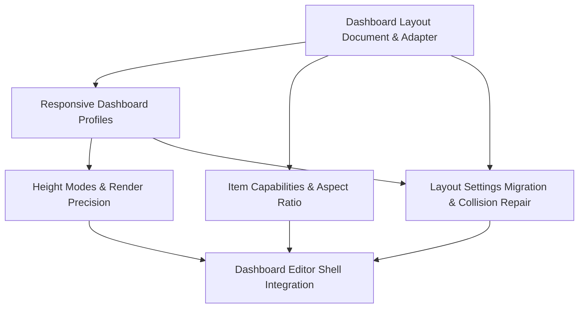

# ThingsBoard Dashboard Spec Planning Context

Created: 2026-05-19
Project: `/Users/hqz/dev/vue-grid-layout`
Reference project: `/Users/hqz/dev/zx/thingsboard/ui-ngx`

## 背景目标

本轮目标不是立刻生成正式 spec，而是把当前 Vue Grid Layout 组件库的真实实现状态，与 ThingsBoard `ui-ngx` dashboard 拖拽编辑器中值得借鉴的产品经验结合起来，形成后续逐个生成 spec 的原始上下文。

用户强调：

- 规划必须基于当前实现，不要泛泛按“通用组件库常见模块”切。
- ThingsBoard 的 dashboard 代码是重要参考，但不是要照搬 Angular/Gridster 实现。
- 需要把最重要的上下文记录到 `docs/raw`，后续再根据记录分别生成正式 spec。
- 项目约束：不要使用 computer use。

## 当前实现基线

当前仓库已经不是一个纯基础拖拽 demo，已经具备以下模块化方向：

- `lib/VueGridLayout.tsx`
  - 顶层 grid 组件。
  - 负责 layout 同步、drag/resize/drop 事件编排、editor runtime 接入、auto-scroll、layout engine bridge、placeholder 和 overlay 渲染。

- `lib/GridItem.tsx`
  - 单个 item 的 drag/resize wrapper。
  - 连接 `@marsio/vue-draggable` 和 `@marsio/vue-resizable`。
  - 通过 `calcGridItemPosition()` 生成像素位置和尺寸。

- `lib/utils.ts`
  - 当前核心 `LayoutItem` 仍是几何模型：`x/y/w/h/i/min/max/static/isDraggable/isResizable/resizeHandles/isBounded`。
  - 目前没有 dashboard 语义字段，例如 `mobileOrder`、`mobileHeight`、`preserveAspectRatio`。

- `lib/calculateUtils.ts`
  - 像素/grid 坐标转换。
  - 当前 `calcGridItemWHPx()`、`calcGridItemPosition()` 会对 width/height/top/left 做 `Math.round()`。

- `lib/responsive/useResponsiveGridLayoutModel.ts`
  - 当前已有 responsive model。
  - 支持 `breakpoints`、`cols`、`layouts`、`margin`、`containerPadding`、`width`。
  - 会基于 width 推导 breakpoint，并用 `findOrGenerateResponsiveLayout()` 生成布局。
  - 当前更接近 react-grid-layout 风格的自动响应式布局，不是 ThingsBoard 那种 per-breakpoint dashboard profile。

- `lib/ResponsiveVueGridLayout.tsx`
  - 当前 responsive 组件壳。
  - 向内部 `VueGridLayout` 传递当前 breakpoint 的 layout、cols、margin、containerPadding。

- `lib/layout-engine/*`
  - 已经有独立 layout engine、scheduler、worker runtime、indexing、executor。
  - 这是后续做 collision repair、fit search、group move、responsive generation 的基础，避免把复杂逻辑塞回 Vue 组件。

- `lib/editor/*`
  - 已有 headless editor controller。
  - 已有 selection、commands、clipboard、history、keyboard、toolbar、guides、section rows、intelligence、metadata。
  - `GridEditorCommandType` 已包括 `select`、`move`、`resize`、`add`、`delete`、`duplicate`、`copy`、`paste`、`align`、`distribute`、`tidy`、`lock`、`unlock`、`show`、`hide`、`save`、`discard`、`undo`、`redo` 等。

- `lib/persistence.ts`
  - 已有 versioned persistence core 和 `useGridLayoutPersistence()`。
  - 支持 `Layout` 和 `LayoutsMap` 保存方向。

- `example/23-professional-dashboard-editor.js`
  - 已经有 professional dashboard editor 示例。
  - 示例里接入 persistence、editor controller、layout engine scheduler、toolbar 命令等。

## 已有 specs 状态

当前已有正式 spec：

- `docs/specs/async-layout-engine-performance-architecture/`
- `docs/specs/editor-multiselect-group-move-core/`
- `docs/specs/professional-dashboard-editor-l3-intelligence/`
- `docs/specs/professional-dashboard-editor-ux/`
- `docs/specs/versioned-layout-persistence-core/`
- `docs/specs/vue-grid-layout-behavior-preserving-refactor/`

因此后续规划不应重复生成“layout engine 性能”、“基础 persistence”、“editor 多选 group move”、“editor UX”这些已经覆盖过的地基 spec。更合理的是：

- 新增 dashboard 产品层缺失的 spec。
- 扩展已有 editor/persistence/layout-engine spec 的边界。
- 保持核心 `LayoutItem` 简洁，通过 adapter/profile/sidecar meta 引入 dashboard 语义。

## ThingsBoard `ui-ngx` 值得借鉴的点

### 1. Dashboard 文档模型比基础 grid layout 更产品化

ThingsBoard 的核心模型在：

- `../zx/thingsboard/ui-ngx/src/app/shared/models/dashboard.models.ts`

关键结构：

- `WidgetLayout`
  - `sizeX`
  - `sizeY`
  - `desktopHide`
  - `mobileHide`
  - `mobileHeight`
  - `mobileOrder`
  - `col`
  - `row`
  - `resizable`
  - `preserveAspectRatio`

- `GridSettings`
  - `layoutType`
  - `backgroundColor`
  - `columns`
  - `minColumns`
  - `margin`
  - `outerMargin`
  - `viewFormat`
  - `backgroundSizeMode`
  - `backgroundImageUrl`
  - `autoFillHeight`
  - `rowHeight`
  - `mobileAutoFillHeight`
  - `mobileRowHeight`
  - `mobileDisplayLayoutFirst`
  - `layoutDimension`

- `DashboardLayout`
  - `widgets`
  - `gridSettings`
  - `breakpoints`

借鉴结论：

- 当前库不应该把这些字段直接塞进基础 `LayoutItem`。
- 应该定义一个上层 `DashboardLayoutDocument` 或 adapter，把 dashboard 语义映射到当前 `Layout` / `LayoutsMap` / `editorMetaById`。

### 2. 响应式断点是 dashboard profile，不只是自动 cols 切换

ThingsBoard 断点相关逻辑在：

- `../zx/thingsboard/ui-ngx/src/app/modules/home/components/dashboard-page/dashboard-page.component.ts`
- `../zx/thingsboard/ui-ngx/src/app/core/services/dashboard-utils.service.ts`

关键行为：

- 根据当前 viewport 匹配 breakpoint。
- 如果当前 breakpoint 有独立 layout config，则使用它。
- 如果没有，则 fallback 到 `default`。
- breakpoint 切换时更新：
  - `layoutCtx.breakpoint`
  - `layoutCtx.gridSettings`
  - `layoutCtx.widgets`
  - `layoutCtx.widgetLayouts`
  - 必要时 reload dashboard。

借鉴结论：

- 当前 `ResponsiveVueGridLayout` 已有 responsive 基础，但缺少 dashboard profile 概念。
- 后续应支持 per-breakpoint `gridSettings`、item visibility/order/height、view format。
- 应明确 fallback 策略，而不是永远自动生成 layout。

### 3. 移动端不是简单缩列，而是 list/grid 双模式

ThingsBoard 有：

- `ViewFormatType.grid`
- `ViewFormatType.list`
- `mobileHide`
- `desktopHide`
- `mobileHeight`
- `mobileOrder`

相关逻辑在：

- `../zx/thingsboard/ui-ngx/src/app/modules/home/models/dashboard-component.models.ts`

关键行为：

- view mode 下 mobile 会过滤 `mobileHide` item。
- desktop 会过滤 `desktopHide` item。
- mobile rows 会优先使用 `mobileHeight`。
- mobile 排序优先使用 `mobileOrder`，没有则 fallback 到 row。

借鉴结论：

- 当前 editor meta 已有 `visible`，但不是 breakpoint-aware。
- 后续需要 `responsiveItemMeta` 或 dashboard profile 层处理 mobile/desktop visibility、order、height。
- 不建议在核心 grid 层写死 mobile 规则。

### 4. 高度模式很重要

ThingsBoard 高度相关逻辑在：

- `../zx/thingsboard/ui-ngx/src/app/modules/home/components/dashboard/dashboard.component.ts`

关键行为：

- 支持类似 `ScrollVertical`、`Fit`、`Fixed` 的 grid mode。
- `autoFillHeight` 时使用 fit 逻辑。
- mobile auto-fill 时根据父容器高度和 active widgets rows 反算 rowHeight。
- mobile 有独立 `mobileRowHeight`。

借鉴结论：

- 当前库主要是 `autoSize + rowHeight`，不够表达 dashboard 场景。
- 需要规划 `heightMode: 'auto' | 'scroll' | 'fit' | 'fixed'`。
- 需要明确 container resize 后 rowHeight 如何推导，尤其 mobile/list 模式。

### 5. 像素精度是实际痛点

ThingsBoard 对 `angular-gridster2` 打了补丁：

- `../zx/thingsboard/ui-ngx/patches/angular-gridster2+20.2.4.patch`

补丁内容：

- 去掉 `x/y` 上的 `Math.round()`。
- 保留更精确的 `curColWidth * item.x` 和 `curRowHeight * item.y`。

当前库对应位置：

- `lib/calculateUtils.ts`

现状：

- 当前 width/height/top/left 都会 round。

借鉴结论：

- 应该规划 `roundPixels?: boolean` 或更细的 render precision 策略。
- 默认行为可以保守保持兼容，但 transform 模式下允许 subpixel，减少视觉抖动和累积误差。

### 6. Preserve Aspect Ratio 是产品需求，但不要照搬 hack

ThingsBoard preserve aspect ratio 逻辑在：

- `../zx/thingsboard/ui-ngx/src/app/modules/home/models/dashboard-component.models.ts`

现状：

- ThingsBoard 通过 monkey patch gridster item 的 `rows/cols` 和 resizable 的 `height/width` setter 实现等比缩放。

借鉴结论：

- 需求值得吸收：item 级 `preserveAspectRatio` / `aspectRatio`。
- 做法不要照搬。
- 应该在当前库的 resize candidate、layout engine operation、editor capability 中一等支持。

### 7. Dashboard 编辑器壳是独立产品层

ThingsBoard editor shell 相关逻辑：

- `../zx/thingsboard/ui-ngx/src/app/modules/home/components/dashboard/dashboard.component.ts`
- `../zx/thingsboard/ui-ngx/src/app/modules/home/components/dashboard-page/dashboard-page.component.ts`

值得借鉴的行为：

- `selectWidget()`
- `highlightWidget()`
- `scrollToWidget()`
- `getEventGridPosition(event)`
- dashboard/widget context menu
- copy widget
- copy widget reference
- paste widget at event grid position
- paste reference
- remove widget confirm
- move all widgets
- empty dashboard add widget affordance

借鉴结论：

- 当前库的 editor controller 命令能力已经强，但缺少可选的 dashboard shell composable/component。
- 应新增或扩展一个 shell spec，而不是把右键菜单、弹窗、业务 widget reference 全塞入 `VueGridLayout`。

## 最终建议的 Spec 规划

建议规划 6 个 spec。它们不是 6 个全新大坑，而是“新增 4 个 + 扩展已有 2 个”的组合。

### Spec 1: Dashboard Layout Document & Adapter

建议目录：

```text
docs/specs/dashboard-layout-document-adapter/
```

性质：新增，最高优先级。

目标：

- 定义一个 dashboard 产品层文档模型。
- 明确当前核心 `Layout`、`LayoutsMap`、`editorMetaById` 与 dashboard 文档的映射关系。
- 让 ThingsBoard 风格的 `WidgetLayout/GridSettings/DashboardLayout` 能被组件库表达，但不污染基础 `LayoutItem`。

当前实现依据：

- `lib/utils.ts` 的 `LayoutItem` 是几何模型。
- `lib/persistence.ts` 已支持 versioned persistence。
- `lib/editor/types.ts` 已有 sidecar editor metadata。

ThingsBoard 借鉴：

- `WidgetLayout`
- `GridSettings`
- `DashboardLayout`
- `breakpoints`

建议范围：

- `DashboardLayoutDocument`
- `DashboardGridSettings`
- `DashboardItemLayout`
- `DashboardBreakpointProfile`
- `toGridLayout(document, breakpoint)`
- `fromGridLayout(layout, document, breakpoint)`
- schema version
- migration hook
- unknown field preservation
- 与 `Layout` / `LayoutsMap` / `editorMetaById` 的边界

不要做：

- 不要在这个 spec 里实现完整 UI。
- 不要改写 layout engine。
- 不要把 dashboard 字段全部塞进 `LayoutItem`。

### Spec 2: Responsive Dashboard Profiles

建议目录：

```text
docs/specs/responsive-dashboard-profiles/
```

性质：新增。

目标：

- 把当前 `ResponsiveVueGridLayout` 从“自动响应式布局”升级成“dashboard breakpoint profile”。
- 支持 ThingsBoard 式 per-breakpoint 配置和 fallback。

当前实现依据：

- `lib/responsive/useResponsiveGridLayoutModel.ts`
- `lib/ResponsiveVueGridLayout.tsx`
- 当前已有 `breakpoints`、`cols`、`layouts`、`margin`、`containerPadding`。

ThingsBoard 借鉴：

- `updatedLayoutForBreakpoint()`
- breakpoint 有配置就使用，没有就 fallback 到 `default`。
- 每个 breakpoint 可拥有自己的 `gridSettings` 和 `widgetLayouts`。
- mobile/list 不是简单缩列。

建议范围：

- `profiles.default`
- `profiles[breakpoint]`
- profile fallback
- profile-level `cols/margin/containerPadding/rowHeight/heightMode`
- item-level `mobileHide/desktopHide/mobileOrder/mobileHeight`
- `viewFormat: 'grid' | 'list'`
- 兼容现有 `layouts` API 的迁移策略
- `breakpointChange`、`profileChange` 事件语义

不要做：

- 不要在此 spec 中处理 context menu、copy/paste UI。
- 不要重写 layout engine collision 行为。

### Spec 3: Height Modes & Render Precision

建议目录：

```text
docs/specs/height-modes-render-precision/
```

性质：新增，建议优先级很高，规模可控。

目标：

- 补齐 dashboard 常见高度模式。
- 解决像素 round 策略过于单一的问题。

当前实现依据：

- `lib/VueGridLayoutPropTypes.ts` 当前有 `autoSize`、`rowHeight`、`maxRows`。
- `lib/calculateUtils.ts` 当前会 round item position/size。
- `lib/WidthProvider.tsx` 和已有 ResizeObserver 路径可以作为容器测量基础。

ThingsBoard 借鉴：

- `autoFillHeight`
- `mobileAutoFillHeight`
- `mobileRowHeight`
- `ScrollVertical` / `Fit` / `Fixed`
- 去掉 `x/y` round 的 gridster patch。

建议范围：

- `heightMode: 'auto' | 'scroll' | 'fit' | 'fixed'`
- `mobileHeightMode`
- `rowHeight` 推导策略
- container resize 后的重算规则
- `roundPixels?: boolean`
- 或 `renderPrecision: 'integer' | 'subpixel'`
- transform positioning 和 absolute positioning 的差异
- snapshot/browser tests 验证不重叠、不抖动、placeholder 对齐

不要做：

- 不要在这里设计完整 responsive profile 数据模型。
- 不要引入 dashboard persistence schema。

### Spec 4: Item Capabilities & Aspect Ratio

建议目录：

```text
docs/specs/item-capabilities-aspect-ratio/
```

性质：新增。

目标：

- 统一 item 级能力、editor metadata、layout constraints、resize behavior。
- 将 `preserveAspectRatio` 做成一等能力。

当前实现依据：

- `lib/editor/types.ts` 已有 `GridEditorItemMeta`：
  - `locked`
  - `visible`
  - `editable`
  - `draggable`
  - `resizable`
  - `deletable`
  - `duplicatable`
  - `copyable`
- `lib/grid-layout/useGridEditorRuntime.ts` 已根据 editor meta resolve render state。
- `lib/grid-layout/useGridDragResizeInteractions.ts` 已有 `buildResizeCandidate()`。
- `lib/layout-engine/*` 已支持 operation result 和 blocked diagnostics。

ThingsBoard 借鉴：

- `WidgetLayout.resizable`
- `WidgetLayout.preserveAspectRatio`
- mobile/desktop hide
- 但不照搬 monkey patch 做法。

建议范围：

- `preserveAspectRatio`
- `aspectRatio`
- item-level resize handle policy
- breakpoint-aware capability
- `locked` vs `static` vs `resizable: false` 语义
- editor capability 与 layout engine static/collision 的优先级
- resize preview 和 commit 都必须保持比例
- blocked diagnostics

不要做：

- 不要把业务 widget config 引入核心。
- 不要直接依赖 ThingsBoard 字段名作为核心 API，可通过 adapter 映射。

### Spec 5: Layout Settings Migration & Collision Repair

建议目录：

```text
docs/specs/layout-settings-migration-collision-repair/
```

性质：新增或扩展 layout-engine 相关能力。

目标：

- 当 dashboard grid settings 变化时，布局可以安全迁移和修复。
- 例如 columns 从 24 改到 12、margin/rowHeight 变化、profile 切换、导入旧布局等。

当前实现依据：

- 已有 `lib/layout-engine/*`。
- 已有 fit search / collision / responsive generation 基础。
- 已有 `async-layout-engine-performance-architecture` spec，不应重复性能地基。

ThingsBoard 借鉴：

- `DashboardUtilsService.updateLayoutSettings()`：
  - 根据 columns ratio 缩放 `row/col/sizeX/sizeY`。
  - 之后尝试修复碰撞。
- `addWidgetToLayout()`：
  - 指定 row/column 时如果碰撞则找可放置位置。
  - 未指定时放到当前最大 bottom 后。
- `widgetPossiblePosition()`：
  - 先扫描已有区域找第一个可放置位置。
  - 再决定向右扩展或向下扩展。
- `moveWidgets()`：
  - 整体移动所有 widgets，并避免负坐标。

建议范围：

- `migrateLayoutSettings(prevSettings, nextSettings, layout)`
- columns ratio scaling
- collision repair strategies
- first-fit / nearest-fit policy
- move all items command
- negative bounds clamp
- diagnostics: moved/shrunk/skipped/collided
- 与 layout engine operation 的 API 边界

不要做：

- 不要处理 UI 设置弹窗。
- 不要改变 persistence schema，schema 只引用迁移 operation。

### Spec 6: Dashboard Editor Shell Integration

建议目录：

```text
docs/specs/dashboard-editor-shell-integration/
```

性质：建议扩展已有 `professional-dashboard-editor-ux`，如果 scope 太大则新开。

目标：

- 在当前 headless editor controller 之上提供 dashboard 产品壳。
- 吸收 ThingsBoard 的 context menu、selection、paste-at-pointer、empty add widget 等产品经验。

当前实现依据：

- `lib/editor/controller.ts` 已有 commands。
- `lib/editor/keyboard.ts` 已有 keyboard command mapping。
- `lib/editor/toolbar.ts` 已有 toolbar state。
- `example/23-professional-dashboard-editor.js` 已有可工作的 dashboard editor 示例。
- 已有 `professional-dashboard-editor-ux` 和 `professional-dashboard-editor-l3-intelligence` specs。

ThingsBoard 借鉴：

- `getEventGridPosition(event)`
- `prepareDashboardContextMenu()`
- `prepareWidgetContextMenu()`
- `copyWidget()`
- `copyWidgetReference()`
- `pasteWidget()`
- `pasteWidgetReference()`
- `selectWidget()`
- `highlightWidget()`
- `scrollToWidget()`

建议范围：

- `useDashboardEditorShell()`
- context menu hook contract
- pointer-to-grid-position helper
- paste at pointer
- select/highlight/scroll-to-item
- empty dashboard add affordance
- widget palette/drop integration
- optional reference copy/paste adapter
- shell example update

不要做：

- 不要把业务 widget 数据源、别名、告警、timewindow 全部纳入组件库核心。
- 不要让 `VueGridLayout` 自带 Material-style menu 或弹窗。

## 推荐执行顺序

建议后续正式 spec 生成顺序：

1. `dashboard-layout-document-adapter`
2. `responsive-dashboard-profiles`
3. `height-modes-render-precision`
4. `item-capabilities-aspect-ratio`
5. `layout-settings-migration-collision-repair`
6. `dashboard-editor-shell-integration`

原因：

- 先定义 dashboard 文档和 adapter，避免后续 API 混乱。
- 再定义 responsive profile，因为它依赖 dashboard 文档模型。
- 高度和渲染精度相对独立，且影响真实 dashboard 观感，适合尽早做。
- item capability/aspect ratio 会影响 resize 和 editor 行为，应在 shell 前稳定。
- layout settings migration 依赖前面的 settings/profile 定义。
- editor shell 最后做，避免在底层 contract 未稳定时过早绑定 UI。

## Spec 间依赖关系



## 关键架构原则

后续 spec 应持续遵守这些原则：

- 核心 grid 组件保持通用，不直接依赖 ThingsBoard 的业务模型。
- Dashboard 语义放在 adapter/profile/shell 层。
- `LayoutItem` 继续作为基础几何模型，避免字段膨胀。
- breakpoint/mobile/list/visibility/order/height 通过 dashboard profile 或 editor sidecar meta 表达。
- resize、collision、fit、migration 这类几何操作尽量进入 layout engine，而不是散落在 Vue callback。
- editor shell 是可选上层产品能力，不是 `VueGridLayout` 的必选功能。
- persistence schema 应保存 dashboard 文档时有 version/migration，不把运行时 UI 状态混进基础 layout。
- ThingsBoard 的需求可以借鉴，但其 Angular/Gridster monkey patch 做法不应照搬。

## 后续生成正式 spec 时的建议输入

每个正式 spec 生成时，应至少读取：

- 本文件。
- 对应当前实现模块。
- 对应 ThingsBoard 参考文件。
- 已有相关 `docs/specs/*`，避免重复设计。

例如：

- 生成 `dashboard-layout-document-adapter`：
  - 读 `lib/utils.ts`
  - 读 `lib/persistence.ts`
  - 读 `lib/editor/types.ts`
  - 读 ThingsBoard `dashboard.models.ts`
  - 读 `docs/specs/versioned-layout-persistence-core/*`

- 生成 `responsive-dashboard-profiles`：
  - 读 `lib/responsive/useResponsiveGridLayoutModel.ts`
  - 读 `lib/ResponsiveVueGridLayout.tsx`
  - 读 ThingsBoard `dashboard-page.component.ts`
  - 读 ThingsBoard `dashboard-utils.service.ts`

- 生成 `height-modes-render-precision`：
  - 读 `lib/calculateUtils.ts`
  - 读 `lib/VueGridLayoutPropTypes.ts`
  - 读 ThingsBoard `dashboard.component.ts`
  - 读 ThingsBoard `angular-gridster2+20.2.4.patch`

- 生成 `item-capabilities-aspect-ratio`：
  - 读 `lib/editor/types.ts`
  - 读 `lib/grid-layout/useGridEditorRuntime.ts`
  - 读 `lib/grid-layout/useGridDragResizeInteractions.ts`
  - 读 ThingsBoard `dashboard-component.models.ts`

- 生成 `layout-settings-migration-collision-repair`：
  - 读 `lib/layout-engine/*`
  - 读 `lib/utils.ts`
  - 读 ThingsBoard `dashboard-utils.service.ts`
  - 读已有 `async-layout-engine-performance-architecture`

- 生成 `dashboard-editor-shell-integration`：
  - 读 `lib/editor/*`
  - 读 `example/23-professional-dashboard-editor.js`
  - 读 ThingsBoard `dashboard.component.ts`
  - 读 ThingsBoard `dashboard-page.component.ts`
  - 读已有 `professional-dashboard-editor-ux`

