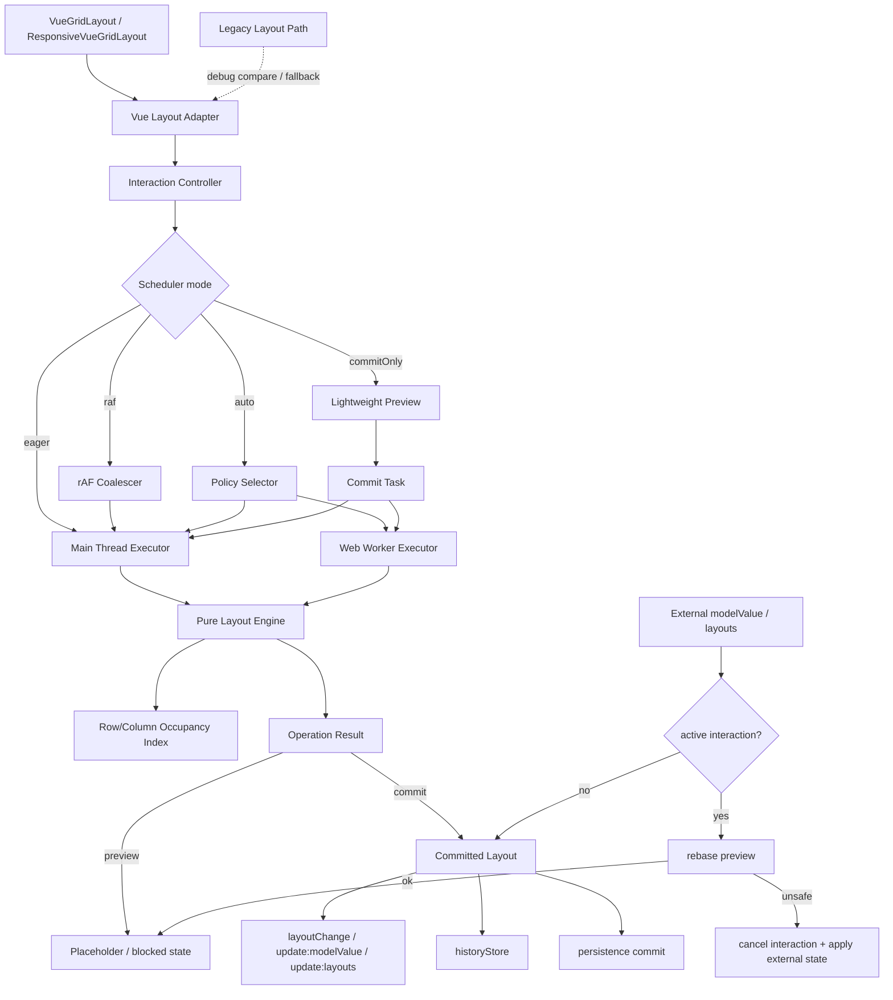

# 异步布局引擎与性能架构 技术设计

## 架构概述

本设计把当前散落在 `lib/VueGridLayout.tsx` 和 `lib/utils.ts` 中的布局热路径收敛为一个默认启用的新布局引擎。新引擎成为 `VueGridLayout` 与 `ResponsiveVueGridLayout` 的默认计算路径，同时保留 legacy path、debug 双跑对比和功能降级能力。目标不是简单替换某几个函数，而是建立长期可演进的性能架构：纯布局引擎负责确定性计算，row/column occupancy index 负责加速碰撞与查找空位，interaction scheduler 负责 preview 更新节奏，Web Worker-capable 执行器负责大型重任务，Vue adapter 负责把结果映射回现有 props、事件、history 和 persistence。

现状中的关键证据：

- `lib/VueGridLayout.tsx` 通过 `LARGE_LAYOUT_THRESHOLD = 200` 在同步路径和 rAF 合帧路径之间切换。
- `onDrag()`、`onResize()`、`onDrop()` 直接调用 `moveElement()`、`compact()`、`getAllCollisions()`、`findFirstFit()` 和 `findNearestFit()`。
- `lib/utils.ts` 已经有 compaction 专用的 `CompactionCollisionIndex`，但通用 collision、fit search 和 move cascade 仍主要依赖数组扫描。
- `perf/bench.js` 只覆盖随机布局下的 compact 和 move micro-benchmark，缺少 dense/sparse/static/preventCollision/drop/resize/worker 维度。
- 第一版 persistence 已经通过 `watchTarget: false` 让组件只在 committed layout 边界调用 `commit()`，新设计必须保持这个边界。

建议新增模块：

- `lib/layout-engine/types.ts`: 引擎输入、操作、patch、diagnostics、preview/commit 状态、scheduler 和 executor 类型。
- `lib/layout-engine/indexing.ts`: `LayoutIndexStrategy` 与默认 `RowColumnOccupancyIndex`。
- `lib/layout-engine/core.ts`: 纯布局引擎，提供 move、resize、drop fit、compact、validate、rebase preview 等操作。
- `lib/layout-engine/scheduler.ts`: `eager`、`raf`、`commitOnly`、`auto` 调度模式和任务取消。
- `lib/layout-engine/executor.ts`: 主线程执行器、Web Worker-capable 执行器适配、超时和 stale task 处理。
- `lib/layout-engine/workerRuntime.ts`: worker 内部消息协议和纯引擎运行入口，不引用 Vue、DOM 或 storage。
- `lib/layout-engine/vueAdapter.ts`: `VueGridLayout` / `ResponsiveVueGridLayout` 的薄适配层。
- `perf/layout-engine-bench.js`: benchmark matrix 与预算校验。
- `test/run-layout-engine-tests.js`: 核心引擎、索引、scheduler、executor 和 legacy parity 测试入口。

现有 `lib/utils.ts` 不立即删除。第一阶段把当前公开工具函数保留为兼容出口，并逐步让它们委托到新引擎或作为 legacy comparison oracle。`lib/cjs.ts` 和 `typings/index.d.ts` 需要导出新引擎类型与工厂函数。

## 数据流图



## 组件与接口定义

### 纯布局引擎

`createLayoutEngine(options)` 创建不依赖 Vue、DOM、Pinia、storage 或浏览器全局对象的纯引擎。引擎输入必须是 plain object / array，输出必须是可序列化的 operation result。

核心职责：

- 构建并维护 layout state、committed snapshot 和默认 row/column occupancy index。
- 执行 `move`、`resize`、`dropFit`、`compact`、`validate` 和 `rebasePreview`。
- 返回 `LayoutOperationResult`，包含 status、layout、patches、affectedIds、collisions、blocked reason、diagnostics。
- 保持 legacy 语义：`compactType`、`allowOverlap`、`preventCollision`、static item、`maxRows`、north/west resize handle 和 `resizeHandles`。
- 对 no-op 操作返回 no-op 结果，避免全量 clone。

### Row/Column Occupancy Index

默认索引策略是 `RowColumnOccupancyIndex`，它按网格行维护 item id / item index bucket，并可选维护 column occupancy metadata。该模型适合当前固定列 dashboard 网格，比通用 R-tree 更容易保证 deterministic order 和 legacy parity。

接口边界保持可插拔：

- 第一版只内置 row/column occupancy strategy。
- `LayoutIndexStrategy` 是未来扩展点，不要求第一版实现 R-tree 或其他空间树。
- 索引返回候选碰撞项时必须按 legacy layout order 或显式排序规则输出，避免 bucket 顺序影响结果。
- 索引维护 insert、remove、update、queryCollisions、queryFirstCollision、canPlace、findFirstFit、findNearestFit。

### Interaction Controller

`InteractionController` 是 Vue adapter 内部状态机，替代当前 `state.activeDrag`、`oldLayout`、`oldDragItem`、`oldResizeItem`、`dragBlocked`、`resizeBlocked` 和 `frameUpdate` 的混合职责。

状态分层：

- `committed`: 最近一次稳定 layout，用于 events、history、persistence。
- `preview`: 当前交互中的候选 layout patch / placeholder / blocked state。
- `interaction`: active item id、operation type、start layout revision、pointer tick revision。
- `externalRevision`: 外部受控 `modelValue` / `layouts` 变化版本，用于 rebase。

默认外部变化策略：

- 交互期间收到新的 `modelValue` 或 `layouts` 时，先尝试把 preview rebase 到最新 committed layout。
- 如果 active item 不存在、约束冲突、`preventCollision` 无法满足或 index 无法安全更新，则取消当前交互，应用外部状态，并发出结构化 `interaction-cancelled` 事件。

### Interaction Scheduler

Scheduler 接收 interaction input，决定何时运行引擎和何时更新 preview。

模式：

- `eager`: 每个有效 tick 同步计算 preview，适合小布局和测试。
- `raf`: 合并同一帧内的多次输入，只用最新输入更新 preview，替代当前硬编码大布局 rAF 分支。
- `commitOnly`: 交互中只更新轻量 placeholder，stop/drop commit 时完整求解。
- `auto`: 根据 item count、density、上次耗时、worker 可用性和配置选择策略。

`auto` 不再依赖单个 `LARGE_LAYOUT_THRESHOLD`。它可以使用默认策略：

- 小布局优先 `eager`。
- 中大型布局优先 `raf`。
- 超大或上次计算超预算的 heavy task 优先 Web Worker executor。
- worker 不可用或任务不适合跨线程时回退主线程。

### Web Worker-capable 执行器

执行器是纯前端运行通道，不是服务端后端。

- `mainThreadLayoutExecutor`: 默认可用，直接调用纯引擎。
- `workerLayoutExecutor`: 内置可选，浏览器环境下懒初始化 Web Worker。
- `customLayoutExecutor`: 给高级使用者接入自定义 worker 包装或实验执行通道。

worker 只接收可结构化克隆的数据：layout、operation、options、task id、deadline 和 debug 标志。它不得接收 DOM 节点、Vue refs、函数闭包、persistence adapter 或 history store。

构建策略：

- CommonJS 构建导出 executor 工厂，但不自动创建 worker。
- Webpack UMD 构建增加可选 worker artifact，例如 `build/web/vue-grid-layout.worker.js`。
- `workerLayoutExecutor({ workerUrl, workerFactory })` 支持显式传入 worker URL 或工厂；未提供且无法推断时，返回不可用状态并回退主线程。
- `auto` 模式只在 worker available 且任务被标记为 heavy 时使用 worker。

### VueGridLayout 集成

`VueGridLayout` 保持现有 props、事件和默认语义，但默认计算路径改为新引擎。

建议新增可选 prop：

```ts
layoutEngine?: false | GridLayoutEngineProp
```

语义：

- `undefined`: 使用新引擎默认路径。
- `false` 或 `{ mode: 'legacy' }`: 回退 legacy path。
- `{ compareLegacy: true }`: debug / test 模式下新旧双跑并报告差异，不改变用户可见结果。
- `{ scheduler, executor, diagnostics, onEvent }`: 配置调度、执行器、诊断事件。

组件适配点：

- `onDragStart` / `onResizeStart`: 创建 interaction controller snapshot。
- `onDrag` / `onResize` / `onDragOver`: 提交 preview input 给 scheduler。
- `onDragStop` / `onResizeStop` / `onDrop`: 请求 committed operation result。
- `layoutChange`、`update:modelValue`、history 和 persistence 只在 committed result 后触发。
- blocked result 映射到现有 `dragBlocked` / `resizeBlocked` 视觉状态，并可通过新 diagnostics 事件暴露原因。
- auto-scroll 保持在组件层，因为它依赖 DOM 和 pointer position。

### ResponsiveVueGridLayout 集成

`ResponsiveVueGridLayout` 继续管理 breakpoint、width、cols 和完整 `layouts` 集合，但布局生成和 compact heavy task 可以通过引擎执行。

集成点：

- breakpoint 变化时，把当前 breakpoint layout 作为 committed snapshot 保存。
- 新 breakpoint layout 生成使用纯引擎的 `generateResponsiveLayout` / `compact` 操作。
- 大型 responsive layout 生成可标记为 heavy task，交给 Web Worker executor。
- `update:layouts`、`layoutChange` 和 responsive persistence 仍只接收 committed `layouts`。
- `persistence` prop 不透传给内层 `VueGridLayout` 的既有约束保持不变。

## API 接口设计

### 引擎配置

```ts
export type LayoutEngineMode = 'default' | 'legacy'

export type GridLayoutEngineOptions = {
  cols: number
  maxRows?: number
  compactType: CompactType
  allowOverlap?: boolean
  preventCollision?: boolean
  indexStrategy?: LayoutIndexStrategy
  scheduler?: InteractionSchedulerOptions
  executor?: LayoutExecutor
  compareLegacy?: boolean
  legacyFallback?: boolean
  diagnostics?: boolean | LayoutDiagnosticsOptions
  onEvent?: (event: LayoutEngineEvent) => void
}

export type GridLayoutEngineProp =
  | {
      mode?: LayoutEngineMode
      scheduler?: InteractionSchedulerOptions
      executor?: LayoutExecutor | LayoutExecutorOptions
      compareLegacy?: boolean
      legacyFallback?: boolean
      diagnostics?: boolean | LayoutDiagnosticsOptions
      onEvent?: (event: LayoutEngineEvent) => void
    }
```

### 操作模型

```ts
export type LayoutOperation =
  | { type: 'move'; id: string; x: number; y: number; userAction?: boolean }
  | { type: 'resize'; id: string; w: number; h: number; handle: ResizeHandleAxis }
  | { type: 'dropFit'; item: Pick<LayoutItem, 'w' | 'h' | 'i'>; strategy: 'cursor' | 'auto'; target?: { x: number; y: number } }
  | { type: 'compact' }
  | { type: 'validate' }
  | { type: 'generateResponsiveLayout'; breakpoint: string; sourceBreakpoint?: string; cols: number }

export type LayoutOperationPhase = 'preview' | 'commit'

export type LayoutOperationRequest = {
  id: string
  phase: LayoutOperationPhase
  layout: Layout
  operation: LayoutOperation
  options: GridLayoutEngineOptions
  baseRevision?: string
  deadlineMs?: number
}
```

### 操作结果

```ts
export type LayoutOperationStatus =
  | 'changed'
  | 'noop'
  | 'blocked'
  | 'cancelled'
  | 'stale'
  | 'fallback'
  | 'error'

export type LayoutPatch =
  | { type: 'move'; id: string; from: { x: number; y: number }; to: { x: number; y: number } }
  | { type: 'resize'; id: string; from: { w: number; h: number; x: number; y: number }; to: { w: number; h: number; x: number; y: number } }
  | { type: 'add'; item: LayoutItem }
  | { type: 'remove'; id: string }
  | { type: 'compact'; affectedIds: string[] }

export type LayoutOperationResult = {
  id: string
  status: LayoutOperationStatus
  layout: Layout
  patches: LayoutPatch[]
  affectedIds: string[]
  collisions: LayoutItem[]
  blocked?: {
    reason: 'collision' | 'static-item' | 'bounds' | 'maxRows' | 'missing-item' | 'invalid-input'
    itemIds: string[]
  }
  placeholder?: LayoutItem
  diagnostics?: LayoutDiagnostics
}
```

### Indexing strategy

```ts
export type LayoutIndexStrategy = {
  name: string
  build(layout: Layout, options: LayoutIndexOptions): LayoutIndex
}

export type LayoutIndex = {
  queryFirstCollision(item: LayoutItem): LayoutItem | undefined
  queryAllCollisions(item: LayoutItem): LayoutItem[]
  canPlace(item: LayoutItem): boolean
  findFirstFit(item: Pick<LayoutItem, 'w' | 'h'>): { x: number; y: number } | null
  findNearestFit(item: Pick<LayoutItem, 'w' | 'h'>, target: { x: number; y: number }): { x: number; y: number } | null
  insert(item: LayoutItem): void
  remove(id: string): void
  update(before: LayoutItem, after: LayoutItem): void
}

export function rowColumnOccupancyStrategy(): LayoutIndexStrategy
```

### Scheduler

```ts
export type InteractionSchedulerMode = 'eager' | 'raf' | 'commitOnly' | 'auto'

export type InteractionSchedulerOptions = {
  mode?: InteractionSchedulerMode
  maxPreviewItems?: number
  commitOnStop?: boolean
  maxTaskMs?: number
  stalePolicy?: 'drop' | 'latest-wins'
  auto?: {
    eagerMaxItems?: number
    rafMaxItems?: number
    workerMinItems?: number
    densityThreshold?: number
  }
}
```

### Executor

```ts
export type LayoutExecutor = {
  kind: 'main-thread' | 'worker' | 'custom'
  available: () => boolean
  execute: (request: LayoutOperationRequest, signal?: AbortSignal) => Promise<LayoutOperationResult>
  dispose?: () => void
}

export function mainThreadLayoutExecutor(): LayoutExecutor

export function workerLayoutExecutor(options?: {
  workerUrl?: string
  workerFactory?: () => Worker
  timeoutMs?: number
}): LayoutExecutor
```

## 数据模型与数据库变更

本设计不引入数据库，也不修改第一版持久化文档 schema。所有新增数据都是运行时内存状态或 TypeScript 类型。

运行时新增数据模型：

- `EngineLayoutState`: committed layout、layout revision、index、options。
- `InteractionState`: active operation、active item id、start layout revision、last preview result。
- `PreviewState`: placeholder、blocked state、preview patches、stale marker。
- `LayoutDiagnostics`: operation id、operation type、phase、layout size、affected count、collision count、index hit、scheduler mode、executor kind、duration。
- `BenchmarkResult`: scenario id、item count、density、operation count、mean、p95、max、relative ratio、absolute budget status。

持久化边界：

- persistence 仍只保存 committed layout 或 committed responsive layouts。
- worker task、preview state、diagnostics 和 benchmark result 不进入 durable persistence。
- 如果未来需要保存 performance trace，应另写单独 spec，不混入布局文档 schema。

## 安全考量

- Web Worker 执行器只允许结构化克隆数据，禁止传入 DOM 节点、Vue refs、函数闭包、storage adapter 或业务对象。
- worker 不执行用户提供的字符串代码；自定义执行器由调用方在主线程创建，库只调用其 `execute()` 接口。
- SSR 和非浏览器环境不得访问 `window`、`document`、`Worker`、`requestAnimationFrame`。执行器和 scheduler 必须 lazy detect capability。
- 所有异步任务必须有 task id、latest revision 和取消机制，防止 stale result 覆盖新状态。
- 对极大 layout、异常 `maxRows`、非法尺寸、重复 id 和不可恢复输入，纯引擎返回 error / blocked result，不进入无限循环。
- diagnostics 不默认打印完整 layout；debug 模式可提供摘要，避免暴露业务 dashboard 内容到 console 或 telemetry。
- worker 初始化失败、执行失败或超时必须回退主线程或 legacy path，不得让基础 drag/resize/drop 不可用。

## 测试策略

### 单元测试

- `RowColumnOccupancyIndex`: build、query、insert、remove、update、first collision、all collisions、first fit、nearest fit。
- 纯引擎 move/resize/drop/compact：覆盖 vertical、horizontal、null compact type。
- `preventCollision`、`allowOverlap`、static item、`maxRows`、north/west resize handle。
- no-op 结果不得全量 clone，局部操作只影响必要 item。
- rebase preview：成功 rebase、active item 删除、约束冲突、stale task。

### Legacy parity 测试

- 以现有 `compact()`、`moveElement()`、`findFirstFit()`、`findNearestFit()` 作为第一阶段 oracle。
- 对固定 seed 的 dense、sparse、static mixed、allowOverlap、preventCollision case 双跑。
- 有意差异必须写入测试说明和文档，不允许静默改变公开语义。

### 组件集成测试

- `VueGridLayout` 默认走新引擎，同时 props、events、blocked visual state、auto-scroll 和 CSS transform 行为保持兼容。
- `layoutEngine={false}` 或 `mode: 'legacy'` 回退 legacy path。
- drag/resize preview 不触发 persistence commit；stop 后 committed layout 触发 `layoutChange`、`update:modelValue`、history 和 persistence。
- 交互期间外部 `modelValue` 变化默认 rebase；无法 rebase 时取消并应用外部状态。
- `ResponsiveVueGridLayout` breakpoint 变化继续 emit `update:layouts`，并且 responsive persistence 仍只保存完整 committed layouts。

### Scheduler 与 executor 测试

- fake rAF 覆盖 `raf` 合帧和 latest-wins。
- `commitOnly` 只在 stop/drop commit 时完整求解。
- `auto` 根据 item count / density / 上次耗时选择模式。
- worker executor 覆盖可用、不可用、初始化失败、运行时错误、timeout、abort、stale task。
- SSR 环境下 executor 不访问浏览器全局对象。

### Benchmark 与门禁

- 新增 `perf/layout-engine-bench.js`，支持 `SIZES=100,500,1000,2000`、`SCENARIOS`、`SEED`、`BUDGET_FILE`。
- benchmark matrix 至少覆盖 dense、sparse、static mixed、preventCollision、allowOverlap、drag across rows、north/west resize、external drop fit、compact commit。
- 输出 mean、p95、max、operation count、item count、scheduler mode、executor kind、worker compute time、queue time、end-to-end time。
- 第一版预算采用相对回归预算 + 关键绝对上限。基线文件可提交到 `perf/baselines/layout-engine.json`，预算文件可放在 `perf/budgets/layout-engine.json`。
- 发布前至少运行 `yarn lint`、`npx tsc --noEmit`、`yarn build`、布局引擎测试、组件集成测试和 benchmark smoke test。
