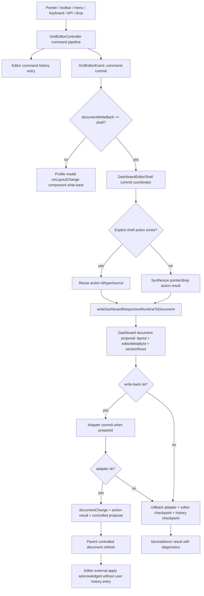

# Command History First Dashboard Editing 技术设计

## 架构概述

本设计把 dashboard 编辑的 durable mutation 收敛到一条主线：`GridEditorController` command commit 是编辑状态和 undo/redo 的权威来源，`useDashboardEditorShell()` 在显式启用 `documentWriteBack: "shell"` 后订阅 command commit，并统一完成 dashboard document write-back、adapter transaction、shell result、diagnostics 与失败回滚。

默认路径保持兼容：未启用 shell-managed 模式时，`useDashboardResponsiveProfileModel().onLayoutChange()` 继续通过 `writeDashboardResponsiveRuntimeToDocument()` 发出 `documentChange`，`DashboardResponsiveVueGridLayout` 仍然只是薄 wrapper。启用 shell-managed 模式后，model 停止为同一 layout commit 写 document，shell 成为唯一 write-back owner；component prop 只透传该选择，不引入独立状态机。

设计边界如下：

- Editor history 记录完整 editor snapshot，包括 layout、`editorMetaById`、`sectionRows`、selection 和 focus；dashboard document 只持久化 layout geometry、durable `editorMetaById` 与 durable `sectionRows`。
- legacy `historyStore` 继续作为 layout-only 兼容镜像。非 shell-managed 模式保持 controller 成功 command 后立即镜像；shell-managed 模式延迟到 shell write-back 和 adapter commit 全部成功后再镜像 layout snapshot，避免失败 command 污染 legacy undo/redo。
- Pointer drag、resize 和 external drop 如果没有显式 shell action，shell 会从 editor `command-commit` 自动合成 `pointer-move`、`pointer-resize`、`external-drop` action result，并关联 command id、source、affected ids、write-back status 和 diagnostics。
- Shell write-back 或 adapter commit 失败时，系统恢复 editor state、dashboard proposed document 状态和用户可见 history；失败 command 不留在后续 undo/redo 栈里。

## 数据流图



## 组件与接口定义

### GridEditorController

当前 controller 的 `emit()` 只调用初始化时的 `options.onEvent`，shell、示例 UI 和审计面无法同时观察同一 command。新增可组合订阅面：

- `subscribe(listener): () => void`：允许多个监听器订阅 `GridEditorEvent`；cleanup 幂等。
- `createRollbackCheckpoint(reason?)`：捕获当前 editor snapshot、history stacks 和 revision，用于 shell-managed mutation 前后恢复。
- `restoreRollbackCheckpoint(checkpoint, reason)`：恢复 snapshot 与 history stacks，并通过内部写入路径避免产生新的 user history entry。

`options.onEvent` 保持兼容，作为内置监听器参与同一派发链。任一监听器抛错时，controller 发出 `editor-event-listener-error` diagnostic，但不改变 command result、history 或 document write-back。

History controller 补充 checkpoint 能力，而不是只提供 layout reset：

- `checkpoint(): GridEditorHistoryCheckpoint`
- `restore(checkpoint): void`

这比单独删除最后一条 history 更稳：同一机制可覆盖普通 command、undo、redo、merge window、preserve redo stack 与 adapter commit 失败。

### Dashboard Responsive Profile Model

在 `UseDashboardResponsiveProfileModelOptions` 增加：

- `documentWriteBack?: "component" | "shell"`，默认 `"component"`。

当值为 `"component"` 时，现有 `onLayoutChange(layout)` 行为保持不变。当值为 `"shell"` 时，`onLayoutChange()` 只更新本地 runtime layout shadow 和 projection 相关事件，不执行 `writeDashboardResponsiveRuntimeToDocument()`，避免和 shell command subscription 双写。

`DashboardResponsiveVueGridLayout` 增加同名便捷 prop，并仅透传到 model/shell 配置；它不保存 write-back token，不生成 shell action，也不直接提交 dashboard document mutation。

### DashboardEditorShell

在 `DashboardEditorShellOptions` 增加：

- `documentWriteBack?: "component" | "shell"`，默认继承 model 或 `"component"`。

当值为 `"shell"` 且存在 editor controller 时，shell 在初始化时订阅 editor events：

- 对显式 shell action 发起的 command，复用 action id/type/source，避免重复 result。
- 对 pointer drag/resize/drop 产生的裸 `command-commit`，根据 command type、source 和 placement diagnostics 合成 shell action result。
- 用 command id/action id/revision 去重，防止父组件受控 document refresh 造成回声提交。
- 接管 legacy layout mirror：如果调用方同时传入 `historyStore`，shell-managed 模式不把它作为 controller 的 immediate `legacyHistoryStore`，而是在最终成功后由 shell 写入 layout-only snapshot。

Shell coordinator 统一执行：

1. 建立 editor/history rollback checkpoint。
2. 计算 next dashboard runtime layout，并收集 `editor.editorMetaById.value` 与 `editor.sectionRows.value`。
3. 调用 responsive write-back，生成 proposed document。
4. 若存在 adapter prepared mutation，执行 commit；失败时执行 adapter rollback。
5. 成功时更新 uncontrolled internal document、发出 `documentChange` 和 `action-result`；失败时恢复 checkpoint，并发出 blocked/error result。

现有 `runDashboardEditorShellTransaction()` 保留 `prepare -> mutate -> commit -> rollback` 形状，但 shell-managed coordinator 要能在 commit 失败时同时恢复 editor/history/document proposal，而不仅是 `setExternalLayout()`.

### Dashboard Document Write-back

`writeDashboardRuntimeToDocument()` 和 `writeDashboardResponsiveRuntimeToDocument()` 增加 durable editor sidecar 写入：

- `editorMetaById?: GridEditorMetaById`
- `sectionRows?: GridEditorSectionRowState`

Grid view 通过 `writeDashboardRuntimeToDocument()` 写入 profile/layout 的 `editor` envelope；list view 的手写分支也必须同步同一 envelope，不能只更新 widgets。删除 item 时同步清理 `editorMetaById` 和 `sectionRows.itemMembership` 中的 orphan id。

### Legacy History

`legacyHistoryStore` 不参与 shell-managed document transaction。非 shell-managed 模式下，controller 仍可在 layout command 成功后镜像 layout snapshot。shell-managed 模式下，model/shell 负责延迟镜像：只有当 dashboard write-back 和 adapter commit 都成功时才调用 legacy store；如果任一阶段失败，editor/history checkpoint 恢复后不写 legacy store。

legacy mirror 永远不会记录 durable sidecar、selection/focus、adapter stage 或 shell action。README 中把 legacy history 标为 compatibility layer，并推荐 dashboard editor 使用 shell/editor history。

## API 接口设计

```ts
export type DashboardDocumentWriteBackOwner = "component" | "shell";

export type UseDashboardResponsiveProfileModelOptions = {
  documentWriteBack?: DashboardDocumentWriteBackOwner;
  // existing fields...
};

export type DashboardResponsiveComponentProps = {
  documentWriteBack?: DashboardDocumentWriteBackOwner;
  // existing fields...
};

export type DashboardEditorShellOptions = {
  documentWriteBack?: DashboardDocumentWriteBackOwner;
  // existing fields...
};
```

```ts
export type GridEditorEventListener = (event: GridEditorEvent) => void;

export type GridEditorHistoryCheckpoint = {
  readonly id: string;
  readonly kind: "grid-editor-history-checkpoint";
};

export type GridEditorRollbackCheckpoint = {
  snapshot: GridEditorHistorySnapshot;
  history?: GridEditorHistoryCheckpoint;
  revision: number;
};

export type GridEditorController = {
  subscribe(listener: GridEditorEventListener): () => void;
  createRollbackCheckpoint(reason?: string): GridEditorRollbackCheckpoint;
  restoreRollbackCheckpoint(
    checkpoint: GridEditorRollbackCheckpoint,
    reason: string
  ): void;
  // existing fields...
};
```

```ts
export type DashboardEditorShellActionType =
  | "pointer-move"
  | "pointer-resize"
  | "external-drop"
  // existing action types...
  ;

export type DashboardEditorShellSyntheticCommitData = {
  commandId: string;
  commandType: GridEditorCommand["type"];
  historyEntryId?: string;
  synthesized: true;
};
```

```ts
export type WriteDashboardRuntimeOptions = {
  editorMetaById?: GridEditorMetaById;
  sectionRows?: GridEditorSectionRowState;
  // existing fields...
};

export type WriteDashboardResponsiveRuntimeOptions = {
  editorMetaById?: GridEditorMetaById;
  sectionRows?: GridEditorSectionRowState;
  // existing fields...
};
```

Result shape 复用现有 `DashboardEditorShellActionResult`：`commandResult`、`writeResult`、`proposedDocument`、`adapter`、`patches`、`diagnostics` 已能承载主链路结果；只需要在 `data` 中补充 synthetic commit metadata，并在 `DashboardEditorShellEvent` 的 `action-result` 中稳定暴露。

## 数据模型与数据库变更

无数据库变更。

Dashboard document 的 editor envelope 做向后兼容扩展：

```ts
export type DashboardEditorEnvelope = {
  version: 1 | 2;
  editorMetaById?: GridEditorMetaById;
  sectionRows?: GridEditorSectionRowState;
  updatedAt?: string;
  extensions?: DashboardJsonObject;
};
```

写入规则：

- `editorMetaById` 沿用现有 profile/layout envelope 位置。
- `sectionRows` 使用 `normalizeGridEditorSectionRows(sectionRows, layout)` 后写入 envelope，并将 envelope version 提升为 `2`。
- 删除 widget 时，清理 profile 和 layout envelope 中对应 id 的 metadata，以及 `sectionRows.itemMembership[id]`。
- selection/focus 不写入 dashboard document；它们只存在于 editor runtime snapshot/history。

Shell 内部新增 transient state，不持久化：

- `processedCommandIds`：去重已处理 command commit。
- `pendingShellActions`：关联显式 shell action 和 editor command id。
- `rollbackCheckpoints`：保存 shell-managed mutation 的 editor/history checkpoint。

## 安全考量

- Adapter diagnostics 默认只记录 stage、ids、status、reason 和 error code，不记录完整业务 payload。
- Event subscription 是观察面，监听器异常被隔离，不能影响 command commit 或 write-back 决策。
- Controlled document 模式只发出 proposed document / `documentChange`，不自动持久化远端状态。
- Shell-managed 模式通过 action id、command id 和 revision 去重，避免受控 document 回传导致重复 commit。
- Stop/unmount 时清理 editor subscription、pending placement finalization 和 keyboard/menu cleanup handle，避免卸载后的异步 write-back。
- 验证遵守仓库约束，优先 CLI/headless 测试，不使用会抢焦点的 GUI browser automation。

## 测试策略

单元测试：

- `GridEditorController.subscribe()` 支持多监听器、cleanup 幂等、listener error diagnostic，并保持 command result 不变。
- `GridEditorHistoryController.checkpoint()/restore()` 覆盖 push、merge、undo、redo、preserve redo stack 和 failed command rollback。
- `writeDashboardRuntimeToDocument()` / `writeDashboardResponsiveRuntimeToDocument()` 写回 `sectionRows`，并在删除 item 时清理 orphan metadata/membership。
- `useDashboardResponsiveProfileModel({ documentWriteBack: "shell" })` 不从 `onLayoutChange()` 直接发出 document mutation。

集成测试：

- Shell-managed pointer drag、resize、external drop 自动合成 action result，并写回 layout、`editorMetaById`、`sectionRows`。
- Toolbar/menu/API action 与 pointer synthetic action 共享同一 document write-back/result/diagnostic 形状。
- Shell write-back 失败后恢复 editor state 和 history checkpoint；adapter commit 失败后恢复 editor/history/document proposal 并调用 rollback。
- Undo/redo 通过 shell write-back 同步 dashboard document，纯 selection/focus 变化不写 document。
- 未启用 shell-managed 模式时，现有 component/model `documentChange` 行为保持兼容。
- `legacyHistoryStore` 只镜像 layout，测试确认不包含 metadata、sectionRows、selection/focus 或 adapter 信息。

验证命令优先级：

- `npm test`
- `npm run test:examples`
- `npm run check:package`
- `npm run build`

涉及浏览器行为时使用仓库现有 headless/CLI 脚本，例如 `npm run test:browser`，不使用会抢焦点的 GUI browser automation。

## 需求追踪

- R1: command history 主线、兼容路径标记、editor checkpoint。
- R2: shell-managed opt-in、document write-back owner、durable sidecar、失败回滚。
- R3: pointer/resize/drop synthetic action result。
- R4: 双写防护、去重、受控 document acknowledgement。
- R5: editor event subscription。
- R6: legacy history layout-only compatibility。
- R7: adapter transaction 与 payload diagnostics。
- R8: undo/redo shell write-back 与失败恢复。
- R9: dogfood workbench 迁移与 result stream。
- R10: public types、README、tests 和验证命令。
