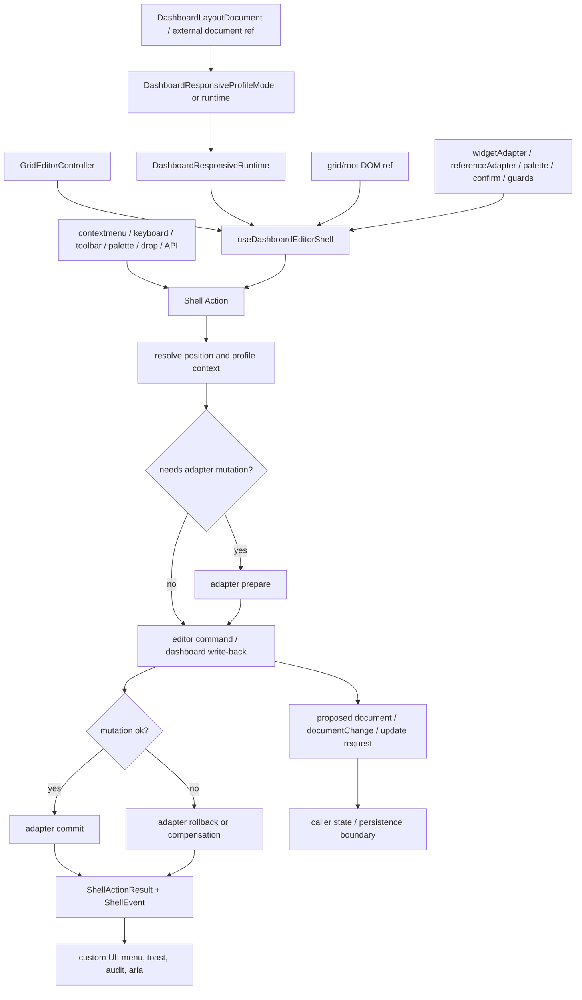
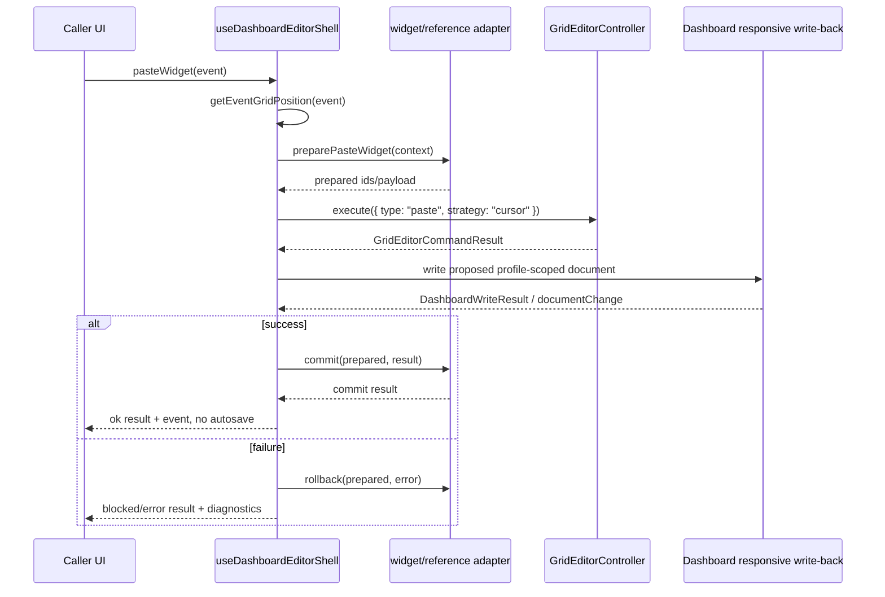

# Dashboard Editor Shell Integration 技术设计

## 架构概述

本设计新增一个 headless dashboard editor shell 层，定位在应用 UI 与现有 grid/editor/dashboard responsive 能力之间。shell 只负责把 context menu、pointer paste、selection/highlight/scroll、widget/reference adapter、empty add、palette/drop、move-all、keyboard、events、diagnostics 和事务语义组织成稳定 API；它不渲染菜单、弹窗或 palette，也不把业务 widget/reference schema 写入 `LayoutItem` 或 dashboard document 核心模型。

当前代码中可复用的关键落点：

- `DashboardResponsiveRuntime` 已提供 shell 所需的 `layout`、`gridSettings`、`layoutId`、`requestedBreakpoint`、`resolvedProfileId`、`targetView`、`viewFormat`、`heightRuntime`、active/render/hidden item ids 和 diagnostics，见 `lib/dashboard-responsive/types.ts:98`。
- `DashboardResponsiveProfileModel` 已暴露 `state`、`editorController`、`getInnerEditorProp()`、`onLayoutChange()`、`onHeightRuntimeChange()` 和 `stop()`，见 `lib/dashboard-responsive/types.ts:209`。
- responsive model 在 layout change 时调用 `writeDashboardResponsiveRuntimeToDocument()` 并发出 `documentChange`，见 `lib/dashboard-responsive/useDashboardResponsiveProfileModel.ts:211` 和 `lib/dashboard-responsive/useDashboardResponsiveProfileModel.ts:223`。
- `GridEditorController` 已有 `execute()`、`canExecute()`、`selection`、`dirty`、`lastResult`、undo/redo/save/reset 和 external layout 更新边界，见 `lib/editor/types.ts:974`。
- editor paste/duplicate 已支持 placement strategy，`cursor` 和 `nearest-fit` 会进入已有 placement 流程，见 `lib/editor/controller.ts:609`、`lib/editor/controller.ts:628`、`lib/editor/controller.ts:1297`。
- grid/drop 坐标已有 `calcXY()`，基于 margin、container padding、cols、rowHeight、maxRows 将像素转换为 grid units，见 `lib/calculateUtils.ts:119`，外部 drop 也已经在 `lib/grid-layout/useGridDropInteractions.ts:191` 和 `lib/grid-layout/useGridDropInteractions.ts:337` 使用该能力。
- dashboard 批量平移已有 `translateDashboardLayout()` wrapper，见 `lib/dashboard-migration.ts:449`。

建议新增模块：

- `lib/dashboard-editor-shell/types.ts`: shell options/state/action/result/event/diagnostic、menu descriptor、position、adapter、transaction 类型。
- `lib/dashboard-editor-shell/position.ts`: event/focus/list insertion 到 grid/list position 的纯 helper。
- `lib/dashboard-editor-shell/transactions.ts`: adapter prepare、editor/dashboard mutation、adapter commit、rollback/compensation 的协调器。
- `lib/dashboard-editor-shell/menus.ts`: dashboard/widget context menu descriptor builder。
- `lib/dashboard-editor-shell/useDashboardEditorShell.ts`: Vue composable 主入口，管理 state、watcher、DOM listener、keyboard、highlight/scroll timer 和 cleanup。
- `lib/dashboard-editor-shell/index.ts`: 聚合导出。
- `lib/cjs.ts`、`typings/index.d.ts`: 暴露 CJS/ESM/types public surface。
- `example/23-professional-dashboard-editor.js` 或新增 focused 示例：演示自定义菜单、palette、reference mock、confirm hook 和 move-all。

设计边界：

- `VueGridLayout`、`ResponsiveVueGridLayout` 和 `DashboardResponsiveVueGridLayout` 保持薄组件边界，不内置业务菜单、palette、reference、confirm dialog 或 widget 配置器。
- shell 使用现有 `GridEditorController` 作为几何编辑、selection、clipboard、history、dirty/conflict 和 beforeCommand 的唯一命令通道。
- dashboard/profile 回写使用 `DashboardResponsiveProfileModel.onLayoutChange()` 或 `writeDashboardResponsiveRuntimeToDocument()`；controlled document 下只发 proposed document/update event，不直接覆盖外部值。
- widget/reference 业务 payload 通过 adapter 处理，shell 默认只保存 ids/status/error code，不解析、不记录敏感内容。
- action 成功产生 proposed/new document 后不自动持久化；保存仍由现有 editor save、dashboard persistence 或应用层显式触发。

## 数据流图





## 组件与接口定义

### Shell Composable

`useDashboardEditorShell()` 是主入口。它接收 responsive model/runtime、editor controller、grid/root DOM ref、mode/context、adapter 和事件回调，返回 readonly state、actions 和 `stop()`。

职责：

- 从 `DashboardResponsiveProfileModel.state` 或独立 `DashboardResponsiveRuntime` 派生 shell runtime context。
- 读取 editor controller 的 `selection`、`dirty`、`conflict`、`lastResult` 和 toolbar availability，不维护第二套 editor 状态。
- 管理 transient state：last pointer position、last menu position、open menu descriptor、highlight target/timer、empty add affordance、keyboard binding、diagnostics。
- 所有变更类 action 统一返回 `DashboardEditorShellActionResult`，并发出 `DashboardEditorShellEvent`。
- 在 `stop()` 或组件卸载时清理 watcher、DOM listener、keyboard binding、highlight timer、pending scroll 和 adapter subscription。
- SSR 下不主动访问 `window`、`document`、DOM measurement、clipboard 或 `scrollIntoView`；相关 action 返回 degraded/blocked result。

### Position Helper

`getEventGridPosition()` 和 `resolveShellPosition()` 放在 `position.ts`，作为框架无关 helper。grid view 使用 DOM rect、event coordinates、scroll offset、width、cols、margin、containerPadding、rowHeight、maxRows 和 height runtime 计算 `{ x, y }`，核心像素到 grid units 的计算复用或包裹 `calcXY()`。

position source 优先级：

1. pointer/mouse/contextmenu/touch event 坐标。
2. active item 或 selection bounds 的几何中心。
3. last menu position。
4. last pointer position。
5. grid viewport center。
6. caller-provided fallback。

非法坐标必须 clamp 或返回 blocked result，不向 editor command 传入 `NaN`、负数或无限值。`viewFormat: "list"` 时不写 mobile/list-only 排序字段到 `LayoutItem`，而是返回 `listIndex`、`beforeId`、`afterId` 或等价 insertion context，后续由 dashboard/profile write-back 按 runtime 规则处理。

### Menu Descriptor Builder

`menus.ts` 输出 plain descriptors，不渲染 DOM。dashboard menu 至少包含 paste、paste reference、add widget、open palette、move all widgets、dashboard settings hook 和 custom items；widget menu 至少包含 select、edit hook、copy widget、copy reference、duplicate、remove、replace reference with widget copy、scroll/highlight 和 custom items。

descriptor 的 enabled/hidden/reason 由 mode、readonly、editor `canExecute()`、locked/static/hidden、clipboard、adapter availability、permission guard 和 profile context 共同决定。action callback 必须调用同一个 shell action pipeline，不能绕过 editor `beforeCommand` 或 adapter transaction。

### Transaction Coordinator

`transactions.ts` 为所有同时涉及 adapter 与 layout/document mutation 的 action 提供统一顺序：

1. `prepare`: adapter 校验权限、生成业务 payload/id、返回 id mapping 或 block/error。
2. `mutate`: 执行 editor command 和 dashboard/profile write-back，生成 proposed document。
3. `commit`: adapter 根据最终 command/write result 提交业务 payload。
4. `rollback`: 任一阶段失败时调用 caller-controlled rollback/compensation hook，并返回 recoverable result。

mutation 阶段默认 all-or-nothing。shell 不应在 adapter prepare 成功但 editor/write-back 失败时提交业务 payload，也不应在 adapter commit 失败时把 action 误报为完全成功；result 必须暴露每个阶段的状态。

### Widget Adapter

widget adapter 处理业务 widget payload，但 shell 不规定业务字段。它支持 copy、paste、duplicate、remove、palette/drop add 和 id mapping。缺省 adapter 时，普通 editor copy/paste/duplicate/remove 仍可处理 layout/editor metadata，result diagnostics 标记 business payload 未处理。

remove action 先执行 optional confirm hook；cancel、timeout、error 或 block 都不得修改 layout、document、editor metadata 或业务 payload。

### Reference Adapter

reference adapter 提供 `canCopyReference`、`copyReference`、`canPasteReference`、`preparePasteReference`、`canReplaceReference`、`prepareReplaceReferenceWithWidgetCopy`、`commit` 和 `rollback`。reference payload 是 opaque data；shell 只记录 adapter status、ids 和 error code。

没有 adapter 或 action 不可用时，menu descriptor 显示 disabled/hidden/reason，action 返回 `unsupported` 或 `blocked`，不得静默消失。

### Keyboard、Focus、Highlight 与 Scroll

keyboard binding 可由 shell 创建，也可由调用方手动把 shortcut 绑定到 actions。默认 ignored targets 包括 input、textarea、select、contenteditable 和 caller-configured selector。keyboard paste 无坐标时走 position fallback，并在 diagnostics 记录来源。

highlight 是 transient shell state，不写入 document、`LayoutItem`、`editorMetaById`、history 或 persistence。`scrollToItem()` 只在客户端安全路径查找 DOM node 和调用 `scrollIntoView` 或 caller scroll adapter；item 隐藏、未挂载或 profile/list filtering 不渲染时返回 blocked result 或 reveal request event。

## API 接口设计

公共导入形态：

```ts
import {
  useDashboardEditorShell,
  getEventGridPosition,
  type DashboardEditorShellOptions,
  type DashboardEditorShellMenuDescriptor,
  type DashboardEditorShellWidgetAdapter,
  type DashboardEditorShellReferenceAdapter
} from "vue-grid-layout/dashboard-editor-shell";
```

核心 options：

```ts
export type DashboardEditorShellOptions = {
  document?: MaybeRef<DashboardLayoutDocument>;
  model?: DashboardResponsiveProfileModel;
  runtime?: MaybeRef<DashboardResponsiveRuntime | null | undefined>;
  editor?: GridEditorController | null;
  gridElement?: MaybeRef<HTMLElement | null | undefined>;
  mode?: MaybeRef<DashboardResponsiveMode | GridEditorMode | undefined>;
  sourceId?: string;
  controlled?: boolean;
  position?: DashboardEditorShellPositionOptions;
  keyboard?: false | DashboardEditorShellKeyboardOptions;
  menu?: DashboardEditorShellMenuOptions;
  widgetAdapter?: DashboardEditorShellWidgetAdapter;
  referenceAdapter?: DashboardEditorShellReferenceAdapter;
  palette?: DashboardEditorShellPaletteAdapter;
  confirm?: DashboardEditorShellConfirm;
  guards?: DashboardEditorShellGuard[];
  scrollAdapter?: DashboardEditorShellScrollAdapter;
  idGenerator?: (baseId: string, existingIds: Set<string>) => string;
  onEvent?: (event: DashboardEditorShellEvent) => void;
  onDocumentChange?: (event: DashboardEditorShellDocumentChangeEvent) => void;
  onMessage?: (message: DashboardEditorShellMessage) => void;
};
```

state 与 actions：

```ts
export type DashboardEditorShellState = {
  ready: boolean;
  degraded: boolean;
  runtime: DashboardResponsiveRuntime | null;
  layoutId: string | null;
  requestedBreakpoint: string | null;
  resolvedProfileId: string | null;
  targetView: DashboardTargetView | null;
  viewFormat: "grid" | "list" | null;
  selection: GridEditorSelectionState | null;
  dirty: boolean;
  conflict: GridEditorConflict | null;
  lastResult: GridEditorCommandResult | null;
  lastPointerPosition: DashboardEditorShellResolvedPosition | null;
  lastMenuPosition: DashboardEditorShellResolvedPosition | null;
  menu: DashboardEditorShellPreparedMenu | null;
  highlightedId: string | null;
  emptyAdd: DashboardEditorShellEmptyAddState;
  diagnostics: DashboardEditorShellDiagnostic[];
};

export type DashboardEditorShellActions = {
  getEventGridPosition(event?: Event | null, options?: DashboardEditorShellPositionRequest): DashboardEditorShellPositionResult;
  pasteAtEvent(event?: Event | null, options?: DashboardEditorShellPasteOptions): Promise<DashboardEditorShellActionResult>;
  pasteAtGridPosition(position: DashboardEditorShellPositionInput, options?: DashboardEditorShellPasteOptions): Promise<DashboardEditorShellActionResult>;
  selectItem(id: string, options?: DashboardEditorShellActionOptions): Promise<DashboardEditorShellActionResult>;
  highlightItem(id: string, options?: DashboardEditorShellHighlightOptions): DashboardEditorShellActionResult;
  resetHighlight(): DashboardEditorShellActionResult;
  scrollToItem(id: string, options?: DashboardEditorShellScrollOptions): Promise<DashboardEditorShellActionResult>;
  prepareDashboardContextMenu(event?: Event | null, options?: DashboardEditorShellMenuRequest): DashboardEditorShellPreparedMenu;
  prepareWidgetContextMenu(event: Event | null, itemId: string, options?: DashboardEditorShellMenuRequest): DashboardEditorShellPreparedMenu;
  closeMenu(reason?: string): void;
  copyWidget(itemIds?: string | string[], options?: DashboardEditorShellActionOptions): Promise<DashboardEditorShellActionResult>;
  pasteWidget(target?: Event | DashboardEditorShellPositionInput | null, options?: DashboardEditorShellPasteOptions): Promise<DashboardEditorShellActionResult>;
  duplicateWidget(itemIds?: string | string[], options?: DashboardEditorShellActionOptions): Promise<DashboardEditorShellActionResult>;
  removeWidget(itemIds?: string | string[], options?: DashboardEditorShellRemoveOptions): Promise<DashboardEditorShellActionResult>;
  copyWidgetReference(itemId: string, options?: DashboardEditorShellActionOptions): Promise<DashboardEditorShellActionResult>;
  pasteWidgetReference(target?: Event | DashboardEditorShellPositionInput | null, options?: DashboardEditorShellPasteOptions): Promise<DashboardEditorShellActionResult>;
  replaceReferenceWithWidgetCopy(itemId: string, options?: DashboardEditorShellActionOptions): Promise<DashboardEditorShellActionResult>;
  openWidgetPalette(target?: Event | DashboardEditorShellPositionInput | null, options?: DashboardEditorShellPaletteOptions): Promise<DashboardEditorShellActionResult>;
  addWidgetFromTemplate(template: DashboardEditorShellWidgetTemplate, target?: Event | DashboardEditorShellPositionInput | null): Promise<DashboardEditorShellActionResult>;
  handleExternalDrop(payload: DashboardEditorShellDropPayload, event: DragEvent | PointerEvent): Promise<DashboardEditorShellActionResult>;
  moveAllWidgets(dx: number, dy: number, options?: DashboardEditorShellMoveAllOptions): Promise<DashboardEditorShellActionResult>;
  bindKeyboard(target?: HTMLElement | Window | Document): () => void;
  stop(): void;
};
```

menu descriptor：

```ts
export type DashboardEditorShellMenuDescriptor = {
  id: string;
  type?: "item" | "separator" | "group";
  label?: string;
  labelKey?: string;
  icon?: string;
  shortcut?: string;
  enabled?: boolean;
  hidden?: boolean;
  checked?: boolean;
  danger?: boolean;
  reason?: string;
  target?: DashboardEditorShellMenuTarget;
  metadata?: Record<string, unknown>;
  children?: DashboardEditorShellMenuDescriptor[];
  action?: () => Promise<DashboardEditorShellActionResult> | DashboardEditorShellActionResult;
};
```

adapter contract：

```ts
export type DashboardEditorShellPreparedMutation = {
  id: string;
  kind: "widget" | "reference";
  sourceIds?: string[];
  newIds?: string[];
  idMap?: Record<string, string>;
  opaque?: unknown;
  diagnostics?: DashboardEditorShellDiagnostic[];
};

export type DashboardEditorShellWidgetAdapter = {
  canCopyWidget?: (ctx: DashboardEditorShellAdapterContext) => MaybePromise<DashboardEditorShellAvailability>;
  copyWidget?: (ctx: DashboardEditorShellAdapterContext) => MaybePromise<DashboardEditorShellAdapterResult>;
  preparePasteWidget?: (ctx: DashboardEditorShellAdapterContext) => MaybePromise<DashboardEditorShellPreparedMutation>;
  prepareDuplicateWidget?: (ctx: DashboardEditorShellAdapterContext) => MaybePromise<DashboardEditorShellPreparedMutation>;
  prepareRemoveWidget?: (ctx: DashboardEditorShellAdapterContext) => MaybePromise<DashboardEditorShellPreparedMutation>;
  prepareAddWidget?: (ctx: DashboardEditorShellAdapterContext) => MaybePromise<DashboardEditorShellPreparedMutation>;
  commit?: (prepared: DashboardEditorShellPreparedMutation, ctx: DashboardEditorShellCommitContext) => MaybePromise<DashboardEditorShellAdapterResult>;
  rollback?: (prepared: DashboardEditorShellPreparedMutation, ctx: DashboardEditorShellRollbackContext) => MaybePromise<DashboardEditorShellAdapterResult | void>;
};

export type DashboardEditorShellReferenceAdapter = {
  canCopyReference?: (ctx: DashboardEditorShellAdapterContext) => MaybePromise<DashboardEditorShellAvailability>;
  copyReference?: (ctx: DashboardEditorShellAdapterContext) => MaybePromise<DashboardEditorShellAdapterResult>;
  canPasteReference?: (ctx: DashboardEditorShellAdapterContext) => MaybePromise<DashboardEditorShellAvailability>;
  preparePasteReference?: (ctx: DashboardEditorShellAdapterContext) => MaybePromise<DashboardEditorShellPreparedMutation>;
  canReplaceReference?: (ctx: DashboardEditorShellAdapterContext) => MaybePromise<DashboardEditorShellAvailability>;
  prepareReplaceReferenceWithWidgetCopy?: (ctx: DashboardEditorShellAdapterContext) => MaybePromise<DashboardEditorShellPreparedMutation>;
  commit?: (prepared: DashboardEditorShellPreparedMutation, ctx: DashboardEditorShellCommitContext) => MaybePromise<DashboardEditorShellAdapterResult>;
  rollback?: (prepared: DashboardEditorShellPreparedMutation, ctx: DashboardEditorShellRollbackContext) => MaybePromise<DashboardEditorShellAdapterResult | void>;
};
```

result、event 与 controlled-first document change：

```ts
export type DashboardEditorShellActionStatus =
  | "success"
  | "noop"
  | "blocked"
  | "cancelled"
  | "unsupported"
  | "timeout"
  | "error";

export type DashboardEditorShellActionResult<T = unknown> = {
  ok: boolean;
  status: DashboardEditorShellActionStatus;
  actionId: string;
  actionType: DashboardEditorShellActionType;
  source: DashboardEditorShellActionSource;
  itemIds: string[];
  affectedIds: string[];
  position?: DashboardEditorShellResolvedPosition;
  commandResult?: GridEditorCommandResult;
  writeResult?: DashboardResponsiveWriteResult | DashboardWriteResult;
  adapter?: DashboardEditorShellAdapterStageResult;
  proposedDocument?: DashboardLayoutDocument;
  idMap?: Record<string, string>;
  diagnostics: DashboardEditorShellDiagnostic[];
  data?: T;
};

export type DashboardEditorShellDocumentChangeEvent = {
  type: "documentChange";
  actionId: string;
  document: DashboardLayoutDocument;
  runtime: DashboardResponsiveRuntime | null;
  controlled: boolean;
  persist: false;
};
```

`controlled: true` 或外部 document ref 场景下，shell 只通过 `onDocumentChange` 和 shell event 交付 proposed document；非受控内部 document ref 可以在 action 成功后更新内部 ref，但仍不自动调用持久化。

## 数据模型与数据库变更

本设计不引入数据库变更，也不修改 dashboard 持久化 schema。

- 不新增 `LayoutItem` 字段。
- 不新增 dashboard document 必填字段。
- 不把 reference payload、widget business payload、menu state、highlight state、scroll state 或 keyboard state 写入 `DashboardLayoutDocument`。
- 不修改 `DashboardResponsiveRuntime` 的持久化含义；shell 只消费 runtime，并在必要时产生 proposed document。
- 新增的 `DashboardEditorShellState`、menu descriptor、transaction stage、diagnostic 和 event 都是运行时/类型层数据。
- adapter 的 `opaque` payload 不由组件库序列化、解析或记录；如果业务方要持久化，必须通过应用层或明确的 dashboard extensions 自行处理。
- profile-scoped write-back 继续使用现有 `writeDashboardResponsiveRuntimeToDocument()`，default layout 与 profile overrides 的作用域由 runtime context 决定。

## 安全考量

- hidden、locked、static、readonly、mode gating 和 menu disabled 只是客户端编辑体验边界，不是安全边界；真实权限必须由应用层 guard、adapter 和后端校验。
- shell action 必须经过 editor `canExecute()`/`execute()`，保留现有 `beforeCommand`、locked/static、mode-readonly、clipboard 和 conflict 语义。
- diagnostics 默认只记录 JSON-safe 的 action id、item ids、profile context、adapter status、error code 和 source/path metadata，不记录业务 widget/reference payload 内容。
- context menu descriptor 的 `label`/`labelKey` 是 plain data，渲染和转义由调用方 UI 负责；shell 不拼接 HTML。
- DOM、clipboard、selection、scroll 和 keyboard 访问只能发生在客户端安全路径；SSR 或缺失 DOM 时返回 degraded/blocked result。
- keyboard binding 必须忽略 input、textarea、select、contenteditable 和 caller ignored target，避免破坏文本输入。
- transaction 必须避免部分提交：adapter prepare 成功但 editor/write-back 失败时 rollback；adapter commit 失败时 result 标记 adapter failure，调用方决定补偿或持久化策略。
- shell 不自动持久化 proposed document，避免在未经调用方确认、权限校验或冲突处理时写入远端。

## 测试策略

单元测试：

- `position.ts`: pointer/contextmenu/touch 坐标、scroll offset、container padding、margin、rowHeight、height runtime、非法坐标 clamp、keyboard fallback、list insertion mapping。
- `menus.ts`: view/edit/readonly、locked/static/hidden、clipboard unavailable、adapter missing、guard block、custom item 合并、shortcut 与 action enabled 一致性。
- `transactions.ts`: prepare -> editor/write-back -> commit 顺序；prepare block、editor blocked、write-back error、commit error、rollback/compensation、all-or-nothing result。
- `useDashboardEditorShell.ts`: controlled-first document change、不自动持久化、degraded state、stop cleanup、highlight transient、不复制 editor dirty/selection state。
- adapters: widget copy/paste/duplicate/remove、confirm cancel、reference unsupported/error/replace、opaque payload 不进入 diagnostics。

浏览器/组件测试：

- contextmenu event 生成 dashboard/widget menu descriptor，并记录 last menu position。
- paste-at-pointer 实际传入 `strategy: "cursor"` 并落在鼠标位置附近；collision 时走已有 nearest/fit fallback。
- empty dashboard edit mode 暴露 add affordance，view/readonly 下 disabled。
- selection、highlight、reset highlight 和 scroll-to-item 的 DOM 行为与 hidden/missing DOM degraded result。
- keyboard paste 无 pointer 时使用 active item/selection/menu/pointer/viewport fallback，并忽略文本输入焦点。
- menu close、shell stop、组件卸载后 listener/timer 不再触发。

dashboard integration 测试：

- profile-scoped paste/add/remove/move-all 只回写目标 profile，不污染 default layout 或其他 profiles。
- list/mobile runtime 下 add/paste/reference paste 使用 insertion context，不直接写 mobile/list-only 排序字段到 `LayoutItem`。
- missing profile、profile validation error、collision/bounds/maxRows 和 adapter failure 不覆盖原 document。
- `moveAllWidgets(dx, dy)` 复用 `translateDashboardLayout()`，负坐标 clamp、repair diagnostics、affected ids 和 proposed document event 可追踪。
- unknown dashboard fields 和 editor metadata 在 shell action 后保持现有 preservation 规则。

导出、文档与回归测试：

- CJS/ESM/types 导出 `useDashboardEditorShell()`、position helper、menu descriptor、adapter、state/action/result/event/diagnostic 类型。
- 示例展示自定义菜单、palette、reference mock、confirm hook、paste at pointer、highlight/scroll、empty add 和 move-all，且示例 UI 不进入公共 API。
- README/docs 说明 shell 与 `VueGridLayout`、`DashboardResponsiveVueGridLayout`、editor controller、dashboard document、responsive profile、migration/repair、widget adapter 和 reference adapter 的关系。
- 相关 editor、dashboard、dashboard responsive、layout migration、browser smoke、typing/export 和 build/test command 必须通过；无法运行时在实现任务中记录验证缺口。
