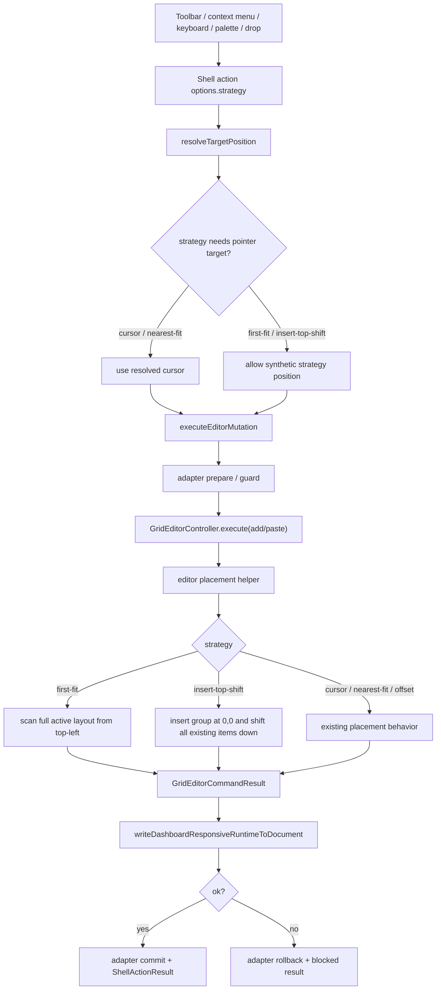
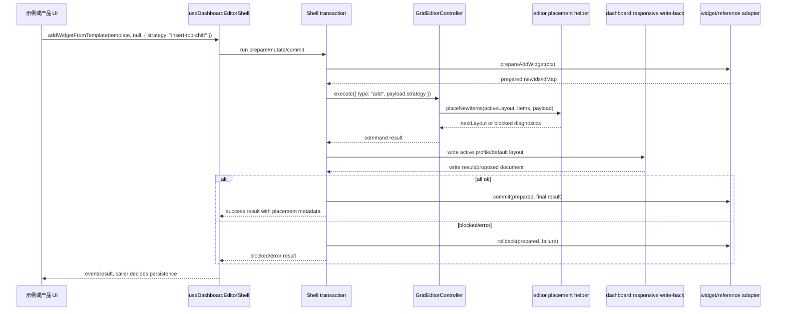

# Dashboard Editor Shell Widget Placement Policies 技术设计

## 架构概述

本设计在现有 `dashboard-editor-shell` 与 `GridEditorController` 的 placement pipeline 上扩展策略能力，不把算法写进示例，也不下沉到 `VueGridLayout` 渲染组件。核心变化是：复用现有 `strategy` 语义作为唯一公共配置入口，新增 `insert-top-shift`，并让 `first-fit` 成为 add/palette/drop/reference 等 shell action 可显式选择的策略。

当前代码中的关键落点：

- shell 类型目前只有 paste options 暴露 `strategy?: "cursor" | "nearest-fit" | "first-fit" | "offset"`，见 `lib/dashboard-editor-shell/types.ts:524`；`addWidgetFromTemplate` 和 `openWidgetPalette` 仍只接收普通 action options，见 `lib/dashboard-editor-shell/types.ts:552`、`:612`、`:613`。
- `pasteWidget` 已经把 `pasteOptions.strategy || "cursor"` 传入 editor，见 `lib/dashboard-editor-shell/useDashboardEditorShell.ts:1048`、`:1055`。
- `pasteWidgetReference` 和 `addWidgetFromTemplate` 当前硬编码 `strategy: "cursor"`，见 `lib/dashboard-editor-shell/useDashboardEditorShell.ts:1163`、`:1264`；`openWidgetPalette` 自动添加模板时没有透传策略，见 `lib/dashboard-editor-shell/useDashboardEditorShell.ts:1230`。
- editor add/paste 共享 `placeNewItems()`，`cursor`/`nearest-fit` 走 `findNearestFit()`，其他策略走 `findFirstFit()`，见 `lib/editor/controller.ts:606`、`:628`、`:641`；editor add 命令默认 `payload.strategy || "first-fit"`，见 `lib/editor/controller.ts:1212`。
- layout engine 已有 row/column occupancy index，`canPlace()` 校验 cols/maxRows/collision，`findFirstFit()` 从 `y=0`、`x=0` 开始扫描，见 `lib/layout-engine/indexing.ts:86`、`:100`、`:117`。
- dashboard responsive write-back 已在 shell mutation 中调用 `writeDashboardResponsiveRuntimeToDocument()`，并发出非自动持久化的 `documentChange`，见 `lib/dashboard-editor-shell/useDashboardEditorShell.ts:422`、`:443`、`:470`。
- shell transaction 已经支持 prepare/mutate/commit/rollback，并把 `writeResult?.ok === false` 视为 mutation failure，见 `lib/dashboard-editor-shell/transactions.ts:234`、`:283`、`:289`。
- context menu 里的 add/paste reference/open palette 当前没有 policy metadata，action 也没有传 strategy，见 `lib/dashboard-editor-shell/menus.ts:120`、`:130`、`:141`。
- 当前企业示例 `Add widget` 调用 `openWidgetPalette(insertionPosition.value)`，而 `insertionPosition` 是示例计算的底部位置，见 `example/25-dashboard-editor-shell.js:1177`。

设计原则：

- `strategy` 是唯一策略字段，避免同时出现 `strategy` 与 `placementPolicy` 两套同义 API。
- shell action 负责把 toolbar、context menu、keyboard、palette、drop 的策略统一转成 editor command payload。
- editor 负责纯 layout placement；shell 负责 adapter transaction、profile write-back、event/result/diagnostics。
- `first-fit` 默认基于完整 active layout 占位，hidden/static/locked 和当前视图未渲染但仍属于 active layout 的 item 都参与碰撞检测。
- `insert-top-shift` 是一次明确 add/insert commit 的线性布局变更，不进入 drag/resize preview 高频路径。
- 示例只显式传入策略、展示结果和解释策略，不维护自己的放置算法。

## 数据流图





## 组件与接口定义

### Public Types

在 `lib/dashboard-editor-shell/types.ts` 增加统一策略类型，并让 add、palette、drop、reference 复用同一个 options shape。

```ts
export type DashboardEditorShellPlacementStrategy =
  | "cursor"
  | "nearest-fit"
  | "first-fit"
  | "insert-top-shift"
  | "offset";

export type DashboardEditorShellPlacementOptions =
  DashboardEditorShellActionOptions & {
    strategy?: DashboardEditorShellPlacementStrategy;
    itemSize?: Pick<LayoutItem, "w" | "h">;
  };

export type DashboardEditorShellPasteOptions = DashboardEditorShellPlacementOptions;

export type DashboardEditorShellPaletteOptions =
  DashboardEditorShellPlacementOptions & {
    autoAddReturnedTemplate?: boolean;
  };

export type DashboardEditorShellAddWidgetOptions =
  DashboardEditorShellPlacementOptions;
```

更新 action signatures：

```ts
pasteWidget(target?: Event | DashboardEditorShellPositionInput | null, options?: DashboardEditorShellPlacementOptions): Promise<DashboardEditorShellActionResult>;
pasteWidgetReference(target?: Event | DashboardEditorShellPositionInput | null, options?: DashboardEditorShellPlacementOptions): Promise<DashboardEditorShellActionResult>;
openWidgetPalette(target?: Event | DashboardEditorShellPositionInput | null, options?: DashboardEditorShellPaletteOptions): Promise<DashboardEditorShellActionResult>;
addWidgetFromTemplate(template: DashboardEditorShellWidgetTemplate, target?: Event | DashboardEditorShellPositionInput | null, options?: DashboardEditorShellAddWidgetOptions): Promise<DashboardEditorShellActionResult>;
handleExternalDrop(payload: DashboardEditorShellDropPayload, event: DragEvent | PointerEvent, options?: DashboardEditorShellPlacementOptions): Promise<DashboardEditorShellActionResult>;
```

`typings/index.d.ts` 与 `lib/cjs.ts` 同步导出 `DashboardEditorShellPlacementStrategy` 相关类型。CJS 顶层函数不需要新增导出，因为策略通过现有 shell action options 进入。

### Shell Action Normalization

在 `useDashboardEditorShell.ts` 中增加内部 helper：

```ts
const normalizePlacementStrategy = (
  options: DashboardEditorShellPlacementOptions,
  fallback: DashboardEditorShellPlacementStrategy
) => options.strategy || fallback;

const resolvePlacementPosition = (
  target: Event | DashboardEditorShellPositionInput | null | undefined,
  options: DashboardEditorShellPlacementOptions
) => {
  if (options.strategy === "first-fit" || options.strategy === "insert-top-shift") {
    return resolveTargetPosition(target, {
      ...options,
      fallback: target && typeof target === "object" ? target : { x: 0, y: 0, source: "strategy" }
    });
  }
  return resolveTargetPosition(target, options);
};
```

目的：

- `cursor` 和 `nearest-fit` 继续依赖 pointer/fallback position。
- `first-fit` 和 `insert-top-shift` 即使没有 DOM event 或底部插入点，也能执行；position 只作为 result/event 的 source metadata。
- 不改变未显式传 strategy 的旧行为。`pasteWidget` 默认仍是 `cursor`；`addWidgetFromTemplate`、`pasteWidgetReference` 继续使用现有 cursor 默认，示例需要显式传 `first-fit` 或 `insert-top-shift`。

### Editor Placement Helper

将 `lib/editor/controller.ts` 内部的 `placeNewItems()` 提取或重构为 `lib/editor/placement.ts`，减少 controller 复杂度，并让 tests 能直接覆盖策略。

```ts
export type GridEditorPlacementStrategy =
  | "offset"
  | "cursor"
  | "nearest-fit"
  | "first-fit"
  | "insert-top-shift";

export type GridEditorPlacementResult = {
  layout: Layout;
  failed: boolean;
  strategy: GridEditorPlacementStrategy;
  placementSource: string;
  insertedIds: string[];
  shiftedIds: string[];
  delta?: { dx: number; dy: number };
  diagnostics: GridEditorPlacementDiagnostic[];
};
```

`first-fit` 实现：

- 输入 layout 使用 editor 当前 committed active layout，不从 `renderItemIds` 过滤。
- 使用现有 `buildIndex(baseLayout, { cols, maxRows })` 或 `findFirstFit()` 从左上角扫描。
- 每放入一个新 item 后，把 candidate 加入 index/base layout，再放置下一个 item，保证多 item paste/add 的相对提交结果稳定。
- hidden/static/locked item 都留在 base layout 中参与占位。
- item `w/h` 非法时沿用 editor 现有 `clampGridSize()` normalize；超过 `cols/maxRows` 或无合法空位时返回 failed。

`insert-top-shift` 实现：

- 对单个 item：将新 item 设置为 `{ x: 0, y: 0 }`。
- 对多个 items：先校验 group 内部几何，计算 group bounds，把 group 整体 offset 到 `minX=0,minY=0`，`shiftHeight = groupBottom - groupTop`。
- 将 active layout 中全部现有 items 执行 `y += shiftHeight`。这一步不检查 static/locked 的直接编辑权限，因为它是 layout-level reflow，不改变 item capability metadata。
- 拼接 inserted group 与 shifted existing layout 后，运行 bounds、maxRows、collision 校验。任何失败都返回 failed，不提交部分 layout。
- 成功 result 填充 `shiftedIds`、`delta: { dx: 0, dy: shiftHeight }`、before/after patches 和 diagnostics。
- 空 layout 时不生成 shifted patches，strategy result 仍标记为 `insert-top-shift`。

复杂度：

- `first-fit` 与现有扫描一致，主要成本为 placement scan；只在 add/paste/drop commit 时运行。
- `insert-top-shift` 是 `O(n + k)` 的一次性线性变更，`n` 为现有 item 数，`k` 为新 item 数；不在 drag/resize preview 中执行。

### Menu 与示例集成

`lib/dashboard-editor-shell/menus.ts` 的 add、paste reference、open palette descriptors 增加 strategy metadata，并从 `DashboardEditorShellMenuOptions` 读取默认策略：

```ts
type DashboardEditorShellMenuOptions = {
  defaultAddStrategy?: DashboardEditorShellPlacementStrategy;
  defaultReferencePasteStrategy?: DashboardEditorShellPlacementStrategy;
  customDashboardItems?: ...;
  customWidgetItems?: ...;
};
```

descriptor 示例：

```ts
{
  id: "add-widget",
  metadata: { strategy: defaultAddStrategy },
  action: () => input.actions.addWidgetFromTemplate(
    { w: 2, h: 2 },
    input.position || null,
    { source: "context-menu", strategy: defaultAddStrategy }
  )
}
```

示例 `example/25-dashboard-editor-shell.js` 使用公共 API：

- Add widget 默认展示 `first-fit`，并提供 strategy segmented control 切换 `first-fit` / `insert-top-shift`。
- 不再通过底部 `insertionPosition` 决定 Add widget 落点。
- `Paste` 可继续展示 `nearest-fit`，避免把粘贴语义和新增 widget 语义混在一起。
- `Move all` 同时提供 up/down，复用 `moveAllWidgets(0, -1)` 与 `moveAllWidgets(0, 1)`。
- UI 只展示策略、结果、write-back/adapter 阶段和当前布局变化，删除无关日志与噪音文案。

## API 接口设计

### Action Defaults

默认值保持兼容：

| Action | 未显式传 strategy 的默认行为 | 新策略使用方式 |
| --- | --- | --- |
| `pasteWidget` | `cursor` | `{ strategy: "first-fit" }` 或 `{ strategy: "insert-top-shift" }` |
| `pasteWidgetReference` | `cursor` | `{ strategy: "first-fit", itemSize: { w, h } }` |
| `addWidgetFromTemplate` | `cursor`/现有 position fallback | `{ strategy: "first-fit" }` |
| `openWidgetPalette` | 透传现有 position 并 auto-add | `{ strategy: "first-fit" }` 透传到 add |
| `handleExternalDrop` | cursor/drop position | 可选 `{ strategy }`，preview 不执行 shift |

### Command Payload

shell 传给 editor 的 add/paste payload 增加 strategy：

```ts
{
  strategy,
  cursor: { x: position.x, y: position.y },
  cols: runtime?.gridSettings?.columns || position.cols || 12,
  maxRows: runtime?.gridSettings?.maxRows || Infinity,
  list: position.list,
  source: position.source
}
```

`insert-top-shift` 不使用 cursor 作为落点，但保留 cursor/position metadata 供 event、diagnostics 和 audit 使用。

### Result 与 Diagnostics

`DashboardEditorShellActionResult.data` 增加可选 placement sidecar，不改变既有顶层字段：

```ts
type DashboardEditorShellPlacementSummary = {
  strategy: DashboardEditorShellPlacementStrategy;
  placementSource: "cursor" | "nearest-fit" | "first-fit" | "insert-top-shift" | "offset" | "none";
  insertedIds: string[];
  shiftedIds: string[];
  delta?: { dx: number; dy: number };
};
```

建议 diagnostic code：

- `shell-placement-first-fit`
- `shell-placement-insert-top-shift`
- `shell-placement-max-rows-blocked`
- `shell-placement-invalid-item`
- `shell-placement-collision-unresolved`
- `shell-placement-profile-write-back-blocked`
- `shell-placement-strategy-unsupported`

diagnostics 继续通过 `stableDiagnostics()` 输出，避免记录 `opaque`、`payload`、`businessPayload` 等敏感字段。

### Profile Write-back

placement 成功只表示 editor command 得到了候选 layout；最终 success 还必须满足 dashboard write-back：

- 有 `DashboardResponsiveRuntime` 和 document 时，调用现有 `writeBackLayout()`。
- `writeResult.ok === false` 时，transaction 进入 failure path，触发 adapter rollback，并返回 blocked/error result。
- controlled document 只通过 `onDocumentChange`/event 返回 proposed document，不自动持久化。
- `createMissingProfileOnEdit` 继续作为缺失 profile 的显式策略；未开启时保持 block/no-op 语义。

## 数据模型与数据库变更

本规格不引入数据库变更，也不修改 dashboard document schema。

需要变更的 TypeScript/API 模型：

- `GridEditorPasteStrategy` 扩展为包含 `insert-top-shift`。
- `DashboardEditorShellPasteOptions` 重命名语义为 placement options alias，并扩展 `insert-top-shift`。
- `DashboardEditorShellPaletteOptions` 与新增 `DashboardEditorShellAddWidgetOptions` 支持 `strategy` 和 `itemSize`。
- `DashboardEditorShellActionResult.data` 可携带 `placement` summary；这是可选 sidecar，不改变既有 result 顶层字段。
- `DashboardEditorShellMenuDescriptor.metadata` 可携带 `{ strategy }`，供 UI 渲染说明或分组。
- `typings/index.d.ts` 同步所有 public type changes。

不变项：

- `LayoutItem` 不新增字段。
- static/locked/hidden capability metadata 不改变。
- dashboard profiles、mobile/list 字段和 persistence schema 不改变。
- 业务 widget/reference payload 仍由 adapter opaque 管理。

## 安全考量

- placement diagnostics 不得记录业务 widget payload、reference payload、opaque adapter data 或用户敏感配置；继续复用 `stableDiagnostics()` 的敏感字段过滤。
- adapter prepare 成功但 placement/write-back 失败时必须 rollback，避免业务系统创建孤立 widget。
- `insert-top-shift` 对 static/locked 的移动只发生在内部 layout-level reflow，不改变直接拖拽、resize、remove 权限判断。
- SSR 或无 DOM 环境下，`first-fit` / `insert-top-shift` 可以基于 runtime layout 执行；`cursor` / `nearest-fit` 缺少 position 时返回 degraded/blocked 或 fallback diagnostics。
- `maxRows`、非法 item 尺寸、collision unresolved、missing profile write-back 都必须 block，而不是生成越界布局。
- 示例中的企业级 UI、文案和策略说明不进入公共 API，避免调用方误以为必须采用示例视觉实现。

## 测试策略

### 单元测试

- `test/editor-core.test.ts`: 覆盖 `first-fit` 空首行、首行未满向右、首行满后换行、hidden/static/locked 占位、多 item first-fit、maxRows blocked。
- 新增或扩展 editor placement tests: 覆盖 `insert-top-shift` 空 layout、顶部占用、全体下移、static/locked 下移、多个 item group、maxRows blocked、collision unresolved、result patches/shiftedIds。
- `test/dashboard-editor-shell-core.test.ts`: 覆盖 `addWidgetFromTemplate`、`openWidgetPalette`、`pasteWidgetReference`、`handleExternalDrop` 透传 strategy；adapter prepare/commit/rollback 顺序；write-back failure rollback。
- `test/dashboard-editor-shell-types.test.ts`: 覆盖 `DashboardEditorShellPlacementStrategy`、add/palette/reference/drop options、CJS/ESM/type export。
- dashboard responsive tests: 覆盖 default layout、profile override、missing profile、list/mobile write-back、unknown field preservation。

### 浏览器/示例测试

- `test/dashboard-editor-shell-browser.test.js`: 验证 toolbar/context menu Add widget 使用 `first-fit` 后实际落点在左上优先空位。
- 验证切换到 `insert-top-shift` 后新 item 在 `{ x: 0, y: 0 }`，已有 widgets 整体下移。
- 验证 maxRows block 时布局和 adapter payload 不变。
- 验证 Move all up/down 都可触发，并与策略示例无互相干扰。
- 视觉 smoke 只验证企业级示例关键信息清晰：策略选择、布局变化、last result、adapter/write-back stage；不把具体样式作为库行为断言。

### 回归测试命令

实现阶段至少运行：

```sh
npm test -- --runInBand test/editor-core.test.ts test/dashboard-editor-shell-core.test.ts test/dashboard-editor-shell-types.test.ts
node test/run-dashboard-editor-shell-browser-tests.js
npm run build
```

如仓库当前测试入口不同，任务阶段按实际 `package.json` 脚本调整，但必须保留 editor、shell、types、browser smoke 和 build 覆盖。
