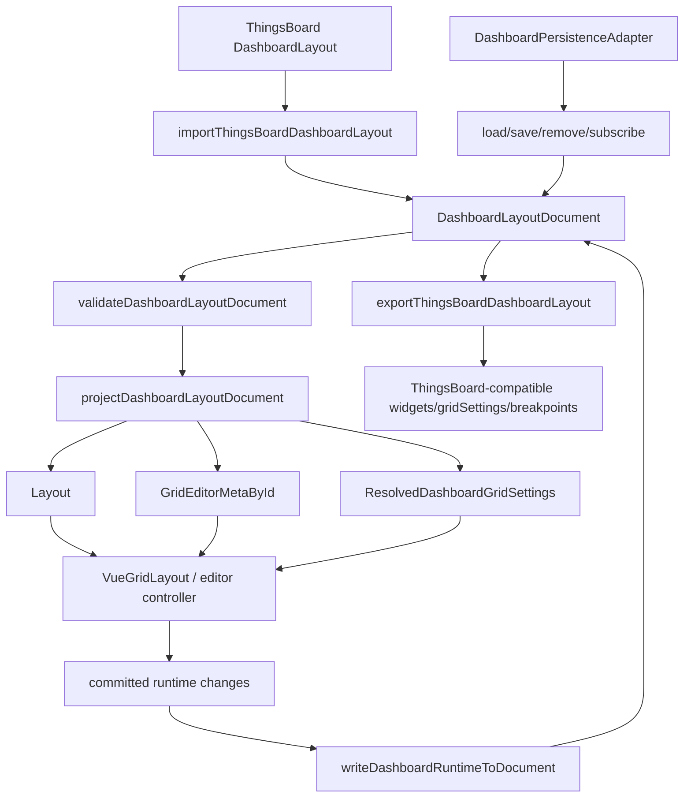

# Dashboard Layout Document & Adapter 技术设计

## 架构概述

本设计新增一个框架无关的 dashboard 文档与 adapter 核心层，位于现有基础 `Layout` / `LayoutsMap`、editor metadata、layout persistence 旁边，而不是替换它们。第一版只实现单个 primary/default dashboard layout 的读写、投影和回写；根结构保留未来多 layout 区域扩展位，但运行时只解释 `primaryLayoutId` 指向的 layout。

建议新增模块：

- `lib/dashboard.ts`: dashboard document 类型、校验、序列化、反序列化、迁移、runtime 投影、runtime 回写、ThingsBoard 风格导入导出、diagnostics 类型。
- `lib/cjs.ts`: 导出 dashboard 核心 API 到 CommonJS 入口。
- `typings/index.d.ts`: 导出 dashboard 类型和函数声明。
- `test/run-dashboard-tests.js`: 覆盖文档 round-trip、strict/sanitize、投影、回写、unknown field preservation 和 ThingsBoard 兼容转换。

设计边界：

- `LayoutItem` 仍只承载几何和已有交互字段，不加入 `mobileOrder`、`mobileHeight`、`preserveAspectRatio`、grid settings 等 dashboard 产品字段。
- `DashboardLayoutDocument` 使用独立 `dashboardSchemaVersion`，不寄生在 `LayoutPersistenceDocument.meta.dashboard`。
- 第一版只提供纯函数和 adapter 类型，不实现 `useDashboardLayoutPersistence()`、组件级 `persistence` prop 或 Vue 状态机。
- breakpoint/profile 只由调用方显式传入 id；缺失或不存在时投影 fallback 到 primary/default，不根据 viewport width 自动匹配。
- mobile/list 渲染、高度模式、pixel precision、collision repair、context menu 和业务 widget 数据源留给后续 specs。

## 数据流图



## 组件与接口定义

### `lib/dashboard.ts`

`lib/dashboard.ts` 是第一版唯一新增运行时核心模块。它只依赖当前通用类型和纯函数：

- 从 `lib/utils.ts` 复用 `Layout`、`LayoutItem`、`ResizeHandleAxis` 和 clone 思路。
- 从 `lib/editor/types.ts` 以 type-only 方式复用 `GridEditorMetaById`。
- 从 `lib/editor/metadata.ts` 复用 `sanitizeEditorMetaById()` / `validateEditorMetaById()`，避免重复定义 editor metadata 校验规则。
- 从 `lib/persistence.ts` 复用 `MaybePromise`、`LayoutValidationMode` 的语义，但不复用 `LayoutPersistenceDocument` 作为 dashboard schema。

### 文档根结构

`DashboardLayoutDocument` 使用 `kind: 'dashboard-layout'` 区分基础 layout persistence。第一版 runtime 只解释 `layouts[primaryLayoutId]`，其他 layout id 仅校验 JSON-safe 后保留，并在 diagnostics 中标记为 `deferred-layout-slot`。

```ts
export const DASHBOARD_SCHEMA_VERSION = 1

export type DashboardLayoutDocument = {
  dashboardSchemaVersion: number
  kind: 'dashboard-layout'
  key: string
  revision: string
  sourceId: string
  savedAt: string
  primaryLayoutId: string
  layouts: Record<string, DashboardLayoutDefinition>
  meta?: DashboardDocumentMeta
}
```

默认新文档使用：

- `primaryLayoutId: 'default'`
- `layouts.default` 作为唯一已实现 runtime layout

### Dashboard layout 定义

```ts
export type DashboardLayoutDefinition = {
  widgets: Record<string, DashboardItemLayout>
  gridSettings?: DashboardGridSettings
  profiles?: Record<string, DashboardBreakpointProfile>
  editor?: DashboardEditorEnvelope
  extensions?: DashboardJsonObject
}
```

`profiles` 是 dashboard profile/breakpoint 的文档表达，但第一版不做 viewport 匹配。调用方可以显式传入 `profileId`，否则投影使用 primary/default layout。

### Item layout

```ts
export type DashboardItemLayout = {
  col: number
  row: number
  sizeX: number
  sizeY: number
  minSizeX?: number
  minSizeY?: number
  maxSizeX?: number
  maxSizeY?: number
  static?: boolean
  draggable?: boolean
  resizable?: boolean
  bounded?: boolean
  resizeHandles?: ResizeHandleAxis[]
  desktopHide?: boolean
  mobileHide?: boolean
  mobileHeight?: number
  mobileOrder?: number
  preserveAspectRatio?: boolean
  aspectRatio?: number
  extensions?: DashboardJsonObject
}
```

投影到 `LayoutItem` 时只写入当前基础 grid 支持的字段：

- `col` -> `x`
- `row` -> `y`
- `sizeX` -> `w`
- `sizeY` -> `h`
- `minSizeX/minSizeY/maxSizeX/maxSizeY` -> `minW/minH/maxW/maxH`
- `static/draggable/resizable/bounded/resizeHandles` -> `static/isDraggable/isResizable/isBounded/resizeHandles`

`desktopHide`、`mobileHide`、`mobileHeight`、`mobileOrder`、`preserveAspectRatio`、`aspectRatio` 不写入 `LayoutItem`。其中 visibility 通过 `editorMetaById.visible` 表达；aspect ratio 和 mobile/list 相关字段保留在 dashboard document，并通过 diagnostics 标记为后续能力。

### Grid settings

```ts
export type DashboardGridSettings = {
  columns?: number
  minColumns?: number
  margin?: number | [number, number]
  outerMargin?: boolean
  containerPadding?: [number, number]
  viewFormat?: 'grid' | 'list'
  rowHeight?: number
  autoFillHeight?: boolean
  mobileRowHeight?: number
  mobileAutoFillHeight?: boolean
  mobileDisplayLayoutFirst?: boolean
  layoutDimension?: {
    type?: 'percentage' | 'fixed'
    fixedWidth?: number
    fixedLayout?: string
    leftWidthPercentage?: number
  }
  backgroundColor?: string
  backgroundSizeMode?: string
  backgroundImageUrl?: string
  extensions?: DashboardJsonObject
}
```

第一版只把 settings 作为 resolved runtime settings 输出；不会把高度模式、mobile list 或背景渲染接进 Vue 组件。

### Editor sidecar

```ts
export type DashboardEditorEnvelope = {
  version: number
  editorMetaById?: GridEditorMetaById
  sectionRows?: unknown
  updatedAt?: string
  extensions?: DashboardJsonObject
}
```

规则：

- `editor` namespace 只保存 editor sidecar。
- dashboard grid settings 和 dashboard item layout 不写入 editor namespace。
- 未声明映射的 editor runtime state 不写入 dashboard item schema。
- 第一版明确映射字段为：几何字段、`resizable`、visibility。其他 editor metadata 保留在 sidecar。

### Diagnostics

所有核心函数返回结构化 diagnostics：

```ts
export type DashboardDiagnostic = {
  code: string
  level: 'info' | 'warning' | 'error'
  message: string
  path?: string
  itemId?: string
  profileId?: string
  layoutId?: string
  details?: unknown
}
```

常见 code：

- `profile-fallback`
- `unsupported-field`
- `deferred-layout-slot`
- `invalid-item-geometry`
- `unknown-item`
- `orphan-editor-meta`
- `editor-capability-conflict`
- `non-json-extension`
- `migration-missing`
- `migration-failed`

## API 接口设计

### 序列化、反序列化、校验和迁移

```ts
export type SerializeDashboardLayoutOptions = {
  key: string
  sourceId?: string
  meta?: DashboardDocumentMeta
  now?: () => Date
  revision?: () => string
}

export function serializeDashboardLayoutDocument(
  input: DashboardLayoutDefinition | DashboardLayoutDocument,
  options: SerializeDashboardLayoutOptions
): DashboardLayoutDocument

export type DeserializeDashboardLayoutOptions = {
  currentVersion?: number
  migrations?: DashboardMigrationMap
  validation?: 'strict' | 'sanitize'
  fallback?: DashboardLayoutDocument
}

export function deserializeDashboardLayoutDocument(
  payload: unknown,
  options?: DeserializeDashboardLayoutOptions
): DashboardDeserializeResult

export function validateDashboardLayoutDocument(
  payload: unknown,
  options?: {
    currentVersion?: number
    validation?: 'strict' | 'sanitize'
  }
): DashboardValidationResult

export function migrateDashboardLayoutDocument(
  payload: unknown,
  options?: {
    currentVersion?: number
    migrations?: DashboardMigrationMap
    validation?: 'strict' | 'sanitize'
  }
): DashboardMigrationResult
```

默认 `validation` 为 `strict`。`sanitize` 只在调用方显式传入时启用。

Strict 模式失败时：

- 返回错误和原始 payload。
- 不生成 runtime projection。
- 不覆盖调用方已有 runtime 状态。

Sanitize 模式只做确定性修复：

- clamp 负数 `col/row` 到 0。
- clamp 非正 `sizeX/sizeY` 到 1。
- 丢弃非法 `resizeHandles` 值。
- 删除或隔离 orphan editor metadata。
- 忽略非 JSON-safe extension 并报告 warning。

缺失 item id、缺失必要几何字段、重复逻辑 id 冲突、非 object document 等情况默认不可自动修复。

### Runtime 投影

```ts
export type ProjectDashboardLayoutOptions = {
  layoutId?: string
  profileId?: string
  targetView?: 'desktop' | 'mobile'
  validation?: 'strict' | 'sanitize'
}

export type DashboardGridRuntimeProjection = {
  layout: Layout
  gridSettings: ResolvedDashboardGridSettings
  editorMetaById: GridEditorMetaById
  layoutId: string
  profileId: string | null
  fallbackApplied: boolean
  diagnostics: DashboardDiagnostic[]
}

export function projectDashboardLayoutDocument(
  document: DashboardLayoutDocument,
  options?: ProjectDashboardLayoutOptions
): DashboardProjectionResult
```

投影规则：

- `layoutId` 缺省使用 `document.primaryLayoutId`。
- 第一版只解释 primary/default runtime layout；非 primary layout slot 保留但不投影。
- `profileId` 存在且命中时，将 profile 中的 `widgets` 和 `gridSettings` override 合并到 primary layout。
- `profileId` 缺失或不存在时 fallback 到 primary/default layout，并输出 `profile-fallback` diagnostic。
- `targetView` 缺省为 `desktop`。`desktopHide` / `mobileHide` 只影响 `editorMetaById.visible`，不删除 item。
- 输出 layout 按 `row`、`col`、id 排序，保证稳定结果。
- `resizable: false` 同时表达为 `LayoutItem.isResizable = false` 和 `editorMetaById[id].resizable = false`。

### Runtime 回写

```ts
export type WriteDashboardRuntimeOptions = {
  layoutId?: string
  profileId?: string
  editorMetaById?: GridEditorMetaById
  createMissingItems?: boolean
  createMissingProfile?: boolean
  validation?: 'strict' | 'sanitize'
}

export function writeDashboardRuntimeToDocument(
  document: DashboardLayoutDocument,
  runtime: {
    layout: Layout
    editorMetaById?: GridEditorMetaById
    gridSettings?: Partial<DashboardGridSettings>
  },
  options?: WriteDashboardRuntimeOptions
): DashboardWriteResult
```

回写规则：

- 函数永远 clone document，不原地修改输入。
- `LayoutItem.x/y/w/h` 回写到 `col/row/sizeX/sizeY`。
- `minW/minH/maxW/maxH` 回写到 `minSizeX/minSizeY/maxSizeX/maxSizeY`。
- `isResizable` 可回写到 `resizable`。
- visibility 可回写到 `desktopHide` 或 `mobileHide`，具体由 `targetView` 或调用方映射配置决定；默认只更新 editor sidecar，避免误判业务语义。
- 未声明映射的 editor metadata 保留在 `editor.editorMetaById`。
- `profileId` 存在且 profile 存在时只更新目标 profile override。
- `profileId` 不存在时默认返回 error diagnostic；只有 `createMissingProfile: true` 时才创建 profile。
- runtime 中出现未知 item 时，`createMissingItems: true` 才新增 dashboard item，否则返回 `unknown-item` diagnostic。

### Persistence adapter 类型

```ts
export type DashboardPersistenceAdapter = {
  load: (key: string) => MaybePromise<unknown>
  save: (key: string, document: DashboardLayoutDocument) => MaybePromise<void>
  remove: (key: string) => MaybePromise<void>
  subscribe?: (
    key: string,
    callback: (event: DashboardPersistenceExternalChange) => void
  ) => () => void
}
```

第一版只定义 adapter 类型和事件类型，不实现 Vue composable。现有 storage/http/indexedDB adapter 的实现思路可以在后续任务中复用，但不能把 dashboard document 存成 `LayoutPersistenceDocument`。

### ThingsBoard 兼容转换

```ts
export type ThingsBoardDashboardLayoutLike = {
  widgets?: Record<string, unknown>
  gridSettings?: Record<string, unknown>
  breakpoints?: Record<string, unknown>
}

export function importThingsBoardDashboardLayout(
  input: ThingsBoardDashboardLayoutLike,
  options?: SerializeDashboardLayoutOptions
): DashboardImportResult

export function exportThingsBoardDashboardLayout(
  document: DashboardLayoutDocument,
  options?: { layoutId?: string }
): DashboardExportResult
```

映射：

- `widgets[id].col/row/sizeX/sizeY` -> `DashboardItemLayout.col/row/sizeX/sizeY`
- `widgets[id].desktopHide/mobileHide/mobileHeight/mobileOrder/resizable/preserveAspectRatio` -> 同名 dashboard item 字段
- `gridSettings` 中的 columns、margin、viewFormat、rowHeight、autoFillHeight 等字段 -> `DashboardGridSettings`
- `breakpoints[id].widgetLayouts/gridSettings` -> `profiles[id].widgets/gridSettings`

ThingsBoard 的业务 widget config、entity alias、timewindow、filter、alarm、toolbar 等数据放入 `extensions.thingsBoard` 或调用方自有业务层，不进入基础 adapter 必需 schema。

## 数据模型与数据库变更

不需要数据库变更。该能力定义 JSON 文档模型和纯函数转换。

文档存储形态示例：

```json
{
  "dashboardSchemaVersion": 1,
  "kind": "dashboard-layout",
  "key": "dashboard:demo",
  "revision": "rev_1",
  "sourceId": "source_1",
  "savedAt": "2026-05-19T00:00:00.000Z",
  "primaryLayoutId": "default",
  "layouts": {
    "default": {
      "gridSettings": {
        "columns": 24,
        "margin": 10,
        "viewFormat": "grid",
        "rowHeight": 80
      },
      "widgets": {
        "temperature": {
          "col": 0,
          "row": 0,
          "sizeX": 6,
          "sizeY": 4,
          "resizable": true
        }
      },
      "profiles": {
        "mobile": {
          "widgets": {
            "temperature": {
              "mobileOrder": 1,
              "mobileHeight": 8
            }
          },
          "gridSettings": {
            "viewFormat": "list",
            "mobileRowHeight": 64
          }
        }
      }
    }
  }
}
```

校验规则：

- `dashboardSchemaVersion` 必须为正整数。
- `kind` 必须为 `dashboard-layout`。
- `primaryLayoutId` 必须指向 `layouts` 中存在的 layout。
- `widgets` 必须是 object map，key 为非空 string。
- item `col`、`row`、`sizeX`、`sizeY` 必须为有限 number；strict 模式要求 `col >= 0`、`row >= 0`、`sizeX > 0`、`sizeY > 0`。
- `resizeHandles` 值必须属于当前 `ResizeHandleAxis`。
- `profiles` 必须是 object map；profile override 中出现的 item id 可以引用 primary widgets，未知 id 允许保留但会产生 diagnostic。
- `meta`、`extensions`、unknown fields 必须是 JSON-safe plain data。

## 安全考量

- 所有读取都通过 JSON parse 和结构校验，不执行 payload 中任何内容。
- 不允许 DOM 节点、VNode、事件对象、函数、symbol、class instance 或循环引用进入 document。
- strict 是默认校验策略，损坏 document 不会覆盖当前 runtime。
- migration 失败不得写回 adapter。
- unknown fields 只作为 JSON-safe data 克隆和保留，不参与 runtime 执行。
- 不把认证 token、查询密钥或私密业务配置放进 dashboard layout document；业务层需要自行加密或选择更合适的存储。
- adapter subscribe 事件只暴露 document 和诊断信息，不自动解决冲突；冲突 UI 留给后续 editor shell 或业务层。

## 测试策略

### 单元测试

- serialize/deserialize：合法 document round-trip、默认 primary layout、revision/source/savedAt、unknown field preservation。
- validation strict：缺少 root 字段、非法 kind、缺失 primary layout、非法 item geometry、非法 resize handle、非 JSON-safe extension。
- validation sanitize：负数坐标 clamp、非正尺寸 clamp、非法 handle 丢弃、orphan editor metadata 清理。
- migration：顺序迁移、缺失 migration、migration 抛错、迁移后校验失败。
- projection：default 投影、显式 profile 投影、缺失 profile fallback、desktop/mobile visibility、`resizable: false` 映射、稳定排序。
- write-back：几何字段回写、profile-scoped 回写、不原地修改、unknown item error/create、editor sidecar preservation。
- ThingsBoard import/export：`WidgetLayout`、`GridSettings`、`breakpoints` 映射，业务字段进入 extensions 或被 diagnostic 标记。

### 类型与导出测试

- `lib/cjs.ts` 导出 dashboard namespace 和常用函数。
- `typings/index.d.ts` 暴露 `DashboardLayoutDocument`、`DashboardGridSettings`、`DashboardItemLayout`、`DashboardBreakpointProfile`、`DashboardPersistenceAdapter`、projection/write result 和 diagnostics 类型。
- TypeScript 消费侧可以只导入 dashboard 核心，不要求导入 Vue 组件。

### 集成边界测试

- 投影结果可直接传给现有 `VueGridLayout` 的 `modelValue`。
- 投影出的 `editorMetaById` 可通过现有 editor metadata 校验。
- 不使用 dashboard module 时，现有 `LayoutPersistenceDocument`、`useGridLayoutPersistence()` 和 editor persistence bridge 行为保持不变。
