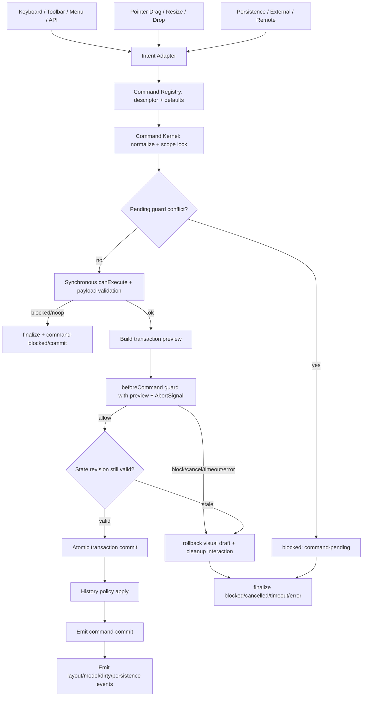

# Editor Command Kernel 技术设计

## 架构概述

本设计把专业编辑器的所有可提交编辑意图收敛到一个 headless Command Kernel。现状里，keyboard 已经通过 `controller.execute()` 执行命令，`controller.execute()` 也已经具备 `command-start`、同步校验、`beforeCommand` 和 `command-commit/blocked/error` 的雏形；但 drag/resize/drop 仍在交互层直接提交 layout，editor history 的 `push` 和 `replacePresent` 也会无条件清空 redo 栈。这些路径需要被统一，而不是只给 `Ctrl+Z` 增加一个事件。

目标架构分为七层：

1. Intent Adapter：把 keyboard、toolbar、context-menu、api、pointer、drop、persistence、external/remote 更新归一化为 command 或 internal transaction intent。
2. Command Registry：提供内建 command descriptor，集中声明 labelKey、默认 history 策略、影响范围、风险等级、target 解析、payload 校验和 handler。
3. Command Kernel：负责 normalize、同步 canExecute、pending guard 互斥、stale 校验、guard 调用、transaction commit、rollback 和结果归一化。
4. Transaction Builder：handler 不再直接写响应式状态，而是产出 preview、patches、before/after snapshot 和 apply plan。
5. Guard Boundary：`beforeCommand` 是唯一可阻塞/确认的业务扩展点；事件只做观察。
6. History Policy：统一处理 `record`、`ignore`、`record-preserveRedoStack`、`replace`、`clear`、mergeKey 和 interaction mark。
7. Event and Persistence Bridge：commit 后再稳定发出 command、layout/model、dirty/persistence 事件。

设计保持向后兼容：现有 `GridEditorCommand`、`beforeCommand`、`command-*` 事件、legacy `historyStore` 继续工作；`command.history.skip` 作为 `history.mode = "ignore"` 的兼容别名保留。公开第三方 `registerCommand()` 不纳入本轮实现，只预留内部 descriptor 形态，避免 API 过早冻结。

现状依据：

- `lib/editor/keyboard.ts:173` 已将快捷键绑定到 `controller.execute(command)`。
- `lib/editor/controller.ts:1303` 已有 execute 管线，包含 command-start、同步检查、beforeCommand 和 mutation。
- `lib/grid-layout/useGridDragResizeInteractions.ts:662`、`lib/grid-layout/useGridDragResizeInteractions.ts:694` 的 resize stop 仍直接 `onLayoutMaybeChanged(..., "push")`。
- `lib/grid-layout/useGridDropInteractions.ts:144` 到 `lib/grid-layout/useGridDropInteractions.ts:182` 的 drop commit 直接走 engine result 和 `emitDrop`。
- `lib/editor/history.ts:80` 的 `push` 会清空 future，`lib/editor/history.ts:116` 的 `replacePresent` 也会清空 future。

## 数据流图



External/programmatic 更新也进入 Kernel，但使用 internal apply path：默认 `history: "ignore"` 且保留 redo 栈，默认不触发业务确认弹框；只有显式 replace/load new document/reset history 才清空 redo。

## 组件与接口定义

### `lib/editor/commandRegistry.ts`

新增内部 registry，覆盖所有内建 command descriptor。它是 toolbar、context menu、keyboard 文案提示和 kernel handler 的统一来源，本轮不暴露第三方注册 API。

```ts
export type GridEditorCommandAffects = {
  layout?: boolean;
  layouts?: boolean;
  metadata?: boolean;
  sectionRows?: boolean;
  selection?: boolean;
  focus?: boolean;
  persistence?: boolean;
};

export type GridEditorCommandDescriptor = {
  type: GridEditorCommandType;
  labelKey: string;
  shortcuts?: string[];
  defaultSource?: GridEditorCommandSource;
  defaultHistory: GridEditorHistoryPolicy;
  affects: GridEditorCommandAffects;
  risk?: "normal" | "destructive" | "persistence" | "external";
  mutualExclusionScope?: "layout" | "selection" | "persistence" | "global";
  resolveTargets?: GridEditorResolveTargets;
  validatePayload?: GridEditorValidatePayload;
  buildTransaction?: GridEditorBuildTransaction;
};
```

默认策略：

- layout、metadata、section row 修改：`history.mode = "record"`。
- selection/focus：`history.mode = "ignore"`。
- undo/redo：不再写入 history，但可经过 guard。
- save/discard/reset：`risk = "persistence"`，history 策略由 descriptor 明确声明。
- external/remote/programmatic：internal intent，`history.mode = "ignore"` 且 `preserveRedoStack = true`。

`toolbar.ts` 的固定 `toolbarCommands` 保留为排序配置，但可用性、labelKey、快捷键和禁用原因从 descriptor + `controller.canExecute()` 派生。

### `lib/editor/transactions.ts`

新增 transaction 类型，作为 preview、guard 和 commit 的共同数据结构。

```ts
export type GridEditorHistoryMode =
  | "record"
  | "ignore"
  | "record-preserveRedoStack"
  | "replace"
  | "clear";

export type GridEditorHistoryPolicy = {
  mode?: GridEditorHistoryMode;
  mergeKey?: string;
  mergeWindowMs?: number;
  preserveRedoStack?: boolean;
  skip?: boolean;
  reason?: string;
};

export type GridEditorTransactionPreview = {
  layoutPatches: LayoutPatch[];
  metadataPatches: GridEditorMetadataPatch[];
  sectionRowPatches?: GridEditorSectionRowPatch[];
  affectedIds: string[];
  beforeSummary: GridEditorTransactionSummary;
  afterSummary: GridEditorTransactionSummary;
  risk?: "normal" | "destructive" | "persistence" | "external";
};

export type GridEditorTransaction = {
  id: string;
  commandId: string;
  command: NormalizedGridEditorCommand;
  source: GridEditorCommandSource;
  origin?: string;
  scope: string;
  before: GridEditorHistorySnapshot;
  after: GridEditorHistorySnapshot;
  preview: GridEditorTransactionPreview;
  history: GridEditorHistoryPolicy;
};
```

handler 的职责是计算 `after` 和 preview；Kernel 负责统一 apply。对于当前必须依赖 layout engine 的 move/resize/drop，handler 可以复用现有 `executeLayoutOperation`、`layoutOperationRunner` 和 dropFit 结果，但最终状态必须以 transaction 形式返回。

### `lib/editor/commandKernel.ts`

新增 Kernel 工厂，由 `controller.ts` 传入 state ports。

```ts
export type GridEditorCommandKernelPorts = {
  getSnapshot: () => GridEditorHistorySnapshot;
  getStateRevision: () => number;
  applySnapshot: (snapshot: GridEditorHistorySnapshot, reason: string) => void;
  applyTransaction: (transaction: GridEditorTransaction) => GridEditorCommandResult;
  beforeCommand?: GridEditorBeforeCommand;
  history?: GridEditorHistoryController;
  emit: (event: GridEditorEvent) => void;
  cleanupInteraction?: (reason: string) => void;
};
```

Kernel 流程：

1. normalize command，并套用 descriptor 默认 source/history。
2. 根据 descriptor scope 检查 pending guard；默认拒绝同一 scope 的新互斥 command，返回 `blocked`，reason 为 `command-pending`。
3. 执行 payload 校验和现有 `checkGridEditorCommand`。
4. 构造 transaction preview。
5. 调用 `beforeCommand`，上下文包含 preview、source、origin、sectionRows、history 可用性和 `AbortSignal`。
6. guard 返回 allow 后检查 state revision；若失效，返回 `cancelled` 或 `blocked: stale-command`，并 rollback。
7. 原子提交 transaction，应用 history policy，发出事件。
8. guard block/cancel/timeout/error 或组件 stop 时 abort pending guard，不提交过期结果。

### `lib/editor/history.ts`

扩展 editor history，而不是扩展 legacy `lib/history.ts` 公共契约。

```ts
export type GridEditorHistoryPushOptions = {
  preserveRedoStack?: boolean;
};

export type GridEditorHistoryReplaceOptions = {
  preserveRedoStack?: boolean;
};

export type GridEditorHistoryMark = {
  id: string;
  snapshot: GridEditorHistorySnapshot;
  revision: number;
};
```

`push(entry, { preserveRedoStack })` 默认维持现状：记录后清空 redo；当 `preserveRedoStack` 为 true 时保留 future。`replacePresent(snapshot, { preserveRedoStack })` 默认用于 load/reset 并清空 redo；external/programmatic 更新调用时传入 `preserveRedoStack: true`。

interaction mark 由 Kernel 创建：drag/resize/drop 开始时保存 committed snapshot；成功时从 mark squash 成一条 history entry；取消、guard 非 allow 或 stale 时 bail 到 mark，不写 history，不污染 redo。

### `lib/grid-layout/*` interaction adapter

drag/resize/drop 不再直接触发 durable commit：

- drag stop：捕获 `committedBefore` 和 `candidateAfter`，构造 `move` command，`source = "pointer"`，payload 带 before/after item 和 layout diff。
- resize stop：构造 `resize` command，逻辑同上。
- external drop：优先复用 `add` command，`source = "drop"`，payload 带 drop strategy、candidate item 和 target；只有确实需要区分新增/移动混合语义时再增加专用 command type。
- guard pending 期间允许保留视觉 preview，但必须设置 suppress 标记，不能触发 model/history/persistence durable 提交。
- guard 非 allow、stale 或 engine 失败时，立即恢复 committed layout，并清理 placeholder、guides、active interaction、auto-scroll。
- `emitDrop`、`emitResizeStop`、`emitDragStop` 等外部事件在 transaction allow 且 durable commit 后发出。

### `lib/editor/controller.ts`

`controller.execute()` 改为委托 Kernel，原有 `executeMutation` 中的具体逻辑逐步拆到 descriptor handler。`canExecute()` 继续保持同步，只做 descriptor + payload + capability 检查，不调用 guard。

`setExternalLayout()` 和 `setExternalLayouts()` 改为通过 Kernel 的 internal apply path：

- 默认 source 为 `"external"`，origin 为 reason 或调用方传入 origin。
- 默认 `history.mode = "ignore"`，保留 redo。
- 可选 `history.mode = "replace"` 或 `history.mode = "clear"` 用于显式 load new document/reset。

## API 接口设计

### Command source

扩展 source union：

```ts
export type GridEditorCommandSource =
  | "pointer"
  | "keyboard"
  | "toolbar"
  | "context-menu"
  | "api"
  | "persistence"
  | "drop"
  | "external"
  | "remote"
  | "system";
```

### Command history

`GridEditorCommand.history` 支持字符串和对象两种形态，旧的 `skip` 继续可用。

```ts
export type GridEditorCommand = {
  id?: string;
  type: GridEditorCommandType;
  targetIds?: string[];
  payload?: unknown;
  source?: GridEditorCommandSource;
  origin?: string;
  history?: GridEditorHistoryMode | GridEditorHistoryPolicy;
};
```

解析规则：

- `history: "ignore"`：不记录 undo/redo，不清空 redo。
- `history: "record"`：记录 entry，默认清空 redo。
- `history: "record-preserveRedoStack"`：记录 entry，但保留 redo。
- `history: "replace"`：替换当前 present，默认清空 redo。
- `history: "clear"`：清空 history。
- `history.skip === true`：等价于 `"ignore"`。

### beforeCommand context

对现有 context 做可选字段扩展，旧业务代码无需修改。

```ts
export type GridEditorBeforeCommandContext = {
  command: GridEditorCommand;
  source: GridEditorCommandSource;
  origin?: string;
  targetIds: string[];
  layout: Layout;
  layouts?: LayoutsMap;
  editorMetaById: GridEditorMetaById;
  sectionRows: GridEditorSectionRowState;
  selection: GridEditorSelectionState;
  mode: GridEditorMode;
  history: {
    canUndo: boolean;
    canRedo: boolean;
  };
  preview?: GridEditorTransactionPreview;
  signal?: AbortSignal;
};
```

示例：

```ts
const beforeCommand: GridEditorBeforeCommand = async context => {
  if (context.command.type === "undo") {
    return await confirmUndo(context.preview) ? { status: "allow" } : { status: "cancel" };
  }
  if (context.preview?.risk === "destructive") {
    return { status: "block", reason: "before-command-blocked" };
  }
  return { status: "allow" };
};
```

### Controller external apply

保留现有调用方式，并增加可选 options。

```ts
export type GridEditorExternalApplyOptions = {
  origin?: string;
  history?: GridEditorHistoryMode | GridEditorHistoryPolicy;
};

setExternalLayout(layout, reason?, options?)
setExternalLayouts(layouts, breakpoint, reason?, options?)
```

默认行为为 `history: "ignore"` 且 `preserveRedoStack: true`。显式加载新文档时使用 `{ history: "clear" }` 或 `{ history: "replace" }`。

### Events

事件继续是观察面，不是拦截面。保持 `command-start`、`command-commit`、`command-blocked`、`command-error`，并通过 `GridEditorCommandResult.diagnostics` 增加可诊断字段：

- `guardMs`
- `pendingScope`
- `stateRevision`
- `stale`
- `historyMode`

onEvent 抛错不得改变 command 结果；实现中需要捕获并通过 `editor-error` 或 diagnostics 暴露。

## 数据模型与数据库变更

无数据库变更。

内存数据模型变化：

- `GridEditorHistoryEntry` 增加可选 `source`、`origin`、`targetIds`、`affectedIds`、`historyMode`，用于审计和调试。
- `GridEditorCommandResult.diagnostics` 增加 pending/stale/history 相关字段。
- `GridEditorBeforeCommandContext` 增加 `sectionRows`、`source`、`origin`、`history`、`preview`、`signal`。
- `GridEditorHistoryController` 增加 preserve redo 选项；legacy `GridHistoryStore` 不变。
- `typings/index.d.ts` 需要同步上述类型。

持久化 envelope 不升级版本。history 栈、pending guard、transaction preview 和 raw DOM Event 都不写入 persistence 文档。drop/drag 事件对象只在交互 adapter 的 side effect 层短暂使用，不进入 history entry。

## 安全考量

- 核心库不内建 modal、toast、i18n 或权限 UI，只等待 guard Promise，避免把业务 UI 依赖带进 headless 核心。
- guard 使用 timeout、`AbortSignal` 和 state revision，防止旧弹框、卸载后的 Promise 或外部更新后的过期确认继续提交。
- pending guard 默认拒绝同 scope 新命令，避免重复快捷键造成多次弹框和重复提交。
- source/origin 用于审计和过滤，不作为安全边界；真正权限必须由业务 guard 或上层服务校验。
- event listener 错误必须隔离，不能反向改变已提交 transaction。
- transaction preview 不应携带 raw DOM Event、VNode、DOM node 或大型循环引用，避免内存泄漏和不可序列化对象进入 history。
- external/remote 默认不进入用户 undo 栈，避免用户 undo 本地操作时意外回滚远程同步。

## 测试策略

单元测试：

- `commandRegistry` 覆盖 descriptor 默认 history、source、risk、payload 校验和 toolbar 派生。
- `commandKernel` 覆盖 guard allow/block/cancel/timeout/error、pending guard reject、state revision stale、event 顺序和 onEvent 抛错隔离。
- `history` 覆盖 `ignore` 不清 redo、`record` 清 redo、`record-preserveRedoStack` 保留 redo、`replace/clear` 行为和 mergeKey。
- `controller` 覆盖 keyboard、toolbar/API、undo/redo、selection/focus 默认 `ignore`、external apply 保留 redo。

交互测试：

- drag stop allow 后只产生一条 history entry，并按顺序触发 command commit 和 layout/model 事件。
- drag stop block/cancel/timeout 后恢复 committed layout，清理 guides/active interaction/auto-scroll，不写 history，不发 durable layoutChange。
- resize stop 同 drag 规则。
- drop allow 后才触发 `emitDrop`；drop block/cancel 后移除 placeholder 并恢复 base layout。
- pending guard 期间再次触发同 scope move/resize/delete 时默认返回 `blocked: command-pending`。

浏览器测试：

- 在 `test/editor-component-browser.test.js` 或新增 browser case 中模拟业务确认弹框 Promise，验证视觉 preview、确认后 commit、取消后 rollback。
- 保留现有 `test/grid-layout-contract-browser.test.js` 的 legacy drop 合约；对启用 editor 的场景新增 Command Kernel 路径断言。

类型测试：

- 更新 `test/dashboard-editor-shell-types.test.ts` 和 `typings/index.d.ts` 相关断言，覆盖扩展 source、history 字符串策略、beforeCommand 新 context 字段。

回归边界：

- 未启用 `editor` 的 legacy `historyStore` 行为不变。
- 启用 editor 且传入 `legacyHistoryStore` 时，只在 editor command commit 后同步 layout-only entry，避免 interaction adapter 和 editor history 双写。
