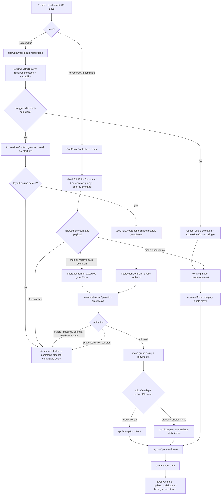

# Editor 多选组移动核心技术设计

## 架构概述

本设计采用 engine-first 的 `groupMove`，但落点需要匹配当前已经拆分后的代码结构。多选组移动由四层协作完成：

- `layout-engine`: 新增一等 `groupMove` operation，负责组移动的几何、碰撞、边界、static 障碍物、patches、placeholder 和 diagnostics。
- `grid-layout` interaction 层: `useGridDragResizeInteractions()` 负责 pointer drag start/preview/stop 的 single/group/blocked runtime context；`useGridLayoutEngineBridge()` 负责把 preview/commit 接入 interaction controller、scheduler 和 executor。
- `editor runtime/controller`: `useGridEditorRuntime()` 负责把 selection、capability、locked metadata、guides/snap 和 pointer adapter 连接起来；`GridEditorController` 继续负责 keyboard/API command、`commandPolicy`、history、undo/redo、persistence bridge 和 command events。
- `ResponsiveVueGridLayout`: 不新增独立算法，只把当前 breakpoint 的 scoped layout、inner editor controller 和 layout engine prop 传给内层 `VueGridLayout`。

现有代码依据：

- `LayoutOperation` 当前只有单 item `move`，见 `lib/layout-engine/types.ts:12`。
- layout engine dispatch 当前只处理 `move`、`resize`、`dropFit`、`compact`、`validate`、`generateResponsiveLayout`，见 `lib/layout-engine/core.ts:765`。
- 单 item move 已经通过 `executeMove()` 复用 `moveElement()`、collision、compaction、patch 和 diagnostics，见 `lib/layout-engine/core.ts:366`。
- pointer drag start/preview/stop 当前位于 `lib/grid-layout/useGridDragResizeInteractions.ts:449`、`:476`、`:580`，preview/commit 当前都发 `{ type: "move", id, x, y }`。
- engine bridge 当前在 `lib/grid-layout/useGridLayoutEngineBridge.ts:183` 和 `:198` 暴露 preview/commit，并在 `:136` 决定 executor 使用策略。
- `InteractionController` 当前用单个 `itemId` 跟踪 drag/resize/drop interaction，见 `lib/layout-engine/vueAdapter.ts:88`。
- `scheduler` 的 `commitOnly` preview 当前只认识 `move`/`resize` placeholder，见 `lib/layout-engine/scheduler.ts:51`。
- editor selection click、render selected/active class 和 guides/snap 连接在 `lib/grid-layout/useGridEditorRuntime.ts:232`、`:246`、`:195`。
- keyboard arrow move 生成 `move` command 和 `keyboard-move` merge key，见 `lib/editor/keyboard.ts:143`。
- editor command check 已经能按 capability、`locked`、`static` 和 `commandPolicy` 分出 allowed/blocked ids，见 `lib/editor/commands.ts:239`。
- editor controller 的 `move` command 当前仍直接批量 patch layout，见 `lib/editor/controller.ts:904`。

设计原则：

- layout engine 不读取 `editorMetaById`，因此不理解 `locked`；`locked` 只在 editor runtime/controller 层参与 capability 过滤。
- `static` 是 layout item 的物理固定语义，layout engine 可以直接识别 selected static 或组外 static，并返回 `static-item`。
- pointer group drag 不能在 `useGridDragResizeInteractions()` 中手写批量 patch layout；keyboard/API group move 也不能在 controller 中继续绕过 engine。
- 未启用 editor、未多选、或 single-item move 时保持现有行为、事件顺序和 CSS class 兼容。
- legacy/disabled layout engine 不实现第二套 group move；multi-item group move 返回结构化 blocked，single item move 继续走现有路径。
- headless controller 必须有明确的 engine options/runner 来源；没有 options/runner 且需要 multi-item group move 时返回 `unsupported`。

## 数据流图



## 组件与接口定义

### LayoutOperation 扩展

在 `lib/layout-engine/types.ts` 中新增 `groupMove`：

```ts
export type LayoutOperation =
  | { type: "move"; id: string; x: number; y: number; userAction?: boolean }
  | {
      type: "groupMove";
      ids: string[];
      dx: number;
      dy: number;
      activeId?: string;
      userAction?: boolean;
    }
  | /* existing operations */;
```

语义：

- `ids` 是要移动的 layout item ids，由 editor controller 或 pointer runtime 过滤后传入。
- `dx/dy` 是 grid cell delta；pointer drag 通过 active item 起点与 snapped target 计算，keyboard/API 直接传入。
- `activeId` 只影响 placeholder、diagnostics、guides、interaction rebase 锚点，不改变组内相对位置。
- `dx=0 && dy=0` 返回 `noop`，placeholder 指向 active item 或第一个有效 id。
- `ids.length === 1` 时复用单 item move 等价语义；diagnostics 仍保留 `operationType: "groupMove"` 以表达来源。

### LayoutBlockedReason 扩展

新增可选 reason：

```ts
export type LayoutBlockedReason =
  | "collision"
  | "static-item"
  | "bounds"
  | "maxRows"
  | "missing-item"
  | "invalid-input"
  | "unsupported";
```

`unsupported` 主要用于 component/editor adapter 层表达 legacy/disabled engine 不支持 multi-item group move。layout engine 内部遇到非法 `groupMove` 输入优先使用 `invalid-input` 或 `missing-item`。

### Group Move 执行上下文

在 `lib/layout-engine/core.ts` 内部增加纯函数上下文：

```ts
type NormalizedGroupMove = {
  ids: string[];
  movingIds: Set<string>;
  activeId: string;
  dx: number;
  dy: number;
  movingItems: LayoutItem[];
  targetItems: LayoutItem[];
};
```

归一化规则：

- 去重 `ids`，保留传入顺序；过滤空字符串。
- `dx/dy` 必须为有限数值，并归一化为整数 grid delta。
- `ids` 为空返回 `invalid-input`。
- 任一 id 不存在返回 `missing-item`，`blocked.itemIds` 为缺失 ids。
- 任一 moving item 为 `static: true` 且未被 editor 层过滤，返回 `static-item`。
- `activeId` 不在有效 ids 中时回退到第一个有效 id。

### ActiveMoveContext

`ActiveMoveContext` 不再放进 `VueGridLayout.tsx`。它应定义在 `lib/grid-layout/useGridDragResizeInteractions.ts` 或相邻内部类型文件中，由 interaction hook 持有：

```ts
type ActiveMoveContext =
  | {
      kind: "single";
      id: string;
      startX: number;
      startY: number;
    }
  | {
      kind: "group";
      activeId: string;
      ids: string[];
      startX: number;
      startY: number;
    }
  | {
      kind: "blocked";
      reason: "unsupported" | "capability" | "mode-readonly";
      ids: string[];
      activeId?: string;
    };
```

`useGridEditorRuntime()` 需要扩展 `GridInteractionsEditor` 的内部能力，给 `useGridDragResizeInteractions()` 提供同步 helper：

- 读取当前 selection：`selectedIds`、`activeId`、`mode`。
- 判断 dragged item 是否属于多选，以及是否能直接移动。
- dragged item 不在 selection 中时请求 controller 切换为单选，但当前 pointer interaction 立即按 single move 继续。
- legacy/disabled engine 且需要 multi-item group move 时构造 blocked result，并通过 editor event 路径发出与 `command-blocked` 兼容的反馈。

### Editor Controller Engine Runner

`GridEditorController` 是 headless API，不能直接依赖 Vue 组件 props。为了让 keyboard/API `move` 也走 engine，需要在 `UseGridEditorOptions` 增加内部可选能力：

```ts
type GridEditorLayoutOperationRunner = (input: {
  commandId: string;
  layout: Layout;
  operation: LayoutOperation;
  phase: "commit";
  source: GridEditorCommandSource;
}) => LayoutOperationResult;
```

推荐落地方式：

- `useGridEditorRuntime()` 创建内部 controller 时注入 runner，runner 复用当前 `engineBridge.getLayoutEngineOptions()` 和 `executeLayoutOperation()`。
- headless `createGridEditorController()` 可以通过 options 显式传入 runner，或通过 move payload 中的 `cols`、`compactType`、`allowOverlap`、`preventCollision`、`maxRows` 构造 engine options。
- 外部传入 `editor.controller` 且未配置 runner/options 时，multi-item group move 返回 `unsupported`；single target absolute `x/y` 保持现有语义。

## API 接口设计

### executeGroupMove(request, index, start)

在 `lib/layout-engine/core.ts` 中新增 `executeGroupMove()`，并在 `executeLayoutOperationWithIndex()` switch 中接入。

执行步骤：

1. 归一化 operation，得到 moving set、target items 和 active item。
2. 对每个 target item 检查 `x/y/cols/maxRows`，任一失败返回 `bounds` 或 `maxRows`。
3. 检查 target items 与组外 `static: true` item 的碰撞；命中时返回 `static-item`，不受 `preventCollision=false` 影响。
4. 检查 target items 与组外非 static item 的碰撞。
5. 若 `preventCollision=true && allowOverlap=false` 且存在组外碰撞，返回 `collision`。
6. 若 `allowOverlap=true`，直接把 moving items 更新到 target positions，不执行 compaction。
7. 若 `preventCollision=false && allowOverlap=false`，把 group 作为 rigid moving set 应用，再按现有 move/compact 规则推动或重新压缩组外非 static item。
8. 通过现有 `collectPatches()`、`makeResult()` 和 diagnostics 返回结果。

组内碰撞处理：

- `movingIds` 内的 item 彼此不作为外部碰撞阻塞。
- 如果原 layout 中组内已有 overlap，group move 保持该 overlap 和相对 offset，不额外修正。

组外推动/compact 策略：

- group target items 在 collision resolution 中被视为本次 user action 的固定移动集合，不能被组外 item 反推改变相对位置。
- 组外非 static item 可被 `moveElementAwayFromCollision()` 或新的 group-aware helper 移开。
- final layout 继续调用现有 final compaction helper；`allowOverlap=true` 或 `compactType=null` 时遵循现有 final compaction 规则。
- patches 和 `affectedIds` 必须包含移动组内 ids，以及被推动或 compact 的组外 ids。

### Scheduler、Executor 与 InteractionController

`groupMove` 必须使用现有 `LayoutOperationRequest`、scheduler、executor 和 interaction controller。

- `createCommitOnlyPreview()` 需要支持 `groupMove`：找到 `activeId` 或第一个 id 的 item，返回加上 `dx/dy` 的 active placeholder。
- `shouldUseExecutor()` 需要显式决定 `groupMove` 策略：pointer preview 默认与 `move`/`resize` 一样优先主线程或 scheduler `commitOnly`，commit 可进入 worker/custom executor。
- `InteractionController.start()` 对 group drag 仍使用 `type: "drag"`，`itemId` 使用 `activeId`；missing non-active selected ids 交给 `executeGroupMove()` 返回 `missing-item`。
- `rebase()` 对 group move 重新执行上一条 preview；若 active item 不存在则 cancel，若其他 moving id 不存在则通过 blocked result 反馈。
- `compareLegacyLayout()` 对 `groupMove` 不应产生无意义 legacy mismatch；single-id groupMove 可以与等价 `move` 比较，多 id groupMove 应跳过 legacy comparison 或标记 unsupported comparison。

### Editor Controller Move Path

`GridEditorController.execute({ type: "move" })` 的 layout mutation 分支改为：

- 经过 `checkGridEditorCommand()` 得到 `targetIds`、`allowedIds` 和 `blockedIds`。
- 继续执行 section row locked/collapsed policy 与 `beforeCommand` guard；这些阻断发生在 engine 前。
- `commandPolicy="skip-blocked"` 时只对 `allowedIds` 运行 engine，并把 `blockedIds` 写入 result 的 `skippedIds`。
- `commandPolicy="all-or-nothing"` 或默认策略下，如果存在 blocked ids，保持当前 command blocked，不调用 engine。
- `allowedIds.length === 1` 且 payload 有 absolute `x/y` 时保留单 item absolute `move`。
- `allowedIds.length > 1`，或当前 selection 多选且 payload 是相对 `dx/dy` 时生成 `groupMove`。
- engine result 的 patches、affected ids、blocked reason、diagnostics 和 undo metadata 合并进 `GridEditorCommandResult`。
- engine blocked 时不调用 `applyLayoutAndMetadata()`，不写 history。

### Pointer Group Drag Path

`useGridDragResizeInteractions()` 新增 `activeMoveContext`，并在 drag lifecycle 中使用。

`onDragStart`：

- editor 未启用、非 edit 模式、selection 数量小于 2 时使用 `single`。
- dragged id 在 `selectedIds` 中且 selection 数量大于 1 时使用 `group`。
- dragged id 不在 selection 中时请求 controller 切换为单选，并使用 `single`。
- `group` 且 layout engine 为 legacy/disabled 时使用 `blocked`，发出 editor blocked feedback，不修改 layout。
- 对 group drag 调用 `engineBridge.start({ type: "drag", itemId: activeId })`。

`onDrag` preview：

- `single` context 保持当前 `{ type: "move", id, x, y }`。
- `group` context 先对 active item 调用 `editor.snapCandidate(activeId, activeItem, candidate, layout)`，再计算：

```ts
const dx = snapped.x - context.startX;
const dy = snapped.y - context.startY;
```

- preview request 使用：

```ts
{
  type: "groupMove",
  ids: context.ids,
  activeId: context.activeId,
  dx,
  dy,
  userAction: true
}
```

`onDragStop` commit：

- `single` context 保持当前 commit。
- `group` context 使用 active placeholder/final geometry 重新计算 `dx/dy`，提交同一个 `groupMove`。
- commit 成功后沿用 `onLayoutMaybeChanged()` 提交边界，确保 `layoutChange`、`update:modelValue`、history 和 persistence 只在 stop 后发生。
- blocked/noop commit 清理 transient drag state，但不覆盖 committed layout。

placeholder / guides：

- 第一版仍以 active item placeholder 为主。
- guides、HUD 和 blocked state 继续使用 active item candidate；diagnostics/HUD 中附加 selected count、`dx/dy` 和 skipped/blocked ids。
- 后续 group bounding box、multi-ghost preview 不属于本规格。

### Responsive 行为

`ResponsiveVueGridLayout` 不新增独立 group move 算法。当前 breakpoint 的内层 `VueGridLayout` 接收 scoped layout 和 editor controller 后：

- pointer group move 只影响当前 breakpoint 的 inner layout。
- keyboard/API group move 在 responsive controller 中只修改当前 `breakpointRef` 对应 layout。
- breakpoint 切换沿用 `useResponsiveGridLayoutModel()` 现有 `setExternalLayouts()`、selection 清理和 responsive editor 语义。
- responsive layout generation 继续使用现有 `generateResponsiveLayout` operation，与 `groupMove` 独立。

## 数据模型与数据库变更

无数据库变更，无 durable persistence schema 变更。

新增数据均为运行时状态或 TypeScript 类型：

- `LayoutOperation` 新增 `groupMove` union member。
- `LayoutBlockedReason` / `GridEditorBlockedReason` 可新增 `unsupported`。
- `useGridDragResizeInteractions()` 新增 transient `ActiveMoveContext`。
- `UseGridEditorOptions` 可新增内部 layout operation runner/options provider，以支持 headless keyboard/API group move。
- `LayoutOperationResult` 继续使用现有 `patches`、`affectedIds`、`blocked`、`placeholder` 和 `diagnostics`。

persistence 行为：

- preview 阶段不写入 persistence。
- pointer commit 阶段通过现有 `onLayoutMaybeChanged()`、history 和 persistence bridge 处理。
- keyboard/API commit 阶段通过 controller history 和 persistence bridge 处理。
- `editorMetaById.locked` 不写入 layout engine request，也不改变 layout persistence schema。

## 安全考量

- `groupMove.ids`、`dx`、`dy` 必须在 layout engine 边界验证，避免无效输入造成 layout mutation。
- layout engine 不读取 editor metadata，因此不会把业务权限 metadata 混入 layout 几何层。
- `locked` 不作为安全权限边界；服务端权限仍应由业务侧或 `beforeCommand` guard 处理。
- legacy/disabled engine 下不实现 shadow group move，避免不同路径出现权限、碰撞和 history 语义分叉。
- headless controller 缺少 engine options/runner 时不得猜测 cols/maxRows 进行 multi-item group move，必须返回结构化 `unsupported` 或要求调用方提供 options。
- 不新增网络、clipboard、storage 或 worker 权限；worker executor 只接收纯 layout operation payload。
- diagnostics 不应包含 item 内容数据，只记录 ids、reason、duration、operation type 和布局几何结果。

## 测试策略

### Layout Engine 单元测试

覆盖：

- `groupMove` 成功移动多个 ids，patches 覆盖每个实际移动 item。
- `ids` 去重、空 ids、missing id、非有限 `dx/dy`。
- single-id `groupMove` 与相同 delta 的 `move` 等价。
- selected static item 返回 `static-item`。
- 组外 static item 即使 `preventCollision=false` 也返回 `static-item`。
- `bounds`、`maxRows` blocked。
- `preventCollision=true && allowOverlap=false` 撞组外 item 返回 `collision`。
- `preventCollision=false && allowOverlap=false` 允许推动/compact 组外非 static item，并记录组外 affected ids。
- `allowOverlap=true` 允许 overlap，并产生可诊断 result。
- `compactType` 为 `vertical`、`horizontal`、`null` 的主要路径。
- scheduler `commitOnly`、executor、workerRuntime 可以透传 `groupMove` 并返回同样结构。
- `compareLegacyLayout` 对 multi-id groupMove 不产生错误 legacy mismatch。

### Grid Layout Interaction 测试

覆盖：

- `useGridDragResizeInteractions()` 在多选拖拽已选 item 时创建 group context，并向 bridge 发 `groupMove` preview/commit。
- 拖动未选 item 时请求单选并保持 single move。
- legacy/disabled engine 下 multi-item group move 返回 structured blocked，committed layout 不变。
- blocked preview 保留 committed layout 或上一可用 preview，并允许后续 tick 恢复。
- active placeholder、dragBlocked class、guides/HUD diagnostics 使用 active item 和 selected count。

### Editor Controller 测试

覆盖：

- 当前 selection 多于一个且 keyboard/API `move` 无 explicit target 时解析为 groupMove。
- explicit 多 target `move` 解析为 groupMove。
- 单 target absolute `x/y` 保持单 item move。
- `locked`、hidden、不可拖拽 item 在 controller 层过滤，不传给 engine。
- `skip-blocked` 返回 changed + skipped ids；`all-or-nothing` 返回 blocked。
- section row locked/collapsed、beforeCommand guard 在 engine 前阻断。
- engine blocked reason 映射到 command result 和 `command-blocked` event。
- keyboard group move 继续使用 `keyboard-move` merge key，undo/redo 恢复 selection、layout 和 dirty state。

### Browser / Component 测试

覆盖：

- `Ctrl/Cmd + 点击` 多选后拖动已选 item，多个 item 一起移动。
- 拖动未选 item 会切换单选，只移动该 item。
- locked selected item 在 `skip-blocked` 下被跳过并显示 skipped/blocked feedback。
- selected static item 或组外 static 障碍物会 blocked。
- `preventCollision=true` 撞组外 item blocked；`preventCollision=false` 可推动/compact 组外非 static item。
- `allowOverlap=true` group 可 overlap。
- view mode 和 legacy path 不修改 layout，并产生可诊断 blocked result。
- `ResponsiveVueGridLayout` 当前 breakpoint group move 不污染其他 breakpoints。
- `professional-dashboard-editor` 示例展示 `locked` vs `static` 区别和 group move。

### 发布质量门槛

在提交实现前后运行可用的轻量质量门：

- `npx tsc --noEmit`
- `npm run build` 或仓库现有 build script
- layout engine core tests
- editor core tests
- grid layout interaction/browser smoke test

验证过程不使用 computer use。
