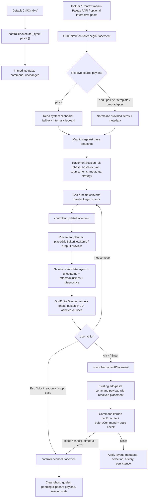
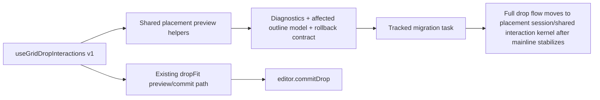

# Editor Placement Session 技术设计

## 架构概述

本设计把高级放置能力收敛为 `GridEditorController` 上的 headless placement session。它不是把默认 `Ctrl/Cmd+V` 改成两阶段交互，而是新增一条可显式启用的事务主线：

```text
beginPlacement -> updatePlacement -> commitPlacement / cancelPlacement
```

当前项目里已经具备几块可复用基础：

- `createGridEditorController()` 是专业编辑器的 headless API 入口，当前 controller 已暴露 `execute()`、`canExecute()`、history、guard 和 persistence 边界，见 `lib/editor/controller.ts:259`、`lib/editor/types.ts:1092`。
- `paste`、`add`、`duplicate` 已复用 `placeGridEditorNewItems()` 计算落点，见 `lib/editor/controller.ts:1421`、`lib/editor/controller.ts:1510`、`lib/editor/placement.ts:488`。
- `bindGridEditorKeyboard()` 已统一 keyboard command 入口，默认 `Ctrl/Cmd+V` 映射到即时 `paste`，见 `lib/editor/keyboard.ts:173`。
- `GridEditorOverlay` 已集中渲染 guides、spacing chip、measurement HUD，可扩展为 placement ghost 与 affected outline，见 `lib/grid-layout/GridEditorOverlay.tsx:102`。
- external drop 已有 `useGridDropInteractions()`、interaction machine 与 `dropFit` preview/commit 路径，但当前 preview 会写入 transient layout 和 dropping DOM，见 `lib/grid-layout/useGridDropInteractions.ts:22`、`lib/grid-layout/useGridDropInteractions.ts:149`、`lib/grid-layout/useGridDropInteractions.ts:396`。
- dashboard shell 已把 `Paste here`、palette、template add 等入口统一成 `strategy`、`placementIntent`、`placementAnchor`，见 `lib/dashboard-editor-shell/useDashboardEditorShell.ts:990`、`lib/dashboard-editor-shell/useDashboardEditorShell.ts:1328`、`lib/dashboard-editor-shell/menus.ts:99`。

目标分层如下：

1. `lib/editor/placementSession.ts`
   纯 editor/headless 模块，定义 session state、preview builder、status/result、blocked diagnostics 和 commit payload 转换。该层不依赖 DOM、不创建 VNode、不调用业务 adapter commit。
2. `GridEditorController`
   新增 `placementSession` ref 与 `beginPlacement()`、`updatePlacement()`、`commitPlacement()`、`cancelPlacement()`。controller 负责互斥、clipboard fallback、id mapping、base snapshot、guard、history 和 command commit。
3. `lib/grid-layout/useGridPlacementInteractions.ts`
   Vue/grid runtime adapter，负责把 pointer event、grid geometry、transformScale、scroll 和 keyboard 输入转换成 controller 能理解的 grid cursor。它只读写 placement session，不直接修改 durable layout。
4. `GridEditorOverlay`
   扩展 overlay-only 渲染：新 items 用 ghost，受影响的旧 items 用 lightweight outline、shift indicator 或 predicted-position outline。preview tick 不渲染真实业务 widget，也不把 ghost 混入 slot children。
5. dashboard shell 与 external drop adapter
   shell 显式入口优先消费 controller API。external drop 第一版采用 B：抽出共享 preview/diagnostics/rollback 规则供 `useGridDropInteractions()` 复用，保留现有主流程；主线稳定后完整迁移 drop preview/commit/cancel/cleanup。

设计选择：

- 默认 `Ctrl/Cmd+V` 仍走 `controller.execute({ type: "paste" })`，保持即时粘贴。只有 `keyboard.pasteMode: "interactive"` 或显式 UI/API 入口才进入 placement session。
- A+ preview 采用 overlay-only predictive reflow。`placementSession.candidateLayout` 只存在于 session state，真实 `layoutRef`、slot children 和业务 widget tree 不被预览 tick 改写。
- commit 复用现有 `add`/`paste` command semantics。高级 paste 在 `beginPlacement` 时读取并暂存 clipboard payload，commit 时把 resolved clipboard payload 传给 `paste` command，避免确认点击时再次读取剪贴板导致预览与提交不一致。
- 位置计算优先复用 `placeGridEditorNewItems()`；需要 layout-engine preview 的场景通过 request id 忽略 stale result。
- 第一版 MVP 必须支持鼠标移动 ghost、点击提交、Esc 取消、Enter 提交；方向键微调作为可追踪增强项保留。
- ThingsBoard review 后的增强遵循同一事务边界：clipboard payload 扩展为兼容 v1/v2 的 source grid context，paste/placeClipboard 在 begin/execute 阶段共享 responsive normalization，多 item `collisionPolicy: "layout"` 作为 group 进入布局推挤，shell keyboard 增加 ThingsBoard-compatible aliases 但不替换现有快捷键。

需求映射：

- R1、R4、R7 对应 controller/session/command kernel 的事务边界。
- R2、R6 对应 keyboard、显式入口和 pointer adapter。
- R3 对应 overlay-only ghost、affected outline、guides 和 cleanup。
- R5 对应 shell、palette、template 与 external drop 渐进统一。
- R8、R9 对应兼容性、导出、README、types 和测试质量门槛。

## 数据流图





## 组件与接口定义

### `lib/editor/placementSession.ts`

新增纯 TypeScript 模块，负责 session state 与 preview 计算。

```ts
export type GridEditorPlacementSessionSource =
  | "paste"
  | "add"
  | "drop"
  | "palette"
  | "template"
  | "api";

export type GridEditorPlacementSessionPhase =
  | "starting"
  | "preview"
  | "blocked"
  | "committing";

export type GridEditorPlacementCursor = {
  x: number;
  y: number;
  source?: "pointer" | "menu" | "keyboard" | "api" | "strategy";
  clientX?: number;
  clientY?: number;
};

export type GridEditorPlacementGhost = {
  id: string;
  item: LayoutItem;
  state: "preview" | "blocked" | "committing";
  sourceId?: string;
};

export type GridEditorPlacementAffectedOutline = {
  id: string;
  before: { x: number; y: number; w: number; h: number };
  after: { x: number; y: number; w: number; h: number };
  kind: "shift" | "collision" | "predicted";
};

export type GridEditorPlacementSession = {
  id: string;
  phase: GridEditorPlacementSessionPhase;
  source: GridEditorPlacementSessionSource;
  commandType: "add" | "paste";
  baseRevision: number;
  baseLayout: Layout;
  items: Layout;
  editorMetaById: GridEditorMetaById;
  strategy: GridEditorPasteStrategy;
  placementIntent?: "auto" | "here" | "selection" | "viewport";
  placementAnchor?: GridEditorPlacementAnchor;
  cursor?: GridEditorPlacementCursor;
  cols: number;
  maxRows: number;
  candidateLayout?: Layout;
  ghostItems: GridEditorPlacementGhost[];
  affectedOutlines: GridEditorPlacementAffectedOutline[];
  diagnostics: GridEditorPlacementDiagnostic[];
  blocked?: {
    reason: GridEditorBlockedReason;
    itemIds?: string[];
    message?: string;
    recoverable: boolean;
  };
  createdAt: number;
  updatedAt: number;
  previewSeq: number;
};
```

核心 helper：

- `createGridEditorPlacementSession(input, context)`：创建 session，保存 base layout/revision 与 resolved payload。
- `updateGridEditorPlacementSession(session, input, context)`：用 cursor/strategy 重新计算 candidate、ghost、affected outline 与 diagnostics。
- `buildGridEditorPlacementCommitCommand(session, input)`：把 session 转成 `add` 或 `paste` command。
- `cancelGridEditorPlacementSession(session, reason)`：返回 cleanup result，不产生 command。

`affectedOutlines` 从 `GridEditorPlacementResult.summary.before/after/shiftedIds` 和 `candidateLayout` diff 派生。对于 `insert-top-shift`，shifted ids 直接变成 `kind: "shift"`；对于 collision/bounds/maxRows，相关 ids 用 `kind: "collision"`；对于未来 layout-engine predictive result，使用 `kind: "predicted"`。

### `GridEditorController`

在 `GridEditorController` public type 上新增：

```ts
export type GridEditorPlacementSessionResult = {
  status: "started" | "updated" | "blocked" | "cancelled" | "noop";
  session?: GridEditorPlacementSession;
  blocked?: GridEditorCommandResult["blocked"];
  diagnostics?: GridEditorCommandResult["diagnostics"];
};

export type GridEditorBeginPlacementInput = {
  source: GridEditorPlacementSessionSource;
  commandType?: "add" | "paste";
  item?: Partial<LayoutItem>;
  items?: Partial<LayoutItem>[];
  editorMetaById?: GridEditorMetaById;
  strategy?: GridEditorPasteStrategy;
  placementIntent?: "auto" | "here" | "selection" | "viewport";
  placementAnchor?: GridEditorPlacementAnchor;
  cursor?: GridEditorPlacementCursor;
  cols?: number;
  maxRows?: number;
  origin?: string;
};

export type GridEditorUpdatePlacementInput = {
  cursor?: GridEditorPlacementCursor;
  strategy?: GridEditorPasteStrategy;
  cols?: number;
  maxRows?: number;
};

export type GridEditorCommitPlacementInput = {
  source?: GridEditorCommandSource;
  autoCancelOnBlocked?: boolean;
};
```

```ts
export type GridEditorController = {
  placementSession: Ref<GridEditorPlacementSession | null>;
  beginPlacement: (input: GridEditorBeginPlacementInput) => Promise<GridEditorPlacementSessionResult>;
  updatePlacement: (input: GridEditorUpdatePlacementInput) => GridEditorPlacementSessionResult;
  commitPlacement: (input?: GridEditorCommitPlacementInput) => Promise<GridEditorCommandResult>;
  cancelPlacement: (reason?: string) => GridEditorPlacementSessionResult;
};
```

Controller 行为：

- `beginPlacement()` 先检查 edit mode、readonly、command pending、active placement、active drag/resize/drop 互斥。冲突返回 `blocked: command-pending` 或 `unsupported-scope`，不创建半激活 session。
- paste source 先读取 configured clipboard，失败时沿用当前 `readClipboard()` fallback 到 `internalGridEditorClipboard` 的策略，见 `lib/editor/controller.ts:750`。若读取失败，返回 `clipboard-unavailable`、`clipboard-permission` 或 `clipboard-invalid`。
- paste session 使用 `mapIds()` 生成预览 id 与 metadata，见 `lib/editor/controller.ts:241`。commit 必须使用 session 内的 resolved payload，不再次读取 clipboard。
- `updatePlacement()` 只更新 `placementSession.value`，不写 `layoutRef.value`、不写 history、不调用 persistence。
- `commitPlacement()` 构造现有 command：
  - `commandType: "add"` 时传 `payload.items`、`editorMetaById`、`strategy`、`cursor`、`placementIntent`、`placementAnchor`。
  - `commandType: "paste"` 时传 `payload.resolvedClipboardPayload` 或等价字段，要求 paste mutation 优先使用该 payload，缺省时才读剪贴板。
  - `payload.candidateLayout` 只作为一致性校验与 guard preview 输入，不作为绕过 layout algorithm 的直接写入入口。
- commit 通过 command kernel 进入 `canExecute`、`beforeCommand`、history、selection/focus 和 persistence 边界。guard context 追加 `placementSummary`、`placementSessionId`、`affectedOutlines`、`clipboard/source ids`。
- commit allow 后清空 session；commit blocked 且 `autoCancelOnBlocked !== true` 时保留 active session 并显示 recoverable blocked reason；cancel/timeout/error/stale 默认清空 session 并 rollback 到 base snapshot。
- `stop()`、external layout replacement、mode 切到 view、readonly 或 controller dispose 时调用 `cancelPlacement("editor-stop" | "external-layout" | "mode-readonly")`，再执行现有 stop cleanup。

### Paste command resolved payload

现有 `paste` mutation 总是在执行时 `readClipboard(resolveClipboard())`，见 `lib/editor/controller.ts:1492`。placement commit 需要避免“预览读一次、确认又读一次”的不一致，因此扩展 paste payload：

```ts
export type GridEditorResolvedPastePayload = {
  items: Layout;
  editorMetaById?: GridEditorMetaById;
  sourceId?: string;
  mapped?: true;
};
```

`paste` mutation 规则：

- 如果 `payload.resolvedClipboardPayload` 存在，直接使用其中 items/meta。
- 如果 `mapped === true`，不再次 `mapIds()`；否则按现有 `mapIds()` 规则处理。
- 如果没有 resolved payload，保持当前即时 paste 行为，读取 clipboard。
- `buildPreview()` 也支持 resolved payload，确保 guard 预览与 commit 一致。

### Clipboard v2 与 responsive geometry normalization

ThingsBoard 的 `ItemBufferService` 会在复制 widget 时保存 `originalColumns` 和 `originalSize`，粘贴到目标 layout 时由 `DashboardUtilsService.addWidgetToLayout()` 按目标 columns 缩放 widget 尺寸与布局。当前项目采用更 headless 的 editor clipboard 设计，但需要补齐同等语义：

```ts
export type GridEditorClipboardSourceContext = {
  cols?: number;
  breakpoint?: string;
  layoutId?: string;
  viewFormat?: "grid" | "list" | string;
};

export type GridEditorClipboardPayloadV2 = {
  version: 2;
  sourceId: string;
  copiedAt: string;
  items: Layout;
  editorMetaById: GridEditorMetaById;
  source: GridEditorClipboardSourceContext;
  originalGeometryById: Record<string, Pick<LayoutItem, "x" | "y" | "w" | "h">>;
};
```

兼容规则：

- `parseGridEditorClipboardPayload()` 同时接受 v1 和 v2。v1 解析结果不包含 source context，粘贴行为保持原样。
- `createGridEditorClipboardPayload()` 默认写 v2；调用方未提供 source context 时，controller copy command 从 `layoutEngineOptions` 或 copy payload 解析 `cols/maxRows/compactType`。
- `normalizeClipboardItemsForTarget(payload, target)` 在 paste 和 beginPlacement 两条路径共用。它按 `targetCols / sourceCols` 缩放每个 item 的 `x`、`w` 和相对横向 offset；`y/h` 默认保持原 grid row 语义，避免跨断点粘贴时高度被意外压缩。
- 缩放采用 deterministic rounding：group minX 作为锚点，`x = floor((sourceX - minX) * ratio) + targetBaseX`，`w = clamp(round(sourceW * ratio), 1, targetCols)`；最终再通过 placement strategy 和 bounds validation 修正。
- `resolvedClipboardPayload.mapped === true` 表示 id mapping 和 responsive normalization 均已完成，commit 不再二次缩放。
- diagnostics computed placement 中记录 `{ sourceCols, targetCols, scaled: boolean }`，供 shell/message/debug 使用。

### Layout policy group placement

`collisionPolicy: "layout"` 不应把多 item clipboard 拆成互不相关的单 item 推挤。新增 group 语义：

- 先用 group origin 与 cursor/top-left anchor 生成一组 candidate items，保持相对 `x/y/w/h`。
- 先校验 group 内部是否自相交；若自相交，返回 `collision`，不进入 layout push。
- `allowOverlap=true` 时直接把 group candidate 添加到 candidate layout，现有 items 不移动。
- `preventCollision=true` 且 group candidate 与外部 items 相交时返回 blocked。
- `preventCollision=false` 时将整个 group 作为一个插入单元进入 layout reflow。实现可以先用现有 `moveElement`/`compact` 循环，但必须以测试锁定组内相对位置；后续若引入 layout-engine group add，保持 public summary 不变。

### Shell keyboard alias 策略

dashboard shell keyboard 保持当前默认：

- `Ctrl/Cmd+C` copy widget
- `Ctrl/Cmd+V` immediate paste
- `Ctrl+Enter`/`Cmd+Enter` interactive place from clipboard
- `Ctrl+Shift+V` paste reference
- Delete/Backspace remove

新增 ThingsBoard-compatible aliases：

- `Ctrl/Cmd+R` -> `copy-reference`
- `Ctrl/Cmd+I` -> `paste-reference`
- `Ctrl/Cmd+X` -> `remove-widget`

这些 aliases 仅作为默认 shortcut 表的附加项；业务可通过 `keyboard.shortcuts` 覆盖或移除，不改变现有菜单 label 和旧快捷键。

### `lib/grid-layout/useGridPlacementInteractions.ts`

新增 grid runtime adapter：

- `pointerToGridCursor(event, options)` 复用 external drop 当前的 `calcXY()` 坐标转换逻辑，输入 `width`、`cols`、`rowHeight`、`margin`、`containerPadding`、`transformScale`、`maxRows`。
- `onPlacementPointerMove(event)`：active session 时计算 cursor 并调用 `controller.updatePlacement()`。
- `onPlacementClick(event)`：active session 时阻止 selection clear 和 item selection，调用 `controller.commitPlacement({ source: "pointer" })`。
- `onPlacementCancel(reason)`：blur、Esc、readonly、unmount 时取消 session。
- `onPlacementEnter()`：Enter 提交当前 candidate；没有 candidate 时返回 recoverable blocked result。
- optional `onPlacementNudge(dx, dy)`：方向键微调候选 cursor，第一版可只保留实现任务，不阻塞 MVP。

`VueGridLayout.tsx` 增加 active placement 时的 root handlers：

- `onMousemove` 或 `onPointermove` 调用 runtime adapter。
- `onClick` 先判断 placement active；若 active，commit placement 并停止 root clear selection。
- `renderGridEditorOverlay()` 传入 `placementSession: editorRuntime.controller?.placementSession.value`。

### `GridEditorOverlay`

扩展 `RenderGridEditorOverlayOptions`：

```ts
type RenderGridEditorOverlayOptions = {
  enabled: boolean;
  geometry: GridEditorOverlayGeometry;
  guideState?: GridEditorGuideState;
  placementSession?: GridEditorPlacementSession | null;
  itemMap: Map<string, LayoutItem>;
  layout: Layout;
};
```

新增 overlay nodes：

- `.vue-grid-editor-placement-ghost`
- `.vue-grid-editor-placement-ghost-blocked`
- `.vue-grid-editor-placement-affected`
- `.vue-grid-editor-placement-affected-shift`
- `.vue-grid-editor-placement-affected-predicted`

稳定测试钩子：

- `data-placement-session-id`
- `data-placement-source`
- `data-placement-item-id`
- `data-placement-state`
- `data-placement-affected-id`
- `data-placement-outline-kind`

渲染规则：

- ghost 节点只由 overlay 生成，不进入 `children.map(child => processGridItem(...))`，也不写入 `state.layout`。
- ghost 使用 `itemLeftPx()`、`itemTopPx()`、`itemWidthPx()`、`itemHeightPx()`，与现有 guide geometry 共用像素精度。
- blocked state 通过 ghost class、HUD blocked message 和 diagnostics 暴露。
- affected outline 用绝对定位边框或轻量 transform，不挂载业务 widget。
- guides 可以把 `GridEditorGuideInteraction` 扩展为 `"placement"`；为降低改动，也可以在第一版内部把 placement 作为 drop 等价场景传入 guide 计算，但 DOM class 和 diagnostics 应保留 placement 语义。

### Keyboard adapter

`GridEditorKeyboardOptions` 增加：

```ts
export type GridEditorKeyboardOptions = {
  pasteMode?: "immediate" | "interactive";
  placementNudgeStep?: number;
  placementFastNudgeStep?: number;
};
```

规则：

- 默认 `pasteMode` 为 `"immediate"`，`Ctrl/Cmd+V` 行为不变。
- active placement 时，`bindGridEditorKeyboard()` 在普通 command 匹配前处理：
  - `Escape` -> `controller.cancelPlacement("keyboard-escape")`
  - `Enter` -> `controller.commitPlacement({ source: "keyboard" })`
  - Arrow keys -> 第一版可返回 blocked/noop 或调用 optional nudge，任务中保留增强项。
- `shouldIgnoreEditorKeyboardEvent()` 继续保护 input、textarea、select、contenteditable 和 ignored target，见 `lib/editor/keyboard.ts:36`。
- `pasteMode: "interactive"` 时，`Ctrl/Cmd+V` 调 `beginPlacement({ source: "paste", commandType: "paste" })`；否则保持 `execute({ type: "paste" })`。

### Dashboard shell

保持现有即时动作兼容，同时新增显式高级入口：

- `actions.placeClipboard(target, options)` 或等价命名，用于 toolbar/palette 的 “Place from clipboard”。
- `pasteWidget()`、`pasteAtGridPosition()` 继续保持即时 commit，用于现有 `Paste here` 兼容。
- shell context menu 可在后续产品层同时提供 `Paste here` 和 `Place from clipboard` 两类动作：前者立即落到菜单位置，后者进入 ghost 模式等待用户点击。
- `addWidgetFromTemplate()` 与 `openWidgetPalette()` 可传 `placementMode: "interactive"`，进入 session；默认仍沿用当前 command pipeline。
- adapter prepare/commit/rollback 只在 `commitPlacement()` 后进入 command transaction，preview 阶段不调用业务 adapter prepare/commit，避免孤立业务 payload。

### External drop 渐进统一

第一版采用 B：

- 从 placement session 模块抽出共享 preview shape、diagnostics normalizer、affected outline builder 和 rollback cleanup helper。
- `useGridDropInteractions()` 保留现有 dragenter/dragover/drop 主流程和 `dropFit` engine path，避免一次性重写外部拖拽。
- drop preview 可复用 overlay affected outline 与 blocked diagnostics，但允许继续使用现有 `state.droppingDOMNode`/`state.activeDrag` 路径，作为兼容层。
- `tasks.md` 必须包含“主线稳定后完整迁移 `useGridDropInteractions` 到 placement session 或共享 placement interaction kernel”的独立可追踪任务。

完整迁移目标：

- external drag enter -> `beginPlacement({ source: "drop" })`
- dragover -> `updatePlacement()`
- drop -> `commitPlacement({ source: "drop" })`
- dragleave/cancel -> `cancelPlacement()`
- 删除 drop 特有的 preview layout mutation，只保留 DOM event bridge 与 data transfer adapter。

## API 接口设计

### Public controller API

```ts
const editor = createGridEditorController({
  layout,
  defaultMode: "edit",
  clipboard: "system"
});

await editor.beginPlacement({
  source: "paste",
  commandType: "paste",
  strategy: "cursor",
  placementIntent: "here",
  placementAnchor: "top-left",
  cols: 12,
  maxRows: Infinity
});

editor.updatePlacement({
  cursor: { x: 4, y: 8, source: "pointer" }
});

await editor.commitPlacement({ source: "pointer" });
```

### Explicit interactive paste

```ts
await editor.beginPlacement({
  source: "paste",
  commandType: "paste",
  strategy: "cursor",
  placementIntent: "here"
});
```

失败语义：

- clipboard 不可用：返回 `status: "blocked"`，`blocked.reason = "clipboard-unavailable"`。
- permission denied：返回 `clipboard-permission`。
- 空或非法 payload：返回 `clipboard-invalid`。
- 当前已有 active placement/drag/resize/drop 或 command guard：返回 `command-pending` 或 `unsupported-scope`。

### Palette/template placement

```ts
await editor.beginPlacement({
  source: "palette",
  commandType: "add",
  items: [{ i: "chart", w: 4, h: 3 }],
  editorMetaById: {
    chart: { label: "Chart", visible: true }
  },
  strategy: "cursor",
  placementIntent: "here"
});
```

### Keyboard option

```ts
const unbind = bindGridEditorKeyboard(editor, {
  pasteMode: "interactive",
  ariaMessage(message) {
    announce(message.message);
  }
});
```

默认不传 `pasteMode` 时，现有 `Ctrl/Cmd+V` 即时粘贴行为不变。

### Overlay consumption

```tsx
{renderGridEditorOverlay({
  enabled: editorRuntime.guidesEnabled() || Boolean(editorRuntime.controller?.placementSession.value),
  geometry: overlayGeometry,
  guideState: editorRuntime.controller?.guides.value,
  placementSession: editorRuntime.controller?.placementSession.value,
  itemMap: layoutItemById,
  layout: state.layout
})}
```

### Result 和事件

可选新增事件，保持 JSON-safe：

```ts
export type GridEditorPlacementEvent =
  | { type: "placement-start"; session: GridEditorPlacementSession }
  | { type: "placement-update"; session: GridEditorPlacementSession }
  | { type: "placement-cancel"; sessionId: string; reason: string }
  | { type: "placement-commit"; sessionId: string; result: GridEditorCommandResult };
```

事件只做观察，不替代 `beforeCommand` guard。业务阻塞仍通过现有 command guard 完成。

## 数据模型与数据库变更

无数据库变更。

新增数据只存在于内存中的 editor controller state：

- `placementSession: Ref<GridEditorPlacementSession | null>`
- `pending resolved clipboard payload`
- `candidateLayout`
- `ghostItems`
- `affectedOutlines`
- `diagnostics`

持久化边界：

- preview 阶段不写 `layoutRef`、`layoutsRef`、dashboard document、legacy `historyStore`、editor command history 或 persistence controller。
- commit 成功后才写入 layout、metadata、selection、focus、history、dirty state 和 persistence。
- responsive/profile 场景沿用当前 write-back 规则，不因 preview materialize inherited layout。
- diagnostics 必须 JSON-safe，不保存 DOM Event、HTMLElement、Vue VNode、业务 adapter prepared object 或 clipboard 原始异常对象。

类型与导出：

- `lib/editor/index.ts` 导出 placement session types/helper。
- `lib/cjs.ts` 同步导出 public helpers，避免 CJS 缺口，当前 CJS editor exports 见 `lib/cjs.ts:95`。
- `typings/index.d.ts` 或类型生成链路必须包含新增 public API。
- README 更新 default paste、显式高级放置、overlay-only preview、external drop 渐进迁移和 keyboard opt-in。

## 安全考量

- Clipboard：system clipboard 只在显式 paste/placement 请求中读取。读取失败 fallback internal clipboard；若仍失败返回 structured blocked result，不创建 ghost。
- Native text input：input、textarea、select、contenteditable 和 ignored targets 不拦截 paste/Enter/Esc，沿用当前 keyboard ignore 规则。
- Preview 隔离：preview 阶段不调用 adapter commit、不写 persistence、不发 final layout change、不触发业务 widget 生命周期。
- Stale 防护：session 保存 `baseRevision` 和 request id。外部 layout、mode、selection policy、clipboard source 或 guard pending 期间发生变化时，commit 必须重新校验或取消。
- Guard 边界：`beforeCommand` 是唯一可阻塞业务提交的扩展点；placement event 只用于观察，不允许绕过 command kernel。
- 数据最小化：diagnostics 不暴露 clipboard 内容全文，不把业务 adapter prepared payload 放入 public session。
- Cleanup：Esc、blur、readonly、controller stop、commit failure、drop leave 都必须清理 ghost、guides、HUD、auto-scroll 和 pending clipboard payload。
- 可访问性：active placement 状态、blocked reason、commit/cancel 通过 `ariaMessage` 或 event hook 暴露，HUD 使用 `role="status"` 和合理 `aria-live`。

## 测试策略

### Editor core

- `beginPlacement()` 成功创建 paste/add session，包含 source、items、metadata、strategy、cursor、baseRevision。
- system clipboard 失败 fallback internal clipboard；空/非法 clipboard 返回对应 blocked reason。
- paste session commit 使用 resolved clipboard payload，不二次读取 clipboard。
- `updatePlacement()` 产生 deterministic candidate、ghostItems、affectedOutlines、diagnostics，不改 layout/history。
- multi-item group 保持相对 x/y/w/h。
- commit 成功只产生一个 command history entry，selection/focus 指向新 items。
- guard allow/block/cancel/timeout/error、stale revision、controller stop、readonly 切换均覆盖。
- controlled `selectedIds` 模式下保持 requested selection event 语义。

### Placement engine

- cursor top-left anchor、nearest-fit、first-fit、offset、insert-top-shift。
- bounds、collision、maxRows、section row policy blocked。
- `insert-top-shift` 生成 shifted affected outline。
- 相同 layout/items/strategy/cursor/cols/maxRows 重复计算结果一致。

### Grid runtime 和 overlay

- mousemove 更新 ghost，click commit，Esc cancel，Enter commit。
- active placement 阻止 root clear selection、delete、drag start、resize start 与 session 竞争。
- ghost 不进入 slot children，不进入 `state.layout`，不挂载业务 widget。
- affected outlines 可见，blocked class/data attribute 正确，z-index 高于 items 但不遮挡必要输入。
- guides/HUD 在 placement 中可用；guides disabled 时 ghost 仍可显示。
- cleanup 后 `.vue-grid-editor-placement-*` DOM 全部清空。
- 默认 `Ctrl/Cmd+V` 即时粘贴不被破坏；`pasteMode: "interactive"` 才进入 session。
- 若第一版实现 arrow nudge，则覆盖 Arrow 与 Shift+Arrow；否则在 tasks 中保留增强项。

### Dashboard shell

- `Paste here` 现有即时行为兼容。
- 新增 `Place from clipboard` 或等价 API 进入 session。
- `Add widget here`、palette、template 可选择 interactive placement。
- adapter prepare/commit/rollback 只在 commit 阶段触发；preview 不创建业务 payload。
- profile/list/mobile runtime 不被 preview 污染。

### External drop

- 第一版验证 `useGridDropInteractions()` 复用 shared diagnostics/affected outline/rollback helper。
- 现有 drop dragover、drop event、dropFit commit、legacy path 回归通过。
- tasks 中保留完整迁移 `useGridDropInteractions` 的追踪项。

### Types、文档和构建

- TypeScript public API 编译通过。
- ESM/CJS exports 覆盖新增 helper 和 types。
- README 说明默认 paste、显式高级放置、keyboard opt-in、clipboard 权限、known limits 和迁移建议。
- 浏览器 smoke 覆盖 editor component、dashboard shell、overlay DOM 和 default paste 兼容。
