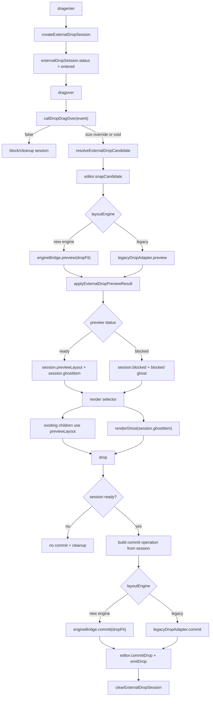

# External Drop Session Refactor 技术设计

## 架构概述

本设计将外部拖入重构为一个明确的 `ExternalDropSession` 内部模型。外部拖入从 `dragenter`、`dragover`、preview、blocked、`drop` 到 cleanup 的所有状态都写入 session；渲染层和 commit 层只读取 session selector，不再分别从 `droppingDOMNode`、`activeDrag`、`state.layout` 和局部变量推导外部 drop 状态。

当前代码证据显示外部拖入状态分散在多个位置：`useGridDropInteractions.ts` 在 preview 时写 `state.layout`、`state.activeDrag` 和 `state.droppingDOMNode`，commit 又从 `layout.find(...) || state.activeDrag` 推导目标；`createGridLayoutComponent.tsx` 通过 `activeDrag` 渲染 placeholder，并用 `droppingDOMNode` 判断是否 dropping；`useGridLayoutModel.ts` 则用 `activeDrag || droppingDOMNode || droppingPosition` 抑制 layout change。这些职责需要收敛为 session 的状态机和 selector。

重构后的边界如下：

- `lib/grid-layout/externalDropSession.ts`：新增内部模块，负责 session 数据结构、状态转换、operation 构造、preview/commit 结果归一化、blocked 表达和 selector。
- `lib/grid-layout/useGridDropInteractions.ts`：降级为事件编排层。它读取 props/event/editor/engine，调用 session helper，调度 legacy 或新 engine adapter，不直接拼接外部 drop 的可见状态。
- `lib/grid-layout/useGridLayoutModel.ts`：持有 `externalDropSession`，把 display-only `previewLayout` 与正式 `state.layout` 分离；preview 不触发 `layoutChange` 或 `update:modelValue`。
- `lib/grid-layout/createGridLayoutComponent.tsx`：通过 selector 获取 render layout 和 ghost。已有 child 只按 `previewLayout` 临时 reflow；外部拖入的 synthetic item 不作为普通 `GridItem` child 渲染。
- `lib/grid-layout/useGridLayoutEngineBridge.ts` 与 legacy utils：作为两个 drop preview/commit adapter 的底层执行器，返回统一的 session preview/commit result。
- runtime/editor：继续通过 `isExternalDropEnabled`、`commitDrop`、`rollbackInteraction`、`updateIntelligence` 等现有 hook 接入；`isDropping` 改为读取 session 状态。

需求追溯：R1 覆盖 session 单一事实源；R2 覆盖 ghost 与 commit 一致；R3 覆盖 synthetic item 与用户可见渲染隔离；R4 覆盖新旧 engine 统一；R5 覆盖状态命名和职责边界；R6 保持公开 API；R7/R8 覆盖回归与 dogfood。

## 数据流图



## 组件与接口定义

### `ExternalDropSession`

新增文件：`lib/grid-layout/externalDropSession.ts`。

```ts
export type ExternalDropSessionStatus =
  | "idle"
  | "entered"
  | "previewing"
  | "ready"
  | "blocked"
  | "committing";

export type ExternalDropBlockedReason =
  | GridInteractionBlockedReason
  | "no-fit"
  | "drop-drag-over-rejected"
  | "preview-stale"
  | "commit-rejected";

export type ExternalDropSession = {
  id: string;
  interactionId: string;
  requestId?: string;
  sourceItem: GridDroppingItem;
  resolvedItem: LayoutItem;
  ghostItem: LayoutItem | null;
  blocked?: {
    reason: ExternalDropBlockedReason;
    message?: string;
    itemIds?: string[];
  };
  baseLayout: Layout;
  previewLayout: Layout;
  previewOperation?: Extract<LayoutOperation, { type: "dropFit" }>;
  commitOperation?: Extract<LayoutOperation, { type: "dropFit" }>;
  target?: { x: number; y: number };
  strategy: "cursor" | "auto";
  status: ExternalDropSessionStatus;
  lastEvent?: DragEvent | Event;
};
```

设计原则：

- `sourceItem` 是 props 中的 `droppingItem` 快照。
- `resolvedItem` 是 `dropDragOver`、cursor/grid 计算、editor snap 后的候选 item。
- `ghostItem` 是当前可见 ghost 的唯一来源。新 engine 的 `result.placeholder` 和 legacy adapter 的 final candidate 都必须写回这里。
- `baseLayout` 永远不包含 synthetic drop item。
- `previewLayout` 是 display-only layout，可包含 engine 计算后的已有 item reflow 和 synthetic drop item，但渲染 selector 必须过滤 synthetic child，只把 `ghostItem` 作为 placeholder 渲染。
- `previewOperation` 和 `commitOperation` 均由 session 构造。若 preview 已有 target，`auto` commit 必须转为带 target 的 cursor-equivalent 操作，避免重新 first-fit。

### Session Helper

`externalDropSession.ts` 提供以下纯函数或小副作用 helper：

- `createExternalDropSession(input)`：从 `droppingItem`、当前 layout、strategy、interaction id、request id 创建 session。
- `resolveExternalDropCandidate(input)`：合并 `dropDragOver` 返回值、计算 cursor grid position、调用 `editor.snapCandidate`，并更新 `resolvedItem`、`target`、`strategy`。
- `buildDropFitOperationFromSession(session, phase)`：从 session 构造 preview/commit 的 `dropFit` operation。commit 阶段只能使用 session 中的 `resolvedItem`、`ghostItem` 和 `target`。
- `applyExternalDropPreviewResult(session, result)`：把新 engine result 或 legacy adapter result 归一化为 `previewLayout`、`ghostItem`、`blocked`、`status`。
- `blockExternalDropSession(session, reason, geometry?)`：记录 blocked reason 和可选 blocked ghost geometry；blocked session 不允许 commit。
- `commitExternalDropSession(session, result)`：把 commit result 归一化为 `committedLayout`、`committedItem`、`baseLayoutForEmit`。
- `clearExternalDropSession(reason)`：集中清理 `previewLayout`、ghost、guides、auto scroll、interaction machine 和 request id。
- selectors：`getExternalDropRenderLayout(state)`、`getExternalDropGhost(state)`、`isExternalDropping(state)`、`isExternalDropBlocked(state)`。

### State 变更

`GridLayoutState` 增加：

```ts
externalDropSession: ExternalDropSession | null;
```

`activeDrag` 继续服务内部 drag/resize。外部 drop 不再写 `activeDrag` 作为主 ghost 状态。过渡期间如果少数旧接口仍需要兼容，可通过 selector 做只读适配，不能在外部 drop 主路径继续写 `activeDrag`。

`droppingDOMNode` 不再作为外部 drop 是否激活的判断依据。若删除成本较高，可以先保留字段但标记为 deprecated adapter 字段，最终由任务消除或限制在兼容层。

### 渲染层

`createGridLayoutComponent.tsx` 修改为：

- `isDropping: () => isExternalDropping(state)`。
- `renderLayout = getExternalDropRenderLayout(state, model.syncRenderedChildren(...))`。
- `layoutItemById` 使用 `renderLayout` 给已有 children 提供 display-only reflow。
- `renderGhost()` 使用 `getExternalDropGhost(state) ?? state.activeDrag`。其中外部 drop ghost 带 `placeholder-blocked` class，当 session 为 blocked 时提供明确视觉反馈。
- synthetic drop item 即使存在于 `previewLayout`，也不进入 `children.map(child => processGridItem(...))` 的真实 child 渲染。未松手前只允许 ghost placeholder 可见。

### Drop Interaction 编排

`useGridDropInteractions.ts` 的目标形态：

- `onDragEnter`：只创建或进入 session，并进入 interaction machine 的 drop interaction。
- `onDragOver`：调用 `dropDragOver`；若返回 `false`，通过 session blocked/cleanup 表达拒绝；否则更新 candidate，调用新 engine 或 legacy adapter preview，结果只写 session。
- `onDrop`：只读取当前 session。如果 session 非 `ready` 或有 `blocked`，不 commit；如果 ready，使用 session commit operation。commit 成功后调用 `editor.commitDrop` 与 `eventBridge.emitDrop`，然后 cleanup。
- `onDragLeave` / unmount：统一调用 cleanup。

`frameUpdate`、`autoScroll`、`editor.clearGuides`、`interactionMachine.reset` 不再分散在多个 early return 中，而由 `clearExternalDropSession` 或 orchestrator 的 finally 路径集中执行。

### Engine Adapter

新 engine adapter：

- preview：调用 `engineBridge.reset(baseLayout)`、`engineBridge.start({ type: "drop" })`、`engineBridge.preview(requestId, session.previewOperation, apply)`。
- apply：忽略 stale request；`changed`/`fallback` 写入 `previewLayout` 和 `ghostItem`；`blocked` 写入 `blocked` 与 blocked ghost；`drop.position` 为空时不 fallback 到其他位置。
- commit：调用 `engineBridge.commit(requestId, session.commitOperation, apply)`；提交 item 以 `result.placeholder || session.ghostItem` 为准。

legacy adapter：

- preview：封装现有 `findNearestFit`、`findFirstFit`、`editor.snapCandidate`、compact 逻辑，返回与新 engine 相同形状的 `ExternalDropPreviewResult`。
- commit：使用 session 的 `resolvedItem`/`ghostItem`，不重新读取 props 中的 `droppingItem` 尺寸，不重新 first-fit 到另一个位置。
- cursor 发生 collision 需要下移的旧语义必须通过 adapter result 写回 `ghostItem`，保证用户看到的 ghost 与 drop event item 一致。

## API 接口设计

公开 API 保持兼容，不新增必需 prop/event：

- `isDroppable`：仍控制是否允许外部拖入；editor view mode 继续通过 `runtimeExtension.isExternalDropEnabled` 禁止 session 创建。
- `dropStrategy: "cursor" | "auto"`：语义保持。`auto` preview 可以寻找 fit，但一旦 session 已有有效 target，commit 必须使用 session target，不重新 first-fit。
- `droppingItem`：仍是默认外部 item 模板。
- `dropDragOver(event)`：仍允许返回 `{ w?: number; h?: number } | false | void`。返回尺寸覆盖值时写入 `resolvedItem`；返回 `false` 时 session 进入 rejected/cleanup，不提交。
- `drop(layout, event, item)`：仍在 commit 成功后触发。`item` 的 `x/y/w/h` 必须等于 commit 后最终 placeholder；`layout` 仍是去掉 synthetic drop item 的 base/committed layout 语义，避免把未提交 synthetic item 提前暴露给父级。
- `layoutChange` / `update:modelValue`：preview 阶段不触发。只有正式 drag/resize/commit 或父级 model 变化触发。

内部 TypeScript 接口允许新增，但不导出到公共包入口，除非后续任务明确需要给 plugin/editor 扩展使用。

## 数据模型与数据库变更

无数据库或持久化格式变更。

数据模型变更只发生在 grid runtime 内存状态：

- `GridLayoutState.externalDropSession`：新增运行时状态，不写入 `modelValue`。
- `ExternalDropSession.previewLayout`：display-only，用于当前 render tick 的视觉预览，不发出 `layoutChange`。
- `ExternalDropSession.ghostItem`：唯一外部 drop ghost 几何来源。
- `ExternalDropSession.blocked`：记录 blocked reason/message/itemIds，供 ghost class、editor feedback 和测试断言使用。

`dist/` 构建产物不属于设计文档范围，后续实现完成后再通过标准构建刷新。

## 安全考量

- 不引入新的运行时依赖，不读取 `.env*`、token、private key 或外部数据源。
- `DragEvent` 与 `dataTransfer` 不作为可信输入解析 HTML 或执行脚本；当前设计只使用坐标、事件对象传递和业务回调返回的尺寸覆盖。
- `dropDragOver` 返回值只接受 `w/h` 数字覆盖，并在 session/engine 操作中继续经过正数、边界、`maxRows`、collision 校验。
- blocked state 不自动 fallback 到其他位置，避免用户在不可见位置误提交。
- 示例中的透明 drag image 只用于避免浏览器原生 drag image 混淆，不进入核心 session 逻辑。

## 测试策略

单元测试：

- 为 `externalDropSession.ts` 增加纯函数测试：创建 session、合并 `dropDragOver` 尺寸、构造 preview/commit operation、blocked session 禁止 commit、cleanup selector 恢复空状态。
- 为 legacy adapter 增加 `auto` 与 `cursor` preview 测试，断言返回的 `ghostItem` 与 commit item 一致。
- 为新 engine adapter 增加 stale、blocked、changed/fallback result 应用测试。

集成/核心测试：

- 更新 `test/grid-layout-internal-core.test.ts` 中外部 drop 测试，断言 external drop preview 不写 `activeDrag`，而写 `externalDropSession.ghostItem`。
- 覆盖 `dropDragOver` 改变 `w/h` 后 ghost、commit operation item、`emitDrop` item 三者一致。
- 覆盖 `dropStrategy="auto"` preview 已有 target 后，drop commit 使用 session target，不重新 first-fit。
- 覆盖 display-only `previewLayout`：已有 item 可临时 reflow，但 `layoutChange` 和 `update:modelValue` 不在 preview 阶段触发。
- 覆盖 blocked ghost：no-fit、`dropDragOver=false`、engine blocked 时显示 blocked state，松手不提交。
- 覆盖 drag leave、drop rejected、component unmount cleanup。
- 保留 `test/layout-engine-core.test.ts` 中 `dropFit` final placeholder 与 final layout item 一致的测试。

示例/dogfood：

- `example/07-drag-from-outside.js` 和 `example/17-drop-strategy.js` 保持透明 drag image，避免原生 drag image 与 grid ghost 混淆。
- 如需要新增 dogfood 场景，优先放在现有 example 中，覆盖动态尺寸、auto/cursor、取消路径。

标准验证：

- 实现完成后运行 `npm test`、`npm run build`、`npm run test:examples`、`npm run check:bundle`。
- 需要时运行 `npm run test:browser`，但遵守仓库 AGENTS：优先 CLI/headless，不使用会抢焦点的 GUI/browser automation。
- `npm run check:package` 若因仓库已有 ignored `build/` artifact 失败，记录失败原因；不为通过检查擅自删除 ignored artifact。
