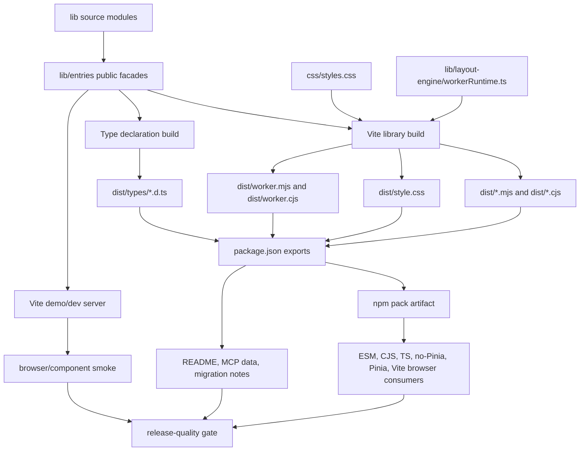

# Foundation Modernization 技术设计

## 架构概述

本设计将根包构建系统收敛为一套 Vite-first 发布和开发流水线：Vite library build 负责 ESM、CJS、worker 和 CSS 产物，TypeScript declaration emit 或 Vite-compatible dts 工具负责 `.d.ts`，Vite dev/preview 负责 demo、docs 和 browser smoke。webpack、webpack-dev-server、webpack loader/plugin、UMD/CDN artifact 与 Babel CJS 发布链路全部退出 active workflow。

当前证据显示旧链路同时存在于多个层面：`package.json` 的 `main` 指向 `build/cjs/cjs.js`、`unpkg` 指向 `build/web/vue-grid-layout.min.js`、`typings` 指向手写声明；`script.js` 通过 Babel 产出 CJS，并通过 webpack 产出 UMD 和 worker；`webpack.config.js` 同时定义 UMD library、worker entry、dev server 和 analyzer；`example/index.html` 与 `test/editor-component-browser.test.js` 仍加载 `build/web/vue-grid-layout.min.js` 并读取 `window.VueGridLayout`。因此迁移不是单点替换配置，而是发布入口、示例入口、测试入口和文档入口的共同收敛。

设计原则：

- 发布契约由 `package.json.exports` 和 `dist/` 内产物定义，源码路径与旧 `build/` 路径不再是公共 API。
- 根入口只承载 core/responsive 兼容能力；editor、dashboard、persistence、history、layout-engine、worker 通过 subpath 暴露。
- CJS 根入口保持旧兼容形态：`require("@marsio/vue-grid-layout")` 返回可直接作为组件使用的对象，并挂载常用兼容属性。
- Vite demo/dev server 使用源码别名和 ESM 示例，避免任何 UMD 全局、CDN script 或 webpack-only 依赖。
- release gate 用真实 packed package、consumer projects、browser bundler、类型检查和包边界脚本验证，而不是仅检查本仓库源码能编译。

参考官方文档：Vite library mode 支持 `build.lib`、多入口、external deps、ES/CJS 格式和 CSS export；Vite workers 推荐 `new Worker(new URL(..., import.meta.url))` 或 `?worker`/`?url` 形式；Vue 3 TSX 使用官方 `@vitejs/plugin-vue-jsx`。

## 数据流图



## 组件与接口定义

### Public Entry Facades

新增 `lib/entries/` 作为唯一公开入口源码层，避免直接把内部文件暴露给 `exports` map。

| 入口源码 | package subpath | 责任 |
| --- | --- | --- |
| `lib/entries/index.ts` | `.` | 根兼容入口；默认导出 `VueGridLayout` 兼容对象，并命名导出 core/responsive 常用能力。 |
| `lib/entries/core.ts` | `./core` | `VueGridLayout`、`WidthProvider`、core utils、calculate utils、grid-height 和基础类型。 |
| `lib/entries/responsive.ts` | `./responsive` | `ResponsiveVueGridLayout`、responsive utils、responsive model 相关类型。 |
| `lib/entries/layout-engine.ts` | `./layout-engine` | `lib/layout-engine/index.ts` 的公开 engine API。 |
| `lib/entries/editor.ts` | `./editor` | headless editor controller、commands、metadata、selection、placement 等。 |
| `lib/entries/dashboard.ts` | `./dashboard` | dashboard runtime、dashboard migration、dashboard responsive runtime 能力。 |
| `lib/entries/dashboard-editor-shell.ts` | `./dashboard-editor-shell` | dashboard editor shell hooks、menus、transactions 和 shell types。 |
| `lib/entries/persistence.ts` | `./persistence` | persistence adapters、document serialization、migration、Vue composable。 |
| `lib/entries/history.ts` | `./history` | Pinia-powered history API；唯一允许静态导入 `pinia` 的 public entry。 |
| `lib/entries/worker.ts` | `./worker` | layout worker runtime 和 worker helper API；同时作为 browser worker artifact 源。 |

根入口不再从 `lib/cjs.ts` 聚合所有高级能力。旧 `lib/cjs.ts` 在迁移后删除或降级为 migration reference，不参与 build。若根入口过去挂载的高级属性被移除，迁移说明列出替代 subpath。

### Vite Build Config

新增 `vite.config.ts`，包含两个 mode：

- `mode=library`：多入口 library build，输出 `dist/*.mjs` 和 `dist/*.cjs`，externalize peer/runtime deps，不将 sourcemap 打入发布包，可由 `yarn build` 调用。
- `mode=demo` 或默认 dev：以 `example/index.html` 为 Vite app，alias `@marsio/vue-grid-layout` 到 `lib/entries/index.ts`，alias 各 subpath 到对应 facade，供 demo/dev server 和 browser smoke 使用。

建议保留根包不设置 `"type": "module"`，以免现有 CommonJS 测试脚本和 Node 工具被整体切换为 ESM。发布产物使用显式扩展名：ESM 为 `.mjs`，CJS 为 `.cjs`。若实现阶段决定设置 `"type": "module"`，必须同步把现有 CommonJS 脚本改为 `.cjs` 或 ESM，并在任务里显式记录。

Vite 依赖：

- `vite`
- `@vitejs/plugin-vue-jsx`
- 类型声明工具二选一：优先 `typescript --emitDeclarationOnly`，若 entry declaration 拼装复杂再引入 `vite-plugin-dts`
- bundle analysis 可用 Vite/Rollup compatible 工具或自研 dist boundary script；不得引入 webpack analyzer

移除依赖：

- `webpack`, `webpack-cli`, `webpack-dev-server`
- `webpack-bundle-analyzer`
- `babel-loader`, `ts-loader`, `vue-loader`
- `eslint-webpack-plugin`, `fork-ts-checker-webpack-plugin`, `lodash-webpack-plugin`, `progress-bar-webpack-plugin`, `terser-webpack-plugin`
- Babel CLI/preset/plugin 只有在没有其他脚本依赖时一并移除；若某个非构建工具仍需要 Babel，必须在设计变更中说明用途，且不得参与发布产物。

### Type Declaration Builder

新增 `tsconfig.build.json` 或 `tsconfig.types.json`：

- `declaration: true`
- `emitDeclarationOnly: true`
- `declarationMap: false`，避免发布包包含 `.d.ts.map`
- `outDir: dist/types`
- `module` 使用 `ESNext` 或与 Vite 兼容的配置
- `include` 聚焦 `lib/**/*.ts`、`lib/**/*.tsx`
- `exclude` 保持 `mcp` 独立

类型输出以后以 entry facade 为准。若 declaration emit 产出内部目录结构，增加 `scripts/check-public-types.mjs` 验证每个 `exports` subpath 都有对应 `types` 条件，并禁止 `typings/index.d.ts` 再作为唯一类型来源。必要的兼容 shim 只能用于根入口旧名称。

### Package Metadata

`package.json` 调整：

- `main`: `./dist/index.cjs`
- `module`: `./dist/index.mjs`
- `types`: `./dist/types/index.d.ts`
- `exports`: 声明根入口、各 subpath、`./style.css`、`./package.json`
- `style`: `./dist/style.css`
- 删除 `unpkg`
- `files`: 收敛到 `dist`, `README.md`, `LICENSE`, `package.json`
- `sideEffects`: 至少包含 `"*.css"` 或 `"./dist/style.css"`，避免样式被 tree-shaking 删除
- `vue` 从 `dependencies` 移到 `peerDependencies` 和 `devDependencies`
- `pinia` 放入 `peerDependencies`、`devDependencies`，并通过 `peerDependenciesMeta.pinia.optional = true` 标记为 optional

示例 exports 形态：

```json
{
  "main": "./dist/index.cjs",
  "module": "./dist/index.mjs",
  "types": "./dist/types/index.d.ts",
  "style": "./dist/style.css",
  "exports": {
    ".": {
      "types": "./dist/types/index.d.ts",
      "import": "./dist/index.mjs",
      "require": "./dist/index.cjs"
    },
    "./core": {
      "types": "./dist/types/core.d.ts",
      "import": "./dist/core.mjs",
      "require": "./dist/core.cjs"
    },
    "./responsive": {
      "types": "./dist/types/responsive.d.ts",
      "import": "./dist/responsive.mjs",
      "require": "./dist/responsive.cjs"
    },
    "./layout-engine": {
      "types": "./dist/types/layout-engine.d.ts",
      "import": "./dist/layout-engine.mjs",
      "require": "./dist/layout-engine.cjs"
    },
    "./editor": {
      "types": "./dist/types/editor.d.ts",
      "import": "./dist/editor.mjs",
      "require": "./dist/editor.cjs"
    },
    "./dashboard": {
      "types": "./dist/types/dashboard.d.ts",
      "import": "./dist/dashboard.mjs",
      "require": "./dist/dashboard.cjs"
    },
    "./dashboard-editor-shell": {
      "types": "./dist/types/dashboard-editor-shell.d.ts",
      "import": "./dist/dashboard-editor-shell.mjs",
      "require": "./dist/dashboard-editor-shell.cjs"
    },
    "./persistence": {
      "types": "./dist/types/persistence.d.ts",
      "import": "./dist/persistence.mjs",
      "require": "./dist/persistence.cjs"
    },
    "./history": {
      "types": "./dist/types/history.d.ts",
      "import": "./dist/history.mjs",
      "require": "./dist/history.cjs"
    },
    "./worker": {
      "types": "./dist/types/worker.d.ts",
      "import": "./dist/worker.mjs",
      "require": "./dist/worker.cjs"
    },
    "./style.css": "./dist/style.css",
    "./package.json": "./package.json"
  }
}
```

### CJS Root Compatibility Adapter

Vite/Rollup CJS output for mixed default and named exports may return a namespace object from `require()`, while R3 requires root `require()` to return the component-compatible object. To keep this guarantee:

- `lib/entries/index.ts` creates a root compat object based on `VueGridLayout` and attaches `VueGridLayout`, `default`, `Responsive`, `ResponsiveVueGridLayout`, `WidthProvider`, `utils` and other core/responsive properties.
- If raw Vite CJS output does not make `module.exports` equal to that compat object, postbuild generates only `dist/index.cjs` as a root compatibility wrapper around `dist/index.runtime.cjs`.
- This wrapper is part of the Vite build pipeline and is covered by CJS consumer tests; no Babel or webpack output may be used.

其他 subpath 的 CJS 入口可以返回标准 namespace object，只需 `require("@marsio/vue-grid-layout/<subpath>")` 可解析并访问对应命名导出。

### Demo, Docs And Browser Smoke

`example/index.html` 改为 Vite ESM app：

- 移除 `vue-3.2.36.js`、`babel.min.js`、Pinia CDN script 和 `../build/web/vue-grid-layout.min.js`。
- 新增 `example/main.ts`，通过 package-style imports 使用 `@marsio/vue-grid-layout`、`@marsio/vue-grid-layout/responsive`、`@marsio/vue-grid-layout/history` 等。
- 现有 `example/*.js` 按能力标签迁移到 ESM demo modules。迁移期间，只有已迁移并在 registry 中声明的 demo 进入 docs 和 smoke；未迁移文件不能被 README 或 docs 推荐。
- `docs` 构建改为 `vite build --config vite.docs.config.ts` 或 `vite build --root example --outDir ../docs`，输出静态 demo 站点，不复制 UMD artifact。
- browser/component smoke 通过 Vite dev server 或 Vite preview 访问测试页面；测试页面以 ESM imports 获取组件，不再读取 `window.VueGridLayout`。

### Release Gate Scripts

新增或改造以下脚本：

- `build`: 清理 `dist`，运行 Vite library build，生成 types，复制 CSS，生成/验证 root CJS wrapper，检查 exports。
- `dev`: 启动 Vite demo dev server。
- `build-docs`: Vite 构建 example/docs 静态站。
- `test:package`: `npm pack` 后创建临时消费者并验证 ESM、CJS、TS、no-Pinia、Pinia history、Vite browser bundler。
- `test:examples`: 验证 README/MCP/example imports 都存在于 `exports` map。
- `check:package`: 检查 published files、exports/types/style/worker、sideEffects、peer deps、optional peer、no webpack active deps。
- `check:bundle`: 检查 root/core/responsive/layout-engine/persistence 不包含 `pinia`、editor、dashboard、MCP-only 或 Node-only 依赖。
- `release:quality`: 串联 build、unit tests、browser smoke、package tests、docs/example checks、benchmark/bundle budgets。

`publish` 和 `release` 只能在 `release:quality` 通过后继续。

## API 接口设计

### Public Import API

```ts
import VGL, { VueGridLayout, ResponsiveVueGridLayout, WidthProvider } from "@marsio/vue-grid-layout";
import { VueGridLayout as CoreGrid } from "@marsio/vue-grid-layout/core";
import { ResponsiveVueGridLayout as ResponsiveGrid } from "@marsio/vue-grid-layout/responsive";
import { createLayoutEngine } from "@marsio/vue-grid-layout/layout-engine";
import { useGridEditor } from "@marsio/vue-grid-layout/editor";
import { serializeDashboardLayoutDocument } from "@marsio/vue-grid-layout/dashboard";
import { useDashboardEditorShell } from "@marsio/vue-grid-layout/dashboard-editor-shell";
import { useGridLayoutPersistence } from "@marsio/vue-grid-layout/persistence";
import { createGridHistoryStore } from "@marsio/vue-grid-layout/history";
import "@marsio/vue-grid-layout/style.css";
```

### CJS API

```js
const VGL = require("@marsio/vue-grid-layout");
const { createLayoutEngine } = require("@marsio/vue-grid-layout/layout-engine");

// Backward-compatible shape:
// VGL is the VueGridLayout-compatible component object.
// VGL.default === VGL
// VGL.VueGridLayout === VGL
```

### Worker API

推荐文档示例：

```ts
import { workerLayoutExecutor } from "@marsio/vue-grid-layout/layout-engine";

const executor = workerLayoutExecutor({
  workerUrl: new URL("@marsio/vue-grid-layout/worker", import.meta.url).toString()
});
```

实现阶段需要用真实 Vite consumer 验证该 worker URL 模式。如果某个 bundler 对 package subpath `new URL()` 支持不足，README 必须提供对应替代方式，例如 `import workerUrl from "@marsio/vue-grid-layout/worker?url"` 或自定义 `workerFactory`。

### MCP Boundary

根包不提供 `./mcp` export。MCP 包继续使用 `mcp/package.json` 中的 tsup 构建和独立发布流程。根包 release gate 只要求 README、MCP data 和 public exports 一致；MCP 自身仍通过 `yarn build`、`yarn check:data` 和 `test:mcp` 验证。

## 数据模型与数据库变更

无数据库变更。

本规格引入的结构化配置和元数据为：

- `lib/entries/*`：公开 API facades，作为 types、exports、docs、MCP 示例的单一源码边界。
- `package.json.exports`：公共 API 映射表，作为 docs 和 package tests 的验证输入。
- `scripts/check-package-exports.mjs`：读取 `package.json.exports`，验证 JS/types/CSS/worker 文件存在并可解析。
- `scripts/check-package-boundary.mjs`：读取 dist 产物或 metafile，验证 root/core 不吸入高级能力和 optional peer。
- `scripts/check-doc-imports.mjs`：扫描 README、MCP data、example registry 中的 imports，确认只使用 public exports。
- `docs/specs/foundation-modernization/migration.md` 或 README migration section：记录旧路径到新 subpath 的映射、breaking changes、回滚边界。

旧数据/产物路径处理：

- `build/cjs/cjs.js`：不再发布；迁移说明映射到 `dist/index.cjs` 和 subpath CJS。
- `build/web/vue-grid-layout.min.js`：不再发布；迁移说明标记 UMD/CDN removal。
- `typings/index.d.ts`：不再作为唯一类型入口；若保留，只作为兼容 shim 或迁移参考。
- `css/styles.css`：源文件可保留，但发布入口变为 `dist/style.css` 和 `./style.css` export。

## 安全考量

- Browser bundle 禁止引入 MCP-only、Node-only、dev-server-only 代码，避免把 Node API 或 MCP server surface 暴露到浏览器。
- 示例和 docs 不再加载远程 `unpkg` script；Pinia 等依赖通过 package manager 和 Vite dependency graph 管理，减少 CDN 漂移和供应链不可控输入。
- Worker 文档必须使用静态 URL 或明确的 `workerFactory`，不拼接用户输入生成 worker URL。
- `exports` map 关闭未声明 deep imports，降低内部实现被外部依赖后无法修复的风险。
- `sideEffects` 必须保留 CSS，避免安全/交互相关样式被误删导致拖拽、resize、overlay 状态不可见。
- release gate 检查发布文件列表，防止 `.tmp`、`node_modules`、raw docs context、测试产物进入 npm package。
- `process.env` 替换只允许通过 Vite `define` 或 `import.meta.env` 的受控配置完成，禁止恢复 webpack `EnvironmentPlugin`。

## 测试策略

### Build And Unit

- `yarn build`：生成 `dist`、types、CSS、worker、exports-compatible package artifact。
- `yarn test`：保留 persistence、layout-engine、editor、dashboard、dashboard-editor-shell 的 Node 单元测试。
- `yarn bench:layout-engine`：按现有性能预算接入 `release:quality`，本地可配置跳过但 CI 必跑或记录替代命令。

### Package Resolution Matrix

`test:package` 在 `.tmp/package-consumers` 下创建临时项目并安装 `npm pack` 产物：

- ESM consumer：import 根入口、core、responsive、layout-engine、persistence、worker、style。
- CJS consumer：require 根入口并断言返回组件兼容对象；require 关键 subpath。
- TypeScript consumer：typecheck 根入口、所有 subpath types、CSS module declaration、worker URL usage。
- no-Pinia consumer：不安装 pinia，确认 root/core/responsive/layout-engine/persistence import 不失败。
- Pinia history consumer：安装 pinia，确认 `./history` runtime 和 types 可用。
- Vite browser consumer：创建最小 Vite app，导入 CSS 和 worker entry，执行 production build。

### Browser And Demo

- `test:browser` 启动 Vite dev server 或 preview，不启动 webpack server。
- 迁移 `test/editor-component-browser.test.js` 等 browser tests：HTML 使用 `<script type="module">` 或 Vite-served module，组件从 public package-style imports 获取。
- 对 editor/dashboard shell 等需要 DOM 的流程继续用 Puppeteer；服务器由 Vite preview 或轻量 Vite middleware 提供。
- 断言页面运行时不存在 `window.VueGridLayout` 依赖路径，且网络请求不包含 `build/web/vue-grid-layout.min.js`。

### Docs, Examples And MCP

- README code blocks 中可执行的 `vue`、`ts`、`js`、`bash` 示例进入 smoke/compile check；不可执行片段必须标注。
- example registry 中每个 demo 标注能力标签，并通过 Vite dev/build import check。
- MCP `generate:props` 和 `check:data` 保持可运行；新增 public exports/import consistency check，防止 MCP 推荐未公开路径。

### Package Artifact And Bundle Boundary

- `check:package` 验证 `files` 包含 dist、types、CSS、README、LICENSE、package metadata，不包含 build、typings、node_modules、docs raw context、`.tmp`。
- `check:package` 验证 root package active deps/scripts/config 不包含 webpack、webpack loader/plugin、webpack analyzer。
- `check:bundle` 验证 root/core/responsive/layout-engine/persistence dist 不包含 `pinia`、editor/dashboard/history/MCP-only 字符串或依赖引用。
- size budget 先以 gzip size 和 forbidden dependency inclusion 为主；后续可接 Vite/Rollup-compatible visualizer。

### Rollback

不通过混用新旧产物回滚。回滚策略是回到迁移前稳定发布分支/tag，或在 release 分支撤回 Vite migration commit。migration note 必须列明旧路径、新路径和 breaking changes。
