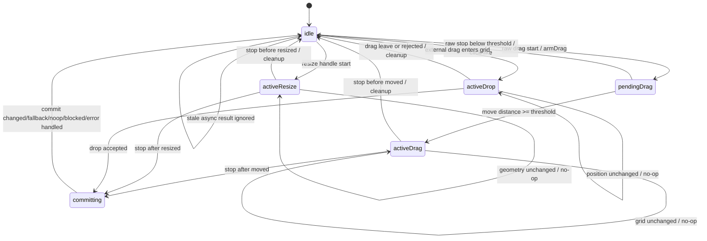
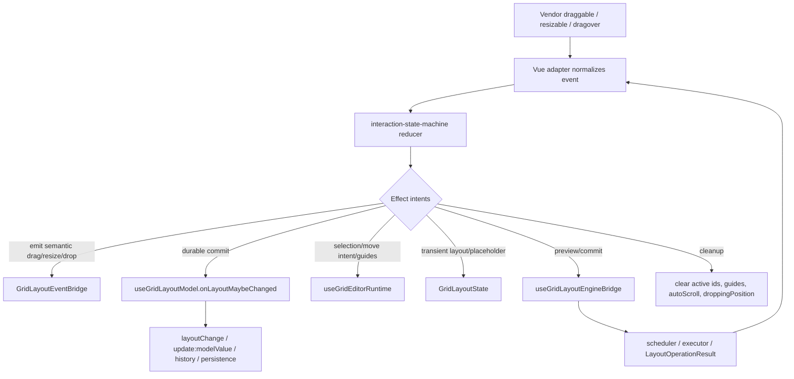

# Grid 交互状态机技术设计

## 架构概述

本设计把当前分散在 `useGridItemDrag()`、`useGridItemResize()`、`useGridDragResizeInteractions()`、`useGridDropInteractions()` 和 `useGridLayoutModel()` 中的交互生命周期收敛为一个纯 TypeScript core + Vue adapter 架构。

核心目标不是新增视觉能力，而是把 click、drag、resize、external drop、preview、commit、blocked、cancel 和 cleanup 变成显式状态转换。状态机只决定“现在是什么状态、这个事件是否合法、下一步需要哪些副作用”，不直接调用 Vue、DOM、layout engine、editor controller 或 persistence。

分层如下：

- `lib/interaction-state-machine/`: 新增纯 TS core，包含 state、event、effect、threshold、diagnostics 和 reducer。该层不依赖 Vue，不保存 DOM node 或 raw Event。
- `lib/grid-item/useGridItemDrag.ts`: 改为 raw draggable callback adapter。它把 vendor `start/move/stop` 转成 arm/move/stop 事件，只有超过阈值后才向上发 semantic `onDragStart/onDrag/onDragStop`。
- `lib/grid-item/useGridItemResize.ts`: 保持 resize handle start 立即激活，但将 no-op resize 判断显式化，避免没有几何变化时继续 preview/commit。
- `lib/grid-layout/useGridDragResizeInteractions.ts`: 从“隐式状态持有者”降级为 effect runner。它根据 core effect 调用 editor runtime、layout engine preview/commit、event bridge、history 和 cleanup。
- `lib/grid-layout/useGridDropInteractions.ts`: external drop 进入 grid 即 active drop，但由状态机抑制坐标未变化的重复 preview/update，并统一 drop leave/cancel/commit cleanup。
- `lib/grid-layout/useGridLayoutModel.ts`: 继续负责 durable layout、history、`layoutChange`、`update:modelValue` 和 persistence，但只在状态机确认 commit 成功后写入。

现有代码依据：

- `useGridItemDrag()` 当前在 vendor start 时立即调用 `onDragStart`，并用 `state.dragging` 直接驱动后续 `onDrag/onDragStop`，见 `lib/grid-item/useGridItemDrag.ts:72`、`lib/grid-item/useGridItemDrag.ts:144`、`lib/grid-item/useGridItemDrag.ts:170`。
- `useGridDragResizeInteractions()` 当前用 `activeDragHasMoved` 作为中层兜底，并在 drag start 里提前设置 placeholder、history replace 和 public dragStart，见 `lib/grid-layout/useGridDragResizeInteractions.ts:73`、`lib/grid-layout/useGridDragResizeInteractions.ts:573`、`lib/grid-layout/useGridDragResizeInteractions.ts:607`。
- drag preview/commit 当前直接在 composable 中调用 engine bridge，见 `lib/grid-layout/useGridDragResizeInteractions.ts:639`、`lib/grid-layout/useGridDragResizeInteractions.ts:833`。
- drop 当前在 `onDragOver` 中直接维护 `droppingPosition`、placeholder 和 intelligence update，见 `lib/grid-layout/useGridDropInteractions.ts:159`、`lib/grid-layout/useGridDropInteractions.ts:238`、`lib/grid-layout/useGridDropInteractions.ts:326`。
- durable layout、history 和 persistence 当前集中在 `onLayoutMaybeChanged()`，见 `lib/grid-layout/useGridLayoutModel.ts:156`。

设计原则：

- click-like interaction 不发 semantic drag lifecycle；公开 `onDragStart/onDrag/onDragStop` 只在超过阈值后触发。
- 默认 drag activation threshold 为 mouse/pen 4px、touch/coarse 8px；`0` 保留近似旧行为。
- resize handle start 立即 active；no-op resize 不 preview、不 commit。
- external drop 进入 grid 即 active；坐标和尺寸不变时 no-op。
- 纯 core 返回 effect intents；所有副作用由 Vue adapter 执行。
- `activeDragHasMoved` 这类中层 guard 可以保留为防御层，但不再是语义来源。

## 数据流图





## 组件与接口定义

### Pure Core 模块

新增目录：

```text
lib/interaction-state-machine/
├── index.ts
├── types.ts
├── thresholds.ts
└── reducer.ts
```

核心类型：

```ts
export type GridPointerKind = "mouse" | "pen" | "touch" | "coarse" | "unknown";

export type GridDragActivationDistance =
  | number
  | {
      mouse?: number;
      pen?: number;
      touch?: number;
      coarse?: number;
      default?: number;
    };

export type GridInteractionState =
  | { status: "idle"; revision: number }
  | {
      status: "pending-drag";
      interactionId: string;
      itemId: string;
      pointerKind: GridPointerKind;
      originPx: GridPoint;
      currentPx: GridPoint;
      originGrid: GridCell;
    }
  | {
      status: "active-drag";
      interactionId: string;
      itemId: string;
      context: GridDragContext;
      startGrid: GridCell;
      lastGrid: GridCell;
      moved: boolean;
      previewSeq: number;
    }
  | {
      status: "active-resize";
      interactionId: string;
      itemId: string;
      handle: ResizeHandleAxis;
      start: GridGeometry;
      last: GridGeometry;
      resized: boolean;
      previewSeq: number;
    }
  | {
      status: "active-drop";
      interactionId: string;
      itemId: string;
      lastGrid?: GridCell;
      lastSize?: GridSize;
      previewSeq: number;
    }
  | {
      status: "committing";
      interactionId: string;
      kind: "drag" | "resize" | "drop";
      previous: Exclude<GridInteractionState, { status: "idle" | "pending-drag" | "committing" }>;
    };
```

事件与副作用：

```ts
export type GridInteractionEvent =
  | { type: "ARM_DRAG"; interactionId: string; itemId: string; pointerKind: GridPointerKind; originPx: GridPoint; originGrid: GridCell }
  | { type: "MOVE_DRAG"; interactionId: string; currentPx: GridPoint; grid: GridCell }
  | { type: "STOP_DRAG"; interactionId: string; grid: GridCell }
  | { type: "START_RESIZE"; interactionId: string; itemId: string; handle: ResizeHandleAxis; geometry: GridGeometry }
  | { type: "MOVE_RESIZE"; interactionId: string; geometry: GridGeometry }
  | { type: "STOP_RESIZE"; interactionId: string; geometry: GridGeometry }
  | { type: "ENTER_DROP"; interactionId: string; itemId: string; grid?: GridCell; size?: GridSize }
  | { type: "MOVE_DROP"; interactionId: string; grid: GridCell; size: GridSize }
  | { type: "LEAVE_DROP"; interactionId: string }
  | { type: "COMMIT_DROP"; interactionId: string }
  | { type: "APPLY_RESULT"; interactionId: string; requestId: string; status: "changed" | "fallback" | "noop" | "blocked" | "error" | "stale" }
  | { type: "CANCEL"; interactionId?: string; reason: string };

export type GridInteractionEffect =
  | { type: "EMIT_DRAG_START"; interactionId: string; itemId: string; grid: GridCell }
  | { type: "EMIT_DRAG"; interactionId: string; itemId: string; grid: GridCell }
  | { type: "EMIT_DRAG_STOP"; interactionId: string; itemId: string; grid: GridCell }
  | { type: "PREVIEW_DRAG"; interactionId: string; requestId: string; grid: GridCell; context: GridDragContext }
  | { type: "COMMIT_DRAG"; interactionId: string; requestId: string; context: GridDragContext }
  | { type: "PREVIEW_RESIZE"; interactionId: string; requestId: string; geometry: GridGeometry }
  | { type: "COMMIT_RESIZE"; interactionId: string; requestId: string; geometry: GridGeometry }
  | { type: "PREVIEW_DROP"; interactionId: string; requestId: string; grid: GridCell; size: GridSize }
  | { type: "COMMIT_DROP"; interactionId: string; requestId: string }
  | { type: "CLEAR_TRANSIENT"; interactionId?: string; reason: string }
  | { type: "IGNORE_STALE"; interactionId: string; requestId?: string; reason: string }
  | { type: "REJECT_TRANSITION"; from: string; event: string; reason: GridInteractionRejectReason };
```

Reducer 签名：

```ts
export function reduceGridInteraction(
  state: GridInteractionState,
  event: GridInteractionEvent,
  options: GridInteractionMachineOptions
): {
  state: GridInteractionState;
  effects: GridInteractionEffect[];
};
```

### Vue Adapter

新增 `lib/grid-layout/useGridInteractionMachine.ts`，封装 reducer、state ref、effect runner 和 request id 生成：

- 接收 `props`、`state`、`eventBridge`、`engineBridge`、`editor`、`autoScroll`、`frameUpdate`、`syncHistory`、`onLayoutMaybeChanged`。
- 暴露给 item hooks 的 raw callbacks：`armDrag`、`moveDrag`、`stopDrag`。
- 暴露给 resize/drop hooks 的 semantic callbacks：`startResize`、`moveResize`、`stopResize`、`enterDrop`、`moveDrop`、`leaveDrop`、`commitDrop`。
- 根据 effects 执行 preview/commit、public events、guide update、blocked feedback 和 cleanup。

`useGridDragResizeInteractions()` 保留 public-facing return shape，但内部改为调用 adapter：

- `activeDragId`、`activeResizeId`、`dragBlocked` 等仍由 adapter 同步为 Vue refs。
- single/group/blocked move intent 仍由 `editor.resolveMoveDrag()` 决定，但只能在 `EMIT_DRAG_START`/activation effect 时解析。
- drag preview/commit 仍复用 `move` 与 `groupMove` operation。
- legacy path 也必须由状态机决定 activation/no-op/cleanup，避免另开一套 click-like 行为。

### Drag Activation

`useGridItemDrag()` 不再在 vendor `onDragStart` 中直接调用 attrs `onDragStart`。新的流程：

1. vendor start 计算 origin pixel 和 origin grid，向 adapter 发送 `ARM_DRAG`。
2. vendor move 累积 current pixel 和 current grid，向 adapter 发送 `MOVE_DRAG`。
3. reducer 根据 pointer kind 和 threshold 决定是否从 `pending-drag` 进入 `active-drag`。
4. 第一次激活时返回 `EMIT_DRAG_START`，同 tick 如 grid 已变化再返回 `EMIT_DRAG` / `PREVIEW_DRAG`。
5. vendor stop 如果仍是 `pending-drag`，只返回 `CLEAR_TRANSIENT`，不发 `onDragStop`。

`droppingPosition` 驱动的 internal drop proxy 不使用 drag activation threshold；它走 `active-drop` 状态，以符合 external drop 进入 grid 即 active 的需求。

### Resize

`useGridItemResize()` 可以继续立即调用 semantic resize start，但 `useGridDragResizeInteractions()` 的 effect runner 必须经状态机检查：

- `START_RESIZE` 立即进入 `active-resize`，发 `emitResizeStart`，初始化 engine interaction。
- `MOVE_RESIZE` 若 `x/y/w/h` 与 last geometry 相同，返回 no-op，不调用 engine preview 或 `updateIntelligence`。
- `STOP_RESIZE` 若从未 resized，只 cleanup，不 commit。

### Drop

`useGridDropInteractions()` 改为：

- `onDragEnter/onDragOver` 首次进入 grid 时发送 `ENTER_DROP`。
- `onDragOver` 计算 cursor grid、size 和 strategy 后发送 `MOVE_DROP`。
- reducer 比较 `grid + size + strategy`，未变化则 no-op。
- `callDropDragOver(e) === false` 时发送 `CANCEL` 或 `LEAVE_DROP`，cleanup placeholder。
- `onDrop` 发送 `COMMIT_DROP`，effect runner 调用 `dropFit` commit。

### 诊断

core diagnostics 必须是结构化、可测试且脱敏的：

```ts
export type GridInteractionDiagnostics = {
  interactionId: string;
  requestId?: string;
  from: GridInteractionState["status"];
  to: GridInteractionState["status"];
  event: GridInteractionEvent["type"];
  kind?: "drag" | "resize" | "drop";
  itemId?: string;
  reason?: GridInteractionRejectReason;
};
```

raw DOM node、raw Event、business payload 和 adapter payload 不进入 core state 或 diagnostics。

## API 接口设计

### Public Props

新增 public prop：

```ts
export type GridDragActivationDistance =
  | number
  | {
      mouse?: number;
      pen?: number;
      touch?: number;
      coarse?: number;
      default?: number;
    };

export type Props = {
  dragActivationDistance?: GridDragActivationDistance;
};
```

默认值：

```ts
const DEFAULT_DRAG_ACTIVATION_DISTANCE = {
  mouse: 4,
  pen: 4,
  touch: 8,
  coarse: 8,
  default: 4
} as const;
```

落地点：

- `lib/VueGridLayoutPropTypes.ts`: 增加 prop 定义和默认值。
- `lib/grid-layout/gridInteractionTypes.ts`: `GridInteractionsProps` 增加 `dragActivationDistance`。
- `typings/index.d.ts`: 导出 `GridDragActivationDistance` 并加入 `VueGridLayoutProps`。
- responsive/dashboard wrappers 如透传 grid props，应透传该配置；不新增 dashboard adapter 行为。

### Public Events

事件参数结构保持兼容，但触发时机改变：

- `onDragStart/onDrag/onDragStop` 只在超过阈值后的真实 drag interaction 中触发。
- click-like interaction 不发 drag lifecycle。
- `onResizeStart/onResize/onResizeStop` 参数结构保持兼容；resize start 立即触发。
- `onDrop` 参数结构保持兼容；drop rejected 不发 accepted drop event。

需要 mousedown 级即时反馈的集成方应监听自身 item 内容的 pointer/mousedown/click，而不是依赖 drag lifecycle。

### Internal Effect Runner

effect runner 使用现有内部接口：

- `eventBridge.emitDragStart/emitDrag/emitDragStop`
- `eventBridge.emitResizeStart/emitResize/emitResizeStop`
- `eventBridge.emitDrop`
- `engineBridge.preview/commit/start/reset`
- `editor.resolveMoveDrag/snapCandidate/updateIntelligence/notifyMoveBlocked/clearGuides`
- `frameUpdate.cancel/schedule/resetMovedFlags`
- `autoScroll.init/maybeScroll/reset`
- `onLayoutMaybeChanged`

effect runner 必须检查 `interactionId` 和 `requestId`，异步 result 不匹配时只产生 `IGNORE_STALE`，不得写 layout 或 guide。

## 数据模型与数据库变更

本项目没有数据库变更。

内存状态变化：

- `GridLayoutState.activeDrag` 继续作为 transient placeholder，但只能由 effect runner 根据状态机 effect 写入。
- `GridLayoutState.oldLayout`、`oldDragItem`、`oldResizeItem` 继续作为 commit 比较和 public event 参数来源，但不得在 pending drag 阶段提前写入 durable history。
- `droppingPosition` 继续用于 cursor drop proxy，但其生命周期由 `active-drop` 管理。

类型变更：

- 新增 `GridInteractionState`、`GridInteractionEvent`、`GridInteractionEffect`、`GridDragActivationDistance`。
- `GridInteractionsProps` 增加 `dragActivationDistance`。
- `VueGridLayout` public typings 增加 `dragActivationDistance`。

持久化变更：

- preview tick 不触发 persistence。
- click-like、no-op drag、no-op resize、no-op drop 不触发 persistence。
- commit changed/fallback 且 layout 实际变化时，继续通过 `onLayoutMaybeChanged()` 触发 persistence。

## 安全考量

- core state 不保存 raw DOM node、raw Event、VNode 或业务 payload，避免 debug snapshot 泄露外部数据。
- diagnostics 只包含 interaction id、request id、状态、事件类型、kind、item id 和 reason；adapter payload 仍需遵守现有 stable diagnostics 脱敏规则。
- stale async result 必须按 interaction id/request id 丢弃，防止旧 preview/commit 写入当前 layout。
- illegal transition 不应 throw 到用户应用；默认返回 `REJECT_TRANSITION` effect 和可测试 reason。
- 组件卸载、layout prop 外部更新、drop rejected、drag leave 都必须走 cleanup effect，避免残留 placeholder 或 guide。
- public API 的事件时机变化需要文档说明，避免集成方把 drag lifecycle 当作 mousedown 安全入口。

## 测试策略

### Core 单元测试

新增 `test/interaction-state-machine-core.test.ts`：

- pending drag 未过 mouse 4px 阈值 stop，不产生 drag lifecycle effect。
- pending drag 超过 4px 激活，先产生 `EMIT_DRAG_START`，再产生 preview effect。
- touch/coarse 使用 8px 阈值。
- `dragActivationDistance=0` 近似旧行为。
- active drag 坐标不变 no-op，不重复 preview。
- active drag stop before moved cleanup，不 commit。
- active resize start 立即 active，no-op resize 不 preview/commit。
- active drop enter 即 active，坐标不变 no-op。
- illegal transition 和 stale result 返回结构化 effect。

### Item / Grid Interaction 测试

扩展 `test/grid-layout-internal-core.test.ts`：

- `useGridItemDrag` click-like 不调用 attrs `onDragStart/onDragStop`。
- 超过阈值后 public event 顺序为 `dragStart -> drag -> dragStop`。
- bounded drag 激活后 delta 基于 origin 计算。
- group drag 激活后继续产生 `groupMove` preview/commit。
- legacy drag 也遵循 threshold 和 no-op cleanup。
- resize no-op 不调用 engine preview 和 `updateIntelligence`。
- drop dragover 坐标不变不重复 preview/update guide。

### Browser / Smoke 测试

扩展 editor/browser smoke：

- 普通点击 dashboard item 不显示 purple guide，不发 drag lifecycle，不写 history。
- 真实拖动 item 显示 guide，并正常 preview/commit。
- 多选后拖动已选 item 仍移动整组。
- resize handle 按下后可立即 resize，零变化 stop 不 commit。
- external drop preview 正常，drag leave 清理 placeholder/guide。

### 回归命令

最低验证：

- `yarn test:layout-engine`
- `yarn test:editor`
- `yarn test`

如修改 browser smoke，应额外运行对应 browser test runner。验证不依赖 computer use。
