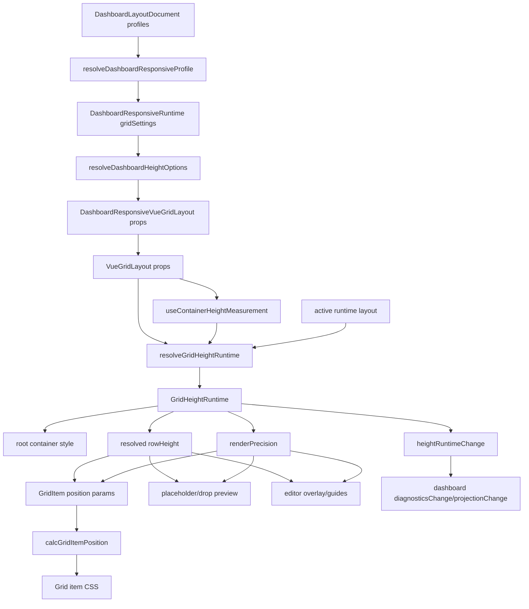

# Height Modes & Render Precision 技术设计

## 架构概述

本设计把高度模式和渲染精度拆成一个基础 grid runtime 层，再由 dashboard responsive 层映射 settings。核心原则是：`LayoutItem` 继续只表达整数 grid units；height mode、container height、rowHeight 推导和 render precision 都是运行时渲染配置。

新增模块建议：

- `lib/grid-height/types.ts`: 基础高度模式、渲染精度、resolver options/result、diagnostic code 类型。
- `lib/grid-height/resolve.ts`: `resolveGridHeightRuntime()`，纯函数计算 effective height mode、resolved rowHeight、container height、container style、diagnostics。
- `lib/grid-height/useContainerHeightMeasurement.ts`: Vue composable，按需测量 grid 根节点父容器 content box 高度。
- `lib/grid-height/index.ts`: 聚合导出。

改造现有模块：

- `lib/VueGridLayoutPropTypes.ts`: 新增基础 props 类型与 validator。
- `lib/VueGridLayout.tsx`: 使用 height resolver 替代内联 `containerHeight()`，把 resolved rowHeight/precision 传给 item、placeholder、drop preview、overlay。
- `lib/calculateUtils.ts`: 为像素输出增加 precision 策略；`calcXY()`、`calcWH()` 继续提交整数 grid units。
- `lib/GridItem.tsx`、`lib/grid-item/gridItemStyle.ts`: 接收 `renderPrecision`，让 transform/top-left 两条样式路径一致。
- `lib/grid-layout/GridEditorOverlay.tsx`: overlay geometry 使用 resolved rowHeight 和 precision formatter。
- `lib/grid-item/useGridItemDrag.ts`、`lib/grid-item/useGridItemResize.ts`、`lib/grid-layout/useGridDropInteractions.ts`、`lib/grid-layout/useGridEditorRuntime.ts`: 改用 resolved rowHeight，保持坐标提交整数。
- `lib/dashboard.ts`: 扩展 `DashboardGridSettings`、校验、ThingsBoard import/export preserved fields 和 `ResolvedDashboardGridSettings`。
- `lib/dashboard-responsive/*`: profile settings 合并 height/precision 字段，生成 profile-derived height options，并在 runtime 中暴露 height state/diagnostics。
- `lib/DashboardResponsiveVueGridLayout.tsx`: 显式组件 props 优先于 profile settings，把 resolved height props 传给内层 `VueGridLayout`，并将基础 height diagnostics 合并进现有 `diagnosticsChange`。
- `lib/cjs.ts`、`typings/index.d.ts`: 导出新类型、resolver、diagnostic code 和组件 props。

现有证据：

- `lib/VueGridLayout.tsx` 当前在组件内用 `autoSize + rowHeight` 直接计算容器高度，并给 item/placeholder/overlay 传原始 `props.rowHeight`。
- `lib/calculateUtils.ts` 当前在 `calcGridItemWHPx()`、`calcGridItemPosition()` 中对渲染像素做 `Math.round()`。
- `lib/grid-layout/GridEditorOverlay.tsx` 当前 overlay 只接收 `rowHeight`，没有 precision 策略。
- `lib/dashboard-responsive/resolve.ts` 当前把 `autoFillHeight`、`mobileRowHeight`、`mobileAutoFillHeight` 标记为 deferred setting。
- `lib/DashboardResponsiveVueGridLayout.tsx` 当前只把 `runtime.gridSettings.rowHeight` 传入内层 `VueGridLayout`。

## 数据流图



## 组件与接口定义

### 基础类型

```ts
export type GridHeightMode = "auto" | "scroll" | "fit" | "fixed";
export type GridRenderPrecision = "integer" | "subpixel";

export type GridHeightSource =
  | "height-mode"
  | "auto-size"
  | "container-height"
  | "measured-parent"
  | "fallback";

export type GridRowHeightSource =
  | "row-height"
  | "fit"
  | "mobile-row-height"
  | "default"
  | "empty-fit-fallback"
  | "fallback";

export type GridHeightDiagnostic = {
  code: GridHeightDiagnosticCode;
  level: "info" | "warning" | "error";
  message: string;
  prop?: string;
  path?: string;
  layoutId?: string;
  profileId?: string;
  targetView?: "desktop" | "mobile";
  details?: unknown;
};
```

`GridHeightDiagnostic.details` 必须 JSON-safe。不能放 DOM 节点、VNode、事件对象、函数或循环引用。

### `resolveGridHeightRuntime()`

纯函数，放在 `lib/grid-height/resolve.ts`。

```ts
export type ResolveGridHeightRuntimeOptions = {
  layout: Layout;
  autoSize?: boolean;
  heightMode?: GridHeightMode | null;
  rowHeight?: number;
  defaultRowHeight?: number;
  minRowHeight?: number;
  margin: [number, number] | number[];
  containerPadding: [number, number] | number[];
  containerHeight?: number | null;
  measuredContainerHeight?: number | null;
  autoMeasureContainerHeight?: boolean;
  renderPrecision?: GridRenderPrecision | null;
  context?: {
    layoutId?: string;
    profileId?: string | null;
    targetView?: "desktop" | "mobile";
    source?: "grid" | "dashboard-responsive";
  };
};

export type GridHeightRuntime = {
  requestedHeightMode: GridHeightMode;
  effectiveHeightMode: GridHeightMode;
  renderPrecision: GridRenderPrecision;
  rowHeight: number;
  rowHeightSource: GridRowHeightSource;
  containerHeight: number | null;
  containerHeightSource: GridHeightSource;
  contentHeight: number;
  bottomRows: number;
  overflow: "visible" | "hidden" | "auto";
  containerStyle: {
    height: string | null;
    overflow?: "hidden" | "auto";
  };
  fallbackApplied: boolean;
  diagnostics: GridHeightDiagnostic[];
};
```

解析规则：

1. `heightMode` 显式传入时优先。
2. `heightMode` 缺失时，`autoSize !== false` 映射为 `auto`，`autoSize === false` 映射为 `scroll` 请求；如果缺少可用高度则按 fallback 进入 `auto`。
3. `containerHeight` 优先于 `measuredContainerHeight`。
4. `autoMeasureContainerHeight` 只决定是否启用测量；resolver 本身只消费测量结果。
5. `renderPrecision` 缺失或非法时使用 `integer`。

高度公式：

```ts
const bottomRows = bottom(layout);
const paddingY = containerPadding?.[1] ?? margin[1];
const marginY = margin[1];

const contentHeightFor = (rows: number, rowHeight: number) =>
  rows === 0
    ? paddingY * 2
    : rows * rowHeight + Math.max(0, rows - 1) * marginY + paddingY * 2;

const fitRowHeight = (availableHeight - paddingY * 2 - Math.max(0, rows - 1) * marginY) / rows;
```

`fit` 行为：

- `rows > 0` 且有可用高度时，按公式反推 `rowHeight`。
- 反推值低于 `minRowHeight` 时，`effectiveHeightMode = 'scroll'`，rowHeight 使用 `minRowHeight` 或原始 rowHeight，并诊断 `fit-min-row-height-fallback`。
- `rows === 0` 且有可用高度时，保持 `effectiveHeightMode = 'fit'`，容器高度为可用高度，rowHeight 使用 fallback/default，并诊断 `empty-fit-layout`。
- 缺少可用高度时，`effectiveHeightMode = 'auto'`，诊断 `missing-container-height`。

`fixed` / `scroll` 行为：

- 有可用高度时都使用固定 rowHeight，不反推。
- `fixed` 输出 `overflow: hidden`。
- `scroll` 输出 `overflow: auto`。
- 缺少可用高度时 fallback 到 `auto` 并诊断。

### 自动测量 composable

```ts
export type UseContainerHeightMeasurementOptions = {
  enabled: () => boolean;
  rootRef: Ref<HTMLElement | null>;
  onDiagnostics?: (diagnostics: GridHeightDiagnostic[]) => void;
};

export type ContainerHeightMeasurement = {
  measuredContainerHeight: Ref<number | null>;
  diagnostics: Ref<GridHeightDiagnostic[]>;
  stop: () => void;
};
```

实现要点：

- 默认测量 `rootRef.value?.parentElement`，使用 parent 的 content box。
- 优先读取 `ResizeObserverEntry.contentRect.height`。
- 如果 parent 不存在、height 非有限数、height <= 0 或 observer 不可用，记录 diagnostic。
- `enabled()` 从 false 变 true 时开始 observe；变 false 或组件卸载时 disconnect。
- 不支持 selector/ref target 配置，保持 API 小而稳。

### 渲染精度

在 `lib/calculateUtils.ts` 中新增基础 helper：

```ts
export function applyRenderPrecision(
  value: number,
  precision: GridRenderPrecision
): number;
```

`PositionParams` 增加：

```ts
renderPrecision?: GridRenderPrecision;
```

改造点：

- `calcGridItemWHPx()` 增加可选 precision，默认 `integer`。
- `calcGridItemPosition()` 对 `width/height/top/left` 使用 `applyRenderPrecision()`。
- `calcXY()` 和 `calcWH()` 保持 `Math.round()` 提交 grid units。
- `setTransform()`、`setTopLeft()` 不自己取整，只格式化传入 position。
- `usePercentages` 路径用已经经过 precision 的 position 计算百分比，保持 SSR/首帧兼容。

### `VueGridLayout` 集成

`VueGridLayout` 内部新增一个 resolved runtime：

```ts
const measuredHeight = useContainerHeightMeasurement(...);
const heightRuntime = computed(() => resolveGridHeightRuntime({
  layout: state.layout,
  autoSize: props.autoSize,
  heightMode: props.heightMode,
  rowHeight: props.rowHeight,
  minRowHeight: props.minRowHeight,
  margin: props.margin,
  containerPadding: props.containerPadding || props.margin,
  containerHeight: props.containerHeight,
  measuredContainerHeight: measuredHeight.value,
  autoMeasureContainerHeight: props.autoMeasureContainerHeight,
  renderPrecision: props.renderPrecision
}));
```

使用方式：

- root style 使用 `heightRuntime.containerStyle.height` 和 `heightRuntime.containerStyle.overflow`。
- `GridItem`、placeholder、dropping item 使用 `heightRuntime.rowHeight` 和 `heightRuntime.renderPrecision`。
- `createGridEditorOverlayGeometry()` 使用 resolved rowHeight/precision。
- `useGridDropInteractions()`、drag/resize hooks、editor runtime 都通过 props/context 接收 resolved rowHeight。
- 新增基础事件 `heightRuntimeChange`，payload 为 `GridHeightRuntime`。它只在 signature 变化时发出，避免每帧噪声。

`innerRef` 兼容：

- 根元素需要内部 `rootRef` 做测量。
- 如果用户传了 `innerRef`，用一个 ref setter 同时写入内部 ref 和外部 ref。

### Dashboard responsive 集成

`DashboardGridSettings` 增加：

```ts
heightMode?: GridHeightMode;
mobileHeightMode?: GridHeightMode;
minRowHeight?: number;
renderPrecision?: GridRenderPrecision;
```

`ResolvedDashboardGridSettings` 增加 resolved 字段：

```ts
heightMode: GridHeightMode;
mobileHeightMode?: GridHeightMode;
minRowHeight?: number;
renderPrecision: GridRenderPrecision;
```

新增 helper：

```ts
export type DashboardHeightOptionOverrides = {
  heightMode?: GridHeightMode | null;
  containerHeight?: number | null;
  autoMeasureContainerHeight?: boolean;
  minRowHeight?: number;
  rowHeight?: number;
  renderPrecision?: GridRenderPrecision | null;
};

export function resolveDashboardHeightOptions(
  settings: ResolvedDashboardGridSettings,
  context: {
    targetView: DashboardTargetView;
    explicit?: DashboardHeightOptionOverrides;
    diagnostics: DashboardDiagnostic[];
    layoutId: string;
    profileId: string | null;
  }
): DashboardHeightOptionOverrides;
```

映射规则：

1. 显式组件 props 优先。
2. `targetView: 'mobile'` 且存在 `mobileHeightMode` 时优先使用它。
3. mode 缺失时，`autoFillHeight` 或 `mobileAutoFillHeight` 为 true 映射为 `fit`。
4. 显式 mode 与旧 auto-fill 字段冲突时，以 mode 为准并诊断。
5. `targetView: 'mobile'` 且 `mobileRowHeight` 有效时，在非 fit 或 fallback 固定 rowHeight 路径优先使用。
6. `renderPrecision` 默认仍为 `integer`，不因 fit 自动切换。

`DashboardResponsiveRuntime` 增加：

```ts
heightOptions: DashboardHeightOptionOverrides;
heightRuntime?: GridHeightRuntime;
```

`DashboardResponsiveVueGridLayout`：

- 从 runtime 取得 `heightOptions`。
- 与显式 props 合并，显式 props 优先。
- 传给内层 `VueGridLayout`。
- 监听内层 `heightRuntimeChange`，调用 model 的 `onHeightRuntimeChange()`。
- model 把 height diagnostics 合并到 runtime diagnostics，并复用已有 `diagnosticsChange` / `projectionChange` 事件。
- dashboard 层不新增 `heightChange` 事件。

## API 接口设计

### 基础组件 props

`VueGridLayoutPropTypes.Props` 增加：

```ts
heightMode?: GridHeightMode | null;
containerHeight?: number | null;
autoMeasureContainerHeight?: boolean;
minRowHeight?: number;
renderPrecision?: GridRenderPrecision | null;
```

runtime validator：

- `heightMode`: 只允许 `auto|scroll|fit|fixed`。
- `containerHeight`: 有限且 `> 0` 才作为可用高度。
- `minRowHeight`: 有限且 `> 0` 才有效。
- `renderPrecision`: 只允许 `integer|subpixel`。

### 基础事件

`gridLayoutEmits` 增加：

```ts
"heightRuntimeChange"
```

事件 payload：

```ts
type HeightRuntimeChangePayload = GridHeightRuntime;
```

事件语义：

- mounted 后首次 resolve 成功发出。
- props、layout、measurement、target rowHeight 或 precision 变化导致 runtime signature 改变时发出。
- 不参与 `layoutChange`、`update:modelValue` 或 persistence commit。

### Dashboard public API

导出：

- `GridHeightMode`
- `GridRenderPrecision`
- `GridHeightRuntime`
- `ResolveGridHeightRuntimeOptions`
- `resolveGridHeightRuntime`
- `GRID_HEIGHT_DIAGNOSTIC_CODES`
- `resolveDashboardHeightOptions`

CommonJS 需要增加：

```ts
module.exports.gridHeight = require("./grid-height");
module.exports.resolveGridHeightRuntime = gridHeight.resolveGridHeightRuntime;
module.exports.GRID_HEIGHT_DIAGNOSTIC_CODES = gridHeight.GRID_HEIGHT_DIAGNOSTIC_CODES;
```

### Backward Compatibility

- 未传 `heightMode`、`containerHeight`、`autoMeasureContainerHeight`、`renderPrecision` 时，默认路径保持 `autoSize + rowHeight + integer`。
- `autoSize` 不立即废弃，但文档标注为旧入口。
- `LayoutItem`、layout engine、persistence document 不新增字段。
- `calcXY()`、`calcWH()` 继续提交整数 grid units。

## 数据模型与数据库变更

本规格不涉及数据库。

TypeScript 数据模型变更：

- `DashboardGridSettings` 新增 `heightMode`、`mobileHeightMode`、`minRowHeight`、`renderPrecision`。
- `ResolvedDashboardGridSettings` 新增对应 resolved 字段。
- `DashboardResponsiveRuntime` 新增 `heightOptions` 和可选 `heightRuntime`。
- `DashboardResponsiveProfileEvent.projectionChange` payload 保持 runtime 类型，因 runtime 扩展而自然携带 height state。
- `DashboardDiagnostic` 继续复用 JSON-safe shape，不新增 DOM/runtime object 字段。

Dashboard import/export：

- ThingsBoard 风格数据若不含新字段，保持现状。
- 本库新字段在 `extensions` 或原生 settings 字段中保留；导出 ThingsBoard 兼容结构时不要求 ThingsBoard 认识这些新增字段。
- `autoFillHeight/mobileAutoFillHeight/mobileRowHeight` 保持兼容，迁移 helper 不删除旧字段。

Typings：

- `typings/index.d.ts` 需要同步所有新增 types、props、事件和 dashboard settings 字段。

## 安全考量

- 自动测量只读取父容器尺寸，不接受 selector 字符串，避免跨区域查询和意外读取任意 DOM。
- ResizeObserver 资源必须在组件卸载、target 切换或测量禁用时释放，避免后台页面泄漏。
- diagnostics 必须 JSON-safe，不能把 DOM 节点、VNode、事件对象、函数或循环引用放入 payload。
- `containerHeight`、`rowHeight`、`minRowHeight`、`renderPrecision` 等外部输入都必须 sanitize/fallback，避免非法值导致 `NaNpx`、无限高度或运行时异常。
- `subpixel` 只影响 CSS 数值，不改变 committed layout 或 persistence，避免外部文档因视觉精度开关而产生不可逆数据变化。
- 新增 dashboard settings 不应覆盖业务 widget 配置、entity alias、timewindow、alarm 或 editor runtime state。

## 测试策略

### 单元测试

新增 `test/grid-height-runtime.test.ts`：

- `auto` 内容高度、空 layout padding 行为。
- `fixed` 有 container height 时 height/overflow。
- `scroll` 有 container height 时 height/overflow。
- `fit` 正常反推 decimal rowHeight。
- `fit` 缺 container height fallback auto。
- `fixed/scroll` 缺 container height fallback auto。
- `fit` 低于 `minRowHeight` fallback scroll。
- `fit` 空 layout 占用 container height 并 diagnostic。
- invalid heightMode/renderPrecision/rowHeight/minRowHeight diagnostics。
- diagnostics 稳定排序。

新增或扩展 `test/grid-layout-internal-core.test.ts`：

- `calcGridItemPosition()` integer/subpixel 输出差异。
- `calcXY()`、`calcWH()` 仍返回整数 grid units。
- `createGridEditorOverlayGeometry()` 使用相同 precision 后 item rect 与 guides 对齐。

### 基础组件/浏览器测试

扩展 `test/grid-layout-contract-browser.test.js` 或新增 `test/grid-height-component-browser.test.js`：

- 未传新 props 时默认高度和整数像素不变。
- `heightMode="fixed"` 输出固定高度与 `overflow: hidden`。
- `heightMode="scroll"` 输出固定高度与 `overflow: auto`。
- `heightMode="fit"` 根据 `containerHeight` 重算 rowHeight。
- `autoMeasureContainerHeight` 默认不测量；显式开启后父容器 resize 会更新 item height。
- unmount 后 ResizeObserver 不再触发更新。
- `heightRuntimeChange` payload 稳定且不触发布局保存。

### Dashboard responsive 测试

扩展 `test/dashboard-core.test.ts`、`test/dashboard-responsive-component-browser.test.js`、`test/dashboard-types.test.ts`：

- `DashboardGridSettings.heightMode/mobileHeightMode/renderPrecision` 类型可导入。
- profile settings 覆盖 default settings。
- mobile target 使用 `mobileHeightMode/mobileRowHeight`。
- `autoFillHeight/mobileAutoFillHeight` 映射为 fit。
- explicit component props 覆盖 profile settings。
- runtime 暴露 `heightOptions` 和最新 `heightRuntime`。
- height diagnostics 并入现有 `diagnosticsChange`。
- list runtime 用 active derived layout 计算 fit rows。

### Editor/visual 对齐测试

浏览器测试覆盖：

- item 与 drag placeholder 在 subpixel 下 left/top/width/height 差异在阈值内。
- dropping preview 与 commit 后 item 对齐。
- overlay grid lines、guide spans、selection/intelligence geometry 使用 resolved rowHeight。
- desktop/mobile viewport 下文字和控件不因 fixed/scroll overflow 产生 incoherent overlap。

### 回归命令

最终实现应运行：

- dashboard core/type tests
- dashboard responsive browser tests
- grid layout internal core tests
- grid layout contract browser tests
- editor browser tests
- persistence browser tests
- package build/type generation 命令

具体命令以当前 `package.json` 中已有 scripts 为准。
