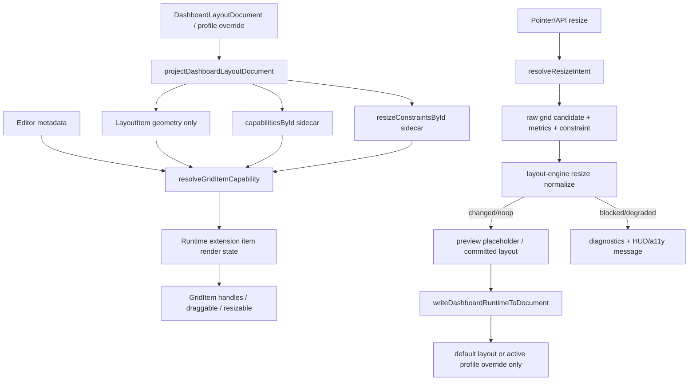

# Item Capabilities & Aspect Ratio 技术设计

## 架构概述

本设计在现有 grid/editor/dashboard/layout-engine 分层之间新增一个 lean-safe 的 item capability 纯函数层，用来解析 item 物理布局能力、editor 直接编辑权限、resize handle policy 与 aspect ratio resize constraint。该层不扩展基础 `LayoutItem`，不导入 dashboard/editor/persistence/runtime 模块，只依赖 `lib/utils.ts` 中的 `LayoutItem`、`ResizeHandleAxis` 等基础类型。

设计目标是让 dashboard document 中已经保存的 `preserveAspectRatio`、`aspectRatio` 从“保留但 runtime unsupported”升级为 sidecar runtime constraint，同时让现有 `LayoutItem.static/isDraggable/isResizable/resizeHandles`、editor metadata、dashboard/profile override 的优先级可诊断。核心执行点放在 layout engine 的 `resize` operation 中，Vue interaction adapter 与 editor runtime 只负责收集 metrics、解析 capability、构造 sidecar request 和展示 diagnostics。

新增与改造模块建议：

- `lib/item-capabilities.ts`: 新增纯函数模块，定义 `ResolvedGridItemCapability`、`GridItemResizeConstraint`、`GridItemResizeMetrics`、resolver、handle policy helper、aspect ratio resize candidate helper。
- `lib/editor/metadata.ts`: 继续保留 `resolveEditorItemCapability()` 公开语义，但内部复用共享 resolver，并保持 editor metadata 只能收紧直接编辑权限。
- `lib/dashboard.ts`: 投影结果增加 `capabilitiesById` / `resizeConstraintsById` sidecar；不再把 `preserveAspectRatio` / `aspectRatio` 标为 runtime unsupported，而是标为 sidecar projected。
- `lib/dashboard-responsive/resolve.ts`: 在 default/profile 合并后继承并覆盖 capability sidecar，profile write-back 只写目标 profile/default。
- `lib/grid-layout/runtimeExtension.ts` 与 `lib/grid-layout/createGridLayoutComponent.tsx`: `GridItemRenderState` 增加 `resizeHandles`，runtime extension 可返回 effective handles；core noop 仍使用现有 `LayoutItem`/prop 行为。
- `lib/grid-layout/gridInteractionTypes.ts` 与 `lib/grid-layout/useGridDragResizeInteractions.ts`: 增加 resize intent/constraint resolution 钩子；pointer resize preview/commit 都携带同一个 sidecar constraint。
- `lib/layout-engine/types.ts` 与 `lib/layout-engine/core.ts`: 扩展 `resize` operation 的 optional `constraint`，在 `normalizeResize()` 中执行 aspect ratio、handle、metrics、min/max、bounds 校验。
- `lib/layout-engine/workerRuntime.ts` / `executor.ts`: 保持 request sidecar 可结构化 clone，worker 与 main-thread 走同一纯函数。

范围边界：

- 不新增 `LayoutItem.preserveAspectRatio`、`LayoutItem.aspectRatio` 或 dashboard 产品字段。
- 不做 group resize、nested grids、inter-grid drag、Widget Registry schema、Editor Kit UI 或 AI/MCP assistant。
- 不让 root/core/responsive 静态依赖 dashboard/editor/persistence/history/Pinia。
- CSS `aspect-ratio` 只能作为应用或 slot 内容的视觉辅助，不参与本规格的 layout correctness。

需求覆盖：R1-R3 由 shared capability resolver 与 runtime extension handle policy 满足；R4-R6 由 aspect ratio metrics、resize constraint sidecar 与 layout engine normalize 满足；R7 由 dashboard/profile projection/write-back 满足；R8 由 command/runtime diagnostics 满足；R9 由 public exports 与 bundle boundary gate 满足；R10 由 dogfood workbench 与测试矩阵满足。

## 数据流图



## 组件与接口定义

### `lib/item-capabilities.ts`

新增纯函数模块，面向 core-safe 的数据结构设计。该模块不得导入 `lib/dashboard.ts`、`lib/editor/*`、Vue runtime、DOM、Pinia 或 persistence。

核心类型草案：

```ts
export type GridItemCapabilitySource =
  | "layout"
  | "dashboard"
  | "profile"
  | "editor"
  | "defaults";

export type GridItemPhysicalCapabilityInput = {
  static?: boolean;
  draggable?: boolean;
  resizable?: boolean;
  bounded?: boolean;
  resizeHandles?: ResizeHandleAxis[];
  preserveAspectRatio?: boolean;
  aspectRatio?: number;
  aspectRatioEdgeHandles?: ResizeHandleAxis[];
};

export type GridItemEditorCapabilityInput = {
  locked?: boolean;
  visible?: boolean;
  editable?: boolean;
  draggable?: boolean;
  resizable?: boolean;
  deletable?: boolean;
  duplicatable?: boolean;
  copyable?: boolean;
};

export type GridItemResizeMetrics = {
  colWidth: number;
  rowHeight: number;
  margin: [number, number];
  containerPadding?: [number, number];
  renderPrecision?: "integer" | "subpixel";
};

export type GridItemAspectRatioConstraint = {
  enabled: boolean;
  ratio: number;
  ratioKind: "visual-px";
  source: "explicit" | "start-geometry";
  fallbackPolicy: "block" | "grid-cell" | "start-geometry";
  edgeHandles: ResizeHandleAxis[];
  metrics?: GridItemResizeMetrics;
};

export type ResolvedGridItemCapability = {
  id: string;
  visible: boolean;
  editable: boolean;
  draggable: boolean;
  resizable: boolean;
  bounded: boolean;
  static: boolean;
  locked: boolean;
  resizeHandles: ResizeHandleAxis[];
  aspectRatio?: GridItemAspectRatioConstraint;
  sources: Record<string, GridItemCapabilitySource>;
  diagnostics: GridItemCapabilityDiagnostic[];
};
```

解析规则：

1. 物理能力由 `LayoutItem`、dashboard item、profile override 与 grid defaults 决定。
2. editor metadata 只能收紧直接编辑权限，不能放宽 dashboard/profile/layout 已禁用的 `draggable`、`resizable` 或 handle policy。
3. `locked` 不等价于 `static`；`locked` 阻止直接编辑，`static` 是 layout-engine 物理固定语义。
4. `preserveAspectRatio` 不进入 `LayoutItem`，只进入 `aspectRatio` constraint sidecar。
5. 启用 `preserveAspectRatio` 且未显式 opt-in edge handle 时，effective handles 为上层允许集合与 `["nw", "ne", "sw", "se"]` 的交集。
6. 缺少视觉像素 metrics 时，默认 fallback policy 为 `"block"`。

### Dashboard projection

`DashboardGridRuntimeProjection` 扩展为：

```ts
export type DashboardGridRuntimeProjection = {
  layout: Layout;
  gridSettings: ResolvedDashboardGridSettings;
  editorMetaById: GridEditorMetaById;
  capabilitiesById?: Record<string, ResolvedGridItemCapability>;
  resizeConstraintsById?: Record<string, GridItemAspectRatioConstraint>;
  layoutId: string;
  profileId: string | null;
  fallbackApplied: boolean;
  diagnostics: DashboardDiagnostic[];
};
```

`toRuntimeLayoutItem()` 继续只写入当前基础 grid 支持的字段：`x/y/w/h/i/min/max/static/isDraggable/isResizable/isBounded/resizeHandles`。`preserveAspectRatio` 与 `aspectRatio` 从 `DASHBOARD_ITEM_RUNTIME_UNSUPPORTED_FIELDS` 的“unsupported”语义迁移为 sidecar projection 语义。若旧 diagnostic 名称需要兼容，可降低为 `capability-sidecar-projected` 或类似 info diagnostic。

profile 规则：

- default item 与 profile override 先按现有 `mergeProfileItem()` 合成 effective dashboard item。
- resolver 标记每个字段来源：default inherited、profile overridden、editor restricted、conflict。
- profile write-back 只更新目标 `profiles[profileId].widgets[id]` 或 default `widgets[id]`，不 materialize 其他 profiles。
- missing profile edit 继续遵守 `responsive-dashboard-profiles` 的 missing-profile write blocking / explicit create-missing policy。

### Runtime extension 与 GridItem 渲染

`GridItemRenderState` 增加：

```ts
resizeHandles?: ResizeHandleAxis[];
capabilityDiagnostics?: GridItemCapabilityDiagnostic[];
```

`createGridLayoutComponent.tsx` 的 handle 选择顺序调整为：

1. `itemState.resizeHandles`；
2. `LayoutItem.resizeHandles`；
3. 组件 prop `resizeHandles`。

`getDefaultGridItemRenderState()` 保持现有行为，只基于 `LayoutItem` 与 prop defaults 解析，不启用 aspect ratio。高级 wrapper 或 dashboard/editor extension 通过 `getItemRenderState()` 返回 effective `resizeHandles`、`draggable`、`resizable` 和 class。

### Resize interaction adapter

`GridInteractionsEditor` 增加可选方法：

```ts
resolveResizeIntent?: (input: {
  id: string;
  item: LayoutItem;
  layout: Layout;
  handle: ResizeHandleAxis;
  rawCandidate: LayoutItem;
  metrics: GridItemResizeMetrics;
  phase: "preview" | "commit";
}) =>
  | {
      kind: "allowed";
      candidate: LayoutItem;
      constraint?: GridItemAspectRatioConstraint;
      capability?: ResolvedGridItemCapability;
      diagnostics?: GridItemCapabilityDiagnostic[];
    }
  | {
      kind: "blocked";
      reason: GridInteractionBlockedReason;
      ids: string[];
      message?: string;
      diagnostics?: GridItemCapabilityDiagnostic[];
    };
```

Noop extension 返回 `allowed` 且不提供 constraint，保持 core 行为。Editor/dashboard extension 使用 shared resolver：

1. resize start 时记录 start geometry 和 metrics。
2. preview 时从 raw candidate 解析 aspect-ratio constrained candidate。
3. snap 计算使用 constrained candidate，snap 后再次通过同一个 helper 校验比例。
4. preview/commit 都把 `constraint` 传给 layout engine `resize` operation。
5. engine result 为 blocked/degraded 时，`resizeBlocked`、command result、HUD 和 a11y message 使用同一 diagnostics。

### Layout engine

`LayoutOperation` 的 `resize` 分支增加 optional `constraint`：

```ts
export type LayoutResizeConstraint = {
  handlePolicy?: {
    allowedHandles?: ResizeHandleAxis[];
    blockedReason?: LayoutBlockedReason;
  };
  aspectRatio?: GridItemAspectRatioConstraint;
};

type ResizeOperation = {
  type: "resize";
  id: string;
  w: number;
  h: number;
  x?: number;
  y?: number;
  handle: ResizeHandleAxis;
  constraint?: LayoutResizeConstraint;
};
```

`LayoutBlockedReason` 增加：

- `handle-disabled`
- `aspect-ratio`
- `metrics-missing`

`normalizeResize()` 的执行顺序：

1. 校验 item 存在、输入有限、handle 是否允许。
2. 如果存在 aspect ratio constraint，先确认 ratio 合法。
3. 如果 constraint 缺少视觉 metrics 且 fallbackPolicy 为 `"block"`，返回 `metrics-missing` blocked。
4. 根据 handle anchor 计算 ratio-preserving grid candidate。
5. 应用 min/max clamp；若 clamp 后无法满足 ratio，在诊断中标记 `aspect-ratio` impossible。
6. 校验 bounds、maxRows。
7. 查询 collision 并按 `preventCollision/allowOverlap` 处理。
8. 返回 placeholder、patches、diagnostics。

worker executor 不做额外分支；constraint 必须是 JSON-serializable plain object，主线程与 worker 使用同一 normalize helper。

### Editor command 与 diagnostics

`GridEditorResolvedCapability` 可改为复用或包装 `ResolvedGridItemCapability`。`resolveEditorItemCapability()` 保持 API 兼容，但其 `source` 增加 conflict 与 physical/editor ownership 信息。

新增 diagnostics code 建议：

- `item-capability.conflict`
- `item-capability.handle-disabled`
- `item-capability.aspect-ratio-invalid`
- `item-capability.metrics-missing`
- `item-capability.fallback-used`
- `item-capability.sidecar-projected`

`canExecute()`、toolbar state、command result 和 resize interaction diagnostics 应暴露：

- disabled reason；
- blocked ids；
- effective handles；
- ratio source；
- target ratio；
- resolved geometry；
- fallback policy；
- metrics availability。

## API 接口设计

### Public exports

建议导出位置：

- `./layout-engine`: 导出 `LayoutResizeConstraint`、`GridItemAspectRatioConstraint`、相关 diagnostics 类型。
- `./dashboard`: 导出 dashboard projection sidecar 类型，并在 `DashboardGridRuntimeProjection` 中公开 `capabilitiesById` / `resizeConstraintsById`。
- `./editor`: 导出 editor-facing capability 类型、toolbar diagnostics 与 wrapper 集成。

`lib/item-capabilities.ts` 的纯 helper 可以从 `./layout-engine` 或新增 `./item-capabilities` subpath 暴露。若新增 subpath，需要更新 `package.json.exports`、types、CJS wrapper、MCP 数据和 package consumer tests。若不新增 subpath，则从 `./layout-engine` 暴露即可避免扩大公共入口数量。

root/core/responsive 不暴露 dashboard/editor wrapper，也不静态依赖 dashboard/editor runtime。若 core 内部需要导入 `item-capabilities` 的纯类型或 noop helper，必须通过 bundle gate 确认没有高级闭包回流。

### Dashboard API

`projectDashboardLayoutDocument()` 返回 projection sidecar：

```ts
const result = projectDashboardLayoutDocument(document, { profileId: "tablet" });
if (result.ok) {
  result.projection.layout;
  result.projection.capabilitiesById?.temperature;
  result.projection.resizeConstraintsById?.video;
}
```

`writeDashboardRuntimeToDocument()` 不从 `LayoutItem` 读取 aspect ratio。它只在 runtime 显式传入 capability patch 或 editor/dashboard sidecar 发生 committed 变化时写回对应 dashboard item/profile。普通 resize 只写 `col/row/sizeX/sizeY`。

### Grid/editor wrapper API

`EditorGridLayout` / dashboard wrapper 通过 runtime extension 注入 sidecar：

```ts
<EditorGridLayout
  modelValue={layout}
  itemCapabilities={capabilitiesById}
  resizeConstraints={resizeConstraintsById}
/>
```

具体 prop 名称在实现阶段可按现有 wrapper 风格收敛，但必须满足：

- core `VueGridLayout` 不新增 dashboard/product props；
- wrapper 接收 sidecar 后能影响 handles、preview、commit、command availability；
- sidecar 缺失时保持现有行为。

## 数据模型与数据库变更

无数据库变更。

内存与文档数据模型变化：

- `LayoutItem` 不新增 `preserveAspectRatio`、`aspectRatio` 或 dashboard 产品字段。
- dashboard document 继续保存 `DashboardItemLayout.preserveAspectRatio` 与 `DashboardItemLayout.aspectRatio`。
- runtime projection 增加 sidecar maps：
  - `capabilitiesById: Record<string, ResolvedGridItemCapability>`
  - `resizeConstraintsById: Record<string, GridItemAspectRatioConstraint>`
- layout engine `resize` request 增加 `constraint` plain object。
- diagnostics 增加 capability/aspect-ratio 相关 code，但应保持现有 `LayoutOperationResult` shape 向后兼容。

aspect ratio 存储语义：

- `aspectRatio` 是视觉像素宽高比 `widthPx / heightPx`。
- 未声明 `aspectRatio` 且 `preserveAspectRatio=true` 时，ratio source 为 resize start geometry。
- 缺少视觉 metrics 默认不提交；显式 fallback 才允许 `grid-cell` 或 `start-geometry` fallback。
- fallback 使用必须出现在 diagnostics 中。

## 安全考量

- `locked`、`editable`、`draggable`、`resizable` 都是客户端编辑体验与约束语义，不是安全权限边界。服务端权限仍需由业务应用或 `beforeCommand` guard 校验。
- resolver 必须忽略或清理 `__proto__`、`constructor`、`prototype` 等危险 key，沿用 dashboard/editor metadata 的安全输入策略。
- worker request sidecar 只能包含 JSON-serializable 数据，不传函数、DOM node、Vue ref、clipboard、adapter 或业务对象。
- diagnostics 不应泄露业务私密配置；只输出 item id、字段路径、reason、fallback policy 和几何摘要。
- 缺少视觉 metrics 时默认 blocked，避免在 SSR、测试或 degraded 环境中静默提交错误比例 layout。
- root/core/responsive bundle boundary 仍由 `check:bundle` 保障，防止 capability helper 引入 dashboard/editor runtime。

## 测试策略

单元测试：

- `lib/item-capabilities.ts`: resolver 优先级、分层所有权、conflict diagnostics、unknown field preservation、安全 key、handle policy merge、corner-only default、edge opt-in。
- aspect ratio helper: explicit ratio、start-geometry ratio、invalid ratio、visual pixel metrics、missing metrics default block、explicit fallback opt-in、north/west anchor、min/max clamp、impossible ratio。
- `lib/layout-engine/core.ts`: resize constraint normalize、handle-disabled、metrics-missing、aspect-ratio blocked、bounds/maxRows/collision、preventCollision/allowOverlap、placeholder/patches/diagnostics、no-constraint backward compatibility。
- main-thread/worker executor: 同一 resize request 产生等价 status、layout、patches、diagnostics。
- dashboard projection/write-back: sidecar projection、profile inheritance/override/conflict diagnostics、unknown profile item、missing profile block、write-back immutability、不 materialize unrelated profiles。

组件与 headless interaction 测试：

- `createGridLayoutComponent.tsx`: `itemState.resizeHandles` 优先级、生效 DOM handles、`resizable=false` 不显示 handles。
- `useGridDragResizeInteractions.ts`: preview/commit 使用同一 constrained geometry、blocked 后恢复、legacy/disabled fallback、snap 后比例仍一致。
- editor command/toolbar: resize disabled reason、locked/static/resizable false、handle-disabled、metrics-missing diagnostics、`skip-blocked`/`all-or-nothing`。
- dogfood workbench: 16:9 视频卡、1:1 Logo 卡、不可 resize KPI、locked 非 static 卡、static anchor 卡、profile override 卡、invalid ratio 卡。

发布与回归：

- 运行相关单元测试和现有 `npm test`。
- 涉及 browser/headless interaction 时运行 `npm run test:browser`。
- 涉及 exports/types/bundle 时运行 `npm run check:package` 和 `npm run check:bundle`。
- 设计不要求 GUI browser 验证；如必须做视觉验证，先请求用户确认。

