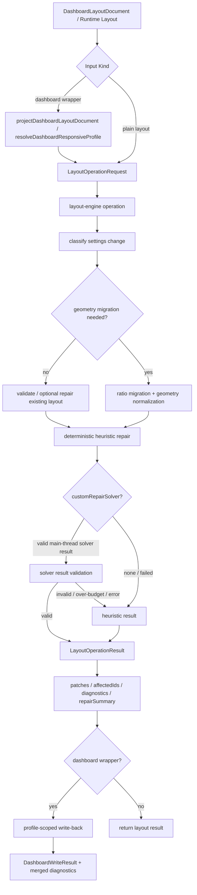

# Layout Settings Migration & Collision Repair 技术设计

## 架构概述

本设计在现有 `lib/layout-engine` 纯布局引擎上增加 settings migration、collision repair、placement/import 和 translate 批量几何操作，并在 dashboard 层提供薄 wrapper。核心原则是：几何迁移与碰撞修复属于 layout engine；dashboard document/profile 只负责投影、调用 engine、再把结果回写到目标 layout/profile。`LayoutItem` 继续只表达基础几何和已有交互字段，不承载 dashboard-only settings、repair policy 或 solver metadata。

当前代码中的关键落点：

- `LayoutOperation` 已包含 `move`、`groupMove`、`resize`、`dropFit`、`compact`、`validate` 和 `generateResponsiveLayout`，见 `lib/layout-engine/types.ts:12`。
- `LayoutOperationResult` 已有 `status`、`layout`、`patches`、`affectedIds`、`collisions`、`blocked`、`diagnostics` 和 `drop` 结构，见 `lib/layout-engine/types.ts:115`。
- 默认 row/column occupancy index 已提供 `canPlace()`、`findFirstFit()`、`findNearestFit()`，见 `lib/layout-engine/indexing.ts:86`、`lib/layout-engine/indexing.ts:100`、`lib/layout-engine/indexing.ts:127`。
- `executeDropFit()` 已经实现 cursor target、nearest-fit fallback 和 first-fit placement 的基础流程，见 `lib/layout-engine/core.ts:832`。
- `projectDashboardLayoutDocument()` 已能把 dashboard document/profile 投影成 `Layout`、resolved grid settings 和 editor metadata，见 `lib/dashboard.ts:1515`。
- `writeDashboardRuntimeToDocument()` 与 `writeDashboardResponsiveRuntimeToDocument()` 已经承担 dashboard/profile 回写、缺失 profile 阻止和 create-missing policy，见 `lib/dashboard.ts:1694`、`lib/dashboard-responsive/resolve.ts:1049`。
- ThingsBoard 参考行为包括 settings ratio migration、collision shrink repair、possible position search 和 negative translate clamp，见 `dashboard-utils.service.ts:773`、`:855`、`:927`。

建议新增模块：

- `lib/layout-engine/migration.ts`: settings classification、ratio migration、geometry normalization、heuristic repair、placement/import、translate 和 custom solver orchestration。
- `lib/layout-engine/repairTypes.ts` 或合并进 `types.ts`: migration settings、repair policy、objective、repair summary、diagnostic detail、custom solver 类型。
- `lib/dashboard-migration.ts`: dashboard document/profile wrapper，负责 projection -> engine operation -> scoped write-back。
- `test/run-layout-migration-tests.js`: engine 与 dashboard wrapper 测试入口。

现有 `lib/layout-engine/core.ts` 继续作为 operation dispatcher。新增批量 operation 进入同一 `executeLayoutOperation()` 路径，以便 main thread executor、worker-capable executor、diagnostics 和 custom executor 复用同一结果结构。

## 数据流图



## 组件与接口定义

### Layout Engine Operation

`LayoutOperation` 增加四个批量操作：

```ts
export type LayoutOperation =
  | ExistingLayoutOperation
  | {
      type: "migrateSettings";
      previousSettings: LayoutMigrationSettings;
      nextSettings: LayoutMigrationSettings;
      policy?: LayoutMigrationPolicy;
    }
  | {
      type: "repairCollisions";
      policy?: LayoutRepairPolicy;
    }
  | {
      type: "translateLayout";
      dx: number;
      dy: number;
      clampNegative?: boolean;
      policy?: LayoutRepairPolicy;
    }
  | {
      type: "placeItems";
      items: LayoutPlacementRequest[];
      policy?: LayoutRepairPolicy;
    };
```

这些 operation 只接收基础 layout 和几何 settings，不接收 dashboard document。dashboard wrapper 负责把 `DashboardGridSettings` 映射为 `LayoutMigrationSettings`。

### Migration Settings

```ts
export type LayoutMigrationSettings = {
  cols?: number | null;
  minColumns?: number | null;
  maxRows?: number | null;
};
```

`cols` 是唯一必需几何边界。`minColumns` 参与 dashboard settings comparison 和 diagnostics，但 engine 的 placement 边界以 resolved `cols` 为准。`maxRows` 沿用现有 engine options。`margin`、`rowHeight`、`heightMode`、`renderPrecision`、背景字段和 mobile/list 字段不进入该类型，避免把渲染设置误当作 committed geometry mutation。

### Migration Policy

```ts
export type LayoutMigrationAxis = "horizontal" | "xy";
export type LayoutMigrationRounding = "round";
export type LayoutRepairStrategy =
  | "none"
  | "first-fit"
  | "nearest-fit"
  | "nearest-then-first"
  | "heuristic"
  | "custom";

export type LayoutRepairObjective = {
  minimizeMovement?: number;
  minimizeResize?: number;
  preserveOrder?: number;
  preserveStatic?: number;
  preserveGroups?: number;
};

export type LayoutMigrationPolicy = {
  axis?: LayoutMigrationAxis;
  rounding?: LayoutMigrationRounding;
  sanitizeInvalidItems?: boolean;
  forceRepair?: boolean;
  repair?: LayoutRepairPolicy;
};

export type LayoutRepairPolicy = {
  strategy?: LayoutRepairStrategy;
  fallback?: "none" | "first-fit" | "nearest-fit" | "nearest-then-first" | "heuristic";
  objective?: LayoutRepairObjective;
  customRepairSolver?: LayoutRepairSolver;
  customSolverBudgetMs?: number;
  createDiagnostics?: boolean;
};
```

默认值：

- `axis: "horizontal"`，只按 ratio 转换 `x/w`，保持 `y/h` 的 row 语义。
- `rounding: "round"`，使用 `Math.round()` 生成候选几何，然后执行 constraints、bounds clamp 和 repair。
- `repair.strategy: "heuristic"`，内部使用 static-first、nearest-then-first 和 deterministic tie-breakers。
- `sanitizeInvalidItems: false`，strict operation 遇到非法 item 直接 error；显式开启后才做确定性恢复或 skip。

### Custom Repair Solver

本规格支持 main-thread `customRepairSolver`，但不要求实现 worker-hosted custom solver。

```ts
export type LayoutRepairSolver = (input: LayoutRepairSolverInput) => LayoutRepairSolverResult;

export type LayoutRepairSolverInput = {
  layout: Layout;
  originalLayout: Layout;
  cols: number;
  maxRows?: number;
  allowOverlap: boolean;
  preventCollision: boolean;
  policy: LayoutRepairPolicy;
  objective: Required<LayoutRepairObjective>;
};

export type LayoutRepairSolverResult = {
  layout: Layout;
  diagnostics?: LayoutRepairDiagnostic[];
  summary?: LayoutRepairSummary;
};
```

执行规则：

- `customRepairSolver` 只在 main-thread execution 中直接调用。
- solver input/output 必须保持 plain data shape；function 本身不会被传入 worker。
- solver result 必须通过 `validateRepairedLayout()`，验证 id 集合、有限整数几何、bounds、constraints、collision policy 和 maxRows。
- solver 抛错、超过 budget、返回非法 layout 或不可用时，按 policy fallback 到 deterministic heuristic；如果 fallback 为 `none`，返回 `error` 或 `blocked`，并保留原 committed layout。
- 异步 solver 不通过 `customRepairSolver` 接入；需要异步求解时使用现有 `custom` layout executor，并返回同形状 `LayoutOperationResult`。

### Repair Summary 与 Diagnostics

`LayoutOperationResult` 增加可选 `migration` 和 `repair` sidecar：

```ts
export type LayoutOperationResult = ExistingLayoutOperationResult & {
  migration?: LayoutMigrationSummary;
  repair?: LayoutRepairSummary;
};

export type LayoutMigrationSummary = {
  previousCols: number;
  nextCols: number;
  ratio: number;
  axis: LayoutMigrationAxis;
  rounding: LayoutMigrationRounding;
  geometryChanged: boolean;
  visualOnlyChange: boolean;
};

export type LayoutRepairSummary = {
  strategy: LayoutRepairStrategy;
  fallback?: string;
  score?: number;
  objective?: Required<LayoutRepairObjective>;
  candidateCount: number;
  movedCount: number;
  resizedCount: number;
  clampedCount: number;
  forcedStaticRepairCount: number;
  unresolvedIds: string[];
};
```

`LayoutDiagnostics.debug` 可以继续承载 debug summary；新增 detailed diagnostics 放到 `details` 或 `debug.result` 子结构中，避免破坏现有消费者。

建议 diagnostic code：

- `settings-invalid`
- `settings-visual-only`
- `settings-ratio`
- `item-invalid`
- `item-sanitized`
- `item-clamped`
- `item-shrunk`
- `item-moved`
- `collision-detected`
- `repair-fallback`
- `static-preserved`
- `forced-static-repair`
- `unresolved-item`
- `custom-solver-fallback`
- `policy-unsupported`

### Deterministic Heuristic Repair

修复流程：

1. 克隆并规范化输入 layout。
2. 将 static 或 locked-equivalent items 作为 anchors 先放入 occupancy index。
3. 对 static 自身非法的 item 执行最小必要 clamp/shrink/move，并记录 `forced-static-repair`。
4. 对非 static items 使用稳定排序：原始 row、原始 col、迁移后 y、迁移后 x、item id。
5. 对每个 item 先检查当前位置能否放置。
6. 如果不可放置，尝试 `findNearestFit(item, targetCenter)`。
7. 如果 nearest 失败，尝试 `findFirstFit(item)`。
8. 如果仍失败，按 constraints 允许的情况下尝试 shrink 到 min size 后重复 placement。
9. 仍失败则标记 unresolved；若 `preventCollision` 为 true，返回 blocked/error，不提交碰撞 layout。

`allowOverlap` 行为：

- `allowOverlap: true` 且未强制 repair 时，operation 可以保持重叠并返回 diagnostics。
- `forceRepair: true` 时，即使 `allowOverlap` 为 true 也运行 repair。

### Placement / Import

`migrateSettings` 处理 settings 变化；`placeItems` operation 供 import/add widget 流程复用。

```ts
export type LayoutPlacementRequest = {
  item: Pick<LayoutItem, "i" | "w" | "h"> & Partial<LayoutItem>;
  target?: { x: number; y: number };
  strategy?: "target-first" | "first-fit" | "append-after-bottom";
  repair?: LayoutRepairPolicy;
};
```

`placeItems` 返回标准 `LayoutOperationResult`，并复用 `dropFit` 的 nearest/first fit 字段；`append-after-bottom` source 出现在 `repair` summary 或 placement diagnostics 中。

### Translate Layout

`translateLayout` 复用 ThingsBoard `moveWidgets()` 的负向 clamp 语义：

- `dx/dy` 先 `Math.round()`。
- `clampNegative !== false` 时，若 `dx + minX < 0` 则把 `dx` 调整为 `-minX`；`dy` 同理。
- 平移后运行 bounds validation；需要时按 policy repair。
- 与现有 `groupMove` 不同，`translateLayout` 面向全布局批处理，不检查 active selection，也不写 editor command state。

### Dashboard Wrapper

新增 `lib/dashboard-migration.ts`，提供：

```ts
export type DashboardLayoutSettingsMigrationOptions = {
  layoutId?: string;
  profileId?: string | null;
  previousSettings?: DashboardGridSettings;
  nextSettings: DashboardGridSettings;
  policy?: LayoutMigrationPolicy;
  createMissingProfile?: boolean;
  validation?: LayoutValidationMode;
};

export type DashboardLayoutSettingsMigrationResult =
  | {
      ok: true;
      document: DashboardLayoutDocument;
      operation: LayoutOperationResult;
      diagnostics: DashboardDiagnostic[];
    }
  | {
      ok: false;
      document: DashboardLayoutDocument;
      operation?: LayoutOperationResult;
      error: DashboardDocumentError;
      diagnostics: DashboardDiagnostic[];
    };

export function migrateDashboardLayoutSettings(
  document: DashboardLayoutDocument,
  options: DashboardLayoutSettingsMigrationOptions
): DashboardLayoutSettingsMigrationResult;
```

Wrapper 流程：

1. 校验 dashboard document。
2. 使用 `projectDashboardLayoutDocument()` 或 responsive resolver 投影目标 layout/profile。
3. 从 `previousSettings` 或当前 target settings 解析 previous settings，从 `nextSettings` 解析 next settings。
4. 调用 engine `migrateSettings` operation。
5. 如果 operation blocked/error，返回 cloned unchanged document。
6. 如果迁移 default layout，回写 default widgets 和 gridSettings。
7. 如果迁移 profile，更新 profile gridSettings，并只为发生几何或明确 capability 变化的 effective item 写入或创建 profile override。
8. 聚合 engine diagnostics 与 dashboard diagnostics，补充 `layoutId/profileId/itemId/path`。

Partial profile write-back 的核心规则：

- `profile.widgets` 中已存在的 override 可以被更新。
- effective item 继承自 default 且迁移后几何没有变化，不创建 override。
- effective item 继承自 default 但迁移/repair 后几何或明确映射 capability 变化，创建 minimal override。
- 不全量 materialize effective layout。

## API 接口设计

### Engine Public Exports

`lib/layout-engine/index.ts` 导出：

```ts
export {
  migrateLayoutSettings,
  repairLayoutCollisions,
  translateLayout,
  placeLayoutItems
} from "./migration";

export type {
  LayoutMigrationSettings,
  LayoutMigrationPolicy,
  LayoutRepairPolicy,
  LayoutRepairObjective,
  LayoutRepairSolver,
  LayoutMigrationSummary,
  LayoutRepairSummary
} from "./types";
```

这些纯函数也由 `executeLayoutOperation()` 调用。直接导出纯函数是为了单元测试、custom editor command 和 dashboard wrapper 不必手动构造完整 request。

### Operation Dispatch

`executeLayoutOperationWithIndex()` 增加 case：

```ts
case "migrateSettings":
  return executeMigrateSettings(normalizedRequest, index, start);
case "repairCollisions":
  return executeRepairCollisions(normalizedRequest, index, start);
case "translateLayout":
  return executeTranslateLayout(normalizedRequest, index, start);
case "placeItems":
  return executePlaceItems(normalizedRequest, index, start);
```

`compareWithLegacyLayout()` 对新增 operation 默认返回 match，或只在 debug 中记录 `unsupported-legacy-comparison`，因为 legacy path 没有等价批量迁移语义。

### Dashboard Public Exports

`lib/dashboard.ts` 不承载 migration implementation，避免文件继续膨胀。`lib/dashboard-migration.ts` 导出：

```ts
export {
  migrateDashboardLayoutSettings,
  repairDashboardLayoutCollisions,
  translateDashboardLayout
} from "./dashboard-migration";
```

`lib/cjs.ts`、`typings/index.d.ts` 同步暴露 runtime functions 和类型。

### Status 语义

- `noop`: settings 是 visual-only 且 layout 无碰撞，或 translate dx/dy 归零。
- `changed`: migration/repair/translate 产生合法 committed layout。
- `blocked`: preventCollision、maxRows 或 constraints 导致无法修复，但输入和执行本身合法。
- `fallback`: custom solver、worker 或 unsupported policy fallback 到 heuristic，并成功或返回可解释结果。
- `error`: settings invalid、layout invalid strict mode、custom solver 非法且不允许 fallback，或执行异常。

## 数据模型与数据库变更

本规格不引入数据库变更，也不改变 persistence schema。

基础数据模型变化：

- `LayoutItem` 不新增字段。
- `DashboardLayoutDocument` 不新增必填字段。
- `DashboardGridSettings` 不新增 migration-only 字段。
- `LayoutOperation`、`LayoutOperationResult`、`LayoutDiagnostics`、dashboard migration result 新增可选类型字段。

持久化边界：

- dashboard wrapper 将 `nextSettings` 写入目标 layout/profile 的 `gridSettings`。
- runtime-only diagnostics、repair summary、solver score 和 migration policy 不写入 dashboard schema。
- 调用方若要长期保存 repair report，只能显式写入 `extensions` 或业务层日志。

## 安全考量

- Custom solver 只作为调用方提供的 in-process function 执行；库不加载远程代码，不 eval 字符串，不动态 import solver。
- Worker-capable executor 只接收 serialization-safe request；function 类型的 `customRepairSolver` 不会被发送到 worker。
- 所有 dashboard wrapper 都先 clone document，再回写结果；失败时返回 unchanged cloned document，避免部分失败污染调用方状态。
- Strict mode 下非法 item geometry、非法 settings、未知 item 或 validation failure 直接返回 error；sanitize 只在显式开启时执行。
- Diagnostics 不应包含 DOM 节点、事件对象、函数或业务敏感 payload；只记录 ids、path、数值 summary 和错误原因。

## 测试策略

### Layout Engine 单元测试

新增 `test/run-layout-migration-tests.js`：

- columns 24 -> 12，默认 horizontal + round，只改 `x/w`。
- columns 12 -> 24，保留 row/height。
- `xy` policy 按 ratio 改 `x/y/w/h`。
- visual-only settings change 返回 no-op。
- invalid previous/next cols 返回 error。
- min/max constraints、`w > cols`、negative x/y、non-finite geometry。
- static item preserved；static 自身非法时 forced clamp/shrink/move。
- nearest-fit、first-fit fallback、unresolved item。
- `allowOverlap` 未强制 repair 时保留 overlap；force repair 时修复。
- `preventCollision` 下 unresolved 返回 blocked。
- `translateLayout` negative clamp。
- main-thread `customRepairSolver` success、throw、over-budget、invalid result、fallback heuristic。

### Dashboard Wrapper 测试

扩展 dashboard 测试：

- default layout migration 更新 default widgets/gridSettings。
- profile migration 只更新目标 profile。
- partial profile 只 materialize changed inherited items。
- missing profile 默认 blocked，create-missing policy 创建 profile。
- unknown fields、mobileOrder/mobileHeight/visibility/aspectRatio/extensions 保留。
- operation failure 不覆盖原 document。
- diagnostics 包含 layoutId/profileId/itemId/path。

### Executor 与 Serialization 测试

- heavy task request 可以经 main-thread executor 运行。
- worker executor sanitize 后不包含 custom function。
- stale/cancelled/timeout result 不覆盖 committed layout。
- async result shape 与 sync result shape 一致。

### 导出与文档测试

- ESM、CommonJS、typings 导出新增 engine/dashboard migration functions 和类型。
- README 或示例展示最小 settings migration、collision repair diagnostics、dashboard wrapper。
- 回归现有 layout-engine、dashboard document、dashboard responsive、height runtime、editor、persistence 测试，确保未启用 migration 能力时行为不变。
