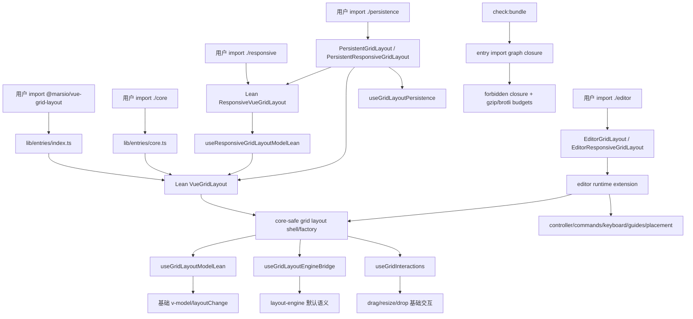

# Lean Core Bundle Boundary 技术设计

## 架构概述

本设计将 2.0 公共 API 调整为硬边界分层：root 等价 `./core`，`./responsive` 是 lean responsive，高级能力只从显式 subpath 进入。现有代码中的主要问题不是入口文件本身，而是 `VueGridLayout` 与 `ResponsiveVueGridLayout` 的实现路径静态 import 了 persistence、editor、keyboard、commands、history 和 dashboard-adjacent 类型或运行时。设计目标是让公共入口结构、组件实现结构、类型声明和本地 bundle gate 同时表达同一条边界。

设计采用四层架构：

1. Lean foundation 层：`lib/VueGridLayout.tsx`、`lib/ResponsiveVueGridLayout.tsx`、`lib/grid-layout/*` 和 `lib/responsive/*` 只保留基础布局、拖拽、缩放、drop、height runtime、responsive breakpoint/layout 同步和 layout-engine 默认语义。`layoutEngine` 仍是基础布局能力的一部分，第一轮不拆出 core 默认路径。
2. Internal extension 层：新增 editor-agnostic 的内部 runtime extension contract，使高级 wrapper 可以复用核心渲染与交互外壳，但该 contract 不 import `../editor`、`../persistence`、`../history` 或 dashboard 模块。lean `VueGridLayout` 使用 noop extension。
3. Advanced subpath 层：`@marsio/vue-grid-layout/editor` 导出 `EditorGridLayout`、`EditorResponsiveGridLayout` 和现有 controller/commands/keyboard/guides/placement API；`@marsio/vue-grid-layout/persistence` 导出 `PersistentGridLayout`、`PersistentResponsiveGridLayout` 和现有 adapter/composable/serializer API。高级 wrapper 静态依赖高级模块，root/core/responsive 不反向依赖它们。
4. Verification 层：`check:bundle` 从入口文本检查升级为 transitive closure 检查，输出 raw/gzip/brotli 报告，并对 root/core/responsive/persistence/layout-engine/history 执行 forbidden closure 与 gzip 预算。

需求覆盖：R1、R2、R3、R4、R5 由入口与组件分层满足；R6、R7 由 bundle closure gate 满足；R8 由 layout-engine 留在基础路径且以行为 smoke 保持；R9、R10、R11 由 exports/types/consumer/docs/examples 更新满足；R12 由非目标边界保证。

## 数据流图



关键数据流：

- Lean root/core：package entry -> lean grid -> lean model/interactions/layout-engine -> emits。该路径不得出现 editor/persistence/history/dashboard/Pinia。
- Lean responsive：responsive entry -> responsive model -> inner lean grid。该路径保留 breakpoint/layouts 生成与同步，但不创建 editor controller 或 persistence controller。
- Editor wrapper：editor entry -> wrapper -> internal extension -> editor runtime/controller -> internal grid shell。editor runtime 可以影响 item render、overlay、keyboard、placement 和 commit，但该影响只存在于 `./editor` closure。
- Persistence wrapper：persistence entry -> wrapper/composable -> controlled modelValue/layouts -> lean grid/responsive。持久化 load/external apply/autosave 由 wrapper 管理，不再由 lean model 内建。

## 组件与接口定义

### Public entries

- `lib/entries/index.ts`：改为 lean root，语义等价 `lib/entries/core.ts`。默认导出 `VueGridLayout`，命名导出只包含 `VueGridLayout`、`WidthProvider`、core utils、calculate utils、grid height runtime 和基础类型。不导出 `Responsive`、`ResponsiveVueGridLayout`、editor、persistence、dashboard、history 或 compat object。
- `lib/entries/core.ts`：继续作为显式 lean core entry，与 root 保持同等能力。
- `lib/entries/responsive.ts`：导出 lean `ResponsiveVueGridLayout`、responsive utils 与 lean responsive 类型，不导出 editor/persistence 相关类型。
- `lib/entries/editor.ts`：在现有 editor exports 基础上增加 `EditorGridLayout` 和 `EditorResponsiveGridLayout`。
- `lib/entries/persistence.ts`：在现有 persistence exports 基础上增加 `PersistentGridLayout` 和 `PersistentResponsiveGridLayout`。
- `lib/entries/history.ts`、`dashboard.ts`、`dashboard-editor-shell.ts`、`layout-engine.ts`、`worker.ts` 保持公开 subpath，但不得被 root/core/responsive 静态引用。

### Lean grid implementation

`VueGridLayout` 拆为内部 grid shell 与 lean public component：

- `lib/grid-layout/createGridLayoutComponent.tsx`：内部工厂，接收 props definition、component name、runtime extension factory。该文件只 import core-safe 模块。
- `lib/grid-layout/runtimeExtension.ts`：定义 editor-agnostic 的 `GridLayoutRuntimeExtension`，包括 `mount()`、`stop()`、`getItemRenderState()`、`decorateInteractions()`、`onRootPointerMove()`、`onRootClick()`、`renderOverlay()` 等可选钩子。类型只使用 `Layout`、`LayoutItem`、基础 interaction snapshot 和 Vue `VNode`。
- `lib/grid-layout/noopRuntimeExtension.ts`：lean component 使用的 noop 实现。
- `lib/VueGridLayout.tsx`：只组合 lean props、core shell、noop extension，不 import `GridEditorOverlay`、`useGridEditorRuntime`、`../editor`、`../persistence` 或 `../history`。

`useGridLayoutModel` 改为 lean model：

- 删除 `historyStore` 和 `persistence` prop 输入。
- 删除 `useGridLayoutPersistence`、`GridLayoutPersistenceProp`、`LayoutPersistenceEvent`、`GridHistoryStore` imports。
- 保留 layout synchronize、controlled `modelValue`、`layoutChange`、drag/resize/drop committed change detection。
- 输出 `onLayoutMaybeChanged` 只负责 emit，不负责 history push 或 persistence commit。

`useGridLayoutEngineBridge` 保留在 core 路径，但必须保持只依赖 `../layout-engine` 与基础 utils。`layoutEngine` prop 继续留在 lean grid，因为本轮不改变基础布局语义。

### Lean responsive implementation

`ResponsiveVueGridLayout` 和 `useResponsiveGridLayoutModel` 拆为 lean responsive：

- 删除 public `editor`、`persistence` props 和对应类型 imports。
- 删除 `createGridEditorController`、`useGridLayoutPersistence` 和 persistence load/commit/external apply 逻辑。
- 保留 breakpoint resolution、layouts map 同步、`update:layouts`、`layoutChange`、`breakpointChange`、`widthChange`。
- 保留 layout-engine generateResponsiveLayout 路径，继续通过 `layoutEngine` prop 控制 legacy/engine 模式。
- inner grid 只接收 lean grid props 和 `layoutEngine`，不再传 `editor={model.getInnerEditorProp()}`。

### Editor wrappers

`./editor` 新增两个薄 wrapper：

- `EditorGridLayout`：props = lean `VueGridLayout` props + `editor?: false | GridEditorProp` + optional `persistence?: GridLayoutPersistenceProp | GridLayoutPersistenceController<Layout>`。它创建或接收 `GridEditorController`，通过 editor runtime extension 接入 core shell。它负责 keyboard bind、guides overlay、item capability、selection class、placement、command commit/rollback 和 editor persistence bridge。
- `EditorResponsiveGridLayout`：props = lean responsive props + `editor?: false | GridEditorProp` + optional `persistence?: ResponsiveGridLayoutPersistenceProp | GridLayoutPersistenceController<LayoutsMap>`。它创建 responsive editor controller，并把 breakpoint/layouts 状态与 inner editor extension 同步。

Editor wrapper 的 API 遵循 Vue component contract-first 原则：

- props 只表达语义行为：`editor`、`persistence`、lean grid/responsive props。
- emits 沿用 lean grid/responsive emits，并补充已有 editor events 只通过 controller `onEvent` 或明确 emit 暴露，不新增大量视觉 props。
- slots 透传 default slot；overlay 和 editor CSS class 由 wrapper/runtime extension 管理。
- `$attrs` 只落到 grid root，不透传到 editor internals。
- expose 默认不暴露内部 controller；需要 controller 时通过 `editor.controller` 显式传入或使用 composable。

### Persistence wrappers

`./persistence` 新增两个薄 wrapper：

- `PersistentGridLayout`：props = lean `VueGridLayout` props + `persistence: GridLayoutPersistenceProp`。内部使用 `useGridLayoutPersistence<Layout>` 绑定受控 layout ref；load 成功后通过 `update:modelValue` 和 `layoutChange` 同步父级；committed layout change 后 commit/save；external apply 时更新 wrapper 状态并 emit 标准事件。
- `PersistentResponsiveGridLayout`：props = lean responsive props + `persistence: ResponsiveGridLayoutPersistenceProp`。内部绑定 `LayoutsMap`，load/external apply/autosave 针对全 breakpoint layouts map。

Persistence wrapper 不 import editor，也不提供 editor behavior。需要 editor + persistence 时使用 `EditorGridLayout` / `EditorResponsiveGridLayout` 的 optional persistence，或由用户显式组合 controller/composable。

## API 接口设计

### Root/core

```ts
import VueGridLayout, {
  VueGridLayout as NamedVueGridLayout,
  WidthProvider,
  utils,
  calculateUtils,
  gridHeight
} from "@marsio/vue-grid-layout";

import CoreGrid from "@marsio/vue-grid-layout/core";
```

root 与 `./core` 不再导出 `Responsive`。响应式用户必须改为：

```ts
import ResponsiveVueGridLayout from "@marsio/vue-grid-layout/responsive";
```

CJS root 仍可提供 lean convenience shape，但只挂载 core-safe 成员：

```js
const VGL = require("@marsio/vue-grid-layout");
// VGL === VGL.default === VGL.VueGridLayout
// 不存在 VGL.Responsive / VGL.persistence / VGL.editor / VGL.history
```

`scripts/build-package.mjs` 中的 root CJS wrapper 需要改为只复制 allowlist 成员，不能继续 `Object.keys(runtime)` 全量挂载。

### Removed lean props

从 lean `VueGridLayout` 移除：

- `editor`
- `persistence`
- `historyStore`

从 lean `ResponsiveVueGridLayout` 移除：

- `editor`
- `persistence`

`layoutEngine` 保留。`dragActivationDistance`、height mode、drop、drag/resize、layout calculation、responsive breakpoints 等基础 props 保留。

### Advanced wrappers

```ts
import {
  EditorGridLayout,
  EditorResponsiveGridLayout,
  createGridEditorController
} from "@marsio/vue-grid-layout/editor";

import {
  PersistentGridLayout,
  PersistentResponsiveGridLayout,
  localStorageAdapter,
  useGridLayoutPersistence
} from "@marsio/vue-grid-layout/persistence";
```

旧用法迁移：

```vue
<!-- 1.x -->
<VueGridLayout v-model="layout" :editor="editor" :persistence="persistence" />

<!-- 2.0 -->
<EditorGridLayout v-model="layout" :editor="editor" :persistence="persistence" />
```

```vue
<!-- 1.x -->
<ResponsiveVueGridLayout v-model:layouts="layouts" :persistence="persistence" />

<!-- 2.0 -->
<PersistentResponsiveGridLayout v-model:layouts="layouts" :persistence="persistence" />
```

### Bundle boundary checker

`scripts/check-bundle-boundary.mjs` 改为构建 import graph closure：

- 优先读取 Vite/Rollup manifest 或生成 bundle metadata；若当前 library build 没有 manifest，则在脚本内解析 dist `.mjs` 的 static import/export specifiers，递归收集相对 chunk。
- 每个 public entry 产生 `BundleClosureReport`：entry、files、rawBytes、gzipBytes、brotliBytes、forbiddenHits。
- forbidden hits 包含模块名、文件路径、匹配 token、来源 entry。
- `--analyze` 输出所有报告；默认模式对 hard budget 和 forbidden closure 失败。

初始预算：

| Entry | gzip budget |
| --- | ---: |
| `index.mjs` | 65 KB |
| `core.mjs` | 65 KB |
| `responsive.mjs` | 80 KB |
| `persistence.mjs` | 64 KB |
| `layout-engine.mjs` | 30 KB |
| `history.mjs` | 8 KB |

Forbidden closure policy：

- root/core/responsive 禁止 editor、keyboard、commands、persistence、dashboard、dashboard-editor-shell、history、Pinia、MCP、Node-only、webpack-only。
- persistence 禁止 editor、dashboard-editor-shell、history、Pinia、MCP、Node-only、webpack-only。
- layout-engine 禁止 editor、persistence、dashboard、history、Pinia、MCP、Node-only、webpack-only。
- history 是唯一允许静态引入 Pinia 的 public entry。

Persistence budget rationale：初始 16 KB 预算只覆盖 serializer/adapter/composable 纯持久化 runtime。实现 R5 后，`./persistence` 直接暴露 `PersistentGridLayout` 与 `PersistentResponsiveGridLayout`，因此 closure 必然包含 lean grid/responsive 基础运行时；本轮将 hard budget 调整为 64 KB gzip，仍禁止 editor/dashboard/history/Pinia 回流。

## 数据模型与数据库变更

本规格不引入数据库，也不改变 layout item、responsive layouts、dashboard document 或 persistence document schema。

新增/调整的内部数据模型仅用于构建检查和运行时 extension：

```ts
type GridLayoutRuntimeExtension = {
  mount?: () => void;
  stop?: () => void;
  getItemRenderState?: (item: LayoutItem, defaults: GridItemDefaults, isDropping?: boolean) => GridItemRenderState;
  decorateInteractions?: (input: GridInteractionRuntimeInput) => GridInteractionRuntimeHooks;
  onRootPointerMove?: (event: MouseEvent | PointerEvent) => void;
  onRootClick?: (event: MouseEvent) => void;
  renderOverlay?: (input: GridOverlayRenderInput) => VNode | null;
};

type BundleClosureReport = {
  entry: string;
  files: string[];
  rawBytes: number;
  gzipBytes: number;
  brotliBytes: number;
  forbiddenHits: Array<{
    file: string;
    token: string;
    reason: string;
  }>;
};
```

Package metadata changes：

- `package.json.exports["."]` 继续指向 `dist/index.*`，但产物语义改为 lean core。
- `package.json.exports["./responsive"]` 指向 lean responsive。
- 不新增 `./compat`。
- `dist/types/index.d.ts` 和 `dist/types/core.d.ts` 指向 lean core 类型。
- `dist/types/responsive.d.ts` 指向 lean responsive 类型。

## 安全考量

- Root/core/responsive 不应引入 Node-only、MCP-only 或 webpack-only 代码，避免 browser bundler 消费时暴露不必要的环境能力或构建失败。
- Sourcemap 仍不得进入 published artifact；bundle checker 对 `.map` 与 source map reference 保持失败策略。
- Persistence wrappers 只复用既有 adapter/composable 安全策略，不新增网络默认行为，不改变反序列化、校验和 fallback 语义。
- Editor wrappers 不把 hidden/locked/editor metadata 当作安全边界；相关说明继续留在 editor/dashboard 文档中。
- CJS root wrapper 必须使用 allowlist 挂载 lean 成员，避免因为 runtime namespace 变化意外暴露高级模块。
- MCP examples/data 只引用 package exports 中声明的入口，避免 AI 工具继续推荐私有 deep import 或旧 root 聚合用法。

## 测试策略

本设计不要求 CI 接入，但本地验证必须覆盖以下命令和场景：

- 构建与包检查：`npm run build`、`npm run check:package`、`npm run check:bundle`、`npm run test:package`。
- 单元与浏览器：`npm test`、`npm run test:browser`，并保留基础 drag/resize/drop、height runtime、responsive breakpoint、layout-engine worker 的现有行为覆盖。
- Bundle gate：`npm run check:bundle -- --analyze` 或等价 analyze 输出 root/core/responsive/persistence/layout-engine/history 的 raw/gzip/brotli；默认 `npm run check:bundle` 对 forbidden closure 和 gzip budget hard fail。
- Consumer matrix：更新 `scripts/test-package-consumers.mjs`，覆盖 ESM root/core/responsive、CJS root/core/responsive、TypeScript root/core/responsive、advanced subpath、no-Pinia consumer、Pinia history consumer、Vite browser consumer。
- Type negative coverage：新增或更新 TypeScript consumer，确保 lean `VueGridLayout` 不接受 `editor`、`persistence`、`historyStore`，lean `ResponsiveVueGridLayout` 不接受 `editor`、`persistence`。
- Advanced wrapper coverage：为 `EditorGridLayout`、`EditorResponsiveGridLayout`、`PersistentGridLayout`、`PersistentResponsiveGridLayout` 添加 browser/component smoke，验证旧高级行为通过显式 subpath 保持可用。
- Docs/examples：更新 README、MCP docs/data、example imports；运行 `npm run test:examples` 和 `npm run build-docs`。示例导航必须保持 `/` examples list 与 `/example/index.html` 旧链接行为。
- Regression guard：root/core/responsive closure 中出现 `editor`、`keyboard`、`commands`、`persistence`、`dashboard`、`history`、`pinia`、`mcp/server`、`node:fs`、`node:path`、`webpack` 等 token 时，检查失败并输出具体文件链路。
