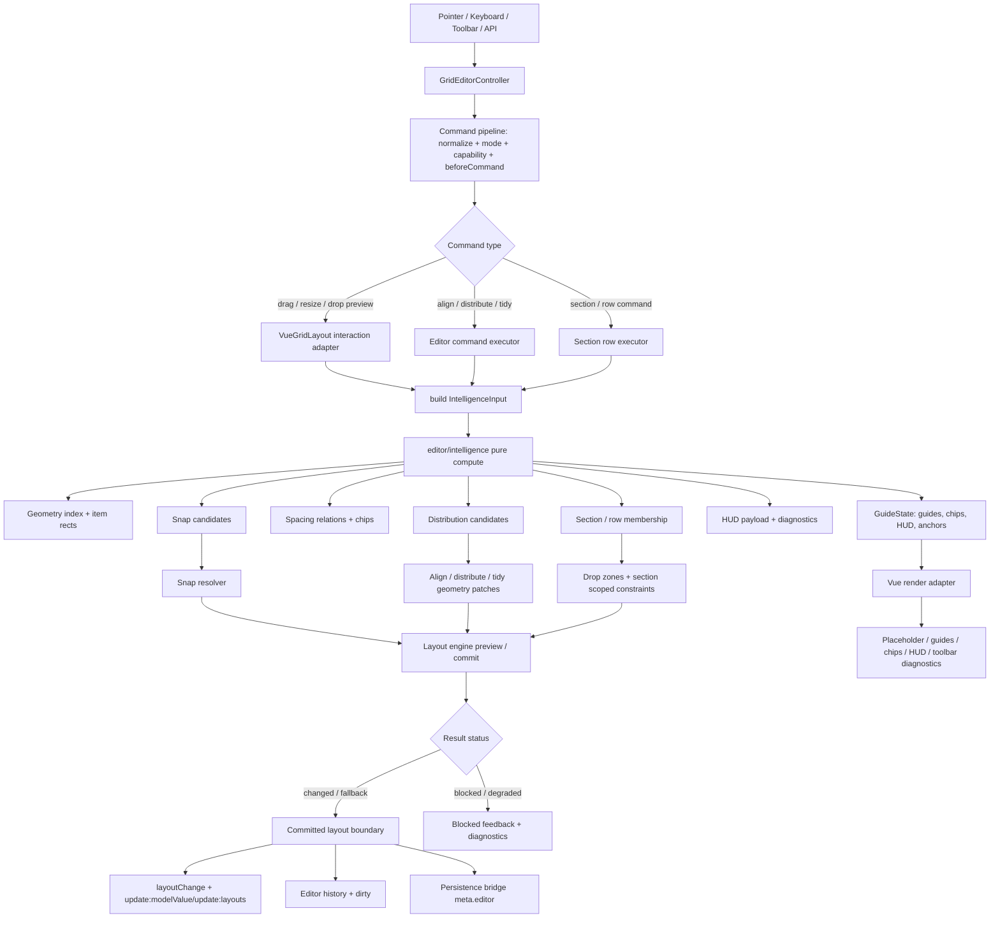

# 专业仪表盘编辑器 L3 智能编排技术设计

## 架构概述

L3 智能编排在现有 professional editor 之上新增一个纯函数 `editor/intelligence` 层，并把当前分散在 guides、Vue 渲染适配、command pipeline 和示例 UI 中的几何语义收敛到同一份数据模型。现有 `editor/controller` 继续负责 mode、selection、command、history、persistence 和事件；现有 layout engine 继续负责碰撞、fit、preview/commit 和调度；`VueGridLayout` 只消费 intelligence 输出并渲染 placeholder、guides、chips、HUD 和 anchor edges。

当前代码证据显示：

- `GridEditorCommandType` 只包含 select/move/resize/delete 等基础命令，尚无 align/distribute/tidy，见 `lib/editor/types.ts:104`。
- command pipeline 已有 normalize、mode/capability check、`beforeCommand` guard、history/persistence 分流，适合扩展新命令，见 `lib/editor/commands.ts:49`、`lib/editor/controller.ts:734`。
- guides 已有 `computeGridEditorGuides()`、spacing chips、measurement HUD 和 `snapItemToGuides()`，但 snap resolver 尚未接入 drag/resize/drop preview/commit，见 `lib/editor/guides.ts:515`、`lib/editor/guides.ts:658`、`lib/VueGridLayout.tsx:1230`。
- `VueGridLayout` 目前由 `updateEditorGuides()` 直接调用 guides 计算并渲染 DOM，edge/center 像素换算都使用 `xPx/yPx`，存在继续膨胀和坐标语义混杂风险，见 `lib/VueGridLayout.tsx:238`、`lib/VueGridLayout.tsx:1860`、`lib/VueGridLayout.tsx:1869`。
- layout engine 已有 preview/commit、`LayoutOperationResult`、diagnostics 和 row/column occupancy index，可作为 intelligence 复用的碰撞/fit 底座，见 `lib/layout-engine/types.ts:12`、`lib/layout-engine/types.ts:106`、`lib/layout-engine/indexing.ts:38`。

推荐模块结构：

```text
lib/editor/
├── intelligence.ts          # 纯函数：几何语义、snap、spacing、distribution、section/row
├── intelligenceTypes.ts     # 可选：若 types.ts 过大，可拆出内部/公开 intelligence 类型
├── guides.ts                # 保留公开 guides API，改为消费 intelligence state
├── commands.ts              # 扩展 align/distribute/tidy/section command 分类与校验
├── controller.ts            # 调用 command executor，汇总 result/diagnostics/history
├── toolbar.ts               # 可选 headless toolbar state，不渲染 UI
└── sectionRows.ts           # 可选：section/row metadata 归一化与迁移
```

边界原则：

- `editor/intelligence` 不访问 DOM，不写 Vue ref，不调用 persistence，不发事件。
- `editor/commands` 可以调用 intelligence 计算目标 geometry，但必须通过现有 command pipeline、capability、`beforeCommand`、history 和 persistence 边界提交。
- `VueGridLayout` 不拥有 align/distribute/tidy 算法；它只做交互坐标采集、preview scheduling、DOM 渲染和事件转发。
- `layout-engine` 不理解 editor toolbar 或视觉 guides；必要时只扩展通用 operation 或提供 index/collision 能力。
- 示例工具栏只消费 headless API，不成为核心包强依赖。

## 数据流图



Preview/commit 顺序：

1. 交互开始时保存 interaction start geometry。
2. 每次 preview tick 构造 `GridEditorIntelligenceInput`。
3. intelligence 输出 snap/distribution/section candidates。
4. snap resolver 或 command executor 生成 candidate geometry。
5. candidate geometry 进入 layout engine preview 校验 collision/bounds/maxRows。
6. preview result 更新 placeholder、guides、HUD、blocked state，不写 history/persistence。
7. stop/commit 使用同一 resolver 输入重新计算或复用最后有效 snapped geometry，保证视觉与落点一致。
8. committed result 才写 layout、history、dirty、persistence 和 command result。

## 组件与接口定义

### Intelligence 输入输出

```ts
export type GridEditorIntelligenceInteraction =
  | "drag"
  | "resize"
  | "drop"
  | "keyboard"
  | "toolbar"
  | "api";

export type GridEditorIntelligenceInput = {
  layout: Layout;
  activeItem?: LayoutItem | null;
  candidateItem?: LayoutItem | null;
  selectionIds?: string[];
  metaById?: GridEditorMetaById;
  sectionRows?: GridEditorSectionRowState;
  cols: number;
  maxRows: number;
  compactType: CompactType;
  allowOverlap?: boolean;
  preventCollision?: boolean;
  interaction: GridEditorIntelligenceInteraction;
  startGeometry?: Record<string, Pick<LayoutItem, "x" | "y" | "w" | "h">>;
  options?: GridEditorIntelligenceOptions;
};

export type GridEditorIntelligenceState = {
  itemRects: Record<string, GridEditorItemRect>;
  neighbors: GridEditorNeighborRelation[];
  snapCandidates: GridEditorSnapCandidate[];
  spacingRelations: GridEditorSpacingRelation[];
  distributionCandidates: GridEditorDistributionCandidate[];
  sectionRows: GridEditorResolvedSectionRowState;
  guideState: GridEditorGuideState;
  measurementHud?: GridEditorMeasurementHud | null;
  diagnostics: GridEditorIntelligenceDiagnostics;
};
```

`GridEditorGuideState` 保持现有公开 API，但其 guides/chips/HUD/anchorEdges 由 intelligence state 派生，避免 `guides.ts` 与 align/distribute 各自重复计算。

### Snap Candidate

```ts
export type GridEditorSnapCandidate = {
  id: string;
  kind: "edge" | "center" | "spacing" | "section-row";
  axis: "x" | "y";
  sourceIds: string[];
  targetId: string;
  targetEdge: GridEditorGuideEdgeSide;
  sourceEdge?: GridEditorGuideEdgeSide;
  distance: number;
  proximity: number;
  priority: number;
  snapped: boolean;
  geometry: Pick<LayoutItem, "x" | "y" | "w" | "h">;
  guideIds: string[];
  blocked?: GridEditorBlockedReason;
};
```

Snap resolver 只选择 candidate，不直接改 layout。drag/resize/drop adapter 将选中的 `geometry` 送入 layout engine preview/commit。

### Align / Distribute Payload

```ts
export type GridEditorAlignMode =
  | "left"
  | "center-x"
  | "right"
  | "top"
  | "center-y"
  | "bottom";

export type GridEditorAlignTarget =
  | { type: "selection-bounds" }
  | { type: "active-item"; id?: string }
  | { type: "last-selected" }
  | { type: "section-row"; id: string }
  | { type: "explicit-line"; axis: "x" | "y"; position: number };

export type GridEditorAlignPayload = {
  mode: GridEditorAlignMode;
  target?: GridEditorAlignTarget;
  collisionStrategy?: "block" | "push" | "skip-blocked";
};

export type GridEditorDistributeMode =
  | "horizontal"
  | "vertical"
  | "spacing-x"
  | "spacing-y";

export type GridEditorDistributePayload = {
  mode: GridEditorDistributeMode;
  strategy?: "edge-to-edge" | "center-to-center";
  bounds?: "selection" | "section-row" | "explicit";
  explicitBounds?: { start: number; end: number };
  collisionStrategy?: "block" | "push" | "skip-blocked";
};

export type GridEditorTidyPayload = {
  axis?: "x" | "y" | "both";
  scope?: "selection" | "section-row" | "layout";
  minSpacing?: number;
  strategy?: "edge-to-edge" | "center-to-center";
};
```

`GridEditorCommandType` 扩展为包含 `"align" | "distribute" | "tidy"`。这些命令归类为 layout command，参与 history、dirty、persistence 和 `beforeCommand`。

### Toolbar State

```ts
export type GridEditorCommandAvailability = {
  command: GridEditorCommandType;
  enabled: boolean;
  reason?: GridEditorBlockedReason | "selection-count" | "unsupported-scope";
  requiredSelectionCount?: number;
  blockedIds?: string[];
  messageKey?: string;
};

export type GridEditorToolbarState = {
  commands: Record<string, GridEditorCommandAvailability>;
  selectionSummary: {
    count: number;
    movableCount: number;
    lockedCount: number;
    sectionRowIds: string[];
  };
  intelligenceSummary?: {
    equalSpacing?: boolean;
    distributionMode?: GridEditorDistributeMode;
    snapCandidateCount: number;
    degraded?: boolean;
  };
};
```

`canExecute()` 继续返回 command result；新增 `getToolbarState()` 或 `deriveGridEditorToolbarState(controller)` 可作为 headless helper。若避免扩展 controller，可以先导出纯函数 helper。

### Section / Row Model

```ts
export type GridEditorSectionRowKind = "section" | "row";

export type GridEditorSectionRow = {
  id: string;
  kind: GridEditorSectionRowKind;
  label?: string;
  parentId?: string;
  order: number;
  bounds?: { x: number; y: number; w: number; h: number };
  collapsed?: boolean;
  locked?: boolean;
  itemIds?: string[];
  dropPolicy?: "inside" | "between" | "none";
  crossScopePolicy?: "allow" | "block" | "ask";
};

export type GridEditorSectionRowState = {
  version: 1;
  items: Record<string, GridEditorSectionRow>;
  itemMembership: Record<string, { sectionId?: string; rowId?: string }>;
};
```

该模型保存在 editor sidecar envelope，不改变 flat layout 默认行为。没有 metadata 时，所有 intelligence 计算按现有 flat grid 运行。

## API 接口设计

### 新增导出

- `computeGridEditorIntelligence(input): GridEditorIntelligenceState`
- `resolveGridEditorSnap(state, candidate, options): GridEditorSnapResolution`
- `computeGridEditorDistribution(input): GridEditorDistributionCandidate[]`
- `applyGridEditorAlign(layout, payload, context): GridEditorGeometryPatchResult`
- `applyGridEditorDistribute(layout, payload, context): GridEditorGeometryPatchResult`
- `deriveGridEditorToolbarState(controllerOrState, options): GridEditorToolbarState`
- `normalizeGridEditorSectionRows(input, layout): GridEditorSectionRowState`

这些 API 都应从 `lib/editor/index.ts` 导出，并同步 `lib/cjs.ts` 和 `typings/index.d.ts`。

### Command 扩展

`commands.ts` 修改点：

- `isLayoutCommand()` 增加 `align`、`distribute`、`tidy`。
- `commandCapabilityKey()` 对 align/distribute/tidy 使用 `draggable` 或新增 `movable` 语义。
- `checkGridEditorCommand()` 增加 selection count 校验：align 至少 2，distribute/tidy 至少 3。
- blocked reason 增加 `selection-count` 可以作为 message code；若不扩展 union，则放入 diagnostics messages，blocked reason 使用 `invalid-input`。
- `createGridEditorCommandResult()` diagnostics 增加 `intelligence` 字段，包含 snap/distribution/section-row summary。

`controller.ts` 修改点：

- `executeMutation()` 增加 align/distribute/tidy 分支。
- 每个分支先调用 intelligence 计算 patches，再通过 layout engine 或现有 `moveElement`/operation executor 校验。
- 成功后进入 `commitHistory()`，失败返回 blocked/error 且不改 committed layout。

### VueGridLayout 适配

`VueGridLayout.tsx` 修改点：

- `getEditorGuideOptions()` 扩展为 `getEditorIntelligenceOptions()`，自动注入 delta、blocked、startGeometry、sectionRows。
- `updateEditorGuides()` 改为 `updateEditorIntelligence()`，先计算 intelligence，再设置 `editorController.guides.value`。
- drag/resize/drop preview 在 layout engine preview 前先调用 snap resolver，得到 snapped x/y/w/h，再送入 preview。
- stop/commit 使用最后一次有效 snap resolution 或重新计算同输入，防止 preview/commit 不一致。
- `editorGeometry()` 拆出 `gridLinePx` 与 `itemEdgePx`，避免 edge/center 共用半 gutter 公式。

### 事件

新增或扩展事件：

```ts
type GridEditorEvent =
  | ExistingEvents
  | {
      type: "intelligence-change";
      activeId: string | null;
      diagnostics: GridEditorIntelligenceDiagnostics;
    }
  | {
      type: "snap-change";
      activeId: string;
      previousGuideId?: string;
      nextGuideId?: string;
      geometry: Pick<LayoutItem, "x" | "y" | "w" | "h">;
    }
  | {
      type: "toolbar-state-change";
      state: GridEditorToolbarState;
    };
```

如果事件数量需要控制，`intelligence-change` 可先只作为 `guide-change` diagnostics 扩展，`snap-change` 保留用于真实吸附调试。

## 数据模型与数据库变更

没有数据库变更。所有新增持久化状态仍通过现有 persistence document 的 `meta.editor` sidecar 保存。

### Editor Envelope 扩展

```ts
type GridEditorPersistenceEnvelopeV2 = {
  version: 2;
  editorMetaById: GridEditorMetaById;
  sectionRows?: GridEditorSectionRowState;
  toolbar?: {
    lastUsedAlign?: GridEditorAlignMode;
    lastUsedDistribute?: GridEditorDistributeMode;
  };
  updatedAt: string;
};
```

迁移策略：

- v1 envelope 只有 `editorMetaById` 时，读取为 `{ version: 2, editorMetaById, sectionRows: undefined }`。
- 未知 version 默认忽略新增 sectionRows，不丢弃 layout；返回 warning diagnostics。
- section/row metadata 只表达编辑结构，不保存敏感权限。真实权限继续由业务服务端或 `beforeCommand` guard 负责。

### Geometry Patch

align/distribute/tidy 产生的 geometry patch 复用 layout engine `LayoutPatch` 的 move/resize 语义。若一次命令移动多个 item，result 包含多个 move patch，并用同一 history entry 合并。

### Diagnostics

```ts
export type GridEditorIntelligenceDiagnostics = {
  durationMs: number;
  itemCount: number;
  selectedCount: number;
  snapCandidateCount: number;
  distributionCandidateCount: number;
  sectionRowCount: number;
  degraded?: boolean;
  reason?: "max-items" | "max-duration" | "collision" | "bounds" | "section-row-policy";
  codes: string[];
};
```

diagnostics 使用稳定 code，方便测试、示例 UI 和用户埋点。

## 安全考量

- 新增 section/row metadata 与 toolbar preference 不可作为权限边界；locked/collapsed 只是客户端 UX 约束。
- `beforeCommand` guard 仍是接入业务权限的推荐入口；align/distribute/tidy 必须走同一 guard，不能绕过 capability。
- 所有 sidecar metadata 读取都必须复用现有 sanitize/validate 模式，避免原型污染和非法 JSON shape。
- SSR 路径不得访问 DOM、clipboard、window、document、rAF；intelligence 计算保持纯函数。
- Clipboard、persistence、remote save 的安全边界不改变；L3 不新增外部网络请求。
- command payload 是外部输入，运行时必须校验 axis、mode、ids、bounds、spacing 等字段；类型报错不能替代运行时防御。
- section/row unknown version 不得导致 layout 丢失，最多禁用结构化智能并返回 diagnostics warning。

## 测试策略

### 单元测试

在 `test/editor-core.test.ts` 或新增 `test/editor-intelligence.test.ts` 中覆盖：

- `computeGridEditorIntelligence()` 对相同输入输出稳定排序和稳定 ids。
- snap resolver 对 drag/resize/drop 输出 geometry，并验证 `snap: false` 不改 geometry。
- align command：left/center/right/top/middle/bottom，2 item 成功，selection count 不足 blocked。
- distribute command：3+ item horizontal/vertical，edge-to-edge 与 center-to-center 不混用。
- tidy command：按 row/section 分组，不跨语义区域混排。
- mixed locked/static/hidden item 在 all-or-nothing 与 skip-blocked 下的 result。
- sectionRows：无 metadata flat grid 兼容、locked/collapsed blocked、unknown version warning。
- HUD delta：drag 自动 Δx/Δy，resize 自动 Δw/Δh，blocked reason 自动接线。
- diagnostics：candidate count、durationMs、degraded reason、stable code。

### 浏览器集成测试

扩展 `test/editor-component-browser.test.js`：

- drag preview 命中 guide 后，placeholder 坐标和 drag stop layout 坐标一致。
- resize preview 命中 guide 后，placeholder 尺寸和 resize stop layout 尺寸一致。
- external drop 在 section/row zone 显示 high-contrast placeholder。
- `snap: false` 时 predictive guide 可以显示，但无 snapped class、无 geometry 修改。
- toolbar align/distribute/tidy 按钮 disabled reason 与 command result 一致。
- view mode 下 placeholder/guides/chips/HUD/toolbar active state 清空。
- reduced-motion 下不依赖动画完成断言。
- guide edge/center 像素位置在 margin/gutter 下分别断言。

### 性能与发布门槛

- 500+ item intelligence 计算纳入性能预算，超预算必须产生 degraded diagnostics。
- `npm run test:editor` 必须通过。
- 发布前运行 lint、typecheck、build、核心测试、浏览器 smoke 和 professional dashboard example smoke。
- README 必须列出仍未实现或受限能力，例如 group resize、system clipboard 权限、section/row 只作为客户端编辑语义。

### 追溯矩阵

- R1/R11 由 `editor/intelligence` 模块、diagnostics 和模块边界测试覆盖。
- R2/R7/R8 由 drag/resize/drop preview、snap resolver、HUD delta 和浏览器视觉测试覆盖。
- R3/R4/R5 由 command pipeline、toolbar state、align/distribute/tidy 单元测试覆盖。
- R6/R9 由 section/row metadata、persistence envelope、typings/README 校验覆盖。
- R10 由 CI 命令、测试矩阵和 tasks 分解覆盖。
