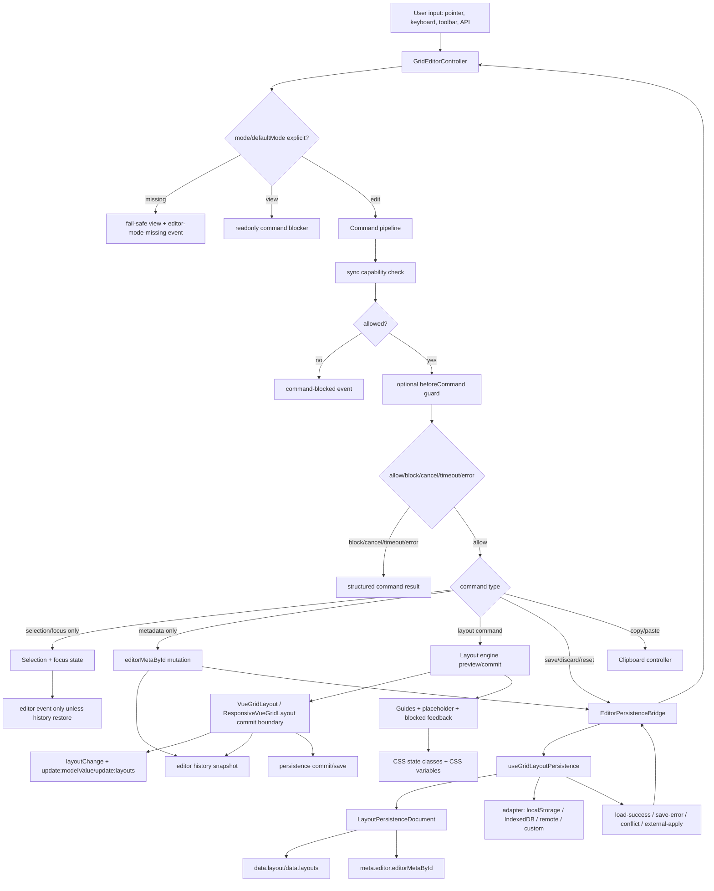

# 专业仪表盘编辑器 UX 技术设计

## 架构概述

本设计在现有 `VueGridLayout`、`ResponsiveVueGridLayout`、layout engine、persistence 和 history 能力之上增加一个 headless-first editor 层。核心原则是：编辑器负责 mode、selection、command、keyboard、clipboard、guides、editor metadata、focus 和 UX 事件；现有 layout engine 继续负责布局计算；现有 persistence 继续负责 durable I/O；现有组件提交边界继续负责 `layoutChange`、`update:modelValue` / `update:layouts`、history 与 persistence commit。

现有代码已经具备这些可复用边界：

- `VueGridLayout` 通过 `onLayoutMaybeChanged()` 在 committed layout 变化后统一同步 history、emit 和 persistence commit，见 `lib/VueGridLayout.tsx:366` 到 `lib/VueGridLayout.tsx:379`。
- `VueGridLayout` 已经接入 `useGridLayoutPersistence({ watchTarget: false })`，避免 preview 中间态写入 durable storage，见 `lib/VueGridLayout.tsx:170` 到 `lib/VueGridLayout.tsx:177`。
- layout engine 已经定义 `LayoutOperationResult`、`LayoutPatch`、`blocked`、`diagnostics`、scheduler、executor 和 interaction controller，见 `lib/layout-engine/types.ts:40` 到 `lib/layout-engine/types.ts:129`、`lib/layout-engine/types.ts:295` 到 `lib/layout-engine/types.ts:337`。
- persistence document 已经支持 `meta` 字段、adapter timeout、dirty、conflict 和事件，见 `lib/persistence.ts:22` 到 `lib/persistence.ts:41`、`lib/persistence.ts:1499` 到 `lib/persistence.ts:1797`。
- CSS 已经有 placeholder、dragging、resizing、blocked 和 resize handle 的变量化基础，见 `css/styles.css:37` 到 `css/styles.css:56`、`css/styles.css:100` 到 `css/styles.css:116`。

新增模块建议如下：

```text
lib/editor/
├── index.ts
├── types.ts
├── controller.ts
├── commands.ts
├── selection.ts
├── metadata.ts
├── clipboard.ts
├── keyboard.ts
├── guides.ts
├── persistenceBridge.ts
├── history.ts
└── vueAdapter.ts
```

职责边界：

- `types.ts`: 公开 editor 相关类型，不依赖 DOM。包含 mode、state、commands、selection、metadata、clipboard、guides、events、history snapshot。
- `controller.ts`: headless editor controller，管理状态机、命令管线、selection、metadata、dirty、focus 目标和事件分发。
- `commands.ts`: 命令执行管线。先执行同步 capability 校验，再执行可选异步 `beforeCommand` guard，最后将 layout 相关命令委托给 layout engine 或组件提交边界。
- `selection.ts`: 单选/多选、anchor/active、受控 selection request、无效 selection 清理。
- `metadata.ts`: sidecar `editorMetaById` 归一化、能力解析、hidden/locked/editable/deletable 等语义。
- `clipboard.ts`: 默认内部剪贴板和可选 Clipboard API adapter。Clipboard API 失败时返回结构化错误或降级内部剪贴板。
- `keyboard.ts`: 快捷键绑定、ignored target 判断、连续键盘 move/resize history 合并。
- `guides.ts`: alignment guides 和 snap candidates 的纯计算，不访问 DOM。
- `persistenceBridge.ts`: 将 sidecar `editorMetaById` 注入同一个 persistence document 的 `meta.editor`，并从 `load-success`、`external-apply`、`conflict` 事件恢复 metadata。
- `history.ts`: editor 专用 history snapshot，覆盖 layout、responsive layouts、`editorMetaById`、selection 和 focus。现有 `historyStore` 保持兼容，但不承担 editor metadata 的完整撤销。
- `vueAdapter.ts`: `useGridEditor()` Vue composable 和组件 prop/event 适配。

本设计不引入数据库变更，不引入默认 UI 依赖，不引入新的拖拽底层库，不重写 `lib/persistence.ts` 的 adapter I/O 机制，不改变未启用 editor 时的默认组件行为。

## 数据流图



事件顺序原则：

1. 输入触发 `command-start`。
2. 同步 capability 与可选 `beforeCommand` guard 决定是否继续。
3. preview 阶段只更新 placeholder、guides、blocked、selection/focus 等 transient state。
4. commit 阶段才产生 layout mutation、metadata mutation 或 persistence action。
5. layout mutation 继续通过组件现有提交边界发出 `layoutChange` 与 `update:modelValue` / `update:layouts`。
6. editor history 和 persistence 只在 committed command 边界更新。
7. save/discard/reset/conflict 事件由 persistence bridge 映射成 editor state event。

## 组件与接口定义

### 核心类型

```ts
export type GridEditorMode = 'view' | 'edit'

export type GridEditorDerivedState =
  | 'viewing'
  | 'editingClean'
  | 'editingDirty'
  | 'dragging'
  | 'resizing'
  | 'keyboardEditing'
  | 'savePending'
  | 'saveFailed'
  | 'conflict'

export type GridEditorSelectionMode = 'single' | 'multiple'

export type GridEditorSelectionState = {
  selectedIds: string[]
  activeId: string | null
  anchorId: string | null
  mode: GridEditorSelectionMode
  source: 'pointer' | 'keyboard' | 'api' | 'history' | 'external'
}

export type GridEditorItemMeta = {
  locked?: boolean
  visible?: boolean
  editable?: boolean
  draggable?: boolean
  resizable?: boolean
  deletable?: boolean
  duplicatable?: boolean
  copyable?: boolean
  label?: string
  data?: Record<string, unknown>
}

export type GridEditorMetaById = Record<string, GridEditorItemMeta>
```

`GridEditorItemMeta` 是 sidecar metadata，不默认写入 `LayoutItem`。现有 `LayoutItem.static`、`isDraggable`、`isResizable`、`resizeHandles` 等字段继续由 layout 层识别；editor 会在 capability 解析时合并 layout 字段和 sidecar metadata。

### 命令模型

```ts
export type GridEditorCommandType =
  | 'select'
  | 'clearSelection'
  | 'move'
  | 'resize'
  | 'add'
  | 'delete'
  | 'duplicate'
  | 'copy'
  | 'paste'
  | 'lock'
  | 'unlock'
  | 'show'
  | 'hide'
  | 'save'
  | 'discard'
  | 'reset'
  | 'undo'
  | 'redo'

export type GridEditorCommand = {
  id?: string
  type: GridEditorCommandType
  targetIds?: string[]
  payload?: unknown
  source?: 'pointer' | 'keyboard' | 'toolbar' | 'context-menu' | 'api' | 'persistence'
  history?: {
    mergeKey?: string
    mergeWindowMs?: number
    skip?: boolean
  }
}

export type GridEditorCommandStatus =
  | 'changed'
  | 'noop'
  | 'blocked'
  | 'cancelled'
  | 'timeout'
  | 'error'

export type GridEditorBlockedReason =
  | 'mode-readonly'
  | 'editor-mode-missing'
  | 'capability'
  | 'locked'
  | 'hidden'
  | 'static-item'
  | 'collision'
  | 'bounds'
  | 'maxRows'
  | 'missing-item'
  | 'clipboard-unavailable'
  | 'clipboard-permission'
  | 'before-command-blocked'
  | 'before-command-timeout'
  | 'multi-resize-unsupported'
  | 'persistence-error'
  | 'conflict'
  | 'invalid-input'

export type GridEditorCommandResult = {
  id: string
  type: GridEditorCommandType
  status: GridEditorCommandStatus
  targetIds: string[]
  layoutPatches: LayoutPatch[]
  metadataPatches: GridEditorMetadataPatch[]
  affectedIds: string[]
  selection?: GridEditorSelectionState
  blocked?: {
    reason: GridEditorBlockedReason
    itemIds?: string[]
    message?: string
  }
  diagnostics?: {
    durationMs: number
    guardMs?: number
    guideCount?: number
    layoutDiagnostics?: LayoutDiagnostics
  }
  undo?: GridEditorHistoryEntry
  error?: {
    message: string
    cause?: unknown
  }
}
```

命令管线：

1. `normalizeCommand()` 生成稳定 command id。
2. `resolveTargets()` 将缺省 target 映射为当前 selection。
3. `checkMode()` 处理 `view`、漏配 mode 和受控 mode。
4. `checkCapabilities()` 合并 `LayoutItem` 字段、`editorMetaById` 和全局 editor options。
5. `beforeCommand` guard 可选异步执行，支持 `allow`、`block`、`cancel`、`timeout`、`error`。
6. 根据命令类型进入 selection、metadata、layout engine、clipboard 或 persistence bridge。
7. 生成 result、事件和 history entry。

### Editor Controller

```ts
export type GridEditorController = {
  mode: Ref<GridEditorMode>
  state: ComputedRef<GridEditorDerivedState>
  selection: Ref<GridEditorSelectionState>
  editorMetaById: Ref<GridEditorMetaById>
  dirty: ComputedRef<boolean>
  conflict: Ref<GridEditorConflict | null>
  guides: Ref<GridEditorGuideState>
  lastResult: Ref<GridEditorCommandResult | null>
  execute: (command: GridEditorCommand) => Promise<GridEditorCommandResult>
  canExecute: (command: GridEditorCommand) => GridEditorCommandResult
  undo: () => Promise<GridEditorCommandResult>
  redo: () => Promise<GridEditorCommandResult>
  save: () => Promise<GridEditorCommandResult>
  discard: () => Promise<GridEditorCommandResult>
  reset: () => Promise<GridEditorCommandResult>
  setExternalLayout: (layout: Layout, reason?: string) => void
  setExternalLayouts: (layouts: Record<string, Layout>, breakpoint: string, reason?: string) => void
  stop: () => void
}
```

`canExecute()` 只执行同步校验，不调用异步 `beforeCommand`，用于 toolbar disabled state。真正执行仍以 `execute()` 的 command result 为准。

### Persistence Bridge

`EditorPersistenceBridge` 不重写 adapter，不直接读写 storage。它包在现有 `useGridLayoutPersistence()` 事件与 `meta` option 之上：

```ts
type GridEditorPersistenceEnvelope = {
  version: 1
  editorMetaById: GridEditorMetaById
  updatedAt: string
}

type GridEditorPersistenceBridge = {
  meta: () => LayoutPersistenceMeta
  onPersistenceEvent: (event: LayoutPersistenceEvent<Layout | LayoutsMap>) => void
  save: () => Promise<GridEditorCommandResult>
  discard: () => GridEditorCommandResult
  reset: () => GridEditorCommandResult
}
```

保存时：

- `serializeLayoutDocument()` 仍保存 `data.layout` 或 `data.layouts`。
- bridge 通过 `meta()` 注入 `{ editor: GridEditorPersistenceEnvelope }`。
- adapter 保存同一个 `LayoutPersistenceDocument`，因此 layout 和 `editorMetaById` 原子保存。

恢复时：

- bridge 从 `load-success`、`external-apply`、`conflict.externalDocument` 中读取 `document.meta.editor`。
- 如果 `meta.editor` 缺失，按空 metadata 处理。
- 如果 `meta.editor` 结构非法，load 结果进入 editor error；不能让 layout 恢复成功但 metadata 静默损坏。

dirty 判断：

- persistence controller 继续负责 layout dirty 与 durable I/O。
- editor controller 维护 composite snapshot：`{ layoutOrLayouts, editorMetaById }`。
- metadata-only 命令不触发 `layoutChange`，但会让 editor dirty 变为 true，并在 save command 时调用 persistence controller `save()`，由 `meta()` 把 metadata 写入同一文档。
- save 成功后，editor composite last-saved snapshot 与 persistence `lastSavedAt` 同步更新。

### Editor History

现有 `historyStore` 只存 `Layout`，不能完整表达 metadata、selection 和 focus。为满足完整 editor undo/redo，本设计新增 editor history：

```ts
export type GridEditorHistorySnapshot =
  | {
      kind: 'layout'
      layout: Layout
      editorMetaById: GridEditorMetaById
      selection: GridEditorSelectionState
      focusId: string | null
    }
  | {
      kind: 'responsive'
      layouts: Record<string, Layout>
      breakpoint: string
      editorMetaById: GridEditorMetaById
      selection: GridEditorSelectionState
      focusId: string | null
    }
```

规则：

- pointer drag/resize 从 start 到 stop 只生成一条 editor history entry。
- 键盘连续 move/resize 使用 `mergeKey` 与 `mergeWindowMs` 合并。
- metadata-only 命令也进入 editor history。
- 现有 `historyStore` 继续可用，但只作为 layout-only 兼容层。启用 editor 后，示例 toolbar 的 undo/redo 使用 editor controller 的 `undo()` / `redo()`。

### Guides 与 Snap

`guides.ts` 提供纯计算：

```ts
export type GridEditorGuideKind =
  | 'left'
  | 'right'
  | 'top'
  | 'bottom'
  | 'center-x'
  | 'center-y'
  | 'spacing-x'
  | 'spacing-y'

export type GridEditorGuide = {
  id: string
  kind: GridEditorGuideKind
  axis: 'x' | 'y'
  position: number
  sourceIds: string[]
  targetId: string
  distance: number
}

export type GridEditorGuidesOptions = {
  enabled?: boolean
  snap?: boolean
  thresholdPx?: number
  includeLocked?: boolean
  includeHidden?: boolean
  includeStatic?: boolean
  maxItems?: number
  maxVisibleGuides?: number | {
    drag?: number
    resize?: number
    drop?: number
  }
  showGrid?: boolean | 'interaction'
  showSpacingLabels?: boolean
  debug?: false | 'layer' | 'panel'
}
```

guide 计算输入为 layout、active item、candidate item、metadata 和 grid geometry。500+ item 时走 layout engine scheduler 协作；超过 `maxItems` 或预算时可只返回最近候选或降级跳过，并发出 diagnostics。

Smart guides 的默认展示策略不是“把所有计算结果画出来”，而是揭示当前最有价值的落位机会。视觉层必须区分五种反馈：

- background grid lines：可选编辑辅助背景，默认只在 drag、resize 或 external drop 交互期间以极淡层级出现，`view` 模式和 `edit` idle 状态不显示。
- placement placeholder：松手后的预计落位，是 drag/resize/drop 期间最高优先级反馈。
- alignment guides：边缘或中心对齐，仅展示与当前 item 直接相关的少量线，并通过线段范围、端点关联或源/目标 item 轻量高亮表达“对齐了谁”。
- spacing guides：间距或等距关系，使用区别于 alignment guide 的样式；当 spacing guide 是当前命中、吸附或最相关展示集合的一部分时，默认显示短距离标签，例如 `2 cols` 或 `1 row`。
- blocked feedback：碰撞、越界、readonly、locked 或 capability 阻止时的拒绝反馈。

渲染层从 `computeGridEditorGuides()` 得到完整候选后必须执行 display filtering：

1. 按 snapped、distance、priority、source proximity、id 稳定排序。
2. 根据交互类型应用默认上限：drag/drop 最多 3 条 smart guides，resize 最多 2 条 smart guides，spacing distance label 最多 1 个；业务方可用 `maxVisibleGuides` 收紧或放宽。
3. alignment guide 默认不得使用贯穿全画布的长线或批量文字标签；如果线段需要跨越多个 item，必须仍能通过端点、线段范围或源/目标轻高亮看出关联关系。
4. spacing guide 只有在能表达“与谁形成间距关系”时才渲染；否则保留 diagnostics，不画无语义长线。非命中 spacing 候选不得批量显示标签。
5. `debug` 模式允许查看完整候选集合，但必须通过独立 debug layer、debug panel 或明确 debug 标识隔离，不能伪装成正式用户态视觉。
6. guide 线不得比 placeholder、active item 和 selected outline 更抢视觉层级；candidate guide 应低透明度，snapped guide 才高亮。

默认颜色语义：

- alignment guide 使用 `--vgl-editor-guide-color`，默认采用 Figma 风的粉红系（`rgba(236, 72, 153, ...)`），与 selection 蓝、blocked 红、spacing 绿明确区分；这套色板在 dashboard 中能形成稳定语义记忆。
- alignment guide 处于 predict 态使用 `--vgl-editor-guide-predict`（低不透明度），snapped 态使用 `--vgl-editor-guide-snapped`（高饱和、配端点 tick）。
- spacing guide 使用 `--vgl-editor-spacing-guide-color`（普通间距）与 `--vgl-editor-spacing-equal`（等距），并搭配 bracket-cap 端点、距离标签等非颜色差异。
- anchor edge 使用 `--vgl-editor-anchor-edge`，是源 item / 目标 item 上 1px 宽的高亮边，仅在对齐期出现，停止交互即清除。
- blocked feedback 使用独立 blocked 变量（`--vgl-blocked-outline`），不复用 alignment/spacing 色。
- placement placeholder 使用 `--vgl-editor-placeholder-bg` 作为实色幽灵卡填充，搭配 `--vgl-placeholder-border` 的 dashed 边，必须比 guide 更显眼，让用户视觉锚定"会落哪"。

视觉反向验收：

- 非 debug 模式不得出现满屏高饱和横竖线。
- debug 模式显示完整候选集合时必须使用独立调试层、调试面板或明确 debug 标识。
- smart guides 不得穿透内容成为主视觉，也不得让用户猜测蓝/绿颜色含义。
- view 模式不得显示编辑辅助线、背景网格、placeholder 或 resize handle。
- edit idle 状态默认不得显示 background grid lines、predict guides、anchor edges、spacing chips 或 measurement HUD；drag、resize、drop 或 keyboard 编辑期间才显示。
- alignment guide 不得默认依赖贯穿全画布长线表达关联；spacing guide 不得只用无解释绿色长线表达间距。
- 500+ item 降级时宁可少显示或不显示 guides，也不得卡顿或显示大量低价值候选。
- placement placeholder 视觉权重 SHALL > guide；如果用户截图无法分辨 placeholder 在哪，视为视觉回归。

### Predictive Guides 与 Anchor Edges（R16）

`computeGridEditorGuides()` 升级为预测式：

- 阈值不再使用 px 等价物（`thresholdPx`），改为 cell 单位 `predictRadiusX`（默认 2 列）/ `predictRadiusY`（默认 1 行），并在阈值内 emit 全部候选；`thresholdPx` 仍保留作为兼容入口。
- 每条 alignment guide 携带 `proximity ∈ [0, 1]`：
  - `1` = 距离 0，命中
  - `0` = 距离等于 predict radius
  - 中间线性映射，渲染层按 `opacity = 0.18 + 0.82 * proximity` 做梯度，guide 越近越显眼
- 当 proximity 对应的距离落入 `snapThresholdCells`（默认 0.5 cell）时，视为 snapped；snapped guide 的视觉切换为 solid + tick + 80ms scale pulse，状态切换 SHALL 是确定性、无视觉残影。
- 每条 alignment guide 增加 `anchorEdges`：源 item 与目标 item 各自被对齐的那条边在视觉层各显示 1px 高亮；guide 线段裁剪到两个 item 在 cross-axis 上的最小包络，不再贯穿全画布。
- 同 row / 同 column mate 检测：若 layout 中存在与当前 candidate 在同 `y` / `y+h` / `x` / `x+w` 边上的 item，priority 提升 20，让"对齐到 KPI 行"成为强默认。
- predict guides 仍受 `maxVisibleGuides` 与 display filtering 约束：snapped 永远优先；剩余配额用于按 priority 与 proximity 排序的 predict 候选。

### Spacing Chips 与 Measurement HUD（R17）

`guides.ts` 新增两个纯计算输出：

```ts
export type GridEditorSpacingChipSide = 'top' | 'right' | 'bottom' | 'left'

export type GridEditorSpacingChip = {
  id: string
  side: GridEditorSpacingChipSide
  axis: 'x' | 'y'
  position: number      // chip 中心 (cell 单位)
  span: { start: number; end: number }
  distance: number      // cell 单位
  unit: 'col' | 'row'
  isEqual: boolean      // 是否等距
  neighborId: string | null  // null = 画布边界
}

export type GridEditorMeasurementHud = {
  itemId: string
  label?: string
  position: { x: number; y: number }   // cell 单位
  size: { w: number; h: number }
  delta?: { dx?: number; dy?: number; dw?: number; dh?: number }
  interaction: GridEditorGuideInteraction
  blocked?: GridEditorBlockedReason
  blockedMessage?: string
}
```

`computeGridEditorGuides()` 返回值新增：

```ts
type GridEditorGuideState = {
  ...
  spacingChips?: GridEditorSpacingChip[]
  measurementHud?: GridEditorMeasurementHud | null
  anchorEdges?: Array<{
    itemId: string
    sides: GridEditorSpacingChipSide[]
    role: 'source' | 'active'
  }>
}
```

规则：

- spacing chip 仅当对应方向的 distance ≥ 1 cell 时输出；不显示 0 间距。
- 等距检测两种来源：
  - 同方向上（左右或上下）active item 与最近邻居的 distance 相等
  - active item 与同 axis 上 ≥2 个邻居形成等距阵列（`[gap, gap, gap, ...]` 容差 0.01 cell）
- HUD payload 总是输出（除非 `showMeasurementHud: false`）；UI 在 keyboard 或 reduced-motion 时锚定到 active item 右上角，否则跟随光标偏移 8px。
- HUD 的 blocked reason 通过现有 `dragBlocked` / `resizeBlocked` 状态来源 + capability 校验合并。
- 所有计算 SSR-safe，不读 DOM，不读 window；HUD position 单位是 cell，渲染层负责 cell→px。

### 新增 / 修改的 Guides Options

```ts
export type GridEditorGuidesOptions = {
  ...
  predictRadiusX?: number               // default 2 (cells)
  predictRadiusY?: number               // default 1 (cells)
  snapThresholdCells?: number           // default 0.5
  showSpacingChips?: boolean            // default true
  showMeasurementHud?: boolean          // default true
  highlightAlignmentTargets?: boolean   // default true
  detectEqualSpacing?: boolean          // default true
  sectionSnap?: boolean                 // default true
  spacingChipMinDistance?: number       // default 1 (cells)
}
```

### 视觉层级（最终态）

由高到低 z-index：

1. measurement HUD（z=8）
2. placement placeholder（z=6，必须最显眼）
3. snapped alignment guide + tick（z=4）
4. anchor edge（z=4，仅源/目标 item 边）
5. predict alignment guide（z=3，按 proximity 透明度）
6. spacing guide + bracket cap + chip（z=3）
7. selection outline（z=5，但只在选中 item 上，不与 guides 在画布层冲突）
8. background grid lines（z=0，仅交互期淡入）

### 反向验收（截图级）

- predict guide 透明度 < snapped guide：截图中应能用肉眼分辨"虚线弱"和"实线强"。
- 拖动期间 active item 与目标 item 必须各看到一段 anchor edge 高亮；guide 线不得贯穿全画布。
- spacing chip 必须出现在 active item 上下左右带有间距的方向；等距时颜色变绿。
- HUD 必须显示 `WxH · col X, row Y`，resize 时显示 `Δ +N col` 或 `Δ +N row`。
- placement placeholder 必须为实色幽灵卡（不是几乎不可见的虚线框），左上角显示 `x,y / w×h`。
- view 模式或 edit idle 不得出现 chip / HUD / anchor edge / predict guide。

### Clipboard

默认内部剪贴板是内存对象，不访问 browser clipboard：

```ts
export type GridEditorClipboardPayload = {
  version: 1
  sourceId: string
  copiedAt: string
  items: Layout
  editorMetaById: GridEditorMetaById
}

export type GridEditorClipboardAdapter = {
  read: () => MaybePromise<GridEditorClipboardPayload | null>
  write: (payload: GridEditorClipboardPayload) => MaybePromise<void>
}
```

可选 `clipboardAdapter: 'system' | GridEditorClipboardAdapter` 使用 Clipboard API。SSR、权限拒绝、浏览器不可用时不抛裸异常，返回 `clipboard-unavailable` 或 `clipboard-permission` command result。

## API 接口设计

### Composable

```ts
export function useGridEditor(options: UseGridEditorOptions): GridEditorController

export type UseGridEditorOptions = {
  kind?: 'layout' | 'responsive'
  layout?: Ref<Layout>
  layouts?: Ref<Record<string, Layout>>
  breakpoint?: Ref<string>
  mode?: Ref<GridEditorMode>
  defaultMode?: GridEditorMode
  selectedIds?: Ref<string[]>
  defaultSelectedIds?: string[]
  editorMetaById?: Ref<GridEditorMetaById>
  defaultEditorMetaById?: GridEditorMetaById
  layoutEngine?: false | GridLayoutEngineProp
  persistence?: GridLayoutPersistenceProp | ResponsiveGridLayoutPersistenceProp | GridLayoutPersistenceController<Layout | LayoutsMap>
  history?: false | GridEditorHistoryController
  legacyHistoryStore?: GridHistoryStore
  keyboard?: false | GridEditorKeyboardOptions
  clipboard?: GridEditorClipboardAdapter | 'internal' | 'system'
  guides?: false | GridEditorGuidesOptions
  beforeCommand?: GridEditorBeforeCommand
  onEvent?: (event: GridEditorEvent) => void
}
```

mode 规则：

- `mode` 是受控。
- `defaultMode` 是非受控初始值。
- 启用 editor 但两者都未传时，controller fail-safe 到 `view`，并发出 `editor-mode-missing` 事件。

### 组件 Prop

`VueGridLayoutPropTypes.ts` 增加：

```ts
editor: {
  type: [Boolean, Object] as PropType<false | GridEditorProp>,
  default: false
}
```

`ResponsiveVueGridLayout` 增加同名 prop，但响应式组件负责完整 `layouts` 与 breakpoint 语义，不能把 responsive-only editor config 无脑透传给内层单布局组件。内层 `VueGridLayout` 可以接收由 responsive adapter 生成的 scoped editor controller。

```ts
export type GridEditorProp = Omit<UseGridEditorOptions, 'layout' | 'layouts' | 'breakpoint'>
```

未传 `editor` 或 `editor=false` 时，现有行为不变。

### 事件

```ts
export type GridEditorEvent =
  | { type: 'mode-change'; from: GridEditorMode; to: GridEditorMode; source: string }
  | { type: 'editor-state-change'; state: GridEditorDerivedState; reason: string }
  | { type: 'selection-change'; selection: GridEditorSelectionState; previous: GridEditorSelectionState }
  | { type: 'command-start'; command: GridEditorCommand }
  | { type: 'command-commit'; command: GridEditorCommand; result: GridEditorCommandResult }
  | { type: 'command-blocked'; command: GridEditorCommand; result: GridEditorCommandResult }
  | { type: 'command-error'; command: GridEditorCommand; result: GridEditorCommandResult }
  | { type: 'guide-change'; guides: GridEditorGuide[]; activeId: string | null }
  | { type: 'save-state-change'; status: LayoutPersistenceStatus; dirty: boolean; error?: LayoutPersistenceError }
  | { type: 'conflict'; conflict: GridEditorConflict }
  | { type: 'focus-change'; from: string | null; to: string | null; reason: string }
  | { type: 'editor-error'; code: string; message: string; details?: unknown }
```

事件顺序文档必须说明：

- layout command 成功提交后，先发 `command-commit`，再由组件现有边界发 `layoutChange` / `update:modelValue` 或 `update:layouts`，随后同步 editor history 和 persistence bridge。
- metadata-only command 成功提交后发 `command-commit` 和 `editor-state-change`，不发 `layoutChange`。
- persistence `save-error` 先映射为 `save-state-change`，再让 save command 返回 `error` result。
- `beforeCommand` 返回 block/cancel/timeout/error 时，不发 layout events。

### CSS 契约

新增稳定 class / data attribute：

```text
.vue-grid-layout.editor-enabled
.vue-grid-layout.editor-mode-view
.vue-grid-layout.editor-mode-edit
.vue-grid-item.editor-selected
.vue-grid-item.editor-active
.vue-grid-item.editor-hovered
.vue-grid-item.editor-locked
.vue-grid-item.editor-hidden
.vue-grid-item.editor-readonly
.vue-grid-item.editor-keyboard-editing
.vue-grid-item.editor-drop-target
.vue-grid-editor-guide
.vue-grid-editor-guide-active
.vue-grid-editor-spacing-guide
```

新增 CSS variables：

```css
:root {
  --vgl-editor-selection-outline: rgba(37, 99, 235, 0.95);
  --vgl-editor-selection-outline-width: 2px;
  --vgl-editor-focus-ring: rgba(14, 165, 233, 0.95);
  --vgl-editor-guide-color: rgba(14, 165, 233, 0.85);
  --vgl-editor-spacing-guide-color: rgba(16, 185, 129, 0.85);
  --vgl-editor-locked-opacity: 0.72;
  --vgl-editor-hidden-opacity: 0.35;
  --vgl-editor-dirty-color: rgba(245, 158, 11, 0.95);
}
```

### 导出

`lib/cjs.ts`、`lib/editor/index.ts` 和 `typings/index.d.ts` 需要导出：

- `useGridEditor`
- `createGridEditorController`
- `createGridEditorHistory`
- `internalGridEditorClipboard`
- `systemClipboardAdapter`
- editor types、commands、events、metadata、guides、history、clipboard adapter 类型

## 数据模型与数据库变更

不涉及数据库变更。

### Persistence Document

继续使用现有 `LayoutPersistenceDocument`：

```ts
type LayoutPersistenceDocument = {
  layoutSchemaVersion: number
  kind: 'layout' | 'responsive'
  key: string
  revision: string
  sourceId: string
  savedAt: string
  data: { layout: Layout } | { layouts: Record<string, Layout> }
  meta?: Record<string, unknown>
}
```

editor metadata 存在 `meta.editor`：

```ts
type GridEditorPersistenceEnvelope = {
  version: 1
  editorMetaById: GridEditorMetaById
  updatedAt: string
}
```

约束：

- `meta.editor.version` 必须可迁移。
- `editorMetaById` 的 key 必须对应 layout item id；恢复后要清理不存在 item 的 metadata，并产生 warning。
- metadata 恢复失败时，不得静默只恢复 layout。editor bridge 应返回 editor error，保留当前内存状态或 fallback。
- 多 tab conflict 使用现有 persistence conflict 事件，但 conflict payload 需要同时显示 layout 和 metadata 差异。

### Editor Snapshot

editor history 使用完整 snapshot：

```ts
type GridEditorSnapshot = {
  kind: 'layout' | 'responsive'
  layout?: Layout
  layouts?: Record<string, Layout>
  breakpoint?: string
  editorMetaById: GridEditorMetaById
  selection: GridEditorSelectionState
  focusId: string | null
}
```

`selection` 和 `focusId` 默认只进入 session history，不进入 durable persistence。将来如需恢复编辑上下文，可以作为可选 `meta.editor.ui` 扩展，但本设计默认不持久化 transient UI。

### Clipboard Payload

```ts
type GridEditorClipboardPayload = {
  version: 1
  sourceId: string
  copiedAt: string
  items: Layout
  editorMetaById: GridEditorMetaById
}
```

paste 时：

- 使用可配置 id generator 生成新 id。
- metadata id 同步重写。
- fit/drop 失败返回结构化 command result，不覆盖现有 item。

## 安全考量

- Clipboard API 仅在显式配置系统剪贴板 adapter 时使用。默认内部剪贴板不访问系统剪贴板，避免权限与隐私风险。
- Clipboard payload 只存 JSON-safe layout 和 editor metadata，不存 HTML，不执行外部内容。系统剪贴板读取失败必须返回结构化错误。
- `beforeCommand` guard 必须有 timeout。pending 期间不得部分修改 committed layout 或 metadata。
- SSR 和非浏览器环境不得访问 `window`、`document`、`navigator.clipboard`、DOM selection、rAF 或 DOM measurement。相关能力只能在客户端 mounted 后启用。
- `meta.editor` 存在 localStorage / IndexedDB / remote adapter 时，文档需提醒用户不要存敏感权限数据；权限判断仍应在业务服务端或 `beforeCommand` guard 中完成。
- hidden item 不是安全删除。`visible: false` 仅为 UI 表达，不能当成权限隔离。
- command event 和 diagnostics 默认不输出完整业务 metadata，debug 模式也应避免泄漏敏感字段。
- 外部 `editorMetaById`、clipboard payload 和 persisted `meta.editor` 都要进行结构校验，防止非法 id、原型污染字段和非 JSON-safe 值进入状态。

## 测试策略

### 单元测试

新增 `test/editor-core.test.ts` 或现有脚本入口覆盖：

- mode/defaultMode：显式配置、漏配 fail-safe view、受控 mode request。
- command pipeline：同步 capability、`beforeCommand` allow/block/cancel/timeout/error。
- selection：单选、多选、anchor、active、受控 selection、删除后清理。
- metadata：`editorMetaById` sidecar、locked/visible/deletable/copyable、hidden 与 delete 区分。
- clipboard：内部剪贴板、系统 adapter 成功、权限失败、SSR 降级、id remap。
- history：pointer drag/resize 合并、键盘 merge window、metadata-only undo、selection/focus 恢复。
- persistence bridge：`meta.editor` 注入、load 恢复、metadata 校验失败、save error、conflict payload。
- guides：边缘/中心/间距、确定性优先级、display filtering、drag/drop 3 条与 resize 2 条默认上限、spacing label 最多 1 个、locked/hidden/static 是否参与、500+ item 降级。

### 组件集成测试

使用现有浏览器集成测试方式扩展：

- `VueGridLayout` 未传 `editor` 时现有事件、drag/resize/drop 行为不变。
- `editor` 启用但未传 `mode/defaultMode` 时 fail-safe view 且产生 `editor-mode-missing`。
- `view` 模式下拖拽、resize、delete、paste 均被阻止。
- `edit` 模式下点击、多选、键盘移动、键盘 resize、delete、duplicate、copy/paste、lock/unlock、show/hide。
- drag/resize preview 不触发 persistence save；stop 后只提交一次 command 和 history。
- save failure 保留 layout、metadata、selection 和 dirty。
- external conflict 同时包含 layout 和 `meta.editor`。
- `ResponsiveVueGridLayout` breakpoint 切换后 selection 与 metadata 不错配，responsive editor config 不错误透传。

### 可访问性与焦点

- ignored target：input、textarea、select、contenteditable 不拦截快捷键。
- Delete 后 focus 移动到下一个可见 item 或 grid 容器。
- Esc 取消 keyboard editing / drag preview / selection 的路径可测。
- command blocked/save failed 产生可接入 aria-live 的结构化消息。
- selected/active/focus ring 不只依赖颜色表达。

### 性能与视觉

- 500+ item 下 drag、resize、keyboard move、guide 计算不破坏已有 layout engine 性能预算。
- guide 超预算时降级并发 diagnostics。
- Playwright 截图验证 selection outline、blocked、locked、hidden、guide、placeholder 不遮挡内容。
- Playwright 截图验证非 debug 模式下 drag/drop smart guides 不超过 3 条、resize smart guides 不超过 2 条、spacing distance label 不超过 1 个，且不会出现满屏高饱和辅助线。
- Playwright 截图验证 alignment guide 能通过线段范围、端点关联或源/目标 item 轻高亮看出关系。
- Playwright 截图验证 spacing guide 具有非颜色语义，且命中或最相关 spacing guide 默认显示短距离标签。
- Playwright 截图验证 debug mode 的完整候选集合只出现在独立 debug layer、debug panel 或明确 debug 标识下。
- reduced motion 下 guide/placeholder/selection 动画不造成额外过渡。

### 发布验证

发布前至少运行：

- `yarn lint`
- `npx tsc --noEmit`
- `yarn build`
- `yarn test`
- editor 单元测试
- editor 浏览器集成测试
- professional dashboard editor 示例 smoke test
- 500+ item editor interaction smoke 或 benchmark 子集
