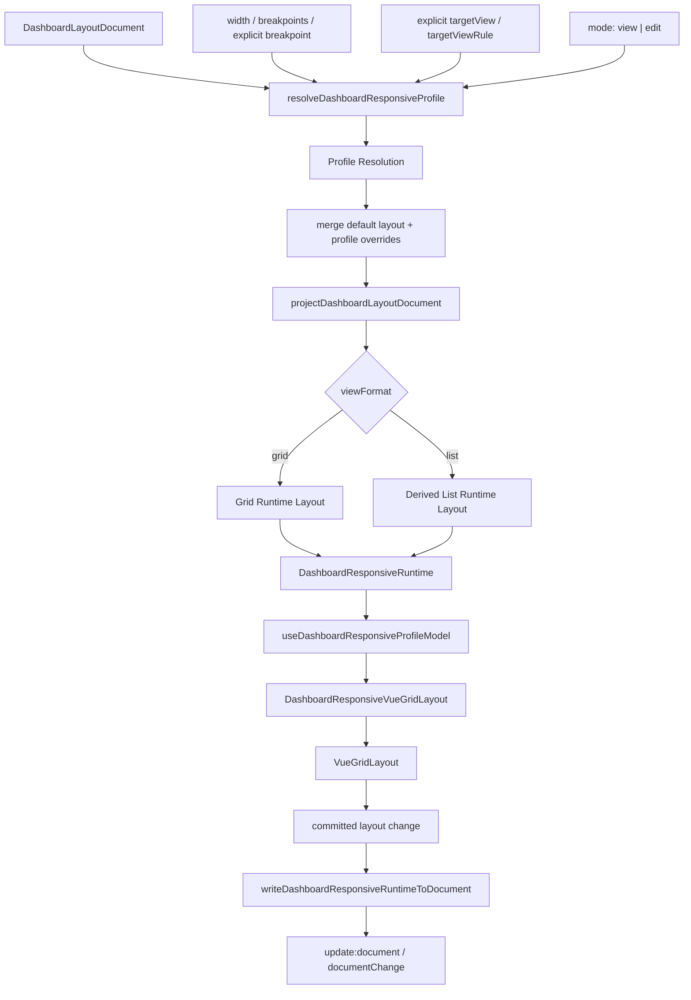

# Responsive Dashboard Profiles 技术设计

## 架构概述

本设计在第一个 dashboard document adapter 之上新增 dashboard responsive profile 层。它不改变现有 `ResponsiveVueGridLayout` 的通用 responsive layouts 模型，也不把 dashboard-only 字段写入 `LayoutItem`。新的层分为三部分：

- 纯函数 resolver：根据 `DashboardLayoutDocument`、width、breakpoints、显式 breakpoint、target view 规则和 mode，解析 dashboard profile、合并 settings、生成 grid/list runtime projection，并返回 diagnostics。
- Vue composable：管理 document、width、breakpoint、targetView、mode、projection state、editor controller、write-back 和事件顺序。
- 薄组件 `DashboardResponsiveVueGridLayout`：只做 props/slots/events glue，把 composable 的 active runtime 传给内层 `VueGridLayout`，不内置业务 widget UI、菜单、palette 或 editor shell。

建议新增模块：

- `lib/dashboard-responsive/resolve.ts`: 框架无关 resolver、list layout 派生、settings 合并、target view 推导、legacy responsive migration helper。
- `lib/dashboard-responsive/useDashboardResponsiveProfileModel.ts`: Vue composable、watcher、scoped editor controller、write-back orchestration。
- `lib/dashboard-responsive/types.ts`: 公共 option/result/event/diagnostic 类型。
- `lib/DashboardResponsiveVueGridLayout.tsx`: 可选薄组件，内部复用 `VueGridLayout`。
- `lib/dashboard-responsive/index.ts`: 聚合导出。
- `lib/cjs.ts` 和 `typings/index.d.ts`: 暴露新 public API。

设计边界：

- `ResponsiveVueGridLayout` 保持现有 props、emits、layout generation、persistence 和 editor 行为。
- `DashboardLayoutDocument`、`DashboardBreakpointProfile`、`DashboardGridSettings`、`DashboardItemLayout` 继续是唯一 dashboard schema。
- profile 缺失时 view 模式 fallback default；edit/write-back 默认阻止写回，只有 `createMissingProfileOnEdit` 显式开启才创建 profile。
- `viewFormat: 'list'` 对 desktop/mobile 都有效；mobile 额外使用 `mobileHide`、`mobileOrder`、`mobileHeight`。
- 第一版不实现 fit/fixed height、pixel precision、aspect ratio resize、collision repair、context menu、widget palette、copy/paste shell 或业务数据源。

## 数据流图



## 组件与接口定义

### 框架无关 resolver

`resolveDashboardResponsiveProfile()` 是第一优先实现目标。它只依赖 dashboard adapter 的类型和纯函数，不依赖 Vue 组件。

职责：

- 计算 `requestedBreakpoint`。
- 解析 `targetView`，显式值优先，未传时使用可配置规则推导。
- 在 `DashboardLayoutDefinition.profiles` 中查找命中 profile。
- 将 default widgets/settings 与 profile widgets/settings 做浅层字段级 override 合并。
- 调用或扩展 `projectDashboardLayoutDocument()` 生成基础 projection。
- 根据 `viewFormat` 生成 grid 或 list runtime。
- 生成 `allItemIds`、`activeItemIds`、`renderItemIds`、`hiddenItemIds` 和 diagnostics。

核心类型：

```ts
export type DashboardTargetView = "desktop" | "mobile";
export type DashboardResponsiveMode = "view" | "edit";
export type DashboardTargetViewSource = "explicit" | "resolver" | "breakpoint-id" | "width" | "default";

export type DashboardTargetViewRule = {
  mobileBreakpointIds?: string[];
  mobileMaxWidth?: number;
  resolve?: (context: {
    width: number;
    requestedBreakpoint: string;
    breakpoints: Record<string, number>;
  }) => DashboardTargetView | null | undefined;
};

export type ResolveDashboardResponsiveProfileOptions = {
  layoutId?: string;
  width: number;
  breakpoints: Record<string, number>;
  breakpoint?: string | null;
  targetView?: DashboardTargetView;
  targetViewRule?: DashboardTargetViewRule;
  mode?: DashboardResponsiveMode;
  validation?: "strict" | "sanitize";
  allowUnknownProfileItems?: boolean;
};

export type DashboardResponsiveRuntime = {
  layout: Layout;
  gridSettings: ResolvedDashboardGridSettings;
  editorMetaById: GridEditorMetaById;
  layoutId: string;
  requestedBreakpoint: string;
  resolvedProfileId: string | null;
  targetView: DashboardTargetView;
  targetViewSource: DashboardTargetViewSource;
  mode: DashboardResponsiveMode;
  viewFormat: "grid" | "list";
  fallbackApplied: boolean;
  allItemIds: string[];
  activeItemIds: string[];
  renderItemIds: string[];
  hiddenItemIds: string[];
  diagnostics: DashboardDiagnostic[];
};
```

Target view 默认规则：

1. 显式 `targetView` 直接生效。
2. `targetViewRule.resolve()` 返回值生效。
3. `targetViewRule.mobileBreakpointIds` 命中 `requestedBreakpoint` 时为 `mobile`。
4. `targetViewRule.mobileMaxWidth` 存在且 `width <= mobileMaxWidth` 时为 `mobile`。
5. 未配置规则时使用内置保守规则：breakpoint id 为 `xs` 或 `xxs` 时为 `mobile`，否则为 `desktop`。

所有推导路径都写入 `targetViewSource`，并可附带 diagnostics，方便测试和业务排查。

### Settings 合并

Settings 合并只处理 dashboard settings，不触碰基础 responsive `cols` map：

```ts
const resolvedSettings = {
  ...defaultGridSettings,
  ...profileGridSettings
};
```

运行时映射规则：

- `columns` -> 内层 `VueGridLayout.cols`
- `margin` number -> `[margin, margin]`
- `margin` tuple -> 原样传递
- `containerPadding` -> 内层 `containerPadding`
- `rowHeight` -> 内层 `rowHeight`
- `viewFormat` -> resolver 内部选择 grid/list projection

`outerMargin`、`minColumns`、`mobileRowHeight`、`mobileAutoFillHeight`、`layoutDimension`、背景字段第一版只进入 resolved settings 和 diagnostics，不直接改基础 grid 渲染算法。

### Grid Runtime

当 `viewFormat` 为 `grid` 时：

- 先基于命中 profile 调用 `projectDashboardLayoutDocument(document, { layoutId, profileId, targetView, validation })`。
- view 模式过滤当前 target view 下 hidden item，输出过滤后的 `layout`、`activeItemIds` 和 `renderItemIds`。
- edit 模式保留所有 item，并通过 `editorMetaById[id].visible = false` 标记 hidden item。
- `LayoutItem` 仍只包含基础几何和已有交互字段。

### List Runtime

当 `viewFormat` 为 `list` 时，resolver 从 effective dashboard widgets 派生新的 runtime layout：

- `x = 0`
- `w = resolvedSettings.columns`
- `y = cumulativeHeight`
- `h = derivedHeight`

排序规则：

- mobile: 有效 `mobileOrder >= 0` 优先，缺失或非法时 fallback 到 `row`、`col`、item id。
- desktop: 始终按 `row`、`col`、item id。

高度规则：

- mobile: 有效 `mobileHeight > 0` 优先，否则使用 `sizeY`，仍非法时使用 `1` 并报告 diagnostics。
- desktop: 使用 `sizeY`，仍非法时使用 `1` 并报告 diagnostics。

Visibility 规则：

- view 模式排除 hidden item，不从 document 删除。
- edit 模式保留 hidden item，并在 editor metadata 中标记当前视图不可见。

### Vue Composable

`useDashboardResponsiveProfileModel()` 是薄组件和自定义 UI 的共享状态层。

输入：

```ts
export type UseDashboardResponsiveProfileModelOptions = {
  document: Ref<DashboardLayoutDocument> | DashboardLayoutDocument;
  width: Ref<number> | number;
  breakpoints: Ref<Record<string, number>> | Record<string, number>;
  breakpoint?: Ref<string | null> | string | null;
  targetView?: Ref<DashboardTargetView | null> | DashboardTargetView | null;
  targetViewRule?: DashboardTargetViewRule;
  mode?: Ref<DashboardResponsiveMode> | DashboardResponsiveMode;
  validation?: "strict" | "sanitize";
  layoutEngine?: false | GridLayoutEngineProp;
  editor?: false | GridEditorProp;
  createMissingProfileOnEdit?: boolean;
  allowUnknownProfileItems?: boolean;
  onEvent?: (event: DashboardResponsiveProfileEvent) => void;
};
```

输出：

```ts
export type DashboardResponsiveProfileModel = {
  state: Readonly<Ref<DashboardResponsiveRuntime>>;
  editorController: GridEditorController | null;
  getInnerEditorProp: () => false | GridEditorProp;
  onLayoutChange: (layout: Layout) => void;
  refresh: (reason?: string) => void;
  stop: () => void;
};
```

事件顺序：

1. 输入变化后先解析 runtime。
2. 如果 requested breakpoint 改变，发 `breakpointChange`。
3. 如果 resolved profile 改变，发 `profileChange`。
4. 如果 projection 内容改变，发 `projectionChange`。
5. 如果 diagnostics 改变，发 `diagnosticsChange`。

Projection 校验失败时，composable 保留上一次可用 runtime，发 `projectionError`，不覆盖 active layout。

Editor 集成：

- 内部 editor controller 使用 `kind: "layout"`，因为 dashboard profile 维度由本层管理，不复用 `LayoutsMap` 的 responsive editor 语义。
- controller 绑定当前 active `layout` 和 `editorMetaById`。
- projection 改变时调用 `setExternalLayout()`，清理无效 selection。
- commit 后由 `onLayoutChange()` 走 dashboard write-back，不直接调用 responsive `update:layouts`。
- 如果调用方提供 `editor.controller`，composable 使用外部 controller，但仍负责在 projection 变化时同步 runtime。

### 薄组件

`DashboardResponsiveVueGridLayout` 只包装 `VueGridLayout`：

```tsx
<VueGridLayout
  {...gridProps}
  modelValue={state.layout}
  cols={state.gridSettings.columns}
  margin={resolvedMargin}
  containerPadding={state.gridSettings.containerPadding || [0, 0]}
  rowHeight={state.gridSettings.rowHeight}
  layoutEngine={layoutEngine}
  editor={model.getInnerEditorProp()}
  onLayoutChange={model.onLayoutChange}
>
  {filteredChildren}
</VueGridLayout>
```

Slot 映射策略：

- 默认按 vnode key 与 widget/item id 匹配。
- view 模式只渲染 `renderItemIds`。
- edit 模式允许 hidden item 继续进入 runtime，具体可见性由 editor metadata 和样式层处理。
- 缺少 child 或未知 child 都进入 `slot-widget-mismatch` diagnostics，不抛未捕获异常。

组件 emits：

- `update:document`
- `documentChange`
- `breakpointChange`
- `profileChange`
- `projectionChange`
- `diagnosticsChange`
- 基础 grid drag/resize/drop/editor 事件继续转发，并附带或可查询 dashboard profile context。

## API 接口设计

### Profile Resolver

```ts
export function resolveDashboardResponsiveProfile(
  document: DashboardLayoutDocument,
  options: ResolveDashboardResponsiveProfileOptions
): DashboardResponsiveProfileResult;
```

结果：

```ts
export type DashboardResponsiveProfileResult =
  | {
      ok: true;
      runtime: DashboardResponsiveRuntime;
      diagnostics: DashboardDiagnostic[];
    }
  | {
      ok: false;
      error: DashboardDocumentError;
      previousRuntime?: DashboardResponsiveRuntime;
      diagnostics: DashboardDiagnostic[];
    };
```

### Write-Back

```ts
export type WriteDashboardResponsiveRuntimeOptions = {
  layoutId?: string;
  requestedBreakpoint: string;
  resolvedProfileId: string | null;
  targetView: DashboardTargetView;
  mode: DashboardResponsiveMode;
  viewFormat: "grid" | "list";
  editorMetaById?: GridEditorMetaById;
  createMissingProfileOnEdit?: boolean;
  createMissingItems?: boolean;
  validation?: "strict" | "sanitize";
};

export function writeDashboardResponsiveRuntimeToDocument(
  document: DashboardLayoutDocument,
  runtime: DashboardResponsiveRuntime,
  committedLayout: Layout,
  options: WriteDashboardResponsiveRuntimeOptions
): DashboardWriteResult;
```

Write-back 行为：

- default grid: 调用 `writeDashboardRuntimeToDocument()` 更新 primary/default layout。
- profile grid: 调用 `writeDashboardRuntimeToDocument()` 更新目标 profile override。
- fallback view: 返回 noop diagnostic，不创建 profile，不写回。
- fallback edit: 默认返回 `missing-profile-write-blocked`；显式 `createMissingProfileOnEdit` 后创建 `profiles[requestedBreakpoint]`。
- mobile list: 按 committed layout 的 y 顺序写 `mobileOrder`，按 h 写 `mobileHeight`。
- desktop list: 按 committed layout 的 y 顺序写 `row`，按 h 写 `sizeY`。
- 所有路径 clone document，保留 unknown fields、extensions、非活动 profiles 和未投影 widgets。

### Legacy Responsive Migration Helper

```ts
export type CreateDashboardDocumentFromResponsiveLayoutsOptions = {
  key: string;
  layouts: Record<string, Layout>;
  breakpoints: Record<string, number>;
  cols?: Record<string, number>;
  margin?: Record<string, [number, number] | null> | [number, number];
  containerPadding?: Record<string, [number, number] | null> | [number, number] | null;
  defaultBreakpoint?: string;
  sourceId?: string;
};

export function createDashboardDocumentFromResponsiveLayouts(
  options: CreateDashboardDocumentFromResponsiveLayoutsOptions
): DashboardResponsiveMigrationResult;
```

默认 `defaultBreakpoint` 使用最大 breakpoint 宽度对应的 layout。其他 breakpoint layout 转成 `profiles[breakpoint].widgets`，对应 cols/margin/containerPadding 转成 profile `gridSettings`。无法表达的 legacy 行为进入 diagnostics，不修改输入对象。

### Event 类型

```ts
export type DashboardResponsiveProfileEvent =
  | { type: "breakpointChange"; requestedBreakpoint: string; previous: string | null }
  | { type: "profileChange"; resolvedProfileId: string | null; previous: string | null; fallbackApplied: boolean }
  | { type: "projectionChange"; runtime: DashboardResponsiveRuntime }
  | { type: "diagnosticsChange"; diagnostics: DashboardDiagnostic[] }
  | { type: "documentChange"; document: DashboardLayoutDocument; runtime: DashboardResponsiveRuntime }
  | { type: "projectionError"; error: DashboardDocumentError; diagnostics: DashboardDiagnostic[] };
```

### Public Exports

ESM/CJS/typings 需要导出：

- `DashboardResponsiveVueGridLayout`
- `resolveDashboardResponsiveProfile`
- `writeDashboardResponsiveRuntimeToDocument`
- `createDashboardDocumentFromResponsiveLayouts`
- `useDashboardResponsiveProfileModel`
- 所有 option/result/runtime/event/diagnostic helper 类型

不改变现有 `VueGridLayout`、`ResponsiveVueGridLayout`、`persistence`、`editor`、`layoutEngine` 导出。

## 数据模型与数据库变更

不需要数据库变更，也不新增 dashboard schema version。该能力复用第一个 spec 的 `DashboardLayoutDocument`：

- default layout 存在于 `document.layouts[document.primaryLayoutId]`。
- per-breakpoint profile 存在于 `layout.profiles[breakpoint]`。
- profile widgets 使用 `DashboardItemLayoutOverride` 表达局部覆盖。
- profile settings 使用 `DashboardGridSettings` 表达 breakpoint-specific columns、spacing、rowHeight 和 viewFormat。

不新增 `LayoutItem` 字段。以下字段只留在 dashboard document 或通过派生 runtime 表达：

- `mobileOrder`
- `mobileHeight`
- `mobileHide`
- `desktopHide`
- `viewFormat`
- `mobileRowHeight`
- `mobileAutoFillHeight`

派生 list runtime 只是一种运行时 projection，不能作为新的持久化 schema。持久化仍通过 write-back 映射回 dashboard document。

## 安全考量

- resolver 不执行 document、extensions、slot children 中的任何数据。
- 所有 document 输入继续依赖 dashboard adapter 的 strict/sanitize validation。
- projection 失败不得覆盖上一次可用 runtime。
- write-back 失败不得覆盖调用方 document。
- slot/widget mismatch 只产生 diagnostics，不访问 DOM 或执行 child 内容。
- `createMissingProfileOnEdit` 默认关闭，避免误把 fallback view 变成新的持久化 profile。
- unknown JSON-safe fields 只 clone 和保留，不参与 runtime 执行。
- editor controller 和 layout executor 由 composable 创建时必须在 `stop()` 或卸载时释放。

## 测试策略

### 单元测试

- resolver: breakpoint 命中、显式 breakpoint、空 breakpoints、未知 breakpoint、profile fallback、targetView 显式优先、targetView rule 推导。
- settings: default/profile gridSettings 合并、columns/margin/containerPadding/rowHeight 映射、默认值 diagnostics。
- grid runtime: view hidden item 过滤、edit hidden item 保留并标记 invisible、LayoutItem 不包含 dashboard-only 字段。
- list runtime: desktop list 排序 `row/col/id`、mobile list 排序 `mobileOrder -> row/col/id`、mobileHeight 派生、单列/full-width layout、稳定排序。
- write-back: default/profile grid 回写、fallback view noop、fallback edit blocked、`createMissingProfileOnEdit` 创建 profile、mobile list 写 `mobileOrder/mobileHeight`、desktop list 写 `row/sizeY`、immutability。
- migration helper: legacy layouts 到 default/profiles 的转换、breakpoint key 映射、输入不变、deferred diagnostics。

### 组件与浏览器测试

- `DashboardResponsiveVueGridLayout` 渲染 active runtime。
- width/breakpoint 改变时事件顺序为 `breakpointChange`、`profileChange`、`projectionChange`。
- view 模式 hidden slot 不渲染，edit 模式 hidden item 保留在 editor runtime。
- slot child 缺失或多余时产生 `slot-widget-mismatch` diagnostics。
- 内层 drag/resize/drop 事件可转发，并可关联 dashboard profile context。
- 现有 `ResponsiveVueGridLayout` browser contract 不受影响。

### 类型与导出测试

- ESM/CJS 可导入 resolver、composable、薄组件和 migration helper。
- `typings/index.d.ts` 暴露 runtime、options、events、target view、migration result 等类型。
- TypeScript 消费侧可以只用 resolver，不必导入 Vue 组件。

### 文档与示例

- 增加 headless resolver 示例：document + width + breakpoints -> runtime layout。
- 增加 thin component 示例：`DashboardResponsiveVueGridLayout v-model:document`。
- 增加 legacy responsive migration 示例。
- 文档明确本规格不包含 height modes、render precision、aspect ratio、collision repair 或 dashboard editor shell。
