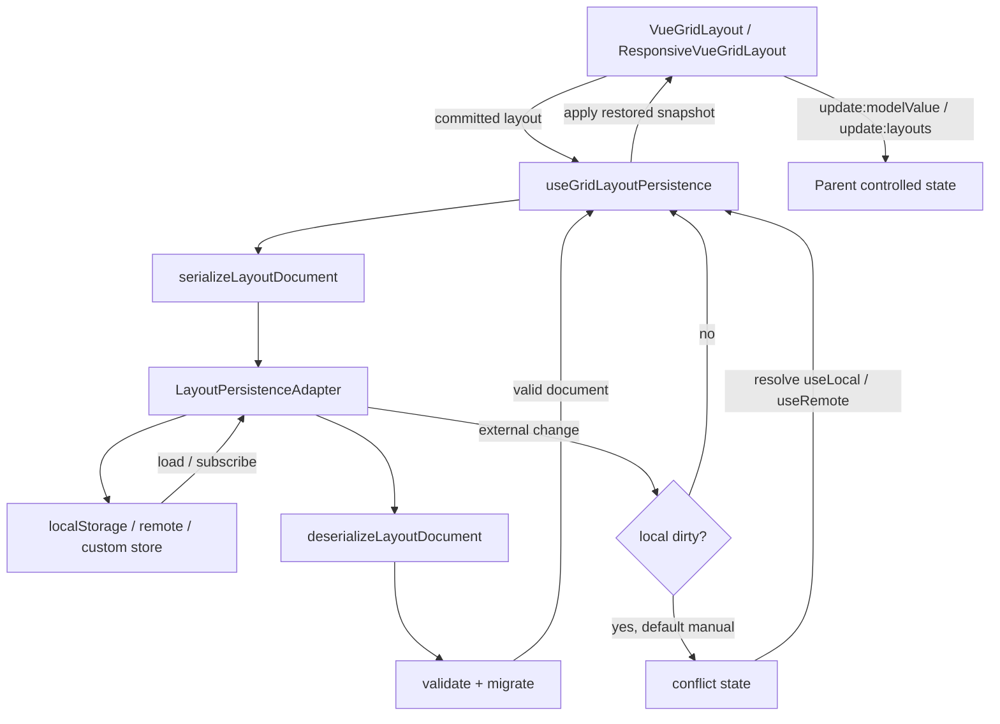

# 版本化布局持久化核心 技术设计

## 架构概述

本设计在现有网格布局能力之上增加一个独立的持久化层，核心目标是把“布局计算/交互预览/提交状态/持久化”分开。现有 `VueGridLayout` 已通过 `layoutChange` 和 `update:modelValue` 表达单布局变化，`ResponsiveVueGridLayout` 已通过 `update:layouts` 表达 breakpoint 布局集合变化，`historyStore` 仅负责 Pinia 会话内 undo/redo。本次实现不替换这些机制，而是在它们旁边增加一个可选的 durable persistence 层。

建议新增一个核心模块：

- `lib/persistence.ts`: 纯类型、序列化、反序列化、迁移、校验、adapter、组合式 API。
- `lib/VueGridLayoutPropTypes.ts`: 新增 `persistence` prop 类型。
- `lib/VueGridLayout.tsx`: 单布局组件接入薄封装，只在 committed layout 变化后提交给持久化层。
- `lib/ResponsiveVueGridLayout.tsx`: 响应式组件接入薄封装，持久化完整 `layouts` 文档，并避免把 responsive persistence 配置继续透传给内层 `VueGridLayout`。
- `lib/cjs.ts` 与 `typings/index.d.ts`: 导出持久化核心 API 与类型。

设计约束：

- 持久化核心不得依赖 Pinia。`historyStore` 继续只管理会话内 undo/redo。
- 默认 `autoSave` 为 true，但只保存 committed layout；拖拽/resize preview 中间态不得触发写入。
- 默认冲突策略为 `manual`；dirty 状态下收到外部更新时进入冲突态。
- 默认校验策略为严格拒绝；容错清理必须显式开启。
- 初始恢复成功后，组件必须用 `update:modelValue` 或 `update:layouts` 同步父级受控状态。

## 数据流图



## 组件与接口定义

### 持久化核心模块

`lib/persistence.ts` 提供不依赖 Vue 组件的基础能力：

- 文档模型：`LayoutPersistenceDocument`、`LayoutPersistenceKind`、`LayoutPersistenceMeta`。
- 序列化：`serializeLayoutDocument()`。
- 反序列化：`deserializeLayoutDocument()`。
- 迁移：`migrateLayoutDocument()`。
- 校验：`validateLayoutDocument()`。
- adapter 接口：`LayoutPersistenceAdapter`。
- adapter 实现：`localStorageAdapter()`、`memoryPersistenceAdapter()`。
- Vue 组合式 API：`useGridLayoutPersistence()`。

### VueGridLayout 集成

`VueGridLayout` 增加可选 `persistence` prop。未传入时，现有 `modelValue`、`layoutChange`、`historyStore` 行为保持不变。

接入点：

- 初始化时，组件先按现有逻辑生成 `state.layout`，再在 `onMounted` 后调用 persistence `load()`。
- load 成功后设置 `state.layout`，通过 `emit('update:modelValue', restoredLayout)` 同步父级受控状态。
- `onLayoutMaybeChanged()` 仍负责判断 committed layout 变化；在 emit 现有事件后调用 `persistence.commit(newLayout, context)`。
- `state.activeDrag` 存在时不触发持久化提交，避免 preview 中间态写入。
- `historyStore` 同步保持现状；persistence 保存成功不创建 undo 历史。

### ResponsiveVueGridLayout 集成

`ResponsiveVueGridLayout` 增加可选 `persistence` prop，持久化对象类型为 `Record<string, Layout>`。

接入点：

- 初始化时生成当前 breakpoint 的 `state.layout` 和完整 `state.layouts`。
- load 成功后用恢复的 `layouts` 替换 `state.layouts`，重新计算当前 breakpoint 的 `state.layout`，并 emit `update:layouts`。
- `onLayoutChange()` 和 breakpoint 变化导致 `newLayouts` 更新后，调用 responsive persistence `commit(newLayouts, context)`。
- render 时从 `props` 中剥离 `persistence`，避免传给内层 `VueGridLayout`，否则会把 responsive 文档当成单布局文档处理。

### Adapter 职责

Adapter 只负责 durable I/O，不负责 Vue 状态、不负责迁移策略、不负责 dirty 判断。所有 adapter 都应实现：

- `load(key)`
- `save(key, document)`
- `remove(key)`
- 可选 `subscribe(key, callback)`

`localStorageAdapter()` 使用 `window.localStorage`，在不可用或 SSR 环境中返回可诊断错误。它通过 `storage` 事件实现跨标签页订阅，并使用文档 `sourceId` 忽略本标签页自身写入。

`memoryPersistenceAdapter()` 用于单元测试和示例，不作为 durable 默认方案。

## API 接口设计

### 文档模型

```ts
export const LAYOUT_SCHEMA_VERSION = 1

export type LayoutPersistenceKind = 'layout' | 'responsive'

export type LayoutPersistenceDocument =
  | {
      layoutSchemaVersion: 1
      kind: 'layout'
      key: string
      revision: string
      sourceId: string
      savedAt: string
      data: { layout: Layout }
      meta?: Record<string, unknown>
    }
  | {
      layoutSchemaVersion: 1
      kind: 'responsive'
      key: string
      revision: string
      sourceId: string
      savedAt: string
      data: { layouts: Record<string, Layout> }
      meta?: Record<string, unknown>
    }
```

字段说明：

- `layoutSchemaVersion`: 持久化文档 schema 版本，不等同于 npm package version。
- `kind`: 区分单布局和响应式布局集合。
- `key`: adapter 存储 key，用于诊断和冲突事件。
- `revision`: 每次保存生成的新 revision，用于区分保存批次。
- `sourceId`: 当前页面会话 ID，用于过滤本标签页自己的 subscribe 回声。
- `savedAt`: ISO 时间字符串，用于 `newer-wins` 比较。
- `meta`: 透传扩展字段，仅保留 JSON-safe 值。

### 序列化与反序列化

```ts
export type SerializeLayoutOptions = {
  key: string
  kind: LayoutPersistenceKind
  sourceId?: string
  meta?: Record<string, unknown>
  now?: () => Date
  revision?: () => string
}

export function serializeLayoutDocument(
  input: Layout | Record<string, Layout>,
  options: SerializeLayoutOptions
): LayoutPersistenceDocument

export type DeserializeLayoutOptions = {
  expectedKind?: LayoutPersistenceKind
  currentVersion?: number
  migrations?: LayoutMigrationMap
  validation?: 'strict' | 'sanitize'
  fallback?: Layout | Record<string, Layout>
}

export function deserializeLayoutDocument(
  payload: unknown,
  options?: DeserializeLayoutOptions
): LayoutDeserializeResult
```

`deserializeLayoutDocument()` 接受 JSON 字符串、plain object 或 adapter 返回值。默认 `validation` 为 `strict`。当 strict 失败时，返回错误结果，不覆盖当前布局；仅显式设置 `sanitize` 时才允许清理可恢复字段。

### Migration

```ts
export type LayoutMigration = (
  document: unknown,
  context: { fromVersion: number; toVersion: number }
) => unknown

export type LayoutMigrationMap = Record<number, LayoutMigration>
```

迁移按版本顺序执行：例如从 1 到 3 时依次执行 `migrations[1]` 与 `migrations[2]`。缺失 migration、migration 抛错、migration 输出非法文档时，读取失败并保留原始 payload，不写回 adapter。

### Adapter

```ts
export type MaybePromise<T> = T | Promise<T>

export type LayoutPersistenceAdapter = {
  load: (key: string) => MaybePromise<unknown | null>
  save: (key: string, document: LayoutPersistenceDocument) => MaybePromise<void>
  remove: (key: string) => MaybePromise<void>
  subscribe?: (
    key: string,
    callback: (event: LayoutPersistenceExternalChange) => void
  ) => () => void
}

export function localStorageAdapter(options?: {
  storage?: Storage
  prefix?: string
}): LayoutPersistenceAdapter

export function memoryPersistenceAdapter(seed?: Record<string, unknown>): LayoutPersistenceAdapter
```

远端存储通过自定义 adapter 接入；第一版不要求内置 `indexedDBAdapter()`，但接口必须能支持 IndexedDB 或后端 API。

### 组合式 API

```ts
export type UseGridLayoutPersistenceOptions<T> = {
  key: string
  kind: LayoutPersistenceKind
  target: Ref<T>
  adapter?: LayoutPersistenceAdapter
  autoSave?: boolean
  debounceMs?: number
  validation?: 'strict' | 'sanitize'
  migrations?: LayoutMigrationMap
  fallback?: T
  conflictStrategy?: 'manual' | 'newer-wins' | 'keep-local'
  meta?: Record<string, unknown> | (() => Record<string, unknown>)
  onEvent?: (event: LayoutPersistenceEvent) => void
  onError?: (error: LayoutPersistenceError) => void
  watchTarget?: boolean
}

export type GridLayoutPersistenceController<T> = {
  status: Ref<LayoutPersistenceStatus>
  dirty: Ref<boolean>
  error: Ref<LayoutPersistenceError | null>
  lastSavedAt: Ref<string | null>
  conflict: Ref<LayoutPersistenceConflict<T> | null>
  load: () => Promise<LayoutPersistenceLoadResult<T>>
  commit: (nextValue?: T, context?: LayoutPersistenceCommitContext) => void
  save: () => Promise<LayoutPersistenceSaveResult>
  discard: () => void
  reset: (nextValue?: T) => void
  remove: () => Promise<void>
  resolveConflict: (action: 'useLocal' | 'useRemote') => Promise<void>
  stop: () => void
}
```

默认值：

- `adapter`: `localStorageAdapter()`，但 SSR 或 storage 不可用时进入 `unavailable` 状态。
- `autoSave`: true。
- `debounceMs`: 300。
- `validation`: `strict`。
- `conflictStrategy`: `manual`。
- `watchTarget`: 普通 composable 用法默认为 true；组件 prop 集成时设置为 false，并由组件在 committed event 后调用 `commit()`。

### 组件 prop

```ts
export type GridLayoutPersistenceProp =
  | false
  | Omit<UseGridLayoutPersistenceOptions<Layout>, 'target' | 'kind'>

export type ResponsiveGridLayoutPersistenceProp =
  | false
  | Omit<UseGridLayoutPersistenceOptions<Record<string, Layout>>, 'target' | 'kind'>
```

`VueGridLayout` 使用 `kind: 'layout'`。`ResponsiveVueGridLayout` 使用 `kind: 'responsive'`。

## 数据模型与数据库变更

不需要数据库迁移。本功能只定义浏览器/远端 adapter 之间共享的 JSON 文档模型。

本地存储格式：

- 默认 key: 由用户传入 `persistence.key`。
- `localStorageAdapter({ prefix })` 实际 key 为 `${prefix ?? ''}${key}`。
- value 为 `JSON.stringify(LayoutPersistenceDocument)`。

布局校验规则：

- `LayoutItem.i` 必须为非空 string。
- `x`、`y`、`w`、`h` 必须为有限 number。
- `x >= 0`、`y >= 0`、`w > 0`、`h > 0`。
- 同一 layout 内 `i` 不得重复。
- `minW`、`minH`、`maxW`、`maxH` 如存在必须为有限 number，且不能与 `w`、`h` 约束冲突。
- `resizeHandles` 如存在，值必须属于现有 `ResizeHandleAxis`。
- 响应式文档的每个 breakpoint value 必须是合法 `Layout`。

`sanitize` 模式只允许执行确定性清理，例如过滤完全非法 item、clamp 负数位置、去除未知 resize handle。重复 id 默认不可自动修复，除非设计后续明确 id 重命名策略。

## 安全考量

- 所有读取都通过 `JSON.parse` 和结构校验，不执行 payload 中的任何代码。
- 不把 DOM 节点、VNode、事件对象或函数写入持久化文档。
- `meta` 只允许 JSON-safe plain data；函数、symbol、循环引用应被拒绝或忽略并报告。
- localStorage 不适合保存敏感数据；文档应提示消费者不要把认证信息、查询密钥或私密业务数据放入 layout meta。
- SSR 环境不得访问 `window`。`localStorageAdapter()` 需要延迟检测 storage，可返回 `unavailable` 错误。
- adapter 错误不得导致内存布局回滚到未知状态。
- migration 失败不得写回 adapter，避免损坏原始数据。

## 测试策略

### 单元测试

- 序列化单布局：覆盖 `LayoutItem` 核心字段、约束字段、交互字段、meta 透传。
- 序列化响应式布局：覆盖多个 breakpoint、空 breakpoint、kind mismatch。
- 反序列化 strict：非法 JSON、缺字段、重复 id、越界值、非法尺寸均失败且返回错误。
- 反序列化 sanitize：只清理允许恢复的字段，并返回 warning。
- migration：顺序迁移、缺失 migration、migration 抛错、migration 输出非法文档。
- adapter：`memoryPersistenceAdapter()` 和 `localStorageAdapter()` 的 load/save/remove/subscribe。
- composable 状态：load、commit、dirty、debounced autosave、save failure、discard、reset、remove。
- 多标签页：dirty=false 自动应用外部更新；dirty=true 默认 manual conflict；`newer-wins` 与 `keep-local` 显式策略。

### 组件集成测试

- `VueGridLayout` 未传 `persistence` 时现有事件不变。
- `VueGridLayout` 初始 load 成功后 emit `update:modelValue`。
- `VueGridLayout` drag/resize commit 后触发 debounced save，drag/resize preview 中间态不写入。
- `ResponsiveVueGridLayout` 初始 load 成功后 emit `update:layouts`，并正确设置当前 breakpoint 的 `state.layout`。
- `ResponsiveVueGridLayout` 不把 responsive persistence prop 透传到内层 `VueGridLayout`。
- `historyStore` 与 persistence 同时使用时，undo/redo 不依赖 durable adapter，save/load 不依赖 Pinia。

### 文档与示例检查

- README 增加 localStorage 刷新恢复示例。
- README 增加 autosave dirty-state 示例。
- README 增加 custom remote adapter 示例。
- 文档说明 `historyStore` 到 persistence 的迁移方式：保留 history 作为会话内 undo/redo，新增 persistence 管 durable save/load。

### 回归命令

设计完成后，实施阶段至少运行：

- `yarn lint`
- `npx tsc --noEmit`
- `yarn build`

如新增测试框架或测试脚本，应在任务拆解阶段明确命令。
