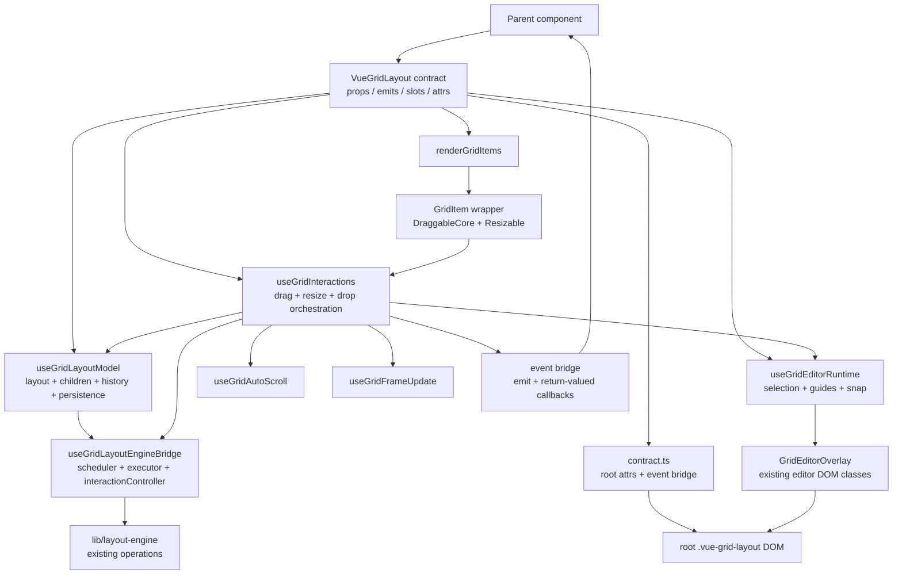
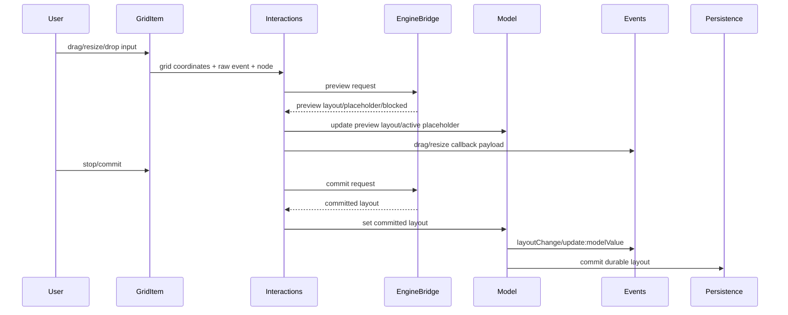

# Vue Grid Layout 行为保持型组件边界重构 技术设计

## 架构概述

本设计采用“行为锁定优先、根组件 orchestration 化、按责任渐进抽取”的架构。`VueGridLayout.tsx` 保留组件 public contract、props/emits/slots/attrs 决策、顶层 wiring 和最终 render composition；layout 同步、persistence、layout engine bridge、drag/resize/drop 交互、auto-scroll/rAF、editor overlay 渲染分别进入独立模块。`GridItem` 与 `ResponsiveVueGridLayout` 只做与 wrapper 边界、事件、attrs 和兼容性直接相关的 cleanup，不进入全面重写。

设计约束：

- 不改变现有 props、默认值、事件名称、事件 payload、CSS class、导出类型、示例语义和提交边界。
- 不重写 layout engine、persistence、editor controller、responsive layout generation 等既有核心行为。
- `VueGridLayout.tsx` 拆分完成后以清晰边界为第一目标，并控制在 800 行以内；不得为了行数拆出薄壳或大型透传 prop bag。
- 新增的 composable/helper/type 可以公开导出，但必须证明具备稳定复用价值，并同步更新 `typings/index.d.ts`、README/API 文档、MCP docs 数据源与 CommonJS/UMD 导出清单。
- 非事件 `$attrs` 采用长期收益最大的有意透传策略：安全 DOM attrs 进入根 grid DOM 或明确 wrapper root；组件受控 props/emits/class/style 规则优先。

建议模块布局：

```text
lib/grid-layout/
  contract.ts                 # emits、event bridge、attrs 分流与 root attrs 合并
  useGridLayoutModel.ts        # modelValue/children/history/persistence 同步
  useGridLayoutEngineBridge.ts # executor/scheduler/interactionController bridge
  useGridFrameUpdate.ts        # rAF 合帧与 placeholder frame update
  useGridAutoScroll.ts         # DOM-side auto-scroll
  useGridEditorRuntime.ts      # editor controller、guide options、snap bridge
  useGridInteractions.ts       # drag/resize/drop orchestration
  GridEditorOverlay.tsx        # guides/chips/HUD/anchor edges 渲染
  renderGridItems.tsx          # children -> GridItem 映射 helper
lib/grid-item/
  useGridItemDrag.ts           # DraggableCore 回调适配
  useGridItemResize.ts         # Resizable 回调适配与 constraints
  gridItemStyle.ts             # positioning style helper
lib/responsive/
  useResponsiveGridLayoutModel.ts # breakpoint/layouts/persistence/editor wrapper 状态
```

实际实现可以在不扩大 diff 的前提下调整文件名，但每个新模块必须有明确 ownership，并在任务或实现说明中列出。

## 数据流图



关键提交边界：



## 组件与接口定义

### VueGridLayout 根组件

`VueGridLayout` 保留以下职责：

- 声明 `props`、`emits`、`inheritAttrs: false` 与 slot 读取策略。
- 创建并组合 model、engine bridge、editor runtime、interactions、attrs/event bridge。
- 生成 root DOM class/style、root attrs、children layer、placeholder 和 overlay。
- 负责 lifecycle cleanup 的顶层 orchestration，但具体 cleanup 由各模块暴露 `stop()`/`dispose()`。

根组件不再直接持有：

- persistence load/save 状态机细节。
- layout engine executor/scheduler 创建与任务执行细节。
- drag/resize/drop 的 legacy/new engine 双路径完整实现。
- auto-scroll DOM 容器查找和 rAF 合帧实现。
- editor guide/chip/HUD/anchor edge 的 JSX 渲染细节。

### `contract.ts`

职责：

- 定义 `gridLayoutEmits`、`responsiveGridLayoutEmits`、事件 payload 类型和事件名称常量。
- 提供 `createGridLayoutEventBridge()`，统一处理普通通知型事件与需要返回值的回调型事件。
- 提供 `splitGridRootAttrs()`，从 `attrs` 中分离事件 listener、DOM attrs、class/style，并合并到根节点。
- 保持 `dropDragOver` 这类需要返回值的 callback 兼容。

重要设计点：`dropDragOver` 不能只用 Vue `emit()`。当前实现通过 `attrs.onDropDragOver?.(e)` 读取返回值，返回 `{ w, h } | false` 会直接改变 drop 行为。声明 `emits` 后 listener 不再留在 `$attrs` 中，因此 event bridge 必须从组件 instance vnode props 或等价可靠入口读取 `onDropDragOver` handler，并以兼容规则返回结果。

建议规则：

- `dragStart`、`drag`、`dragStop`、`resizeStart`、`resize`、`resizeStop`、`drop` 使用 `emit(eventName, ...payload)`。
- `dropDragOver` 使用 `callReturnableEvent("dropDragOver", e)`，返回 `false`、尺寸对象或 `undefined`。
- 若 Vue 合并多个 handler，`false` 优先；否则使用最后一个非空尺寸对象。新增测试必须覆盖单 handler 和数组 handler 的兼容策略。
- 非事件 `$attrs` 透传到根 grid DOM；`on*` listener 不作为 DOM listener 盲目透传，避免影响内部 drag/drop/resize。

### `useGridLayoutModel`

职责：

- 初始化并维护 committed `layout`、`children`、`compactType`、`mounted`、`oldLayout` 等与 layout ownership 相关的状态。
- 集中处理 `modelValue`、slot children、`compactType`、`cols`、`allowOverlap` 的同步 watcher。
- 集中处理 `historyStore` 的 `replacePresent`/`push`。
- 集中处理 `useGridLayoutPersistence` 的 load、external-apply、commit、stop。
- 暴露 `setLayoutFromPreview()`、`commitLayoutChange()`、`applyPersistedLayout()`、`syncChildrenLayout()` 等窄接口。

不得做：

- 不执行 layout engine operation。
- 不读取 DOM event/node。
- 不渲染 placeholder 或 overlay。

### `useGridLayoutEngineBridge`

职责：

- 封装 `getLayoutEngineProp()`、legacy mode 判断、executor/scheduler 创建、dispose、interaction controller lifecycle。
- 提供 `preview(operation, apply, options)` 与 `commit(operation, apply, options)`。
- 保留 `compareWithLegacyLayout`、`legacyFallback`、worker/main-thread executor、scheduler diagnostics 语义。
- 保持 preview stale result 不覆盖当前状态。

不得做：

- 不发 Vue 组件事件。
- 不提交 persistence/history。
- 不读写 DOM。

### `useGridEditorRuntime`

职责：

- 创建或接入 `GridEditorController`。
- 管理 editor mode/view/edit 查询、selection、meta、capability、keyboard binding cleanup。
- 提供 `updateIntelligence()`、`snapCandidate()`、`clearGuides()`。
- 将 guide/snap event 继续通过现有 `editorConfig.onEvent` 通知。

不得做：

- 不直接渲染 guide DOM。
- 不执行 drag/resize/drop commit。

### `useGridFrameUpdate` 和 `useGridAutoScroll`

`useGridFrameUpdate` 只负责 rAF 合帧：

- pending layout/placeholder 保存。
- cancel/flush/schedule。
- large layout preview 合帧。

`useGridAutoScroll` 只负责 DOM 滚动：

- options 解析。
- client point 提取。
- scroll container 查找。
- rAF scrollBy 调度与 cleanup。

这两个模块不得依赖 VueGridLayout 的大状态包，只接收窄参数和 callback。

### `useGridInteractions`

职责：

- 组合 model、engine bridge、editor runtime、auto-scroll、frame update。
- 暴露 `onDragStart/onDrag/onDragStop/onResizeStart/onResize/onResizeStop/onDrop/onDragOver/onDragEnter/onDragLeave`。
- 保持 legacy path 与 layout-engine path 的现有结果和事件 payload。
- 保持 `LARGE_LAYOUT_THRESHOLD` 兼容语义，直到 engine scheduler 配置接管该策略；不得在本重构中更改阈值行为。

拆分策略：

- 第一轮可先抽为一个 interaction 模块。
- 如果该模块超过 review gate 或混合过多，可继续拆为 `useGridDragResizeInteractions` 与 `useGridDropInteractions`。
- 不允许形成新的大型“万能交互 composable”。

### `GridEditorOverlay`

职责：

- 渲染 existing guide/chip/HUD/anchor edge DOM。
- 输入为 `guideState`、`geometry`、`layoutItemById`、`layout` 和 `enabled/debug` 等小型 props。
- 保持现有 class/data attribute/aria-live。

输出：

- `VNode[]` 或一个无额外 wrapper 的 fragment-like render result。
- 不发事件，不改 layout。

### `GridItem` cleanup

`GridItem` 仍然是 vendor wrapper，不变更对外行为：

- `useGridItemDrag` 提供 DraggableCore callback 适配。
- `useGridItemResize` 提供 Resizable callback 适配、constraints、north/west resize 计算。
- `gridItemStyle.ts` 提供 `createGridItemStyle()`，保留 transform/top-left/percentage 语义。
- wrapper props class/style 合并顺序保持兼容。

### `ResponsiveVueGridLayout` cleanup

`ResponsiveVueGridLayout` 保留响应式 wrapper 角色：

- `useResponsiveGridLayoutModel` 管理 breakpoint、cols、layouts、responsive persistence、editor controller wiring。
- 明确响应式 wrapper 自己消费的 props，剩余 attrs/events 传入内层 `VueGridLayout`。
- 新增非事件 DOM attrs 透传测试，确认根节点 attrs 与 `@drop`、`@dragStop` 等事件共存。

## API 接口设计

### 现有公开 API

保持不变：

- `VueGridLayout` / `ResponsiveVueGridLayout` / `WidthProvider` 入口。
- 现有 props、默认值和事件名称。
- `layoutEngine`、`persistence`、`editor` 命名空间导出。
- `typings/index.d.ts` 中现有类型名称和结构。
- README 中现有示例使用方式。

### 事件 API

新增或修正的显式 emits：

```ts
export const gridLayoutEmits = [
  "update:modelValue",
  "layoutChange",
  "dragStart",
  "drag",
  "dragStop",
  "resizeStart",
  "resize",
  "resizeStop",
  "drop",
  "dropDragOver"
] as const;
```

事件桥接接口草案：

```ts
type ReturnableGridEvents = {
  dropDragOver: (event: DragEvent) => { w?: number; h?: number } | false | void;
};

type GridLayoutEventBridge = {
  emitDragStart: EventCallback;
  emitDrag: EventCallback;
  emitDragStop: EventCallback;
  emitResizeStart: EventCallback;
  emitResize: EventCallback;
  emitResizeStop: EventCallback;
  emitDrop: (layout: Layout, event: Event, item?: LayoutItem) => void;
  callDropDragOver: (event: DragEvent) => { w?: number; h?: number } | false | undefined;
};
```

`EventCallback` 参数顺序必须保持当前实现：

```ts
(layout, oldItem, item, placeholder, event, node)
```

### Root attrs API

`splitGridRootAttrs()` 草案：

```ts
type GridRootAttrs = {
  attrs: Record<string, unknown>;
  class?: unknown;
  style?: unknown;
};

function splitGridRootAttrs(
  rawAttrs: Record<string, unknown>,
  knownEventNames: readonly string[]
): GridRootAttrs;
```

合并规则：

- class: `layoutClassName` + root attrs class + prop class + editor state class。
- style: root attrs style + computed height + prop style；prop style 保持最高优先级以兼容当前 `style` prop。
- `on*` 不进入 root DOM attrs，除非后续明确引入根 DOM listener API。
- `id`、`data-*`、`aria-*` 和其他非冲突 DOM attrs 进入 root DOM。

### 可公开导出的新 helper

允许但不强制公开导出。候选必须满足：

- 不暴露组件内部可变状态。
- API 名称稳定，能脱离本次重构继续复用。
- 有类型声明、README/API 文档、MCP docs 数据源和 CommonJS/UMD 导出。

候选分级：

- 可考虑公开：`splitGridRootAttrs`、事件 payload 类型、纯 geometry/style helper。
- 默认内部：`useGridLayoutModel`、`useGridLayoutEngineBridge`、`useGridInteractions`、`useGridEditorRuntime`。
- 不公开：直接持有组件 instance、scheduler runtime、private DOM refs 的 helper。

## 数据模型与数据库变更

本重构不引入数据库变更，也不改变 persistence 文档模型。

保持不变：

- `Layout`、`LayoutItem`、`ResponsiveLayout`、`LayoutsMap` 语义。
- `GridLayoutPersistenceProp`、`ResponsiveGridLayoutPersistenceProp` 与 persistence document schema。
- editor sidecar metadata 与 `meta.editor` 保存语义。
- layout engine request/result/diagnostics 结构。

新增内部类型：

- `GridLayoutRuntimeState`: 聚合根组件当前已有 state，但按 model/interactions/editor 拆分 ownership。
- `GridLayoutEventBridge`: 事件发射与 return-valued callback 调用。
- `GridRootAttrs`: root DOM attrs 分流结果。
- `GridEditorOverlayProps`: overlay 渲染输入。
- `GridLayoutModuleDisposer`: 各模块 cleanup 聚合。

如果新增公开类型：

- 同步 `typings/index.d.ts`。
- 同步 `lib/cjs.ts` 和对应命名空间导出。
- 同步 README/MCP docs 数据源。
- 新增类型不得要求用户迁移现有类型。

## 安全考量

- `$attrs` 透传只处理非事件 DOM attrs，避免用户传入的 `on*` 被盲目挂到 root DOM 并绕过组件事件契约。
- class/style 合并必须保持组件受控语义优先，避免外部 attrs 覆盖必要的 editor、placeholder、drag/resize blocked 状态。
- 透传 `aria-*`、`data-*` 与 `id` 能提升可访问性和测试定位，但不得透传到深层 draggable/resizable vendor 节点，避免形成非预期 DOM API。
- 不改变 persistence document schema，不迁移或复制用户布局数据，不引入新的存储 key。
- 不改变 editor metadata 的安全边界；hidden/locked 仍然不是权限边界，业务权限继续通过现有 `beforeCommand` 或服务端控制。
- DOM helper 必须继续保护 SSR/非浏览器环境：只有在客户端交互路径中访问 `window`、`document`、`requestAnimationFrame`、DOM node 或 scroll API。
- 新公开导出不得暴露内部 refs、scheduler mutable state、controller 私有状态或 DOM node。

## 测试策略

测试分四层推进。

### 1. 行为锁定测试

新增或确认 characterization 覆盖：

- `dragStart/drag/dragStop` payload 顺序、placeholder、commit 边界。
- `resizeStart/resize/resizeStop` payload 顺序、north/west resize、blocked class。
- `dropDragOver` 返回 `false`、返回尺寸对象、正常 drop payload。
- `layoutChange` 与 `update:modelValue` 的提交时机。
- persistence 只保存 committed layout，不保存 preview。
- layoutEngine executor 只在 commit/heavy path 调用，preview 不误进 worker/custom executor。
- editor guide DOM 数量、class、debug layer、HUD、drop target。
- root attrs: `id`、`data-*`、`aria-*`、class/style 合并和事件监听共存。

### 2. 模块级测试

新增 helper/composable 单元测试：

- `splitGridRootAttrs()` 分流、冲突和 class/style 合并。
- `createGridLayoutEventBridge()` 普通 emit 与 `dropDragOver` return-valued callback。
- `useGridFrameUpdate()` 的 schedule/cancel/flush。
- `useGridAutoScroll()` 的 options 解析和 scroll delta 计算，可用纯函数覆盖的部分优先纯函数测试。
- overlay geometry helper 的 guide/chip/HUD 位置换算。

### 3. 浏览器集成测试

复用并扩展现有 browser tests：

- `test/editor-component-browser.test.js` 继续覆盖 `.vue-grid-editor-guide`、`.vue-grid-editor-spacing-chip`、`.vue-grid-editor-measurement-hud`、`.editor-drop-target`、`.editor-mode-view`。
- `test/persistence-component-browser.test.js` 继续覆盖 persistence load/external-apply/drag committed save 与 custom executor commit-only。
- 新增 root attrs browser case，覆盖单布局与响应式 wrapper。
- external drop 示例行为覆盖 `@dropDragOver` return value 与 `@drop` item payload。

### 4. 验收命令

阶段性命令：

- 事件契约阶段：运行相关 browser contract test 和 editor/persistence targeted test。
- model/persistence 阶段：运行 `yarn test` 中 persistence 相关脚本或 `node test/run-persistence-tests.js`。
- engine/interactions 阶段：运行 `node test/run-layout-engine-tests.js` 与相关 browser drag save test。
- editor overlay 阶段：运行 `node test/run-editor-tests.js`。

最终命令：

- `yarn test`
- `yarn build`
- 按触及范围执行 targeted smoke：基础网格、响应式、外部 drop、persistence、layout engine performance、professional dashboard editor。

失败处理：

- 任一阶段发现行为差异，先判断是测试基线缺失还是真实回归。
- 真实回归必须在当前阶段修复或回退，不得继续扩大拆分范围。
- 若发现现有 README/typings 与源码行为不一致，先记录差异并保持源码行为，不在本重构中顺手改行为。
