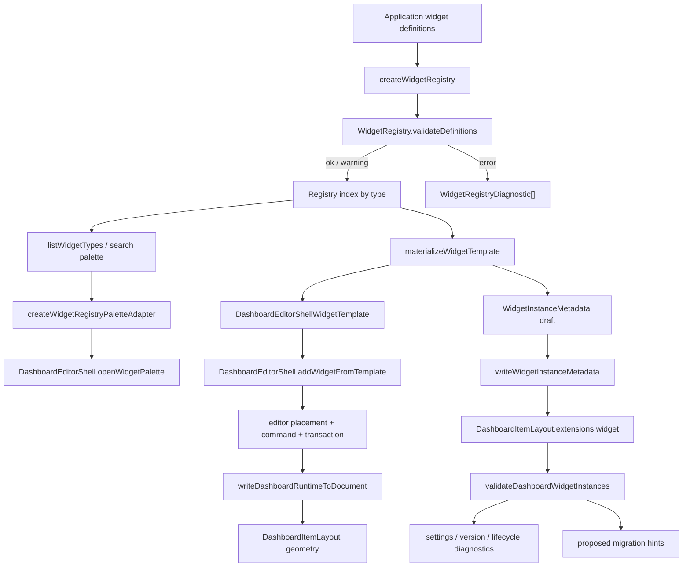

# Widget Registry Protocol 技术设计

## 架构概述

本设计新增一个 headless、JSON-safe、API-first 的 widget registry 协议层，用于描述 widget type、settings descriptor、默认布局能力、template materialization、document sidecar、diagnostics 与 dashboard editor shell adapter。该层不实现真实业务 renderer、不加载远程插件、不执行第三方代码，也不提供完整 Editor Kit UI。

核心边界：

- `lib/widget-registry/` 是新的协议实现目录，提供 registry、settings、template、document 和 shell adapter helper。
- `lib/entries/widget-registry.ts` 是新的公开入口，推荐用户从 `@marsio/vue-grid-layout/widget-registry` 导入。
- registry 可以 type-only 引用 dashboard/editor-shell 公共类型，运行时代码避免静态导入 Vue UI、Pinia、persistence、history 或业务 renderer。
- widget instance metadata 固定保存在 `DashboardItemLayout.extensions.widget`，基础 `LayoutItem` 继续只承载几何和 grid/runtime 支持字段。
- layout defaults 与 capability 字段复用或桥接 `item-capabilities-aspect-ratio` 的能力模型，不在 registry 内重新定义冲突语义。

新增与改造模块：

- `lib/widget-registry/types.ts`: 公共类型与 diagnostic code。
- `lib/widget-registry/registry.ts`: `createWidgetRegistry()`、注册、查询、过滤、排序、覆盖策略和 lifecycle diagnostic。
- `lib/widget-registry/settings.ts`: settings descriptor 默认值生成、有限字段类型校验、JSON-safe clone 与 dangerous key 清理。
- `lib/widget-registry/template.ts`: widget type/template override 到 `DashboardEditorShellWidgetTemplate` 兼容对象的物化。
- `lib/widget-registry/document.ts`: `extensions.widget` 读写、document validation、sidecar 保留和 proposed migration diagnostic。
- `lib/widget-registry/shellAdapter.ts`: registry 到 `DashboardEditorShellPaletteAdapter` / `DashboardEditorShellWidgetAdapter` 的桥接。
- `lib/widget-registry/index.ts`: public exports。
- `lib/entries/widget-registry.ts`: package subpath facade。
- `package.json`、`scripts/build-package.mjs`、`scripts/test-package-consumers.mjs`、bundle/package checks：同步新增 subpath。

需求覆盖：

- R1 由 `types.ts`、`registry.ts`、JSON-safe definition validation 和 lifecycle diagnostics 覆盖。
- R2、R6 由 `template.ts` 与 `shellAdapter.ts` 接入现有 `DashboardEditorShellWidgetTemplate`、`openWidgetPalette()`、`addWidgetFromTemplate()`、widget adapter transaction 覆盖。
- R3 由 `WidgetLayoutDefaults` 与 item capability bridge 覆盖。
- R4 由 `settings.ts` 的有限 descriptor、默认值、field-level diagnostics 和 declarative predicate 覆盖。
- R5 由 `document.ts` 的 `extensions.widget` sidecar 读写与 document validation 覆盖。
- R7 由统一 `WidgetRegistryDiagnostic` code、strict/tolerant policy 和 proposed migration helper 覆盖。
- R8 由独立 `./widget-registry` export、package consumer tests 和 bundle boundary gate 覆盖。
- R9 由 headless dogfood fixture/workbench 与单元、shell、package、bundle 测试覆盖。
- R10 由非目标边界和 renderer hint 限制覆盖。

## 数据流图



## 组件与接口定义

### `lib/widget-registry/types.ts`

核心类型使用普通对象和 JSON-safe value。`rendererHint` 只允许字符串 metadata，不保存组件对象、函数、Vue ref、DOM node 或 resolver。

```ts
import type { DashboardJsonObject, DashboardJsonValue } from "../dashboard";
import type { ResizeHandleAxis } from "../utils";

export type WidgetRegistryPolicy = "strict" | "tolerant";

export type WidgetLifecycleStatus =
  | "stable"
  | "experimental"
  | "deprecated"
  | "hidden";

export type WidgetRegistryDiagnosticLevel = "info" | "warning" | "error";

export type WidgetRegistryDiagnosticCode =
  | "widget-registry.duplicate-type"
  | "widget-registry.unknown-type"
  | "widget-registry.invalid-type"
  | "widget-registry.invalid-version"
  | "widget-registry.deprecated-type"
  | "widget-registry.invalid-template"
  | "widget-registry.invalid-settings"
  | "widget-registry.unsafe-extension-key"
  | "widget-registry.capability-conflict"
  | "widget-registry.missing-data-requirement"
  | "widget-registry.untyped-layout-item"
  | "widget-registry.renderer-hint-invalid";

export type WidgetRegistryDiagnostic = {
  code: WidgetRegistryDiagnosticCode;
  level: WidgetRegistryDiagnosticLevel;
  message: string;
  type?: string;
  itemId?: string;
  fieldId?: string;
  path?: string;
  profileId?: string;
  details?: DashboardJsonObject;
};

export type WidgetRendererHint = {
  rendererKey?: string;
  componentKey?: string;
  slot?: string;
  extensions?: DashboardJsonObject;
};

export type WidgetLayoutDefaults = {
  w?: number;
  h?: number;
  minW?: number;
  minH?: number;
  maxW?: number;
  maxH?: number;
  static?: boolean;
  draggable?: boolean;
  resizable?: boolean;
  bounded?: boolean;
  resizeHandles?: ResizeHandleAxis[];
  preserveAspectRatio?: boolean;
  aspectRatio?: number;
  extensions?: DashboardJsonObject;
};

export type WidgetSettingsFieldType =
  | "string"
  | "number"
  | "boolean"
  | "enum"
  | "color"
  | "text"
  | "json"
  | "object"
  | "array"
  | "ref";

export type WidgetSettingsPredicate =
  | { op: "exists"; path: string }
  | { op: "equals"; path: string; value: DashboardJsonValue }
  | { op: "not"; predicate: WidgetSettingsPredicate }
  | { op: "all"; predicates: WidgetSettingsPredicate[] }
  | { op: "any"; predicates: WidgetSettingsPredicate[] };

export type WidgetSettingsField = {
  id: string;
  label?: string;
  labelKey?: string;
  description?: string;
  type: WidgetSettingsFieldType;
  defaultValue?: DashboardJsonValue;
  required?: boolean;
  group?: string;
  order?: number;
  options?: Array<{ value: string | number | boolean; label?: string; labelKey?: string }>;
  validation?: {
    min?: number;
    max?: number;
    pattern?: string;
    maxLength?: number;
  };
  visibleWhen?: WidgetSettingsPredicate;
  enabledWhen?: WidgetSettingsPredicate;
  status?: WidgetLifecycleStatus;
  replacement?: string;
  extensions?: DashboardJsonObject;
};

export type WidgetSettingsDescriptor = {
  version?: string;
  fields: WidgetSettingsField[];
  groups?: Array<{ id: string; label?: string; order?: number; extensions?: DashboardJsonObject }>;
  extensions?: DashboardJsonObject;
};

export type WidgetTypeDefinition = {
  type: string;
  version: string;
  title: string;
  description?: string;
  category?: string;
  tags?: string[];
  icon?: string;
  status?: WidgetLifecycleStatus;
  replacement?: string;
  layoutDefaults?: WidgetLayoutDefaults;
  settings?: WidgetSettingsDescriptor;
  dataRequirements?: DashboardJsonObject;
  rendererHint?: WidgetRendererHint;
  templates?: WidgetTemplateDefinition[];
  extensions?: DashboardJsonObject;
};

export type WidgetTemplateDefinition = {
  id?: string;
  title?: string;
  description?: string;
  layout?: WidgetLayoutDefaults;
  settings?: DashboardJsonObject;
  bindings?: DashboardJsonObject;
  payload?: DashboardJsonValue;
  extensions?: DashboardJsonObject;
};

export type WidgetInstanceMetadata = {
  widgetType: string;
  widgetVersion?: string;
  templateId?: string;
  settings?: DashboardJsonObject;
  bindings?: DashboardJsonObject;
  payload?: DashboardJsonValue;
  migration?: {
    fromVersion?: string;
    toVersion?: string;
    status?: "current" | "deprecated" | "migration-available" | "manual-review";
    replacement?: string;
  };
  rendererHint?: WidgetRendererHint;
  extensions?: DashboardJsonObject;
};
```

SemVer 校验使用项目已有 `semver` dev dependency，运行时只需要轻量判断：非法 `version` 产生 diagnostic；registry 不执行自动业务迁移，只输出 replacement/proposed patch metadata。

### `lib/widget-registry/registry.ts`

`createWidgetRegistry()` 返回不可变查询视图和显式注册方法。默认不允许 duplicate type；调用方可以通过 options 开启覆盖，但覆盖仍产生 warning。

```ts
export type WidgetRegistryOptions = {
  policy?: WidgetRegistryPolicy;
  allowOverride?: boolean;
  includeHiddenByDefault?: boolean;
  includeDeprecatedByDefault?: boolean;
};

export type WidgetRegistryListOptions = {
  category?: string;
  tags?: string[];
  status?: WidgetLifecycleStatus | WidgetLifecycleStatus[];
  searchText?: string;
  includeHidden?: boolean;
  includeDeprecated?: boolean;
};

export type WidgetRegistryResolveResult =
  | { ok: true; definition: WidgetTypeDefinition; diagnostics: WidgetRegistryDiagnostic[] }
  | { ok: false; diagnostics: WidgetRegistryDiagnostic[] };

export type WidgetRegistry = {
  register(definition: WidgetTypeDefinition): WidgetRegistryResolveResult;
  registerMany(definitions: WidgetTypeDefinition[]): WidgetRegistryDiagnostic[];
  resolve(type: string): WidgetRegistryResolveResult;
  list(options?: WidgetRegistryListOptions): WidgetTypeDefinition[];
  diagnostics(): WidgetRegistryDiagnostic[];
};
```

排序规则：

1. `category` 字符串升序。
2. `title` 字符串升序。
3. `type` 字符串升序。

过滤规则：

- 默认排除 `hidden`。
- 默认可列出 `deprecated`，但返回 lifecycle warning；palette adapter 可选择隐藏。
- `searchText` 匹配 `type`、`title`、`description`、`category`、`tags`。

### `lib/widget-registry/settings.ts`

settings helper 的目标是覆盖常用 inspector/validation 场景，而不是实现 JSON Schema。

```ts
export type WidgetSettingsDefaultsResult = {
  settings: DashboardJsonObject;
  diagnostics: WidgetRegistryDiagnostic[];
};

export function createWidgetSettingsDefaults(
  descriptor: WidgetSettingsDescriptor | undefined,
  overrides?: DashboardJsonObject,
  options?: { policy?: WidgetRegistryPolicy; type?: string }
): WidgetSettingsDefaultsResult;

export function validateWidgetSettings(
  descriptor: WidgetSettingsDescriptor | undefined,
  settings: unknown,
  options?: { policy?: WidgetRegistryPolicy; type?: string; path?: string }
): { ok: boolean; value: DashboardJsonObject; diagnostics: WidgetRegistryDiagnostic[] };
```

字段语义：

- `string`、`text`、`color` 接受 string；`color` 只做轻量格式校验，允许应用层扩展。
- `number` 接受 finite number，并支持 `min/max`。
- `boolean` 接受 boolean。
- `enum` 只接受 options 中声明的 primitive value。
- `json` 接受任意 JSON-safe value。
- `object`、`array` 只承诺 JSON-safe、required、defaultValue 和轻量 field-level diagnostic，不承诺嵌套 JSON Schema、`oneOf`、`anyOf`、外部 validator 或递归 schema。
- `ref` 是 JSON-safe reference token/object，不解析业务资源。

`visibleWhen` / `enabledWhen` 只执行 declarative predicate，不接收函数。predicate 失败不等于 value invalid；它只给 inspector/UI 使用，并可在 diagnostics 中暴露为 info。

### `lib/widget-registry/template.ts`

template materialization 合并 widget type default、template definition、调用方 override 和 shell context，产出 shell 兼容 template 与待写入 `extensions.widget` 的 metadata。

```ts
export type WidgetTemplateMaterializationInput = {
  type: string;
  templateId?: string;
  id?: string;
  existingIds?: Iterable<string>;
  settings?: DashboardJsonObject;
  bindings?: DashboardJsonObject;
  payload?: DashboardJsonValue;
  layout?: WidgetLayoutDefaults;
  label?: string;
  metadata?: DashboardJsonObject;
};

export type WidgetTemplateMaterializationResult =
  | {
      ok: true;
      template: DashboardEditorShellWidgetTemplate;
      instance: WidgetInstanceMetadata;
      diagnostics: WidgetRegistryDiagnostic[];
    }
  | {
      ok: false;
      diagnostics: WidgetRegistryDiagnostic[];
    };

export function materializeWidgetTemplate(
  registry: WidgetRegistry,
  input: WidgetTemplateMaterializationInput,
  options?: { policy?: WidgetRegistryPolicy }
): WidgetTemplateMaterializationResult;
```

合并优先级从低到高：

1. registry fallback layout：`w: 2`、`h: 2`。
2. `WidgetTypeDefinition.layoutDefaults`。
3. `WidgetTemplateDefinition.layout`。
4. `WidgetTemplateMaterializationInput.layout`。
5. shell placement 在实际 add 时写入的 `x/y`。

settings 合并优先级从低到高：

1. descriptor default value。
2. `WidgetTemplateDefinition.settings`。
3. `WidgetTemplateMaterializationInput.settings`。

template 输出规则：

- `template.w/h/minW/minH/maxW/maxH/static/isDraggable/isResizable/isBounded/resizeHandles` 保持 `DashboardEditorShellWidgetTemplate` 与 `LayoutItem` 兼容。
- `template.label` 使用 input label、template title、type title 的第一个可用值。
- `template.metadata.widget` 存放 JSON-safe 摘要，便于 adapter context 读取。
- `template.payload` 存放调用方业务 payload 的 JSON-safe clone。
- `instance` 承载完整 `WidgetInstanceMetadata`，由 shell adapter 或 document helper 写入 `extensions.widget`。

如果 type unknown、version invalid、settings invalid 或 layout default invalid，strict policy 返回 `ok: false`；tolerant policy 尽量产出 degraded template，并带 warning/error diagnostics，调用方决定是否继续。

### `lib/widget-registry/document.ts`

document helper 专注于 `DashboardItemLayout.extensions.widget`，不修改基础 layout geometry，不把 widget 字段写入 `LayoutItem`。

```ts
export function readWidgetInstanceMetadata(
  item: DashboardItemLayout | DashboardItemLayoutOverride | undefined
): WidgetInstanceMetadata | null;

export function writeWidgetInstanceMetadata<T extends DashboardItemLayout | DashboardItemLayoutOverride>(
  item: T,
  metadata: WidgetInstanceMetadata | null,
  options?: { policy?: WidgetRegistryPolicy }
): { item: T; diagnostics: WidgetRegistryDiagnostic[] };

export function validateDashboardWidgetInstances(
  document: DashboardLayoutDocument,
  registry: WidgetRegistry | null,
  options?: {
    policy?: WidgetRegistryPolicy;
    layoutId?: string;
    profileId?: string | null;
    requireTypedItems?: boolean;
  }
): { ok: boolean; diagnostics: WidgetRegistryDiagnostic[] };
```

写入规则：

- `metadata === null` 表示删除 `extensions.widget`，但保留其他 `extensions` key。
- strict policy 遇到 unsafe key、非 JSON-safe value 或非法 renderer hint 时返回 error，不写入坏数据。
- tolerant policy 清理 dangerous key，并返回 warning。
- 普通 move/resize write-back 不调用 `writeWidgetInstanceMetadata()`，因此不会重写 settings/bindings/payload。

validation 规则：

- 有 `extensions.widget.widgetType` 但 registry 缺失时，保留原始 sidecar，输出 recoverable warning。
- 无 `extensions.widget` 且 `requireTypedItems=true` 时，输出 `widget-registry.untyped-layout-item`。
- unknown type 输出 `widget-registry.unknown-type`。
- type version 与 registry version 不兼容时输出 deprecated/replacement/migration diagnostic，不自动改业务数据。
- profile override 中的 `extensions.widget` 只在显式存在时参与校验；默认不复制 default item 的完整 widget instance 到 profile override。

### `lib/widget-registry/shellAdapter.ts`

shell adapter 把 registry 协议接入现有 dashboard editor shell，不要求 shell options 本身新增 registry 字段。这样现有手写 template 路径保持兼容。

```ts
export type WidgetRegistryPaletteItem = {
  type: string;
  title: string;
  description?: string;
  category?: string;
  tags?: string[];
  icon?: string;
  status?: WidgetLifecycleStatus;
  defaultSize: { w: number; h: number };
  diagnostics: WidgetRegistryDiagnostic[];
};

export function createWidgetRegistryPaletteAdapter(
  registry: WidgetRegistry,
  options?: {
    policy?: WidgetRegistryPolicy;
    filter?: WidgetRegistryListOptions;
    autoMaterializeFirst?: boolean;
  }
): DashboardEditorShellPaletteAdapter;

export function createWidgetRegistryWidgetAdapter(
  registry: WidgetRegistry,
  options?: {
    policy?: WidgetRegistryPolicy;
    clonePolicy?: "settings-only" | "settings-bindings-payload" | "metadata-only";
  }
): DashboardEditorShellWidgetAdapter;
```

adapter 行为：

- palette `open(ctx)` 返回 palette-friendly item list；若调用方启用 auto materialize，可返回第一个 registry template 让 shell 继续走 `addWidgetFromTemplate()`。
- `prepareAddWidget(ctx)` 从 `ctx.template.metadata.widget` 或 `ctx.template.payload` 读取 `WidgetInstanceMetadata` draft，返回 `DashboardEditorShellPreparedMutation.metadata.widget`。
- `commit(prepared, ctx)` 在 `ctx.proposedDocument` 或 commit 后 document 中定位新增 item id，并通过 document helper 写 `extensions.widget`。
- copy/paste/duplicate 根据 clone policy 复制 settings、bindings、payload；输出 `idMap/sourceIds/newIds` diagnostics。
- adapter 不吞掉 shell 的 collision、bounds、maxRows、profile write blocking 或 capability diagnostics，只追加 registry diagnostics。

## API 接口设计

### 公共导入

```ts
import {
  createWidgetRegistry,
  materializeWidgetTemplate,
  createWidgetRegistryPaletteAdapter,
  createWidgetRegistryWidgetAdapter,
  readWidgetInstanceMetadata,
  writeWidgetInstanceMetadata,
  validateDashboardWidgetInstances
} from "@marsio/vue-grid-layout/widget-registry";
```

### 注册 widget type

```ts
const registry = createWidgetRegistry([
  {
    type: "kpi",
    version: "1.0.0",
    title: "KPI",
    category: "metrics",
    tags: ["metric", "summary"],
    status: "stable",
    layoutDefaults: { w: 3, h: 2, minW: 2, minH: 1 },
    rendererHint: { rendererKey: "builtin", componentKey: "kpi-card" },
    settings: {
      version: "1.0.0",
      fields: [
        { id: "title", type: "string", defaultValue: "Revenue", required: true },
        { id: "format", type: "enum", defaultValue: "compact", options: [{ value: "compact" }, { value: "full" }] }
      ]
    }
  }
]);
```

### 生成 shell template

```ts
const result = materializeWidgetTemplate(registry, {
  type: "kpi",
  id: "revenue-kpi",
  settings: { title: "Revenue" }
});

if (result.ok) {
  await shell.actions.addWidgetFromTemplate(result.template, null, { strategy: "first-fit" });
}
```

### 接入 dashboard editor shell

```ts
const shell = useDashboardEditorShell({
  document,
  runtime,
  editor,
  palette: createWidgetRegistryPaletteAdapter(registry),
  widgetAdapter: createWidgetRegistryWidgetAdapter(registry)
});
```

不新增强制 shell option。应用可以继续传现有 `palette`、`widgetAdapter` 和手写 `DashboardEditorShellWidgetTemplate`。registry adapter 是推荐组合件，而不是 shell 内置依赖。

### Document validation

```ts
const validation = validateDashboardWidgetInstances(document, registry, {
  policy: "tolerant",
  requireTypedItems: false
});
```

diagnostic 必须机器可读，并可映射到 dashboard shell diagnostic：

```ts
{
  code: "widget-registry.invalid-settings",
  level: "warning",
  message: "Widget settings field is invalid.",
  type: "kpi",
  itemId: "revenue-kpi",
  fieldId: "format",
  path: "layouts.default.widgets.revenue-kpi.extensions.widget.settings.format"
}
```

### Package exports

新增公开入口：

```json
{
  "exports": {
    "./widget-registry": {
      "types": "./dist/types/widget-registry.d.ts",
      "import": "./dist/widget-registry.mjs",
      "require": "./dist/widget-registry.cjs"
    }
  }
}
```

`scripts/build-package.mjs` 的 `publicEntries` 增加 `widget-registry`，`scripts/test-package-consumers.mjs` 增加 ESM/CJS/TypeScript consumer import。bundle boundary gate 需要确认 root/core/responsive 不因新增入口引入 dashboard editor shell、Vue UI、Pinia、persistence 或 renderer runtime。

## 数据模型与数据库变更

本仓库没有数据库迁移。本设计只扩展 dashboard document 的 JSON sidecar 使用约定。

### Dashboard item sidecar

widget metadata 存储在每个 item 的 `extensions.widget`：

```json
{
  "col": 0,
  "row": 0,
  "sizeX": 3,
  "sizeY": 2,
  "extensions": {
    "widget": {
      "widgetType": "kpi",
      "widgetVersion": "1.0.0",
      "templateId": "default",
      "settings": {
        "title": "Revenue",
        "format": "compact"
      },
      "bindings": {
        "value": { "ref": "metric.revenue" }
      },
      "payload": {
        "source": "dogfood"
      },
      "migration": {
        "status": "current"
      },
      "rendererHint": {
        "rendererKey": "builtin",
        "componentKey": "kpi-card"
      }
    }
  }
}
```

字段规则：

- `widgetType` 必填，引用 registry `type`。
- `widgetVersion` 可选但推荐写入，使用 SemVer 字符串。
- `templateId` 记录来源 template，便于 diagnostics 和 migration。
- `settings`、`bindings`、`payload` 必须 JSON-safe。
- `rendererHint` 只能保存 JSON-safe 字符串 hint。
- `extensions.widget` 不进入基础 `LayoutItem`；projection/write-back 继续保持 geometry 与 widget sidecar 分离。

### Profile override

profile override 默认只存 layout/capability override。只有调用方明确修改 profile-specific widget metadata 时，才允许在 `profiles[profileId].widgets[id].extensions.widget` 写入部分 override。registry validation 不自动把 default item 的完整 widget instance 复制到 profile。

### Legacy/import adapter slots

第三方字段通过 `extensions` 保留，例如 `extensions.thingsBoard` 或 `extensions.grafana`。registry 核心 API 不把 ThingsBoard/Grafana 字段提升为 `LayoutItem` 字段。import/export adapter 可以把第三方字段映射到 `WidgetInstanceMetadata.payload`、`bindings` 或 `extensions`。

## 安全考量

- JSON-safe clone：所有 definition、settings、payload、bindings、rendererHint、extensions 都必须通过 JSON-safe clone；拒绝 function、symbol、bigint、DOM、Vue ref、class instance、循环引用和非 finite number。
- reserved key 清理：`__proto__`、`prototype`、`constructor` 在 strict policy 下报错，在 tolerant policy 下清理并输出 `widget-registry.unsafe-extension-key`。
- renderer hint 限制：registry 不保存组件对象、动态 import 函数、resolver、slot render function 或业务执行代码，防止协议层变成插件运行时。
- 无远程插件：本规格不下载、不解析、不运行远程 widget package，不提供权限沙箱。
- diagnostics 脱敏：diagnostic 默认只输出 type、itemId、fieldId、path、几何摘要和 reason，不打印完整业务 payload。
- 不原地修改输入：validation、defaults、materialization 返回 clone 或新对象，不 mutate 调用方 definition/document/template。
- bundle boundary：新增入口不得让 root/core/responsive closure 静态包含 dashboard editor shell、Vue UI、Pinia、persistence、history 或业务 renderer。
- SemVer 安全边界：version 只用于兼容/废弃/migration diagnostic，不执行自动业务迁移代码。

## 测试策略

### 单元测试

- 新增 `test/widget-registry-core.test.ts`，覆盖 register/resolve/list/search、duplicate type、unknown type、hidden/deprecated lifecycle、stable sorting。
- 新增 `test/widget-registry-settings.test.ts`，覆盖默认值生成、有限字段类型、required、enum/range/pattern、object/array/json 轻量校验、declarative predicate、dangerous key 清理。
- 新增 `test/widget-registry-template.test.ts`，覆盖 layout/settings merge priority、fallback size、id conflict、invalid layout、renderer hint invalid、strict/tolerant policy。
- 新增 `test/widget-registry-document.test.ts`，覆盖 `extensions.widget` 读写、删除 widget sidecar 保留其他 extensions、unknown registry 保留 sidecar、untyped item diagnostic、profile override 不复制完整 instance。

### Shell/headless 集成测试

- 扩展 `test/dashboard-editor-shell-core.test.ts` 或新增 runner，覆盖 registry template 接入 `addWidgetFromTemplate()`。
- 覆盖 `createWidgetRegistryPaletteAdapter()` 通过 `openWidgetPalette()` 返回 template 或 palette list。
- 覆盖 `createWidgetRegistryWidgetAdapter()` 的 `prepareAddWidget`、commit 写入 `extensions.widget`、rollback 不污染 document。
- 覆盖 copy/paste/duplicate 的 `idMap/sourceIds/newIds`、settings/bindings/payload clone policy。
- 覆盖 collision、bounds、maxRows、profile write blocking、capability conflict diagnostics 透传。

### Package 与 bundle 测试

- 更新 `scripts/test-package-consumers.mjs`，覆盖 `@marsio/vue-grid-layout/widget-registry` 的 ESM、CJS、TypeScript consumer。
- 更新 `scripts/build-package.mjs` public entries，确认生成 `dist/widget-registry.mjs`、`dist/widget-registry.cjs`、`dist/types/widget-registry.d.ts`。
- 运行 `npm run check:package`，确认 exports、types、package consumer 和 doc import gate。
- 运行 `npm run check:bundle`，确认 root/core/responsive closure 未回流。

### Dogfood workbench

新增或更新 headless dogfood fixture，注册以下 widget type：

- KPI
- line chart
- table
- markdown
- image/video
- map/iframe
- invalid widget type

dogfood 覆盖 palette list、template creation、default settings、layout defaults、capability defaults、document sidecar、validation diagnostics 和 legacy handwritten template 兼容路径。该 workbench 不需要真实图表库或业务 renderer，可以使用 JSON fixtures 和 headless shell action 验证协议。

### 文档验证

- README 或 spec follow-up 文档说明 `@marsio/vue-grid-layout/widget-registry` import path。
- 说明 registry 与 `./dashboard`、`./dashboard-editor-shell`、`./editor`、`./core`、`./responsive` 的边界。
- 说明 settings descriptor 支持范围和非 JSON Schema 边界。
- 说明 `extensions.widget` sidecar、diagnostic policy、legacy template 兼容和后续 Editor Kit 消费方式。
